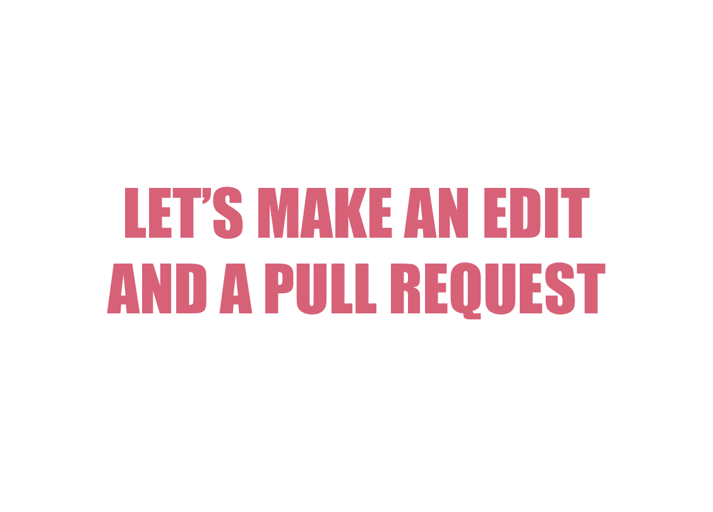
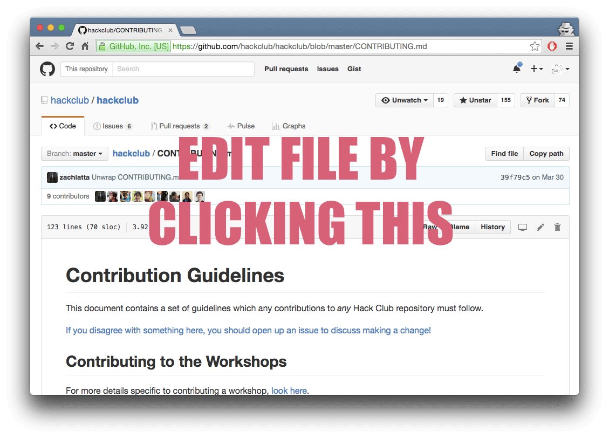
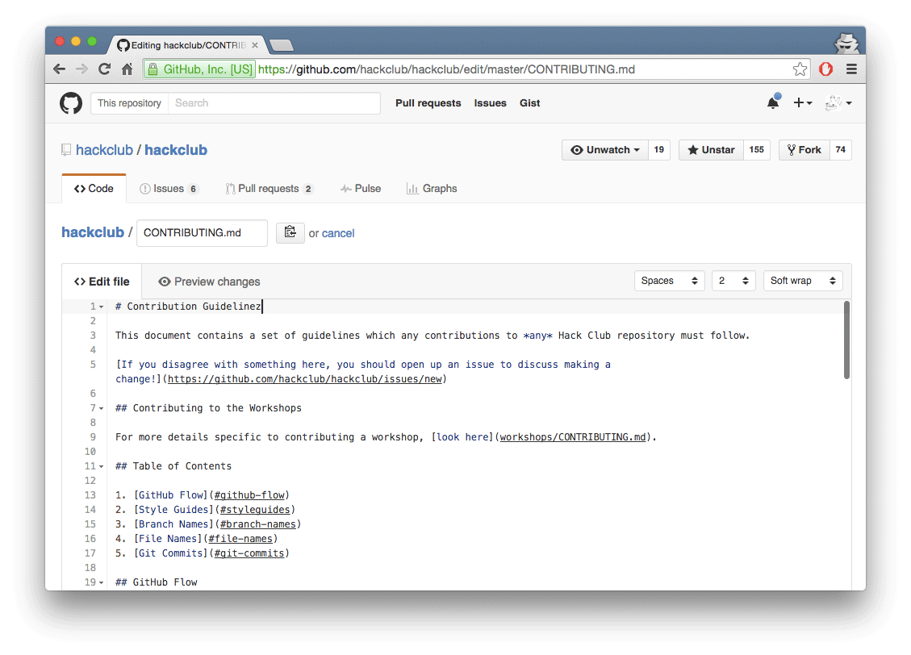
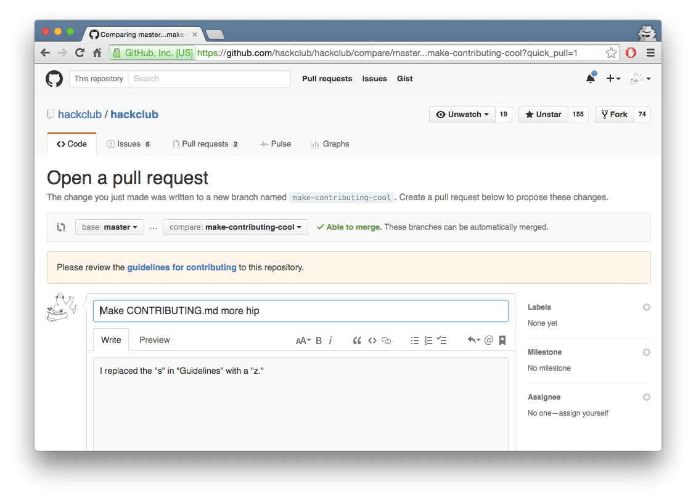

# Contribution Guidelines

This document contains a set of guidelines which any contributions to _any_ Hack Club repository must follow.

[If you disagree with something here, you should open up an issue to discuss making a change!](https://github.com/hackclub/hackclub/issues/new)

## Table of Contents

1. [GitHub Flow](#github-flow)
2. [Branch Names](#branch-names)
3. [File Names](#file-names)
4. [Git Commits](#git-commits)
5. [Making a Pull Request](#making-a-pull-request)

## GitHub Flow

We use a modified version of [GitHub Flow](https://guides.github.com/introduction/flow/) at Hack Club. The only difference is instead of deploying from a reviewed pull request, we merge first and deploy straight from master.

Part of the GitHub Flow is submitting pull requests. See https://help.github.com/articles/using-pull-requests/ for a good overview of what pull requests are and how to use them. We use the _fork & pull model_ for managing contributions.

## Branch Names

Branch names should adhere to the following:

- All lowercase
- `-` as space separator for branch names
- If a feature branch, include the name of the feature

## File Names

File names should follow the following guidelines:

- All lowercase
- `_` as space separator for file names
- `-` as a space separator for dates in file names
- Dates in `YY-MM-DD` format

## Git Commits

In order to ensure that our git history makes sense we have certain guidelines which we require contributors to adhere to. These are:

### Commits should follow the commit standards

These are:

- Commits should be written in the imperative mood
- Commits should start with a capital letter
- Commits should not end with a full stop

This is a style used by many other Open Source projects (Linux, Rails) as well as most corporate software development shops.

[This is a great guide on writing a git commit message](http://chris.beams.io/posts/git-commit/)

#### Examples

> fix typo in introduction.

- Does **not** start with a capital letter
- Ends with a full stop

> Added Iron Man GIF

- Does **not** use the imperative mood

> Adding more pizza parlors to directory

- Does **not** use the imperative mood

> Fix typo in introduction to user guide

This commit message is wonderful!

### Commits should be one logically unit of change

A logical unit of change can be thought of as completion of a single task.

A good way to figure out if you are not adhering to this rule is to tell yourself what you changed ("I added a picture of a donkey to the Twilio workshop"). If you find yourself having multiple statements in this description then you have made your commit too big.

#### Examples

> Add an image of pizza, fix typos, rewrite `README.md`

This commit message contains three units of change, they are:

- An image of pizza
- Fixed typos
- Rewrote `README.md`

These should be split into one commit each.

> Add an image of pizza

This commit is great as only one logical change was made.

### Commits should explain the change, but not be longer than 50 chars

A commit message is used for quickly summarizing a change. Another contributor should be able to read it, along with the content and immediately understand the change does.

#### Examples

> Fix typo

- This commit message does not give any context

> Add the spark reactor source code into the document where we add our thoughts

- This commit message is too long! It should be less than 50 characters!
- It uses too many words and could be simplified

## Making a Pull Request

Here are a series of GIFs that illustrate how to make and commit a change, and create a pull request for review, using GitHub's web interface.

