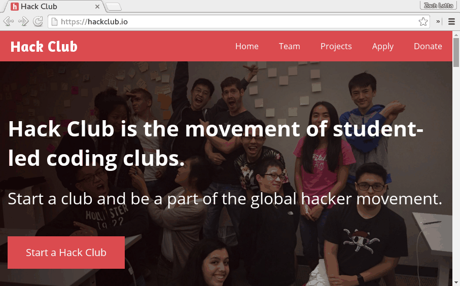
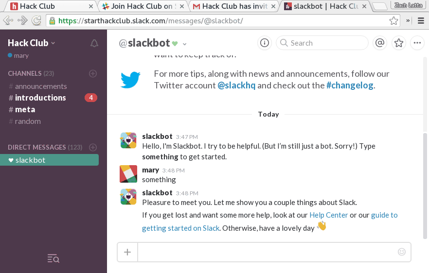

# 

Slack is an awesome tool for large group chats (check out their website at
https://slack.com). Hack Club's Slack is the home of our community. We use it to
ask each other questions, talk about the problems we run into (as members and
club leaders), and hang out with each other.

If you're not already on Slack, let's get you into the community. Just keep
reading for instructions on joining the community. After you've done that,
you'll want to check out the Slack Field Guide ([click here](#field-guide)) for
a handy reference on using the Slack.

# How To Join

Open up https://slack.hackclub.com in a new tab and enter your email to get an
invite from our handy bot.

If you head over to your email inbox, you should see an invite to join the
Slack. Go ahead and click the `Join Hack Club` button in the email to create an
account. It'll ask you to provide a username and password. This username is
unique to Hack Club, so you can use usernames that are often taken on other
sites (like `mary`). After you create an account, it'll take you to the main
Slack interface (you can always get here by going to
https://starthackclub.slack.com).

If you haven't used Slack before, go ahead and click `Explore Slack` for a quick
one minute tutorial that'll show you around the interface.

Now to fill out our account details so other people in the community can get to
know us better. Go ahead and go to `Hack Club > View Profile & Account > Edit
Account` and fill everything out (make sure to set a profile picture!).

Now for the final setup - introducing yourself! Go to the `#introductions`
channel and introduce yourself with your name, where you're from, and something
you're interested in.

Here's an example:

> Hey everyone! I'm Mary from San Francisco. I'm a big fan of science fiction
> books and want to learn to code :-).

You'll find that people are generally pretty welcoming and eager to meet you
:smiley:.

Congratulations! You're now all set up on the Slack. In addition to always being
accessible at https://starthackclub.slack.com, Slack has great desktop and
mobile apps available at https://slack.com/downloads. The most active members
have the mobile app installed and we recommend new members install it.

In the next section we'll go over a quick handy reference for using the Slack.

## Field Guide

This field guide is intended as a quick channel reference for new and old
members alike.

Below is a list of the channels that all members are in by default.

| Channel          | Purpose                                                 |
|------------------|---------------------------------------------------------|
| `#announcements` | The primary place for announcements to the community    |
| `#introductions` | Where new members introduce themselves and are welcomed |
| `#meta`          | Discussion about building Hack Club itself              |
| `#random`        | Anything and everything! General spot for hanging out   |
| `#shipit`        | Space to share your projects with the rest of Hack Club |
| `#studycorner`   | Do schoolwork together and help those in need of help   |

Here are some examples of messages sent to the different default channels:

##### `#announcements`:

##### `#introductions`:

##### `#meta`:

##### `#random`:

##### `#shipit`:

##### `#studycorner`:

