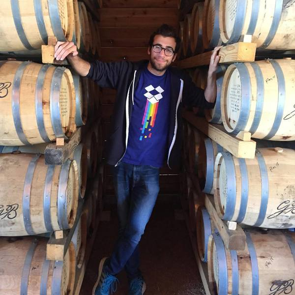
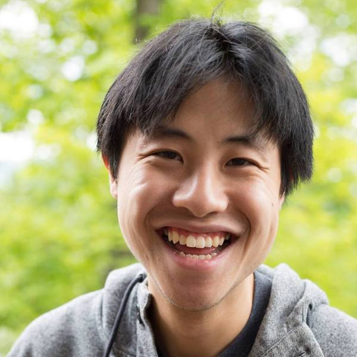

# Key Staff Biographies

## Dave Fontenot

Dave joined hackEDU in August 2015 as our Director of Community. Dave previously
started MHacks, the largest hackathon in the world, and traveled to over 40
universities to bring hackathons to colleges all around the globe. As a result
of the movement Dave led, 50,000 people will attend hackathons by the end of
2015 (compared to the estimated 500 attendees in 2011). Dave also started
Hackathon Hackers, a Facebook group for collegiate hackathons with over 18,000
members. Over 300,000 posts have been made this past year in Hackathon Hackers.

## Jonathan Leung

Jonathan co-founded hackEDU with Zach in 2014. He previously led the growth of
PennApps, the University of Pennsylvania's hackathon, from 80 to over 1,000
participants and has over 4 years of curriculum design and teaching experience.
He previously taught at General Assembly and All Star Code. When Jonathan isn't
working he wanders around San Francisco and does yoga on his house's roof.

## Max Wofford

Max joined hackEDU as a technical fellow in January 2015 and has been crucial in
developing software to mantain our clubs. Prior to hackEDU, Max did software
consulting from Costa Rica and, before that, was in high school where he led the
school's robotics team.

## Zach Latta

Zach Latta is the co-founder and executive director of hackEDU. Zach started
coding when he was 7. Before hackEDU, he built the backend architecture for Yo -
an app with more than 3 million users. At Run Games he was a developer of
Football Heroes and helped grow it to over 1 million users, reaching #5 in the
top free charts, #1 in games, #1 in sports and #1 in the App Store.
