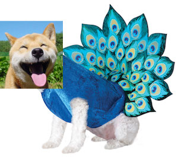

<!-- # Philosophy

Hacker Space

## First interactions matter

# Getting up and running

## Starting a new hackEDU club

### Overview

### Checklist -->

# Club fair/rush day

**Outline:**

- **[Overview](#overview)**
  - [Be a fanatic peacock](#be-a-fanatic-peacock)
  - [Be extremely welcoming](#be-extremely-welcoming)
  - [Be prepared](#be-prepared)
- **[Before the club fair](#before-the-club-fair)**
  - Prep the team
  - Create physical materials
- **[During the club fair](#during-the-club-fair)**
  -
- **[After the club fair](after-the-club-fair)**

## Overview

The primary objective of the club fair is to get as many people to the first
club meeting as possible.

Your primary target: _freshman_.

There are three primary strategies to do this:

- [Be a fanatic peacock](#be-a-fanatic-peacock)
- [Be extremely welcoming](#be-extremely-welcoming)
- [Be prepared](#be-prepared)

If you do the first two, you'll look like this:



### Be a fanatic peacock

Get as much attention as possible, this you can:

- Trying to get a booth in the middle of the event, not somewhere off to the
  side.
- Having a [giant eye-catching sign](#giant-eye-catching-sign) that is easy to
  see from far away.
- Having
  [desirable and unique items to give away/sell](#giveaways-or-items-to-sell)
- Do something else that is completely crazy and eye-catching

### Be extremely welcoming

- Initiative conversation with everyone within a 2 meter radius around your
  booth
- Be as welcoming and friendly as possible
- Look and sound excited about Hack Club
- Meet each person where they are at

### Be prepared

- Create a list of questions that you think people will ask you and make sure
  that every officer answers the questions in a similar way
- Be explicit about who will be doing what ahead of time

## Before the club fair

- [Prep the team](#prep-the-team)
- [Create physical materials](#create-physical-materials)

### Prep the team

You will need to figure out how you're going to tell people about your club.
Collectively come up with a short spiel that you tell people.

**Easily excitable freshman:**

Here is an example of an interaction for which a freshman is excited about
building a website.

| Person       | Script                                                                                                                                                                                                        |
|:-------------|:--------------------------------------------------------------------------------------------------------------------------------------------------------------------------------------------------------------|
| **OFFICER**  | _(with a wide smile and warm friendly voice)_ Hey! I'm Laura!                                                                                                                                                 |
| _OFFICER_    | _`gives warm smile and firm handshake`_                                                                                                                                                                       |
| **FRESHMAN** | Hi, I'm Joanne.                                                                                                                                                                                               |
| **OFFICER**  | We're Hack Club. We learn and make awesome things together with code. For example, Gina built this at her first meeting last year!                                                                            |
| _OFFICER_    | _`opens Gina's website `_                                                                                                                                                                                     |
| **OFFICER**  | She had _**0**_ experience and made this from scratch on her first meeting!                                                                                                                                   |
| **FRESHMAN** | _(with excitedness)_ Whooooaah! That's pretty cool! I wish I could do that!                                                                                                                                   |
| **OFFICER**  | _(with the a smile and assurance)_ YEAH! You totally can! Come stop by our first meeting this Wednesday at 4pm in Mrs. Nelson's room in 110. By the end of the meeting, you'll have your own website as well! |
| _OFFICER_    | _Hands FRESHMAN a clipboard_ and passes her a flyer as well.                                                                                                                                                  |
| _FRESHMAN_   | _Fills out her name, email, and cell phone information on the signup form._                                                                                                                                   |
| **OFFICER**  | So do you have any questions about Hack Club?                                                                                                                                                                 |
| **FRESHMAN** | Hmmm... Not right now!                                                                                                                                                                                        |
| **OFFICER**  | Cool, if you ever do, that flyer has my email and number on it! I'll see you Wednesday?                                                                                                                       |
| _OFFICER_    | Motions for a high-five.                                                                                                                                                                                      |
| _FRESHMAN_   | Reciprocates the high-five.                                                                                                                                                                                   |
| **FRESHMAN** | Yes! Definitely!                                                                                                                                                                                              |

**Less easily excitable freshman:**

This interaction illustrates how you might meet someone where they are by
finding out what their interests are and relating them to the programming club.

| Person         | Action                                                                                                                                                                                                    |
|:---------------|:----------------------------------------------------------------------------------------------------------------------------------------------------------------------------------------------------------|
| **OFFICER**    | _(with a wide smile and warm friendly voice)_ Hey! I'm Laura!                                                                                                                                             |
| _OFFICER_      | _`gives warm smile and firm handshake`_                                                                                                                                                                   |
| **FRESHMAN**   | Hi, I'm Joanne.                                                                                                                                                                                           |
| **OFFICER**    | We're Hack Club. We learn and make awesome things together with code. For example, Gina built this at her first meeting last year!                                                                        |
| _OFFICER_      | _`opens Gina's website `_                                                                                                                                                                                 |
| **OFFICER**    | She had _**0**_ experience and made this from scratch on her first meeting!                                                                                                                               |
| **FRESHMAN**   | _(in a soft, clearly bored voice)_ uh, huh...                                                                                                                                                             |
| **OFFICER**    | _(notices that Joanne is not really too interested and quickly shifts gears)_ So what kinds of things are you excited about?                                                                              |
| **FRESHMAN**__ | _(Looks up from the screen)_ Um... I don't know.                                                                                                                                                          |
| _OFFICER_      | _(Realizes that she would have to get Joanne excited about programming another way. She decides to learn about out what Joanne is interested in.|                                                         |
| **OFFICER**    | _(Laura deliberately keeping a warm understanding smile on her face but lowering her enthusiasm a bit to meet Joanne's energy)_ So what kinds of things do you like to do for fun?                        |
| **FRESHMAN**   | _(slowly with uncertainty)_ Hmmm... Well I guess like to draw?                                                                                                                                            |
| **OFFICER**    | _(an idea pops into the Laura's head to and a knowing smile appears on her face)_ Oh awesome! So with programming, you can draw crazy things that are not possible without a computer. So check this out: |
| _OFFICER_      | _Pulls up Aaron Koblin's [The Single Lane Sumer Highway](http://www.thesinglelanesuperhighway.com/)_ and gestures at it.                                                                                  |
| **OFFICER**    | This guy put up an app online to paid people a little bit of money to draw cars. He took all of the cars that they drew and turned it into this.                                                          |
| **FRESHMAN**   | _(Slowly with surprise and slightly piqued interest)_ Whaatttt...                                                                                                                                         |
| **OFFIER**     | Yeah, and check out this drawing app that Greg made...                                                                                                                                                    |


Moreover, people will be asking you questions at the club fair.

You and your team should be on the same page about how you answer their
questions:

- What does your club do?
- So why should I join your club?
- How often do you meet?
- What's the time commitment?
- What's programming?

You could also think about other scenarios for other kind of people that you meet
at the club fair and figure out how you would meet them where they're at.

Some potential scenarios are:

- Someone is more technically advanced than every other officer
  - (have the attitude of welcoming them excited about the possibility of being
    able to learn from them)
- Someone who feels that they are really bad a math and therefore will be bad
  at programming
  - (convince them that how good or bad at math doesn't really matter)
- Someone really wants to get into programming but think it's really hard and
  requires you to know dark magic
    - (convince them it's really easy perhaps by showing them how to write some
      basic lines of code in the JavaScript console then and there.)

Also, make sure that everyone on the team has a clear understanding of what they
need to do for the club fair.

You could:

- have everyone read this document
- have a meeting to discuss who is doing what by when
- practice role playing the club fair (where someone acts as a potential new
  club member and someone else is a club officer at the club fair)

### Create physical materials

**Checklist overview:**

- [Giant eye-catching sign](#giant-eye-catching-sign)
- [Flyers](#flyers)
- [Signup materials](#sign-up-materials)
  - Signup forms (perhaps 20 sheets of paper)
  - Clipboards (perhaps 3-6)
  - Pens (2x what you think you will need)
- [Giveaways or items to sell](#giveaways-or-items-to-sell)
- [Computers setup with demos](#computers-setup-with-demos)

#### Giant eye-catching sign

You want your sign to:

- be big: as in 6 feet by 3 feet
- stand out: use a unique font and color
- be readable from across the room

Other clubs have found that buying paint and painting a giant poster board
to be an effective way to make a sign.

<!-- TODO: Get examples -->

#### Flyers

You want your flyers to include:

- where room your club meetings are: `room 311`
- what day of the week and time you meet: `mondays at 3pm`
- the start date of your club
- contact email

Make sure your flier is not too cluttered with other graphics.

<!-- TODO: Get examples -->

#### Sign-up materials

Some clubs have found it helpful to just use a physical signup form that has
the columns:

- full name
- email
- phone number

Make sure you have

- pre-made forms
- clipboards (you may want 3-6)
- pens (have 2x the amount of pens you need because they get lost)

You may want each officer to be holding a clipboard and leaving 3 clipboards on
the table for people to signup on.

<!-- TODO: Get examples -->

#### Giveaways or items to sell

You can attract people to the table if you have something to give away or sell.

A really good example is at the hackEDU club at Mission Vista High School,
it is their tradition to sell bags of kettle corn every club fair.

As a result, a _**GIANT**_ line forms in front of their booth. The other people
that see the line wonder what it is and wait in line as well!

Because there is a line now, their officers go up and down the line to greet
and talk to each person to convince them that programming club is awesome.

Some schools don't allow you sell things or giveaway food. In this situation,
think about what else you could provide that would make you stand out against
all the other clubs.

<!-- TODO: Get examples -->

#### Computers setup with demos

Have computers setup to show off several demos of what you've made at the club.

<!-- TODO: Get examples -->

### Prepare the team

- Try to have 3-5 people at the club fair
- Create a list of questions that you think people will ask you and make sure
  that every officer answers the questions in a similar way
- Be explicit about who will be doing what ahead of time

## During the club fair

### Setup

Show up early. Sometimes tables are first come first serve so you want to get
a table in the middle, not off to the side.

#### Setting up people

This section I'm less sure about:

- should people stand in front of the table or behind the table?
- how many representatives should be behind the table and how many should be
  elsewhere doing something else? What should they be doing?

#### Setting up physical materials

**[Giant eye-catching sign](#giant-eye-catching-sign)**

- Put it in a place where people can see it from far away.

**[Flyers](#flyers)**

- Leave a stack on the table
- Give some to some officers to hand out

**[Signup materials](#sign-up-materials)**

- Leave 3 clipboards on the table so 3 people can signup at once
- Have each officer not behind the table hold a clipboard

**[Giveaways or items to sell](#giveaways-or-items-to-sell)**

- You can leave these behind the table and give them out after someone either
  signs up or buys it.

**Computers setup with demos](#computers-setup-with-demos)**

- Set 2-3 computers up on the table with the demos of your apps open in
  multiple tabs.

### Running the show:

Make sure that you are:

- [a fanatic peacock](#be-a-fanatic-peacock)
- [extremely welcoming](#be-extremely-welcoming)

Why is this important?
[Because first impressions make a big impact](http://startupclass.samaltman.com/courses/lec07/).

#### Role-play

With your officers who will be at the club fair, walk through the
play by play of what you want someone coming up to your booth to **feel**
and what you DON'T want someone coming up to your booth to **feel**.

**Not Ideal**

_Thoughts going through someone's mind that you want to avoid_

- Hm, that club table seems dead, there's no one there.
- Hm, that club table looks so boring, there's nothing on it.
- Oh, I didn't even notice that booth until the end of the club fair because
  nothing about your booth caught their attention.

**Ideal**

- Whoah, they have a crazy sign that's super colorful, let me go check that out!
- Wait, why is there a giant line in front of that table? Lemme check that out!
- Wait, wtf, why is there someone in a dinosaur suit over there?
- Hey, Jessica, David, did you see that booth over there?! They're nice and
  selling the best kettle corn ever!

#### When they come up to your booth

**Not Ideal**

- Hm... No ones here. I guess they all left. They must not care about their
  club very much.
- The person talking to me sounds really boring. They're so monotone...
- Talks to you briefly but they don't really make eye contact and walks away
  after a while.

**Ideal**

- Give them a warm hello, a smile, and
- They give you a high five when you exit the booth and playfully say, "See you next week Tuesday, right Kevin?"

#### When telling someone about the members' projects

**DO NOT INITIALLY**
- use jargon
- focus on the _language_ or _tools_ you used to build the project
- focus on about _how_ the project works
- focus on the fact that _you_ built the project

**DO**
- talk about how you _felt_ when you accomplished the project
- talk about with _who else_ you worked with on your project
- talk about the _setting_ in which you built the project
- was it during club, was it in a class?

If however, you learn during conversation the person you are talking to is
clearly already technical, then you can start using technical terms.

  ```
  Pro-tip:
              __
             / _)
      .-^^^-/ /
   __/       /
   <__.|_|-|_|

  Level up by having a consistent theme for ## you do. That could mean
  your dress, physical materials, to how you interact with anyone will be dinosaur
  themed.

  For example, if everything might be dinosaur themed:

  - everyone would be wearing a dinosaur suit
  - you have dinosaur shaped crackers that you give out
  - there is a dinosaur on your poster
  - you demo a project about dinosaurs
  - etc.
  ```


## After the club fair

- Email everyone who signed up and make them feel welcome

<!-- TODO: Gather nicely written examples! -->
