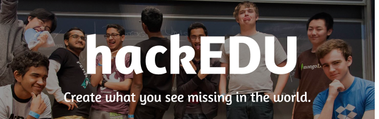
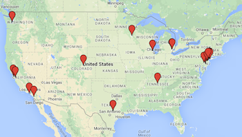

## About

[hackEDU](http://hackedu.us) is a non-profit initiative that works with high
school students to start and lead programming clubs at their schools. We
provide all the tools for starting and leading clubs including a baseline
coding curriculum, free tools, and training on community building.

## Metrics

##### Fall 2014 Pilot

- 24 clubs in 11 states and two countries
- over 1000 members
  - 35% women (double the national average of 18%)
  - 18% minority ethnicities in technology (three times the national average 5%)

##### Accolades

At the top two collegiate hackathons in the world, [PennApps
X](http://2014f.pennapps.com/) and [MHacks
V](http://mhacksv.challengepost.com/), half of the six winning teams were led
high school students. All of these winning high school teams are part of
hackEDU.
