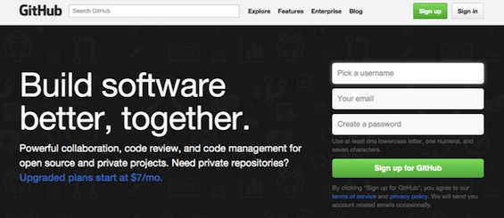
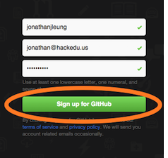

# GitHub

GitHub is a website used by many professional coders to collaborate on code.
Think Dropbox, but for code.

GitHub also has a login feature similar to how Facebook has "Facebook login".
Let's make a GitHub account so we can login to websites like JS Bin, Cloud9, and
many others in the programming ecosystem!

## Signup for GitHub

### 1) In a new window, open <a href="https://github.com" target="_blank">https://github.com</a>

> 

### 2) Create an account with a valid email

> 

### 3) Click "Sign up for GitHub"

> 

### 4) Ignore everything on the page and click "Finish sign up"

> 

## Celebrate!

Huzzah! You've joined the ranks of developers and companies who have GitHub accounts including [Facebook](https://github.com/facebook) and [Google](https://github.com/google)!

--

[← Go Back](../README.md)
