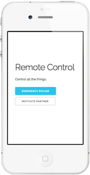

# Workshops

Below a list of all of our workshops.

Our workshops aim to:

- be targeted towards beginners and also accommodate for the more experienced.
- be focused on building something fun that you want share with your friends.
- get something shipped as quickly as possible.
- be modular enough to not feel like you have to go through them linearly.
- work well when done in pairs or individually.
- be tinkerable.

We recommend workshops links be provided to students, with each student working
on the workshops independently and receiving support when needed.

Each workshop is a markdown file and has associated facilitation guidelines.

See our general workshop facilitation guidelines
[here](workshop_details.md#general-workshop-facilitation-guidelines):

Our workshops are free to be used by anyone. If you see any issues,
[make an issue](https://github.com/hackedu/hackedu/issues/new) or even better
yet, make a
[pull request](https://help.github.com/articles/using-pull-requests/)!

--------------------------------------------------------------------------------

#### Portfolio

Learn to build a simple portfolio website that looks like the above.

| Attribute | Value                                        |
| ----------| -------------------------------------------- |
| Audience  | Beginners who have never written HTML before |
| Duration  | 45 mins - 1.5 hours                          |
| Concepts  | Basics of HTML & CSS                         |

--------------------------------------------------------------------------------

#### Remote Control

Learn to make a webapp that calls your friend and plays a song when you press a
button. You will also learn to easily send text messages and make phone calls
from the browser.

##### Important Note

You will need to obtain and setup a Twilio account before the workshop. Luckily
we have a promotion code that will give you $100 worth of credit. Just follow
the instructions in the
[facilitation guidelines](workshop_details.md#remote-control) for details. Give
yourself at least an hour to do this.

There are two parts to this workshop, part I and part II. Part I is more linear
and guided while Part II exploratory.

| Attribute          | Value                                                                                                                                                   |
| -------------------| ------------------------------------------------------------------------------------------------------------------------------------------------------- |
| Audience           | Great for beginners who have never written a line of code before and veteran programmers alike (veterans will love the ease of use of the powerful API) |
| Duration of Part 1 | 30 mins - 1.5 hours                                                                                                                                     |
| Duration of Part 2 | 30 mins - 3 hours                                                                                                                                       |
| Concepts           | Send text messages, make phone calls, play music, detect when a button was clicked, detect when your cell phone moves                                   |

--------------------------------------------------------------------------------

#### Frogger

Learn to build frogger.

