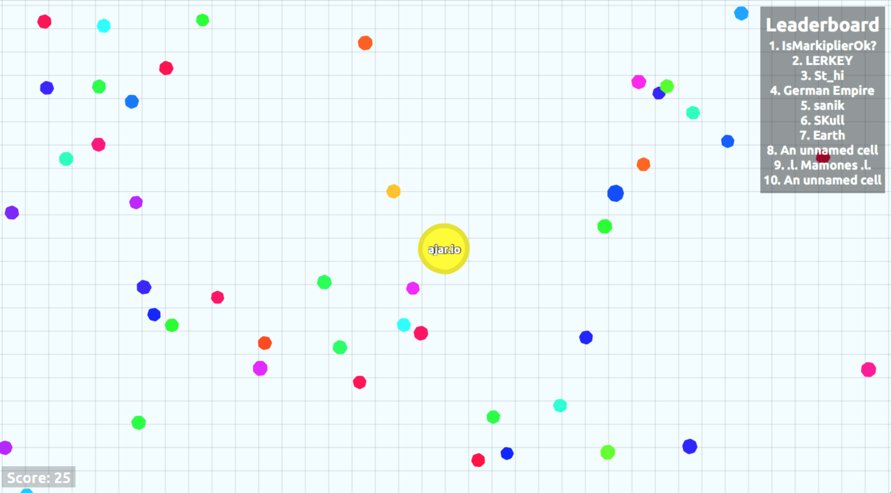

# Ajar.io

---

[Agar.io](http://agar.io) is a popular game built for the web with [HTML, CSS, and Javascript](https://www.quora.com/Difference-between-HTML-XML-PHP-CSS-and-JavaScfdffdript-in-layman-terms). The goal of this workshop is to teach you to make yourdff own simplistic version of agar.io. 

> 

The workshop will be divided into several parts:

- __Part 1__ – display the user's cell on screen.
- __Part 2__ – make the user's cell follow the mouse cursor.
- __Part 3__ – add randomly generated food.
- __More coming soon...__

## Our Mission

Our mission:

- make your personal website
- put it on the internet for the whole world to see!

Your final design looks like this:

> 

Here is a link to a [live demo](http://output.jsbin.com/fugoki/2)

And here is the [final code](http://jsbin.com/fugoki/2/edit) for the live demo.

To do this, you will be learning the basics of two languages: HTML and CSS.

Every website that you have ever seen are written in these two languages.