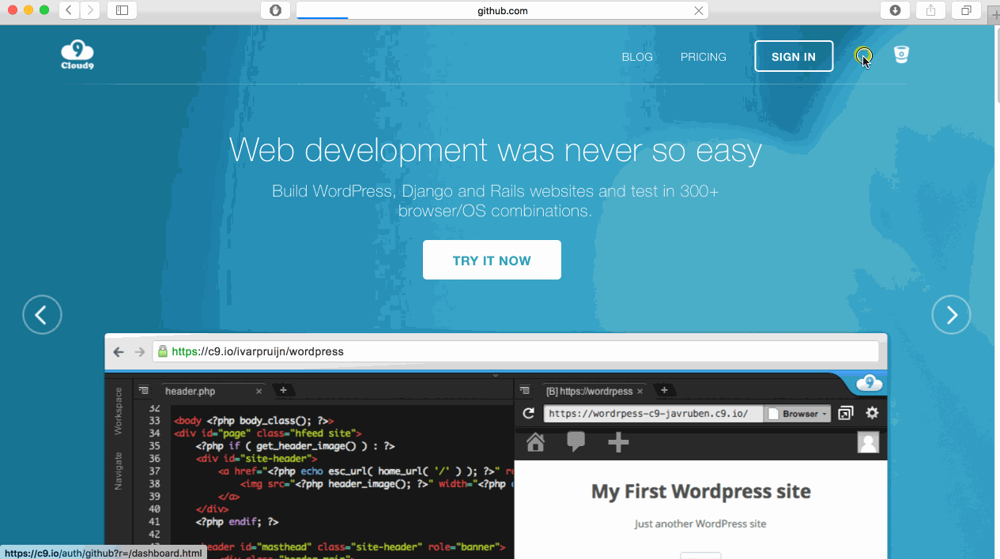

# Cloud9 tutorial

## What is Cloud9?

*Cloud9 is a website that lets you program online*. Traditionally, all programming was done locally on the computer: you would save your files on your computer and edit them on your computer (with a code editor). Cloud9 allows you to save your files online and edit your files online (Cloud9 also has a code editor). This means all you need to start programming is internet and a browser. No more installing software!

---

## Login with GitHub

First, make sure you have a github account. If you don't have one, follow the guide for making one located [here](https://github.com/hackedu/hackedu/tree/master/playbook/workshops/portfolio#creating-a-github-account).

Now that you have a GitHub account, you can login to Cloud9 with GitHub.

## Create a new workspace

To create a new workspace you can either select the create a new workspace option under workspaces, or click the new workspace button at the top right of your screen.

Next set your workspace name to *html-css-javascript-basics*, and your description to *Learning to use html css and javascript together*. Make your workspace public, skip the *Clone from Git or Mercurial URL* option and set your template to *Custom*. Finally click the *Create Workspace* button at the bottom of your page and you should be prompted to this screen.

add image of screen here

First we will create a new folder. To do this right click the workspace bar on the left and select *New Folder*. You can name this folder whatever you like.

add gif of creating folder

Next we will be creating a html file. To do this hit file on the top left of your screen, hover over the *New From Template* option, and select *HTML file*. Now we want to save this file in the new folder we just created. To do this go to *file* and click *save as*. Name your file *index.html* and save it inside the folder you just created.

add gif of creating html file

Repeat the last step twice more, except this time creat a CSS file and a Javascript file. Name your files *style.css* and *index.js*

Now that you have your files set up lets start building. Inside your *index.html* file create a button with the attribute *id* set to *alertButton*. To preview you file right click your *index.html* file in your workspace sidebar to the left and hit *Preview*. This will open up a new tab with the rendered version of your html file.

Every time you update your html file the preview will automatically update.
