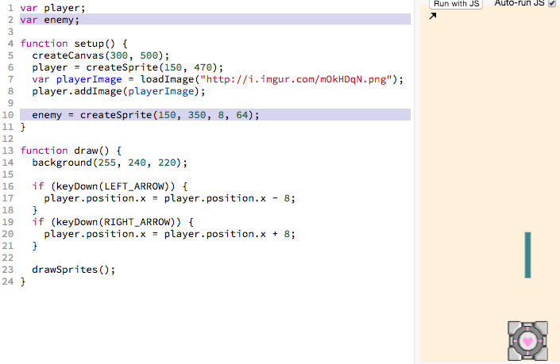
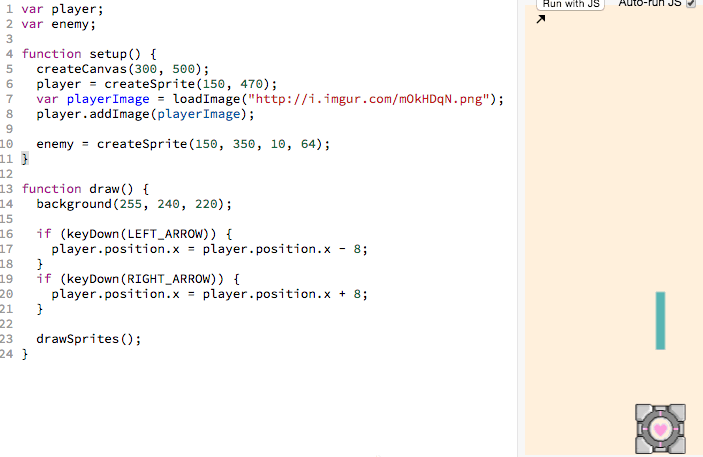
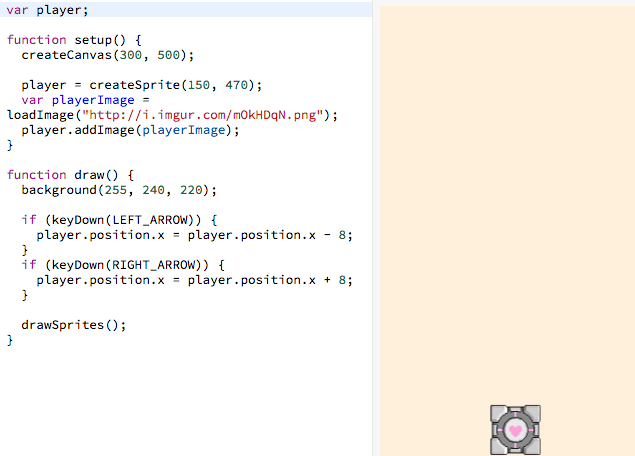

# Add Enemy Sprite

_Questions, comments and critiques are welcome! Send your feedback
[here](https://docs.google.com/forms/d/1IxbiDtyP-UOx3hRGu3o2I-iVll95xQ6I_pW8JS3TZ2k/viewform?entry.1677546962=Adding+an+enemy+sprite+to+the+bullet+dodging+game)._

We can add an enemy sprite with the following code (new code highlighted in
gray):

> 

[](http://jsbin.com/qiyuno/46/edit?js,output)

The highlighted gray lines above (reproduced below) are responsible for the
new sprite:

```js
var enemy;
...
enemy = createSprite(150, 130, 8, 64);
```

## Tinkering with the code

Have you noticed `createSprite` looks different this time:

It used to look like this:

```js
createSprite(150, 470);
```

Now it looks like this:

```js
createSprite(150, 350, 8, 64);
```

Let's try playing with those last two numbers:

> 

## Understanding `createSprite`

It seems that the last two values represent the width and height of the
sprite that's created:

```
createSprite(150, 350, 8, 64);
                       ^   ^
                       |   └ set the *height* of the new sprite
                       |
                       └ set the *width* of the new sprite
```

## Add It To Your Own Code

> 

 Go ahead and add an enemy to your own working bin.

## Recap

- We learned we can have more than one sprite in a canvas
- We learned that the last two numbers in `createSprite` set the width and
  height

## Next Up

| **[ <br> 7.  Enemy Sprite Move] (linear_enemy_movement.md)** |
| --------------------------------------------------------------------------------------------------- |

## Appendix

_This appendix is still being built! Is there something you have a question
about? Submit an issue requesting its addition
[here](https://github.com/hackedu/hackedu/issues)_

## Table of Contents

| **[          <br> 1.  Blank Canvas]      (blank_canvas.md)**          | **[    <br> 2. Add Player Sprite]    (add_player_sprite.md)**    | **[  <br> 3. Linear Player Movement] (linear_player_movement.md)** |
| --------------------------------------------------------------------------------------------------- | --------------------------------------------------------------------------------------------------- | ---------------------------------------------------------------------------------------------------------- |
| **[    <br> 4.  Arrow Key Movement](arrow_key_movement.md)**    | **[         <br> 5. Player Image]         (player_image.md)**         | **[        <br> 6. Add Enemy Sprite]       (add_enemy_sprite.md)**       |
| **[ <br> 7.  Enemy Sprite Move] (linear_enemy_movement.md)** | **[ <br> 8. Enemy Go Back to Top] (enemy_go_back_to_top.md)** | **[   <br> 9. Random Enemy Position]  (random_enemy_position.md)**  |
| **[            <br> 10. Game Over]         (game_over.md)**             |                                                                                                     | **[ <br> Back to the README.md](README.md)**                                            |
