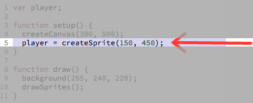

# Adding the Player Sprite

_Questions, comments and critiques are welcome! Send your feedback
[here](https://docs.google.com/forms/d/1IxbiDtyP-UOx3hRGu3o2I-iVll95xQ6I_pW8JS3TZ2k/viewform?entry.1677546962=Adding+a+player+sprite+to+the+bullet+dodging+game)._

Currently our canvas is blank like this:


We want to eventually make the player sprite look like this:


But for now, we'll settle with this:


## Adding the Player Sprite

We can add the player sprite with the following code (new code highlighted in
purple)

> [](http://jsbin.com/qiyuno/14/edit?js,output)

[](http://jsbin.com/qiyuno/14/edit?js,output)

The highlighted purple lines above (reproduced below) are responsible for adding
the player sprite.

## Tinkering with the values of `createSprite`

 Open
 [the above JS Bin](http://jsbin.com/qiyuno/14/edit?js,output) and try messing
 around with the starting position of the sprite.

Here is an example of how I play around with the values of `createSprite` to try
to understand what it does:

> 

## Understanding `createSprite`

There are 3 parts to creating a sprite:

- Creating a variable to store the sprite in
- Creating the actual sprite and storing it in the above variable
- Drawing the sprite

1. First we need to create the variable `player` to store the sprite in:

> 

2. Then we actually create the sprite and store it in the variable `player`:

> 

```
player = createSprite(150, 450);
  ^                    ^    ^
  |                    |    └ set the *y* coordinate of the sprite
  |                    |
  |                    └ set the *x* coordinate of the sprite
  └ Store the newly
    created sprite
    with the variable `player`
```

> 

3. Then we have to tell the program to actually draw the sprites in our program
by calling `drawSprites()`:

> 

If we don't include `drawSprites()`, even if the sprites have been created, you
cannot see them.

## Adding the Sprite to Your Code

 Now add the 3 lines of code needed to add the sprite to
your "_**working bin**_".

> 

## Recap

We learned how to:

- Create a variable
- Create a new sprite with `createSprite`
- The new sprite's starting position
- Store a sprite into a variable
- Draw the sprite

## Next Up

| **[  <br> 3. Linear Player Movement] (linear_player_movement.md)**    |
| ------------------------------------------------------------------------------------------------------------- |

--------------------------------------------------------------------------------

## Appendix

_This appendix is still being built! Is there something you have a question
about? Submit an issue requesting its addition
[here](https://github.com/hackedu/hackedu/issues)_

## Table of Contents

| **[          <br> 1.  Blank Canvas]      (blank_canvas.md)**          | **[    <br> 2. Add Player Sprite]    (add_player_sprite.md)**    | **[  <br> 3. Linear Player Movement] (linear_player_movement.md)** |
| --------------------------------------------------------------------------------------------------- | --------------------------------------------------------------------------------------------------- | ---------------------------------------------------------------------------------------------------------- |
| **[    <br> 4.  Arrow Key Movement](arrow_key_movement.md)**    | **[         <br> 5. Player Image]         (player_image.md)**         | **[        <br> 6. Add Enemy Sprite]       (add_enemy_sprite.md)**       |
| **[ <br> 7.  Enemy Sprite Move] (linear_enemy_movement.md)** | **[ <br> 8. Enemy Go Back to Top] (enemy_go_back_to_top.md)** | **[   <br> 9. Random Enemy Position]  (random_enemy_position.md)**  |
| **[            <br> 10. Game Over]         (game_over.md)**             |                                                                                                     | **[ <br> Back to the README.md](README.md)**                                            |
