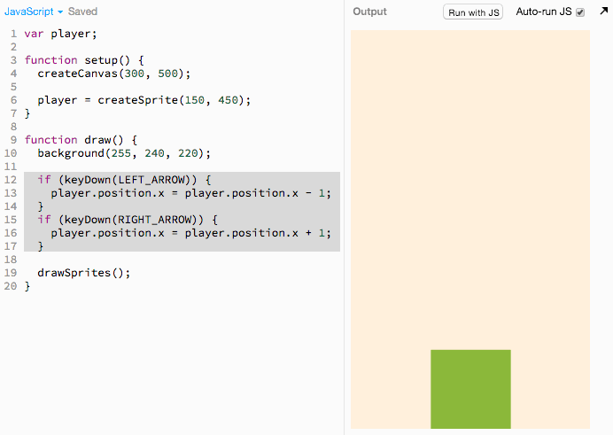

# Arrow Key Movement

We don't want our sprite to move all the time like this:


we only want it to move when we press the arrow keys, like this:


## Adding Arrow Key Controls

We can make our sprite move only when the arrow key with the
following code (new code highlighted in gray):

> 

[](http://jsbin.com/qiyuno/42/edit?js,output)

The highlighted gray lines above (reproduced below) are responsible for the
arrow key movement:

```js
if (keyDown(LEFT_ARROW)) {
  player.position.x = player.position.x - 8;
}
if (keyDown(RIGHT_ARROW)) {
  player.position.x = player.position.x + 8;
}
```

## Understanding the Code

Let's just focus on the first 3 lines of code:

```js
if (keyDown(LEFT_ARROW)) {
  player.position.x = player.position.x - 8;
}
```

You can interpret the above lines of code as follows (bolded words are) lifted
directly from the above code:

- "**`if`** the **`LEFT_ARROW`** is the **`key`** that is pressed **`Down`**
  then"
  - then set the **`player`**'s **`x`** **`position`** to the current
    **`player`**'s **`x`** **`position`** **`- 8`**

## Modifying The Code

 Let's modify our code to make it look like this:

```js
if (keyDown(LEFT_ARROW)) {
  player.position.x = player.position.x - 8;
}
```

> 

 **Challenge**: Can you try to add the code for the right
arrow key movement as well without looking solution? Once you've tried it, you
can look at a solution
[here](https://gist.githubusercontent.com/jonleung/1810b2b784d8afd87f59/raw/1ead2b34441b03f0ae568be33ad334381a19fd85/anwer.js).
And [watch me add it here](img/t4_add_right_arrow_key.gif).

## Recap

We learned how to do something **`if`** a key has been pressed.
More specifically, we learned how to make a sprite move when a key is pressed.

## Next Up

| **[         <br> 5. Player Image]         (player_image.md)** |
|:----------------------------------------------------------------------------------------------------|

## Appendix

## Table of Contents

| **[          <br> 1.  Blank Canvas]      (blank_canvas.md)**          | **[    <br> 2. Add Player Sprite]    (add_player_sprite.md)**    | **[  <br> 3. Linear Player Movement] (linear_player_movement.md)** |
|:----------------------------------------------------------------------------------------------------|:----------------------------------------------------------------------------------------------------|:-----------------------------------------------------------------------------------------------------------|
| **[    <br> 4.  Arrow Key Movement](arrow_key_movement.md)**    | **[         <br> 5. Player Image]         (player_image.md)**         | **[        <br> 6. Add Enemy Sprite]       (add_enemy_sprite.md)**       |
| **[ <br> 7.  Enemy Sprite Move] (linear_enemy_movement.md)** | **[ <br> 8. Enemy Go Back to Top] (enemy_go_back_to_top.md)** | **[   <br> 9. Random Enemy Position]  (random_enemy_position.md)**  |
| **[            <br> 10. Game Over]         (game_over.md)**             |                                                                                                     | **[ <br> Back to the README.md](README.md)**                                            |
