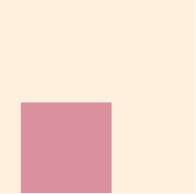
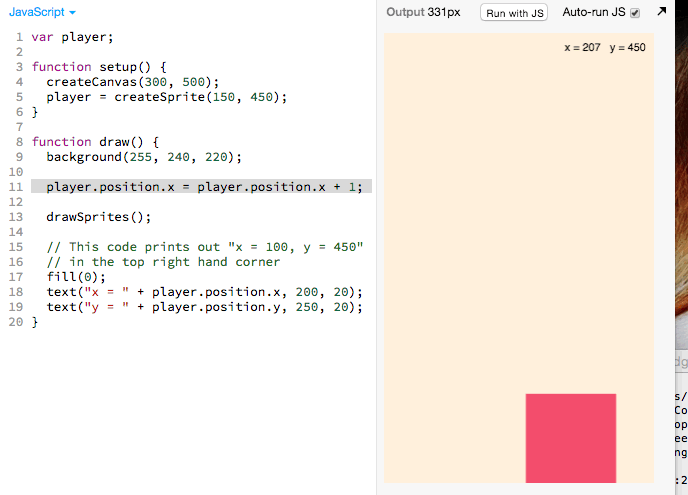
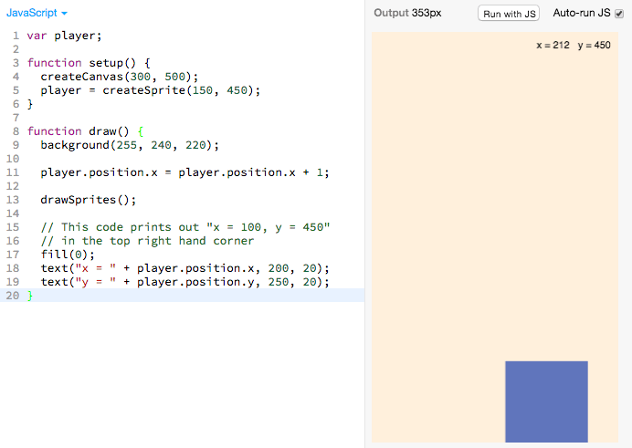
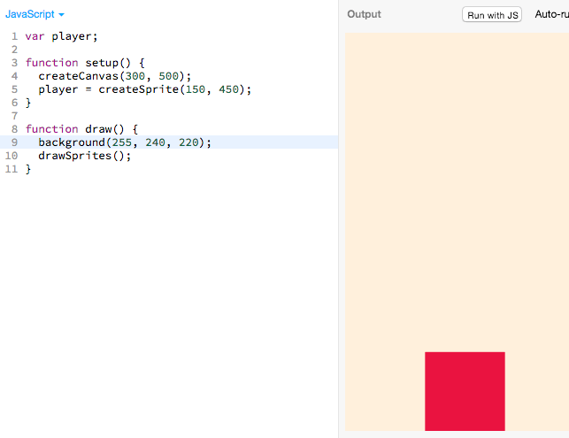
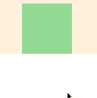
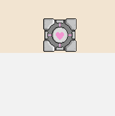
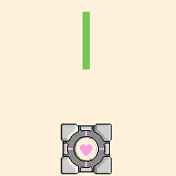
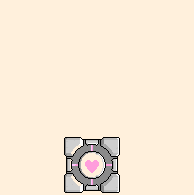
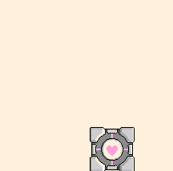

# Linear Motion

Right now our player doesn't move yet:


Let's make it move like this:



## Adding Movement

We can make our sprite move to the right with this code (new code highlighted in
gray):

> 

[](http://jsbin.com/qiyuno/15/edit?js,output)

The highlighted gray lines above (reproduced below) are responsible for this
movement:

```js
player.position.x = player.position.x + 1;
```

## Tinkering with the Player's x Position

 Try changing what `player.position.x` is equal to.

Here is an example of how I play around with it to understand what it does:

> 

It seems that

- `player.position.x = 100`, will set the player's `x`
position to `100`.
- `player.position.x = 200`, it will set the player's `x`
position to `200`.

## Understanding the Code

Let's dig into what this does:

```js
player.position.x = player.position.x + 1;
```

Lets translate each line of code into English:

- `player.position.x`: The sprite's current `x` position
- `player.position.x + 1`: add one to the sprite's current `x` position
- `player.position.x = player.position.x + 1`: set the player's `x` position
  equal to the current `x` position + `1`

There's a bit of subtlety to this that's explained more
[in the appendix below](#understanding-the-code-more-deeply).

## Adding The Code

 **Challenge**: See if you can try making the block move
faster in the above [example JS Bin](http://jsbin.com/qiyuno/15/edit?js,output).
Once you've tried it, you can look at a solution
[here](https://gist.githubusercontent.com/jonleung/1810b2b784d8afd87f59/raw/95b637cb89e482b975cf75721e755ca8fa4a73bd/anwer.js).

 Now add this new code to your **_Working Bin_** to make
the sprite move:

> 

 **Challenge**: Can you try
making it move in the other direction? Once you've tried it (or if you have decided
not to at all), you can look at the
solution [here]
(https://gist.githubusercontent.com/jonleung/1810b2b784d8afd87f59/raw/8181b9e9df7ec7adb7366f80e7cda316dc61a1ba/anwer.js).

## Recap

We learned

- What the `setup` function was used for
- What the `draw` function is used for
- How to change the sprite's `x` position with `sprite.position.x`

## Next Up

| **[    <br> 4.  Arrow Key Movement](arrow_key_movement.md)** |
|:----------------------------------------------------------------------------------------------------|

## Appendix

### Understanding The Code More Deeply

**You said that the block moves over on the axis by 1. So then why does it
_keep_ moving towards the right?**

You have discovered something important, the code inside of `draw function() {`
is run over, and over, and over again. So the first time, if `x` is `0`, the
next time `x` will be `1`. Then when the draw loop is called again, so `x` will equal `2`! It will keep on going!

If we look at the code currently:

```js
var player;

function setup() {
  createCanvas(300, 500);
  player = createSprite(150, 450);
}

function draw() {
  background(255, 240, 220);
  player.position.x = player.position.x + 1;
  drawSprites();
}
```

There are two functions:

The `setup` function:

```js
function setup() {
  createCanvas(300, 500);
  player = createSprite(150, 450);
}
```

and the `draw` function:

```js
function draw() {
  background(255, 240, 220);
  player.position.x = player.position.x + 1;
  drawSprites();
}
```

The difference between these is that

- Everything inside the `setup` function is only run _**once**_. In fact it is
  the very first thing which is ran when your game starts.
- Everything inside the `draw` function is run _**over, and over again**_

This make sense because you only want to create the canvas _**once**_ and you
only want to create the sprite **once**. However, you want to set the player's
position over and over again to make it move. More concretely, if the player's
`x` coordinate is at `10`, you would want to be `11` next time and `12` the next
time.

If you're a bit confused by this, ask a friend or your club leader to help
explain it!

*This appendix is still being built! Is there something you have a question
about? Submit an issue requesting its addition
[here](https://github.com/hackedu/hackedu/issues)*

## Table of Contents

| **[          <br> 1.  Blank Canvas]      (blank_canvas.md)**          | **[    <br> 2. Add Player Sprite]    (add_player_sprite.md)**    | **[  <br> 3. Linear Player Movement] (linear_player_movement.md)** |
|:----------------------------------------------------------------------------------------------------|:----------------------------------------------------------------------------------------------------|:-----------------------------------------------------------------------------------------------------------|
| **[    <br> 4.  Arrow Key Movement](arrow_key_movement.md)**    | **[         <br> 5. Player Image]         (player_image.md)**         | **[        <br> 6. Add Enemy Sprite]       (add_enemy_sprite.md)**       |
| **[ <br> 7.  Enemy Sprite Move] (linear_enemy_movement.md)** | **[ <br> 8. Enemy Go Back to Top] (enemy_go_back_to_top.md)** | **[   <br> 9. Random Enemy Position]  (random_enemy_position.md)**  |
| **[            <br> 10. Game Over]         (game_over.md)**             |                                                                                                     | **[ <br> Back to the README.md](README.md)**                                            |
