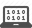

# Dodge

We are going to make this game:

[](http://output.jsbin.com/dozoki/44)

- [Play The Game](http://output.jsbin.com/dozoki/57)
- [See The Code](http://jsbin.com/dozoki/57/edit?js,output)

## How To Use This Tutorial

TODO:There are explanatory boxes

> This is an explanatory box. Don't bother reading it unless you stumble across
> a new concept and really want to understand it.

## Base Template


There are libraries included in the HTML file that make this work.
We'll focus on JavaScript and the output tabs.


> 
>
> Open our module on
> - [Initial Setup](#todo)
>
> Open p5.js the documentation for:
>
> - [`background(255, 255, 255)`](http://p5js.org/reference/#/p5/background)
> - [`createCanvas()`](http://p5js.org/reference/#/p5/createCanvas)
>
> 
>
> **Functions**
>
> `createCanvas(300, 500)` and `background(255, 240, 220)` are what we
> call _**functions**_.
>
> Learn more about functions [here](#TODO).

## Some Quick Vocabulary

In our video game there is the player and there is the enemy:

TODO: Insert image of labeled player and enemy

Each of these are called sprites (basically the charachters / things)
that you can interact with in a game.

## Drawing the Player Sprite

Let's draw the player sprite.

Looking at [the module](#todo), it seems like there are 3 new lines that were
added to the base template

```js
var player; // NEW

function setup() {
  createCanvas(300, 500);
  player = createSprite(); // NEW
}

function draw() {
  background(255, 240, 220);
  drawSprites(); // NEW
}
```

First we need to create a variable to remember the sprite.

TODO:Gif of `var player;`;

Then we can write

`player = createSprite();`

Nothing shows up yet becaus we still need to add

TODO:Gif `drawSprites()`

And voila, a square shows up.


```js
var player;

function setup() {
  createCanvas(600, 400);
  player = createSprite(300, 200);
}

function draw() {
  background(255, 240, 220);
  drawSprites();
}
```


[JS Bin](http://jsbin.com/qiyuno/3/edit?js,output)


## Make the player move

## Arrow key control

## Make sprite an image

## Make an enemy sprite

## Make enemy sprite move down

## Make it so that if the enemy touches, game over

## Make enemy sprite go back to top

## Make enemy sprite start at a random position

## Make player re-spawn at a random position

## Next up

Try building your own project now
