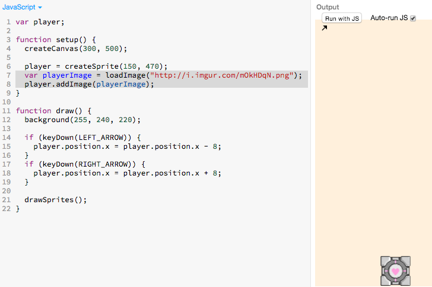
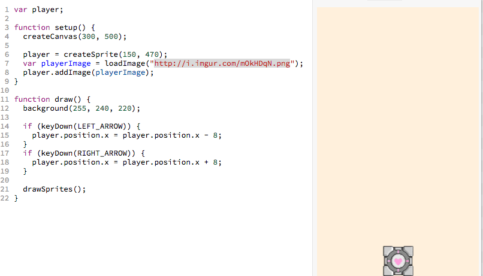
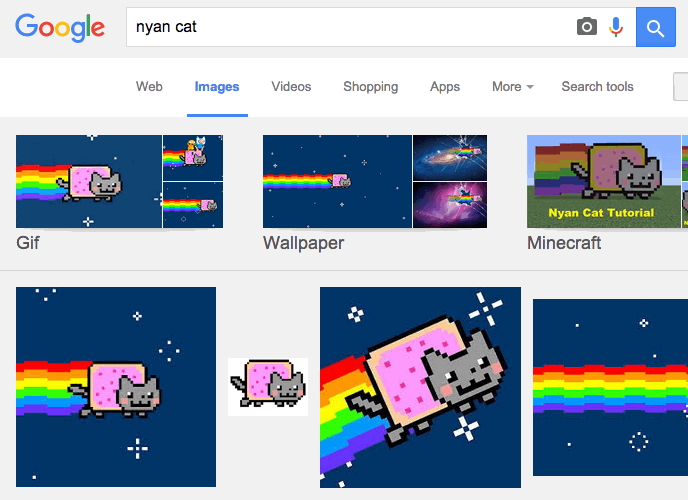
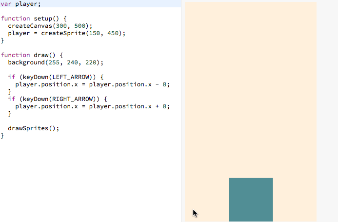

# Player Image

We can add an image to our player sprite with the following (new code
highlighted in gray):

> 

[](http://jsbin.com/qiyuno/39/edit?js,output)

The highlighted gray lines above (reproduced below) are responsible for the
new image:

```js
var playerImage = loadImage("http://i.imgur.com/mOkHDqN.png");
player.addImage(playerImage);
```

## Tinkering with The Image Code

I have links to two other images here:

```
http://i.imgur.com/yA2a7x4.png
http://i.imgur.com/7v8jXg8.png
```

Let me try replacing the image url with some of the above:

> 

 Try linking to your own images and see what happens! you
can use Google Image search to find an image.

**Hint**: when you google image search, add the "Transparent" color requirement
and the "Icon" size requirement:

> 

## Understanding the Code

```js
var playerImage = loadImage("http://i.imgur.com/mOkHDqN.png");
```

- Translation: **`load`** the **`image`** **`"http://i.imgur.com/mOkHDqN.png"`**
  into a newly created **`playerImage`** variable.

```js
player.addImage(playerImage);
```
- Translation: **`add`** the **`playerImage`** to the **`player`** sprite.

## Add It To Your Code

 Let's add these two lines of code to ours:

```js
var playerImage = loadImage("http://i.imgur.com/mOkHDqN.png");
player.addImage(playerImage);
```

Feel free to use your own image.

> 

## Recap

- We learned how to make a sprite have an image.

## Next Up

| **[        <br> 6. Add Enemy Sprite]       (add_enemy_sprite.md)** |
|:----------------------------------------------------------------------------------------------------|

## Appendix

### Follow Up Questions

**Why do you think that this new code is in the `setup` function and not the
`draw` function**?

## Table of Contents

| **[          <br> 1.  Blank Canvas]      (blank_canvas.md)**          | **[    <br> 2. Add Player Sprite]    (add_player_sprite.md)**    | **[  <br> 3. Linear Player Movement] (linear_player_movement.md)** |
|:----------------------------------------------------------------------------------------------------|:----------------------------------------------------------------------------------------------------|:-----------------------------------------------------------------------------------------------------------|
| **[    <br> 4.  Arrow Key Movement](arrow_key_movement.md)**    | **[         <br> 5. Player Image]         (player_image.md)**         | **[        <br> 6. Add Enemy Sprite]       (add_enemy_sprite.md)**       |
| **[ <br> 7.  Enemy Sprite Move] (linear_enemy_movement.md)** | **[ <br> 8. Enemy Go Back to Top] (enemy_go_back_to_top.md)** | **[   <br> 9. Random Enemy Position]  (random_enemy_position.md)**  |
| **[            <br> 10. Game Over]         (game_over.md)**             |                                                                                                     | **[ <br> Back to the README.md](README.md)**                                            |
