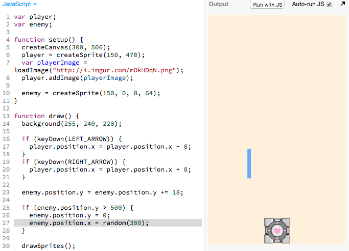
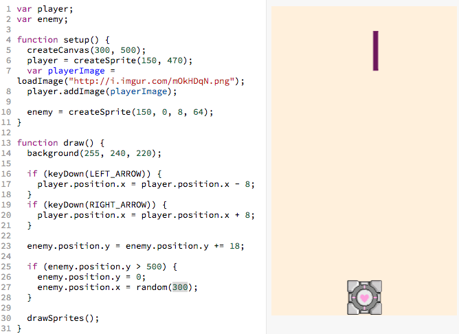
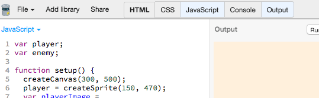
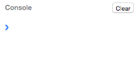
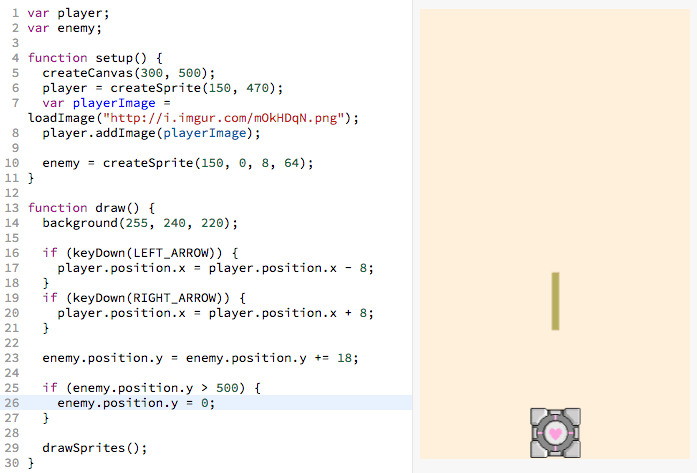

# Enemy - Random Position

Instead of having the enemy fall in the same place every time:

> 

We want it to to fall from a different place each time:

> 

We can make the enemy start at random x positions with the following code:

> 

[](http://jsbin.com/qiyuno/51/edit?js,output)

The highlighted gray lines above (reproduced below) are responsible for making
the enemy spawn in a random position:

```js
enemy.position.x = random(300);
```

## Tinkering

I'm going to try changing the `300` to other numbers:

> 

## Understanding the Code

`random(3)` outputs a number between `0` and `3`

`random(10)` outputs a number between `0` and `10`

`random(300)` outputs a number between `0 and 300`

Looking at the code:

```js
enemy.position.x = random(300);
```

Lets translate that!

> Set the **`enemy`**'s **`x`** **`position`** to a **`random`** number
  between **`0`** and **`300`**.

Why `300`? Because the width of the canvas is `300` and we want the enemy sprite
to be able to spawn anywhere in that region:


<!-- Let's try playing around with the `random()` function in the console.

 Open up the "Console" tab in JS Bin:

> 

 Then type in `random(3);`
your keyboard.

> 

and press the `enter` key on your keyboard

> 

-->

## Adding the Code

> 

## Recap

- We learned how to create random numbers
- We learned how to set the position of a sprite to a number

## Next

| **[            <br> 10. Game Over]         (game_over.md)** |
| --------------------------------------------------------------------------------------- |

## Appendix

_This appendix is still being built! Is there something you have a question
about? Submit an issue requesting its addition
[here](https://github.com/hackedu/hackedu/issues)_

## Table of Contents

| **[          <br> 1.  Blank Canvas]      (blank_canvas.md)**          | **[    <br> 2. Add Player Sprite]    (add_player_sprite.md)**    | **[  <br> 3. Linear Player Movement] (linear_player_movement.md)** |
| --------------------------------------------------------------------------------------------------- | --------------------------------------------------------------------------------------------------- | ---------------------------------------------------------------------------------------------------------- |
| **[    <br> 4.  Arrow Key Movement](arrow_key_movement.md)**    | **[         <br> 5. Player Image]         (player_image.md)**         | **[        <br> 6. Add Enemy Sprite]       (add_enemy_sprite.md)**       |
| **[ <br> 7.  Enemy Sprite Move] (linear_enemy_movement.md)** | **[ <br> 8. Enemy Go Back to Top] (enemy_go_back_to_top.md)** | **[   <br> 9. Random Enemy Position]  (random_enemy_position.md)**  |
| **[            <br> 10. Game Over]         (game_over.md)**             |                                                                                                     | **[ <br> Back to the README.md](README.md)**                                            |
