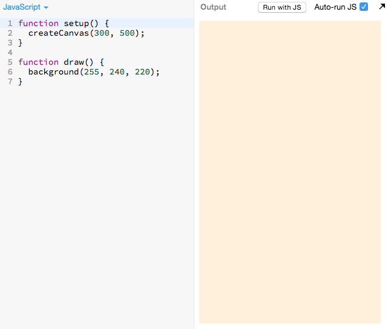
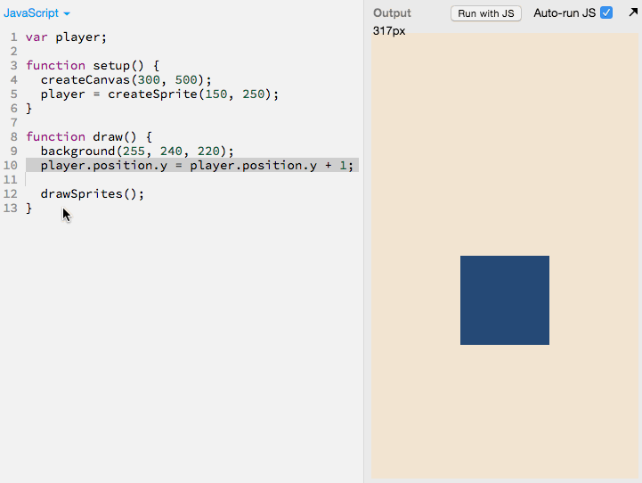
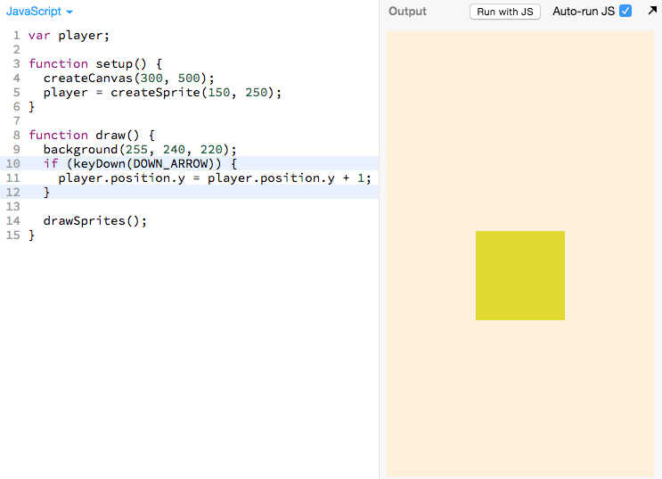
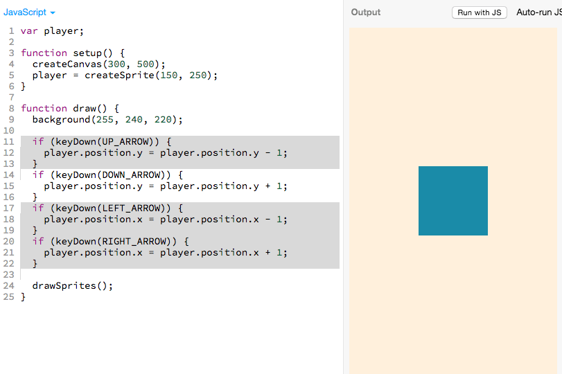

# Archive

_Questions, comments and critiques are welcome! Send your feedback
[here](https://docs.google.com/forms/d/1IxbiDtyP-UOx3hRGu3o2I-iVll95xQ6I_pW8JS3TZ2k/viewform)._

## Blank Canvas

http://jsbin.com/kecodi/3/edit?js,output

## Drawing the Player Sprite

Module: http://jsbin.com/qiyuno/13/edit?js,output
Tutorial: http://jsbin.com/qiyuno/14/edit?js,output

## Make the player move

Module: http://jsbin.com/lifana/15/edit?js,output

Tutorial: http://jsbin.com/qiyuno/15/edit?js,output

- make it move
- make it move faster

## Arrow key control

Module: http://jsbin.com/lifana/22/edit?js,output

Tutorial: http://jsbin.com/qiyuno/42/edit?js,output

- in the down direction
- in all the directions

## Make sprite an image

Tutorial: http://jsbin.com/qiyuno/39/edit?js,output

## Add an enemy sprite

http://jsbin.com/qiyuno/46/edit?js,output

## Make enemy sprite move down

http://jsbin.com/qiyuno/49/edit?js,output

## Make enemy sprite go back to top

http://jsbin.com/qiyuno/65/edit?js,output

## Make enemy sprite start at a random position

http://jsbin.com/qiyuno/51/edit?js,output

## Make it so that if the enemy touches, game over

http://jsbin.com/qiyuno/52/edit?js

## Optional: Make player re-spawn at a random position

http://jsbin.com/qiyuno/53/edit?js

## Next up

## Blank Canvas

> 

## Drawing the Player Sprite

> 

## Make the player move

> 

## Arrow key control

**Only in the down direction**

> 

**In all directions**

> 
