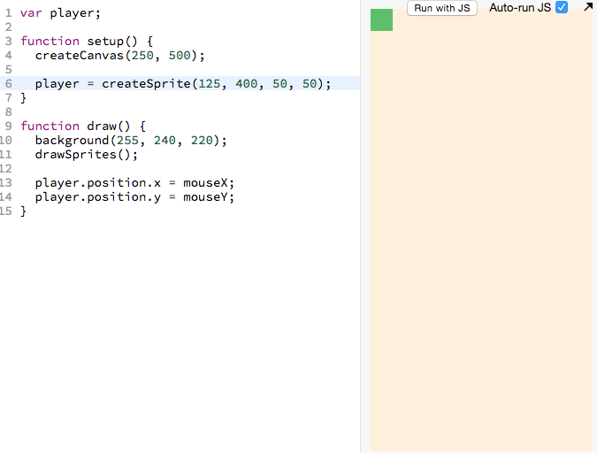

# Step 4: Dribbling the Ball

## Background

| From step 3: the sprite follows <br> the mouse <br>  | Now we want to add a ball that we <br> can dribble around <br>  |
|:-----------------------------------------------------------------------:|:----------------------------------------------------------------------------------:|

## Outcome of This Step

After you finish this step, you will learn how to to add the goal sprite. Here
is the code you will end up with (_the new code is highlighted in gray_):

> 

<a href="http://jsbin.com/dikevu/29/edit?js,output" target="_blank">
  
</a>

## Choose Your Own Path

- [**Walk me through this code step-by-step.**]
  (#walk-through-of-the-code-step-by-step)
    - Recommended for those who
      - are beginners
      - who want an in depth understanding of the code
- [**Give me a brief overview of this code.**](#brief-overview-of-the-code)
    - Recommended for those who
      - have more experience
      - want to cover more ground but have a less in depth understanding
      - want to recap what they did in the step-by-step section

# Walk Through of the Code Step-By-Step

## Adding the Ball Sprite

Create ball sprite in a similar way that you created the player sprite in
[step 2](add_player_sprite.md).

Here's the code that contains the new code to add a ball sprite:

```js
var player;
var ball;                                  // <-- NEW

function setup() {
  createCanvas(250, 500);

  player = createSprite(125, 400, 50, 50);
  ball = createSprite(125, 250, 25, 25);   // <-- NEW
}

function draw() {
  background(255, 240, 220);
  drawSprites();

  player.position.x = mouseX;
  player.position.y = mouseY;
}
```

- [ ] _Go ahead and add these two new lines of code. If you don't quite
       understand how they work, feel free to review [step 2]
       (add_player_sprite.md)._

> 

If you look at the above animation, you will see that the player sprite
does not move the ball around.

## Making the Player Sprite Be Able to Move the Ball Around

All we need to do is add this simple piece of code:

```js
ball.bounce(player)
```

The above line of code can be interpreted as "make the **`ball`** **`bounce`**
against the **`player`**".

- [ ] _Let's add the above line of code to our code:_

> 

### And that's a wrap

The section immediately below section is the "Give me a brief overview of this
code". You already did the "Walk me through this code step-by-step" section
so no need to do it.

[Click here to skip to the next section.](#next-up)

# Brief Overview of the Code

Reproduced below is the code that adds a ball and lets the player move it
around.

New lines marked with
`// <-- NEW LINE`.

```js
var player;
var ball;                                 // <-- NEW

function setup() {
  createCanvas(250, 500);

  player = createSprite(125, 400, 50, 50);
  ball = createSprite(125, 250, 25, 25);  // <-- NEW
}

function draw() {
  background(255, 240, 220);
  drawSprites();

  player.position.x = mouseX;
  player.position.y = mouseY;

  ball.bounce(player);                    // <-- NEW
}
```

- [ ] Go ahead and add the `NEW` lines to your code:

> 

<a href="http://jsbin.com/dikevu/29/edit?js,output" target="_blank">
  
</a>

## Understanding New Concepts

```js
ball.bounce(player)
```

The above line of code can be interpreted as "make the **`ball`** **`bounce`**
against the **`player`**".

## Next Up

| **[  <br> 5. Add Goal](add_goal.md)** |
|:-------------------------------------------------------------------|

## Steps

| **[ <br> 1. Initial Setup] (initial_setup.md)** | **[ <br> 2. Add Player Sprite]  (add_player_sprite.md)** | **[  <br> 3. Mouse Movement](mouse_movement.md)** |
|:-------------------------------------------------------------------|:----------------------------------------------------------------------------|:---------------------------------------------------------------------|
| **[ <br> 4. Dribble Ball](dribble_ball.md)**    | **[ <br> 5. Add Goal](add_goal.md)**                     | **[ <br> Back to the README.md](README.md)**      |
