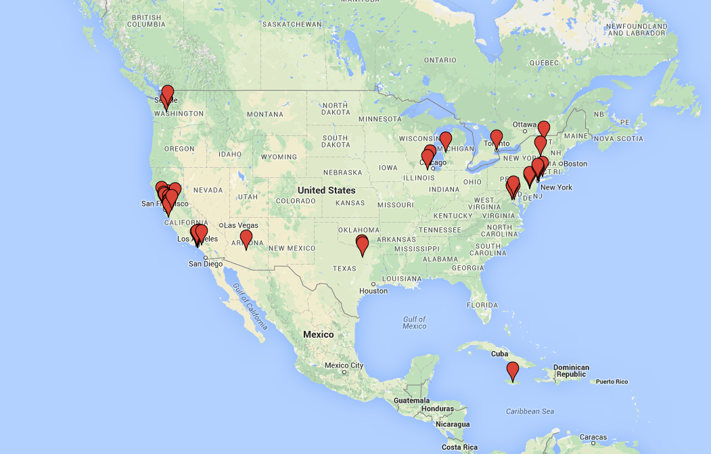

# June 8th, 2015 Progress Update

These past few months have been quite the learning experience.

Updates in brief:

- Grew to 40 schools across 11 states reaching 1300 students
  - 32% female (nearly 2x average in high school computer science classes)
  - 37% black/hispanic (7x industry average)
  - Nearly 1/3rd of our schools have a majority of students on free or reduced
    lunch
- Started the first of six sessions of our two-week summer program
- Began building a custom software component of our curriculum
- Our work has been mentioned in...
  - Cover story of the California Sunday (400k+ readers)
  - Today Show
  - EdSurge
- Zach was awarded the [Thiel Fellowship](https://www.thielfellowship.org/) to
  continue working on hackEDU

### Hack Camp

We're running a two-week summer program to build the first iteration of our
"club in a box"---our plug-and-play "playbook" for starting high school coding
clubs. Hack Camp brings participants from little or no coding experience to
creating games and publishing websites (with the broader goal of inspiring the
hacker mindset). We were originally targetting the program at local high school
students, but within two weeks of launching the program we received applications
from 13 states and 5 countries.

We're still in the early stages of developing our curriculum for the summer
program and next semester, but we've already started to receive promising
feedback from our participants. Here's feedback filled out in an anonymous form
from one of the participants.

> I liked the time given to us for self-discovery(both personally and
> coding-wise). Unlike most classes, this camp teaches not according to a
> standard, rigid curriculum but to a set of beliefs that allow every individual
> to explore what he/she wants, and I think that should be more prevalent in
> other institutions . . . [I]nstruction at this camp isn't merely regarding
> coding; it includes about life in general, which is a really important and
> nice touch since it relates to coding.

### Curriculum

We recently started development of Maestro, part of the software component of
our club curriculum. Maestro is a library (a set of reusable code) that makes it
significantly easier for new programmers to include third-party services in
their software (e.g. Twitter, Facebook, phone texting). Using Maestro, we'll be
able to include third-party services---a process that could previously take
hundreds of lines of code---in our introductory curriculum and have participants
writing software that uses Twitter on their first day.

### Press

We've started to receive limited interest from the press. We were recently
featured in the California Sunday's June cover story,
[Real Teens of Silicon Valley](https://stories.californiasunday.com/2015-06-07/real-teenagers-silicon-valley)
(distributed with the LA Times and SF Chronicle). Later this week a segment
including us is planned to air on the Today Show. We also got a mention in
EdSurge's
[Thiel Fellowship announcement](https://www.edsurge.com/n/2015-06-05-raise-a-glass-it-s-now-possible-to-become-a-thiel-fellow-and-legally-drink).
