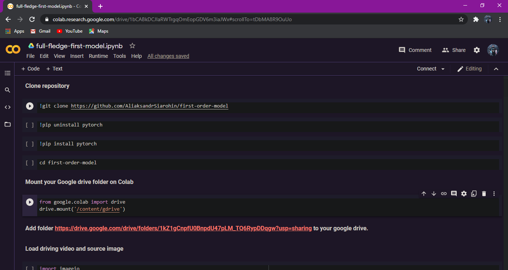

# Deep_meme


⏫ This is one of the things you will be able to do by following this workshop even with your own image or video.

### Why?
As I started learning ML, I wanted to create something visually awesome using AI (not just some numbers and graphs😪) but to make something awesome as the one above we must learn ML, DL and lots of maths. This workshop aims to introduce you to the world of Deep Learning and Deepfakes without discussing the mathematical and scary stuff. After this workshop you can have a taste of the superpower DL gives you, who knows you might fall in love with it😁. Also if you are not into codding so much but other domains (like painting) you might want to use this method too maybe in the following way😀


#### Here is another demo


⏫ The video(animation) on the far left is original video (driving video) which you can provide as input and the upper row of different images are the subject images, the lower row of videos is the output of the program.

### Few words about [AI](https://en.wikipedia.org/wiki/Artificial_intelligence), [ML](https://en.wikipedia.org/wiki/Machine_learning), [DL](https://en.wikipedia.org/wiki/Deep_learning) and [Deep-Fakes](https://en.wikipedia.org/wiki/Deepfake)
AI is one of those technologies which has changed (and going to change) the world completely, it can be easily compared to inventions like wheels and transistors. 
Machine Learning is a method under AI which uses data, math and code together to make machines intelligent🧠. It's almost similar to how a living being learns, we see a spoon daily and then we know it's a spoon based on it's characteristics. Deep Learning is a method under ML which uses more complex maths, [Neural Networks](https://en.wikipedia.org/wiki/Neural_network) (similar to how human brain has neurones) and lots of computations power (eats GPU for lunch 😅) to achieve greater feats such as self-driving cars.
Now we can <s>create</s> synthesise completely fake media file that look legit and we call those <b>DeepFakes</b>.
<br>

### Now Let's get Started 💻📈📉

<b>The tools/resources we are going to use are :</b>

- Your own google account 😁
- [Google Colab](https://colab.research.google.com/)
- python3 (included in colab)
- PyTorch library (included in colab)
- First-order-motion [model](https://github.com/AliaksandrSiarohin/first-order-model) (one of the most important)
- Google Drive
- Driving video (you can use your own or one of the demos)
- subject image(s) (again you can use your own, or from the demos)

<b>Google drive Setup</b>
Click on this link https://drive.google.com/drive/folders/1kZ1gCnpfU0BnpdU47pLM_TQ6RypDDqgw?usp=sharing and add the folder to your google drive. It was created by the creator of "first order motion model" and contains almost all the resources and checkpoints you will need. Check once to confirm you have saved this folder in your drive.

<b>Colab </b>
Google Colab: It is a service provided by google where you can run your intensive codes on a powerful machine (you get GPU, good processor, enough RAM even TPU, you can choose the combination). When you open it, you will see the following screen.
Log in with your Google account.


Click on <b>files</b> and select <b>new notebook</b>.

Click on <b>Runtime</b> and scron down to <b>Change runtime type</b> now choose <b>GPU</b> as the hardware accelerator. 

You will see something like this 
The whole Thing is called a colab notebook it is an adaptation of [jupyter-notebook](https://jupyter.org/)


You can see a line with a play button, that's called a cell where we write snippets of code and click on the play button to execute it.
Notice how I have another tab with my GDrive open, a good practice.

### Coding
Belove are some snippets of code which you just have to copy and paste in your colab cells and execute, a small explanation is given.

## cell-1 

Deep learning is not very easy, in order to make it easy we are going to copy pre-trained checkpoints from Aliaksandr Siarohin (creator of first order motion) so that we get some pre-trained data.

```jupyter-notebook
!git clone https://github.com/AliaksandrSiarohin/first-order-model
```
## cell-2

navigating to the right directory.
```python
cd first-order-model
```

## cell-3

We have our resources in GDrive but we need to use those here in colab, so we are going to link both.
```python
from google.colab import drive
drive.mount('/content/gdrive')
```
<b> Note that in this step you will have to click on the given link, allow permission for GDrive and copy the verification code which you will have to paste in the input prompt </b>


Writing the code in the notebook will look something like this.



## cell-4

Loading the driving video, subject image and libraries.

```python
import imageio
import numpy as np
import matplotlib.pyplot as plt
import matplotlib.animation as animation
from skimage.transform import resize
from IPython.display import HTML
import warnings
warnings.filterwarnings("ignore")

source_image = imageio.imread('/content/gdrive/My Drive/first-order-motion-model/02.png')
reader = imageio.get_reader('/content/gdrive/My Drive/first-order-motion-model/04.mp4')


#Resize image and video to 256x256

source_image = resize(source_image, (256, 256))[..., :3]

fps = reader.get_meta_data()['fps']
driving_video = []
try:
    for im in reader:
        driving_video.append(im)
except RuntimeError:
    pass
reader.close()

driving_video = [resize(frame, (256, 256))[..., :3] for frame in driving_video]

def display(source, driving, generated=None):
    fig = plt.figure(figsize=(8 + 4 * (generated is not None), 6))

    ims = []
    for i in range(len(driving)):
        cols = [source]
        cols.append(driving[i])
        if generated is not None:
            cols.append(generated[i])
        im = plt.imshow(np.concatenate(cols, axis=1), animated=True)
        plt.axis('off')
        ims.append([im])

    ani = animation.ArtistAnimation(fig, ims, interval=50, repeat_delay=1000)
    plt.close()
    return ani
    

HTML(display(source_image, driving_video).to_html5_video())
```

You will get a weird ouput, don't get afraid if the output is bad because the machine is in learning state.

## cell-5

We are now loading the checkpoints which were pre-trained by the creator to help our model learn.

```python
from demo import load_checkpoints
generator, kp_detector = load_checkpoints(config_path='config/vox-256.yaml', 
                            checkpoint_path='/content/gdrive/My Drive/first-order-motion-model/vox-cpk.pth.tar')
```

## cell-6

This is the second and final stage of learning

```python
from demo import make_animation
from skimage import img_as_ubyte

predictions = make_animation(source_image, driving_video, generator, kp_detector, relative=True)

#save resulting video
imageio.mimsave('../generated.mp4', [img_as_ubyte(frame) for frame in predictions], fps=fps)
#video can be downloaded from /content folder

HTML(display(source_image, driving_video, predictions).to_html5_video())
```

## cell-7

Here we are comapring and using relative vs adaptive method so that evrything from the driving video doesn't effect the output. For example Putin haircut will be extended to match Trump's haircut.

```python
predictions = make_animation(source_image, driving_video, generator, kp_detector, relative=False, adapt_movement_scale=True)
HTML(display(source_image, driving_video, predictions).to_html5_video())
```
#### Training is complete, you have just created a deep learning model.

## cell-8

#### Running on whichever data we like
Till now we were using source image - 'My Drive/first-order-motion-model/02.png' <i>and</i> driving video -  'My Drive/first-order-motion-model/04.mp4'
I provided full path as I want you to go to the path in your GDrive and take a look at both. Observe the size and dimensions to have an idea what kind of video and image set it works best on (where should the head be, how much od your body should be visible, how much sould it be moving , etc)

<b>First we need to crop a face from both source image and video, while simple graphic editor like paint can be used for cropping from image. Cropping from video is more complicated. We are using ffpmeg for this. </b>

```python
!ffmpeg -i /content/gdrive/My\ Drive/first-order-motion-model/07.mkv -ss 00:08:57.50 -t 00:00:08 -filter:v "crop=600:600:760:50" -async 1 hinton.mp4
```

## cell-9

Or you can record an accurate(teh type needed) video of yourself and save it in GDrive and input the path below.
source_image is whichever image you want to add motion to
driving_video = is the video you want to mimic.

```python
source_image = imageio.imread('/content/gdrive/My Drive/first-order-motion-model/09.png')
driving_video = imageio.mimread('hinton.mp4', memtest=False)


#Resize image and video to 256x256

source_image = resize(source_image, (256, 256))[..., :3]
driving_video = [resize(frame, (256, 256))[..., :3] for frame in driving_video]

predictions = make_animation(source_image, driving_video, generator, kp_detector, relative=True,
                             adapt_movement_scale=True)

HTML(display(source_image, driving_video, predictions).to_html5_video())
```

If you decided to record a corret size video and try it, just skip cell-8 we dont need it and change the code in cell 8 <b>from</b>
```python
source_image = imageio.imread('/content/gdrive/My Drive/first-order-motion-model/09.png')
driving_video = imageio.mimread('hinton.mp4', memtest=False)
```

<b>To</b>
```python
source_image = imageio.imread('/content/gdrive/My Drive/first-order-motion-model/09.png')
driving_video = imageio.mimread('/content/gdrive/My Drive/first-order-motion-model/video-name.mp4', memtest=False)
```
Now save your notebook and create a copy of it. Open the copy of the notebook and start messing around with whatever you like, experiment and observe the result. If you got interested in Deep Learning learn about it.

#### Error and troubleshooting 
This is a straight forward process but if you are getting any errors, it might be due to the file name and extensions (images in .png and viddeos in .mp4 or .mkv are supported).

##### Done
Before the first-order-motion was invented we needed more than 5 images of the target and many different videos of the source to create a deepfake, but this FOM model has changed the game completely for which we should thank <b>Aliaksandr Siarohin</b>.
You can take a look at the FOM directory [Here](https://github.com/AliaksandrSiarohin/first-order-model) .

## I hope you Enjoy this workshop and find new ways to use this super-power because the possibilities are endless.

# Happy Hacking!!!
