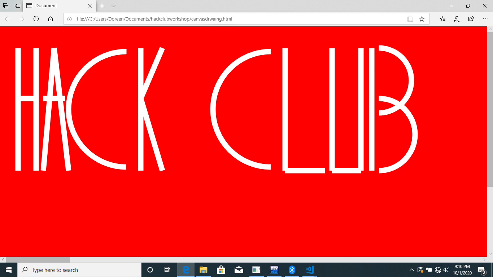
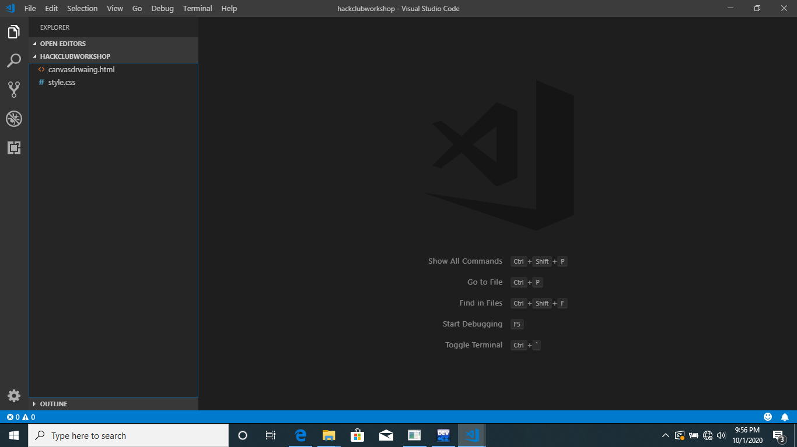
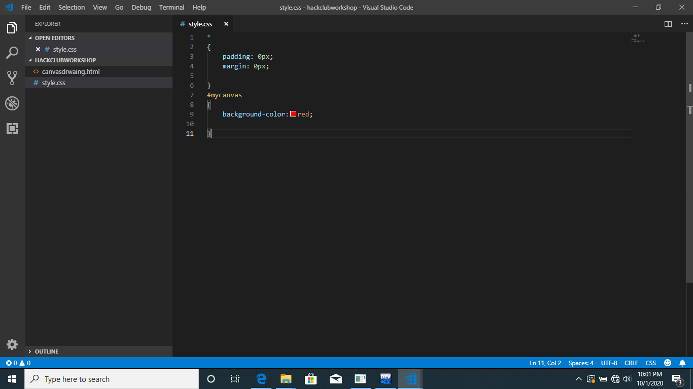

---
name: 'drawing letters on canvas'
description: 'drawing letters  HACK CLUB on canvas using some javascript'
author: 'Doreen2002'
in this workshop will be building or drawing this on the HTML canvas 
this workshop is open to both people with little or no knowledge in javascript HTML and CSS.
HTML is basically a markup language that structures our web page
CSS used to style web page.
javascript is a scripting language will b using todraw on our canvas.
using your favorite code editor create two files, one with .HTML extension and the other with CSS extension like this 
now in our CSS file add the following basics styles 
 now in our HTML file lets add following basic HTML code in our HTML file.

<!DOCTYPE html>
<html lang="en">
<head>
    <meta charset="UTF-8">
    <meta name="viewport" content="width=device-width, initial-scale=1.0">
    <meta http-equiv="X-UA-Compatible" content="ie=edge">
    <title>Document</title>
    <link rel="stylesheet" href="style.css">
</head>
<body>
</body>
</html>
now we have basic html code lets now add our canvas element that will draw on
<!DOCTYPE html>
<html lang="en">
<head>
    <meta charset="UTF-8">
    <meta name="viewport" content="width=device-width, initial-scale=1.0">
    <meta http-equiv="X-UA-Compatible" content="ie=edge">
    <title>Document</title>
    <link rel="stylesheet" href="style.css">
</head>
<body>
    
    <canvas  id="mycanvas" width="10000px" height="900px">

    </canvas>
    </body>
    </html>
    this gives our canvas a width of 10000px and height of 900px for drawing.
    how will need to add a script tag that will use to add our javascript code will add this tag after the canvas element.

    <!DOCTYPE html>
<html lang="en">
<head>
    <meta charset="UTF-8">
    <meta name="viewport" content="width=device-width, initial-scale=1.0">
    <meta http-equiv="X-UA-Compatible" content="ie=edge">
    <title>Document</title>
    <link rel="stylesheet" href="style.css">
</head>
<body>
    
    <canvas  id="mycanvas" width="10000px" height="900px">

    </canvas>
    
    </body>
    </html>
    now lets add some javascript 
    so first we have to access our canvas element , so will declare a variable to store the canvas in and name it canvas. secondly we need to add the getContext which is built inHTML object that has methods to allow us draw  will also store it in a variable called ctx.
    note: a variable is a place holder of a value or object.

    <!DOCTYPE html>
<html lang="en">
<head>
    <meta charset="UTF-8">
    <meta name="viewport" content="width=device-width, initial-scale=1.0">
    <meta http-equiv="X-UA-Compatible" content="ie=edge">
    <title>Document</title>
    <link rel="stylesheet" href="style.css">
</head>
<body>
    
    <canvas  id="mycanvas" width="10000px" height="900px">

    </canvas>
    
      </body>
      </html>

      now lets get started with drawing but bfore that in this workshop will be using the following methods fron getContext to draw on how canvas.

      moveTo: were will start drawing the line from, takes in two parameter x,y.
      lineTo: were our line ends from, takes in two parameter x,y 
      beginPath: used to begin a path
      now lts get business and start drawing, so will start with.
       drawing letter H:
      <!DOCTYPE html>
<html lang="en">
<head>
    <meta charset="UTF-8">
    <meta name="viewport" content="width=device-width, initial-scale=1.0">
    <meta http-equiv="X-UA-Compatible" content="ie=edge">
    <title>Document</title>
    <link rel="stylesheet" href="style.css">
</head>
<body>
    
    <canvas  id="mycanvas" width="10000px" height="900px">

    </canvas>
    
</body>
</html>
drawing letter A:
<!DOCTYPE html>
<html lang="en">
<head>
    <meta charset="UTF-8">
    <meta name="viewport" content="width=device-width, initial-scale=1.0">
    <meta http-equiv="X-UA-Compatible" content="ie=edge">
    <title>Document</title>
    <link rel="stylesheet" href="style.css">
</head>
<body>
    
    <canvas  id="mycanvas" width="10000px" height="900px">

    </canvas>
    
      </body>
      </html>

    drawing letter C:
    <!DOCTYPE html>
<html lang="en">
<head>
    <meta charset="UTF-8">
    <meta name="viewport" content="width=device-width, initial-scale=1.0">
    <meta http-equiv="X-UA-Compatible" content="ie=edge">
    <title>Document</title>
    <link rel="stylesheet" href="style.css">
</head>
<body>
    
    <canvas  id="mycanvas" width="10000px" height="900px">

    </canvas>
    
     </body>
     <html>

     drawing letter K:
     <!DOCTYPE html>
<html lang="en">
<head>
    <meta charset="UTF-8">
    <meta name="viewport" content="width=device-width, initial-scale=1.0">
    <meta http-equiv="X-UA-Compatible" content="ie=edge">
    <title>Document</title>
    <link rel="stylesheet" href="style.css">
</head>
<body>
    
    <canvas  id="mycanvas" width="10000px" height="900px">

    </canvas>
    
      </body>
      </html>
       drawing letter C:
       <!DOCTYPE html>
<html lang="en">
<head>
    <meta charset="UTF-8">
    <meta name="viewport" content="width=device-width, initial-scale=1.0">
    <meta http-equiv="X-UA-Compatible" content="ie=edge">
    <title>Document</title>
    <link rel="stylesheet" href="style.css">
</head>
<body>
    
    <canvas  id="mycanvas" width="10000px" height="900px">

    </canvas>
    
      </body>
      </html>
      drawing letter L:
      <!DOCTYPE html>
<html lang="en">
<head>
    <meta charset="UTF-8">
    <meta name="viewport" content="width=device-width, initial-scale=1.0">
    <meta http-equiv="X-UA-Compatible" content="ie=edge">
    <title>Document</title>
    <link rel="stylesheet" href="style.css">
</head>
<body>
    
    <canvas  id="mycanvas" width="10000px" height="900px">

    </canvas>
    
      </body>
      </html>
      drawing letter U:
      <!DOCTYPE html>
<html lang="en">
<head>
    <meta charset="UTF-8">
    <meta name="viewport" content="width=device-width, initial-scale=1.0">
    <meta http-equiv="X-UA-Compatible" content="ie=edge">
    <title>Document</title>
    <link rel="stylesheet" href="style.css">
</head>
<body>
    
    <canvas  id="mycanvas" width="10000px" height="900px">

    </canvas>
    
      </body>
      </html>
drawing letter B:
<!DOCTYPE html>
<html lang="en">
<head>
    <meta charset="UTF-8">
    <meta name="viewport" content="width=device-width, initial-scale=1.0">
    <meta http-equiv="X-UA-Compatible" content="ie=edge">
    <title>Document</title>
    <link rel="stylesheet" href="style.css">
</head>
<body>
    
    <canvas  id="mycanvas" width="10000px" height="900px">

    </canvas>
    
</body>
</html>

After completing this work shop one will have a full understanding of how drawing using coordinates work.
from this workshop you will be motivated to work on canvas projects such as game making, drawing smilly face.