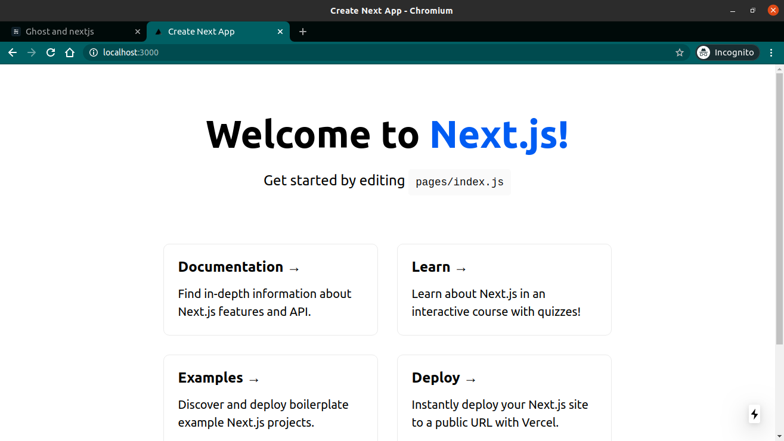

This workshop aims help you build a blog on the [Jamstack](https://jamstack.org/what-is-jamstack/). By the end of this workshop, we would spin up an blog with an entirely custom frontend with the [NextJS](https://nextjs.org/) react framework and the CMS with [Ghost.js](https://ghost.org/), an api driven headless cms.

## The Stack

### [Jamstack](https://jamstack.org/what-is-jamstack/)

You've probably heard of the Jamstack or come across it a few times,
Jamstack is the new standard architecture for the web designed to make websites faster. Using Git workflows and modern build tools, pre-rendered content is served to a **CDN** and made dynamic through **APIs** and **serverless functions**. Technologies in the stack include JavaScript frameworks, Static Site Generators, Headless CMS, and CDNs.

Technologies in this workshop:

- React.js(Javascript framework)
- Next.js(Static site Generator)
- Ghost.js(Headless CMS)

Hosting on a CDN is beyond the scope of this workshop.

### [Next.JS](https://nextjs.org/)

Next.js is an open-source React front-end development web framework that enables functionality such as server-side rendering and generating static websites for React based web applications. It is a production-ready framework that allows developers to quickly create static and dynamic Jamstack websites.

### Headless CMS

An headless CMS(content management system), is a back-end only content management system (CMS) built from the ground up as a content repository that makes content accessible in an api driven manner via a RESTful API for display on any client, regardless of the device.

So it’s basically a full-backend service with the database and also the editor and everything set up for you without any view representation, you interact with the api and JSON response. There are several headless cms examples out there, Including Ghost.js I’ll show an example of how to build a blog feature in a NextJS website with Ghost.js headless cms. This is what we’re going to develop in this workshop.

### why [Ghost.js](https://ghost.org/)

Ghost is the number one open source CMS on github. Ghost is an open source, professional publishing platform built on a modern Node.js technology stack, and is completely framework agnostic — designed with flexibility and performance built-in.

Every day Ghost powers some of the most-read stories on the internet, serving hundreds of millions of requests across tens of thousands of sites.


###### we move, one step at a time...

## Prerequisites

This configuration of a Ghost publication requires existing moderate knowledge of JavaScript and React. but everybody is welcome to follow along, i would try to break stuffs down as much as possible.


###### _Let's get this party started_

## Setup Ghost.js

Ghost is completely free and open source. It can be downloaded and self-hosted just about anywhere, or spun up in a few moments using the Ghost(Pro) managed PaaS, but this includes a subscription which comes with a 14 day free trial.

I’ll be using a **self hosted** option on my machine, this way you don't have to pay atleast until you are ready to host it, and you have the option of using other hosting providers. you can go ahead and setup your ghost pro account if you like.

### Install [Ghost CLI](https://ghost.org/docs/api/v3/ghost-cli/)

Ghost-CLI is a fully loaded tool to help you get Ghost installed and configured and to make it super easy to keep your Ghost install up to date from the command line interface, use the code to install Ghost CLI globally

```bash
npm install -g ghost-cli
```

now install ghost using the Ghost-CLI

```bash
ghost install local
```

_Grab a coffee, this could take while..._

Ghost is an api diven CMS, which means you do your CRUD interactions through the api, the response is in JSON format. but Ghost ships with Handlebars so you can begin interacting with your content immediately so once it's done you can access Ghost from [http://localhost:2368](http://localhost:2368)


###### Ghost default site

### Setup Next.js react application

We setup our Next.js frontend application via the command line using:

i am using [yarn](https://yarnpkg.com/) as my package manager, you can also use npx if you do not have yarn

```bash
yarn create next-app
cd my-next-app
yarn dev
```

_nah you don't really need another cup of coffee_

once the setup completes, we are ready to spin things up.

```bash
cd my-app
yarn dev
```

This serves the NextJS server on [http://localhost:3000](http://localhost:3000)



###### Next.js default starter

## Hooking things up

So now we have setup GhostJS and NextJS, but they are not aware of each other existence and cannot interact yet.
USing the JavaScript Ghost Content API Client Library, it's possible for content from a Ghost site can be directly accessed in your Next.js application.

### Within your Next.js application

Install the official JavaScript Ghost Content API helper

```bash
yarn add @tryghost/content-api
```

Create a new file called posts.js within the pages/api/ directory. This file will contain the config and instance of Ghost Content API as well as the functions needed to request the contents from Ghost.

###### NextJS

```diff
my-app
|- /.next
|- /node_modules
|- /pages
  |- /api
  + |- posts.js
  |- _app_.js
  |- index.js
|- /styles
|- .gitignore
|- package.json
```

import the contentApi helper into posts.js file

###### /pages/posts.js

```jsx
import GhostContentAPI from "@tryghost/content-api";
```

Now the instance of the Ghost Content API can be created using Ghost site credentials:

###### /pages/posts.js

```javascript
const api = new GhostContentAPI({
  url: "http://localhost:2368",
  key: "<your content api key here>",
  version: "v3",
});
```

you have to create your site credentials from the Ghost admin interface, in this case [http://localhost:2368/ghost/](http://localhost:2368/ghost/), in this format [http(s)/[your ghst site url]/ghost](). Go to integrations and create a new integration, name it NextJS.

The API url, is the url your ghost site runs on, copy API URL and replace this config

the key is the content api key from your integration

and the version denotes the version of the content api we want to interact with, v3 is currently the latest version.

### Expose the contents

The `posts.browse()` endpoint can be used to get all the posts from a Ghost site.
This can be done with the following code as an asynchronous function:

###### /pages/posts.js

```jsx
export async function getPosts() {
  return await api.posts
    .browse({
      limit: "all",
      include: "authors, tags",
    })
    .catch((err) => {
      console.error(err);
    });
}
```

this accepts some options to format how we want to return the posts:

**limit** - By default, only 15 records are returned at once, passing all returns all the posts at once, you do not want to use this always.

**Include** - Tells the API to return additional data related to authors, tags

we can now render the posts into our blog

our post.js file should look like this:

###### pages/posts.js

```jsx
import GhostContentAPI from "@tryghost/content-api";

const api = new GhostContentAPI({
  url: "http://localhost:2368",
  key: "40835a1784824da9a2bcce5466",
  version: "v3",
});

export async function getPosts() {
  return await api.posts
    .browse({
      limit: "all",
      include: "authors, tags",
    })
    .catch((err) => {
      console.error(err);
    });
}
```

### Rendering Posts

In React apps data is passed to pages and components with props. Next.js extends upon that concept with getInitialProps function. This function will load the Ghost site content into the page before it's rendered in the browser.

import the getposts function in the index.js file

###### pages/index.js

```jsx
import { getPosts } from "./api/posts";
```

The posts can be provided as props to the page with the getInitialProps function. In this case the page is Home:

###### pages/index.js

```jsx
Home.getInitialProps = async () => {
  const posts = await getPosts();
  return { posts: posts };
};
```

Now the posts can be used within the Home via the component props:

```jsx
const Home = (props) => (
  <div style={{ margin: "50px" }}>
    {props.posts.map((post) => (
      <Link href={`/[slug]`} as={`/${post.slug}`}>
        <div
          style={{
            background: "grey",
            marginBottom: "20px",
            borderRadius: "5px",
            padding: "10px",
          }}
          key={post.id}
        >
          <h3>{post.title}</h3>

          <p>{post.excerpt}</p>
        </div>
      </Link>
    ))}
  </div>
);
```

don't forget to export the page

```jsx
export default Home;
```

this is how the index.js file looks currently:

###### pages/index.js

```jsx
import { getPosts } from "./api/posts";

const Home = (props) => (
  <div style={{ margin: "50px" }}>
    {props.posts.map((post) => (
      <div
        style={{
          background: "grey",
          marginBottom: "20px",
          borderRadius: "5px",
          padding: "10px",
        }}
        key={post.id}
      >
        <h3>{post.title}</h3>

        <p>{post.excerpt}</p>
      </div>
    ))}
  </div>
);

Home.getInitialProps = async () => {
  const posts = await getPosts();
  return { posts: posts };
};

export default Home;
```

### Rendering a single post

Retrieving Ghost content from a single post can be done in a similar fashion to retrieving all posts. By using posts.read() it's possible to query the Ghost Content API for a particular post using a post id or slug.

in the api/posts.js file and add the following async function:

###### api/posts.js

```javascript
export async function getSinglePost(postSlug) {
  return await api.posts
    .read({
      slug: postSlug,
    })
    .catch((err) => {
      console.error(err);
    });
}
```

This function accepts a single postSlug parameter, which will be passed down by the template file using it. The page slug can then be used to query the Ghost Content API and get the associated post data back.

Next.js provides dynamic routing for pages that don't have a fixed URL / slug. The name of the js file will be the variable, in this case the post slug, wrapped in square brackets – [post].js.

create a dynamic page in pages directory, [post].js

###### NextJS

```diff
my-app
|- /.next
|- /node_modules
|- /pages
  |- /api
    |- posts.js
  |- _app_.js
  |- index.js
  + [post].js
|- /styles
|- .gitignore
|- package.json
```

The `getSinglePost()` function can be used within the **[post].js** file like so:

###### /pages/[post].js

```jsx
// Import getSinglePost function
import { getSinglePost } from "./api/posts";

// PostPage page component
const PostPage = (props) => {
  // Render post title and content in the page from props
  return (
    <div>
      <h1>{props.post.title}</h1>
      <div dangerouslySetInnerHTML={{ __html: props.post.html }} />
    </div>
  );
};

// Pass the page slug over to the "getSinglePost" function
// In turn passing it to the posts.read() to query the Ghost Content API
PostPage.getInitialProps = async (params) => {
  console.log(params.query);
  const post = await getSinglePost(params.query.post);
  return { post: post };
};

export default PostPage;
```

now update index.js to become

###### indexpage.js

```Jsx
import { getPosts } from "./api/posts";
import Link from "next/link";

const Home = (props) => (
  <div style={{ margin: "50px" }}>
    {props.posts.map((post) => (
      <Link href={`/[slug]`} as={`/${post.slug}`}>
        <div
          style={{
            background: "grey",
            marginBottom: "20px",
            borderRadius: "5px",
            padding: "10px",
          }}
          key={post.id}
        >
          <h3>{post.title}</h3>

          <p>{post.excerpt}</p>
        </div>
      </Link>
    ))}
  </div>
);

Home.getInitialProps = async () => {
  const posts = await getPosts();
  return { posts: posts };
};

export default Home;
```

We now have a basic blog with our contents managed by Ghost CMS via an api.

## Managing Contents on Ghost

We read some post contents from ghost through the content api into the frontend, You're probably wondering how all that content got into Ghost, Ghost ships some default data out of the box.

You can manage your ghost contents through the Ghost admin interface on [http://localhost:2368/ghost/](http://localhost:2368/ghost/).


Ghost has a really great and powerful content editor that can be used right from the browser with all the features you would expect to find


## Next Steps

We now have a blog built on the Jamstack, this should get you started spinnig up your blog, Go ahead and add some styling and get creative, continue to hosting your blog on a CDN to fully utilize the Jamstack. There is a lot more to Ghost.Js and Next.JS

Feel free to download the [Source Code](https://github.com/Robogeek95/jamblog)

refrences:

- [Ghost Javascript SDK](https://ghost.org/docs/api/v3/javascript/sdk/)

- [Next.js Documentation](https://nextjs.org/docs/getting-started)

- [Ghost.js Documentation](https://ghost.org/docs/)

For ideas and inspirations see some blogs built on the jamstack:

- [Mozilla mixed reality blog](https://blog.mozvr.com/)
- [DuckDuckGo blog](https://spreadprivacy.com/)
- [Airtable Blog](https://blog.airtable.com/)
- [The Gradient](https://thegradient.pub/)
- [CMS critic](https://www.cmscritic.com/)
