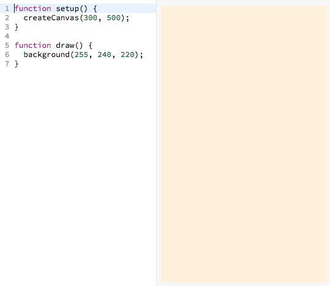
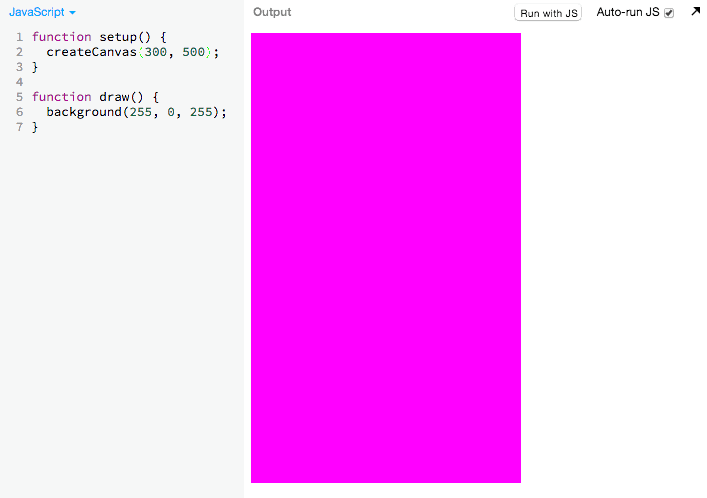
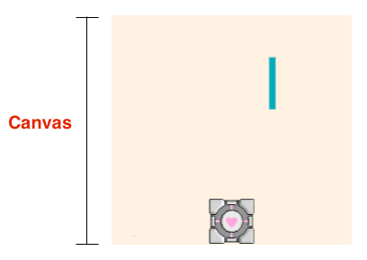
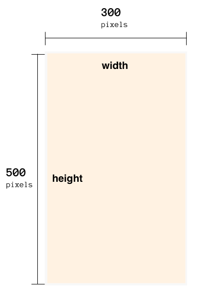
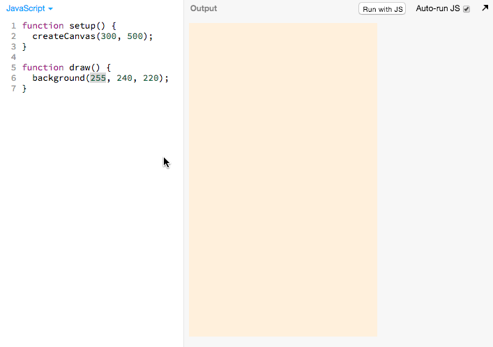
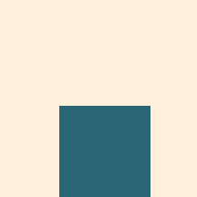
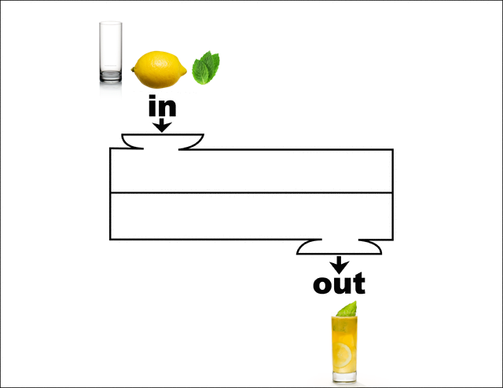
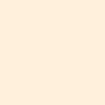
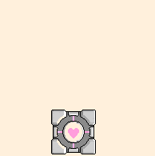

# Blank Canvas

We'll be using JS Bin for this tutorial. Feel free to use your own editor.

 If you are using JS Bin, make sure you have created an
account first.

 Then open [this pre-made JS
Bin template.][blank_canvas]

> 

[][blank_canvas]

You will be building off the above template throughout the tutorial. We'll call
the JS Bin you're working and saving in the "_**working bin**_".

Here is the excerpt of the code from the JS Bin template:

```js
function setup() {
  createCanvas(300, 500);
}

function draw() {
  background(255, 240, 220);
}
```

In this part, we won't talk about what `function setup()` and `function draw()`
are. We'll cover this in more detail
[later](linear_player_movement.md#understanding-the-code).

## Tinkering with the values of `createCanvas`

 In your **_working bin_**, try changing some of the
values of `createCanvas` to try to see what it changes.

Here is an example of how I play around with the values of `createCanvas` to try
understand what it does:

> 

## Understanding `createCanvas`

As a reminder, the area on which everything lives is called the
"canvas":

> 

`createCanvas` creates and sets the size of the canvas so:

```
createCanvas(300, 500);
              ^    ^
              |    └ set the *height* of the canvas to 400
              |
              └ set the *width* of canvas  to 600
```

Here is a diagram representing the result of the above code:



<!-- Google Drawing https://docs.google.com/drawings/d/1c0rai1S-RTuSrfU_WTnUKDH8o3c-eaeobzf7O58ad0k/edit?usp=sharing -->

## Tinkering with the values of `background`

 Try changing some of the values of `createCanvas` to
try to see what it changes.

Here is an example of how I play around with the values of `background` to try
understand what it does:

> 

## Understanding `createCanvas`

```
This code sets the background color of the canvas:

  background(255, 255, 255);
              ^    ^    ^
              |    |    └ set how much *red* there is
              |    |
              |    └ set how much *green* there is
              |
              └ set how much *blue* there is
```

## Setting the Proper Dimensions

Now that you've gotten a chance to experiment, we want our canvas to have a
width of `300` and a height of `500`.

 Go ahead and make sure that your setup function looks
like this:

```js
function setup() {
  createCanvas(300, 500);
}
```

## Recap

- You learned how to use `createCanvas`
- You learned how to use `background`

## Next Up

| **[    <br> 2: Adding the Player Sprite]    (add_player_sprite.md)**    |
| ---------------------------------------------------------------------------------------------------------- |

---

# Appendix

## Documentation 

**Links to the official p5.js Documentation**

- [`background(255, 255, 255)`](http://p5js.org/reference/#/p5/background)
- [`createCanvas(300, 500)`](http://p5js.org/reference/#/p5/createCanvas)

## Computer Science Fundamentals 

**_This Section is Coming Soon!_**—In the mean time, here is a sneak peak:

### Functions

`createCanvas` and `background` are what we call _**functions**_.

Functions can have the following:

- Inputs
- Side effects
- Outputs

#### Lemonade Analogy

Consider this lemonade making machine as a function:



In the above drawing, you can see that

- The inputs are a glass, lemon, and mint
- The output is lemonade

But what are the side effects?

- The lemonade juicing machine gets hot from use
- The user, who is not an input got better making lemonade
- You and your friends bond over making lemonade

Sometimes, you care more about the side effects than the outputs.

#### Create Canvas

Let's examine the components of `background(255, 255, 255)`

##### Inputs

The inputs are whatever in the parenthesis.

In this case the `background` function has 3 inputs:

```
background(255, 255, 255);
            ^    ^    ^
            |    |    └ input 3
            |    |
            |    └ input 2
            |
            └ inputs 1
```

##### Side Effects

The side effect of this function is to set the color of the canvas.

##### Outputs

This function has no outputs. This may not seem like it makes sense right now
but if you visit the functions section of `createSprite` (which doesn't exist
yet), it will make much more sense.

## Associated Modules:

**_This Section is Coming Soon!_**—We don't have any modules yet, but we're
working on it!

| **[          <br> Module Coming Soon!]      (blank_canvas.md)**          |
| ------------------------------------------------------------------------------------------------ |

--------------------------------------------------------------------------------

## Table of Contents

| **[          <br> 1.  Blank Canvas]      (blank_canvas.md)**          | **[    <br> 2. Add Player Sprite]    (add_player_sprite.md)**    | **[  <br> 3. Linear Player Movement] (linear_player_movement.md)** |
| --------------------------------------------------------------------------------------------------- | --------------------------------------------------------------------------------------------------- | ---------------------------------------------------------------------------------------------------------- |
| **[    <br> 4.  Arrow Key Movement](arrow_key_movement.md)**    | **[         <br> 5. Player Image]         (player_image.md)**         | **[        <br> 6. Add Enemy Sprite]       (add_enemy_sprite.md)**       |
| **[ <br> 7.  Enemy Sprite Move] (linear_enemy_movement.md)** | **[ <br> 8. Enemy Go Back to Top] (enemy_go_back_to_top.md)** | **[   <br> 9. Random Enemy Position]  (random_enemy_position.md)**  |
| **[            <br> 10. Game Over]         (game_over.md)**             |                                                                                                     | **[ <br> Back to the README.md](README.md)**                                            |

[blank_canvas]: https://jsbin.com/gist/e282814328d84c6d820d?js,output
