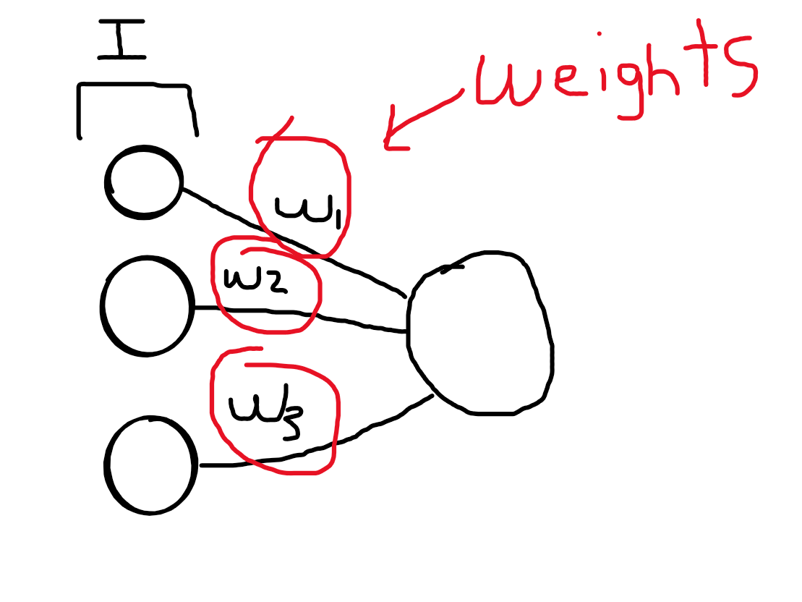
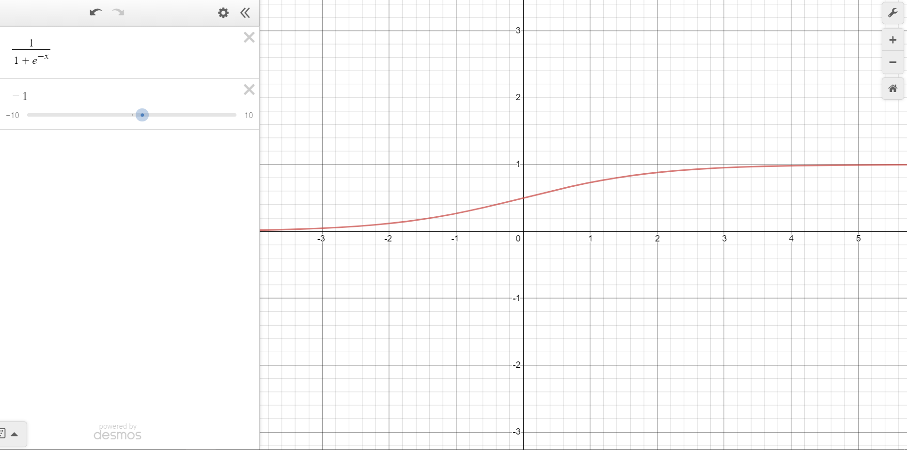
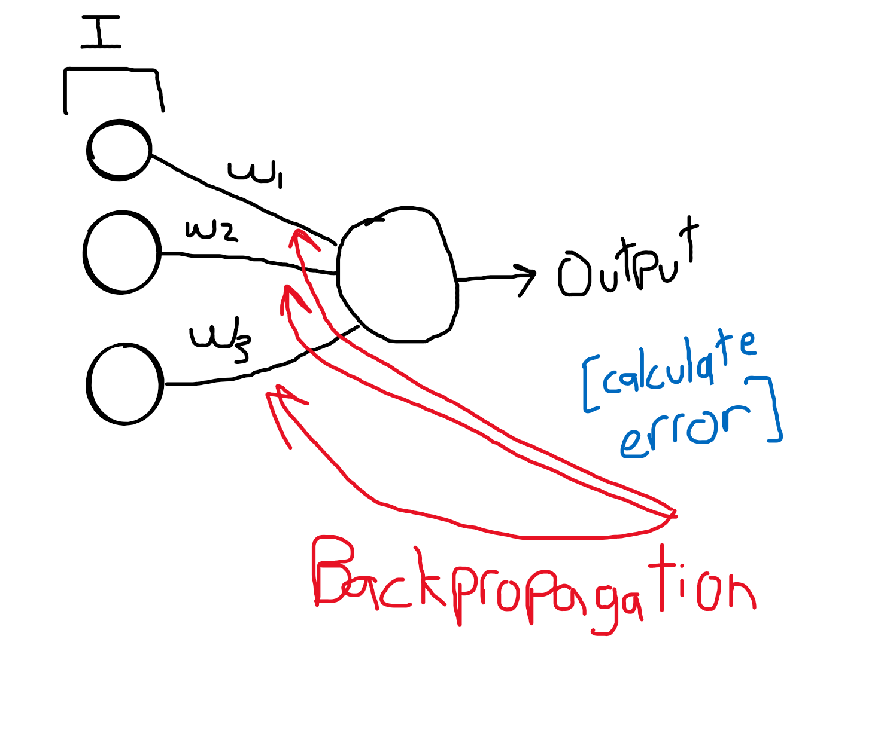
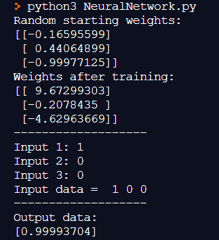

## How to make a Neural Network from Scratch in Python
 
In this workshop you will learn how to create a neural network in python that learns the appropriate numerical output given 3 boolean values.

In this case, it's supposed to return a value close to either `0` or `1` given 3 input values according to the training data.

The following NN is not supposed to be practical, it is supposed to serve as a framework for your next project. I highly recommend forking this code and modifying it on your own, that is the best way to learn.

[**Live Demo**](https://repl.it/@JohnLins/NeuralNetwork)

[**Final Code**](https://github.com/JohnLins/NeuralNetwork)

---


## Table of contents:

- [Getting Started(Initializing weights)](#Getting-started)
- [Activation-Functions](#Activation-Functions)
- [Train](#Train)
- [What is BackPropagation?](#What-is-BackPropagation?)
- [Training it](#Training-it)
- [Get The Results!](#Get-The-Results!)
- [Final Code](#Final-code)


In this worshop you will see some very basic linear algebra concepts such as the Dot product and the transpose operation. You don't need a deep understanding of linear algebra to create basics neural networks like this, but if it sparks your intest, I recommend watching a short linear algebra series from 3b1b: https://www.youtube.com/watch?v=fNk_zzaMoSs&list=PLZHQObOWTQDPD3MizzM2xVFitgF8hE_ab

# Getting started
 
To get started, we must import numpy
```python
import numpy as np
```
Next, we need to assign random weight values (We will tweak these values later with something called backpropagation)
```python
np.random.seed(1)
 
synapticWeights = 2 * np.random.random((3, 1)) - 1
```



# Activation Functions
 
Next, we have to decide on an activation function. The top three are: `Sigmoid`, `TanH`, and `RelU`

The activation function is a crucial component in a neuron. All it does is determine if a neuron should fire or not. When a neuron fires, that just means that it's value will go on to the next layer.
 
But in this case we'll use a sigmoid function.





```python
def sigmoid(x):
    return 1 / (1 + np.exp(-x))
```
 
And we will always need the derivative of our activation function:
```python
def sigmoidDerivative(x):
    return x * (1 - x)
```
The derivative will be later multiplied by the error when calculating the adjustment values.

For those of you who are not fond calculus, all the "derivative" does essentially find the slope of any function.
 
Now let's create a neuron in the function which we'll call `base`
```python
def base(inputs):
    inputs = inputs.astype(float) 
    return sigmoid(np.dot(inputs, synapticWeights))
```
 
# Train
This is the most important part in building a neural network, here, we will create the `train` function.
 
Within the `train` function, we will input a few arguments. These arguments include: training inputs, training outputs, and training iterations.
 
You might be asking, "Why do we include the outputs? Isn't that what the NN has to figure out itself?" 
 
The reason why we include the outputs is because we need the correct outputs in training so we can calculate the error.
 
 
```python
def train(trainingInputs, trainingOutputs, trainingIterations):
    global synapticWeights
    for iteration in range(trainingIterations):
        
        output = base(trainingInputs)
        
        error = trainingOutputs - output
        
        adjustments = np.dot(trainingInputs.T, error * sigmoidDerivative(output))
 
        synapticWeights += adjustments
```
 
As you can see in the function above, `error = training_outputs - output ` calculates the error.
 
This line here, `adjustments = np.dot(training_inputs.T, error * sigmoid_derivative(output))` calculates the adjustments to the weights (The backpropagation I was talking about)
 
Which you can see change here: `synaptic_weights += adjustments`

# What is BackPropagation?
Backpropagation is the process of tweaking the weights, remember how the weights were random in the beginning? Well, now we are artificially changing the weight values.


 
 
# Training it
Now let's actually train our model!
 
In the following lines of code, I will create training inputs and transpose them.
 
```python
trainingInputs = np.array([[0,0,1],
                            [1,1,1],
                            [1,0,1],
                            [0,1,1]])
 
trainingOutputs = np.array([[0,1,1,0]]).T
```
 
Then I will pass this through the train function:
```python
train(trainingInputs, trainingOutputs, 10000)
```
 
# Get The Results!
 
We will prompt the user for inputs:
```python
 
input1 = str(input("Input 1: "))
input2 = str(input("Input 2: "))
input3 = str(input("Input 3: "))
```
 
And finally we will pass it through our network!!!
```python
base(np.array([input1, input2, input3]))
```
 
```
input 1: 1
input 2: 0
input 3: 0
```
Output:
Something close to 1, for example `[0.99993704]`

The neural network learns that if the inputs are [1,1,1], [1,0,1], or [1,0,0] that the output is 1, and otherwise 0.
 

 
 
View code here: [https://github.com/JohnLins/NeuralNetwork](https://github.com/JohnLins/NeuralNetwork)
Run code here: [https://repl.it/@JohnLins/NeuralNetwork](https://repl.it/@JohnLins/NeuralNetwork)
 
# Final code
```python
import numpy as np

np.random.seed(1)

synapticWeights = 2 * np.random.random((3, 1)) - 1

def sigmoid(x):
    return 1 / (1 + np.exp(-x))
 
def sigmoidDerivative(x):
    return x * (1 - x)


def base(inputs):
    inputs = inputs.astype(float) 
    return sigmoid(np.dot(inputs, synapticWeights))

def train(trainingInputs, trainingOutputs, trainingIterations):
    global synapticWeights
    for iteration in range(trainingIterations):
        
        output = base(trainingInputs)
        
        error = trainingOutputs - output
        
        adjustments = np.dot(trainingInputs.T, error * sigmoidDerivative(output))

        synapticWeights += adjustments


print("Random starting weights: ")
print(synapticWeights)


trainingInputs = np.array([[0,0,1],
                            [1,1,1],
                            [1,0,1],
                            [0,1,1]])

trainingOutputs = np.array([[0,1,1,0]]).T

  
train(trainingInputs, trainingOutputs, 10000)


print("Weights after training: ")
print(synapticWeights)
print("-------------------")

input1 = str(input("Input 1: "))
input2 = str(input("Input 2: "))
input3 = str(input("Input 3: "))
    
print("Input data = ", input1, input2, input3)
print("-------------------")
print("Output data: ")
print(base(np.array([input1, input2, input3])))
```


# Run
`cd /NeuralNetwork`
<br/>
`python NeuralNetwork.py`
