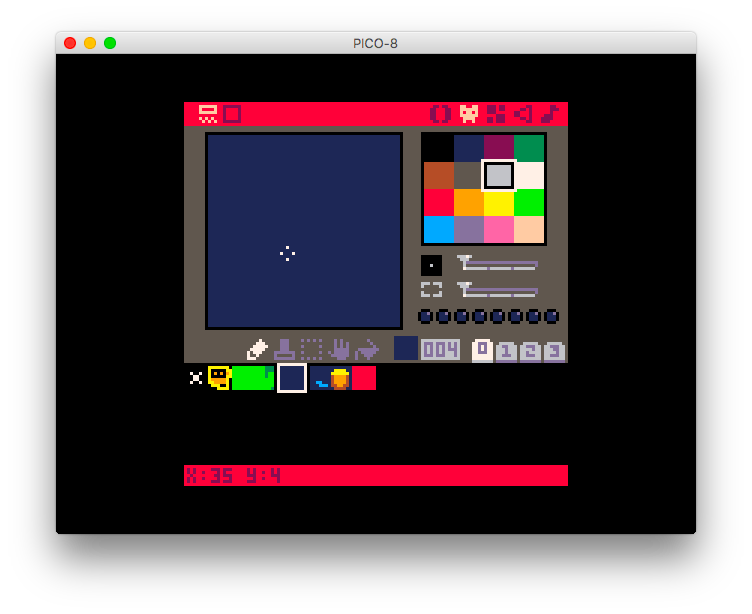
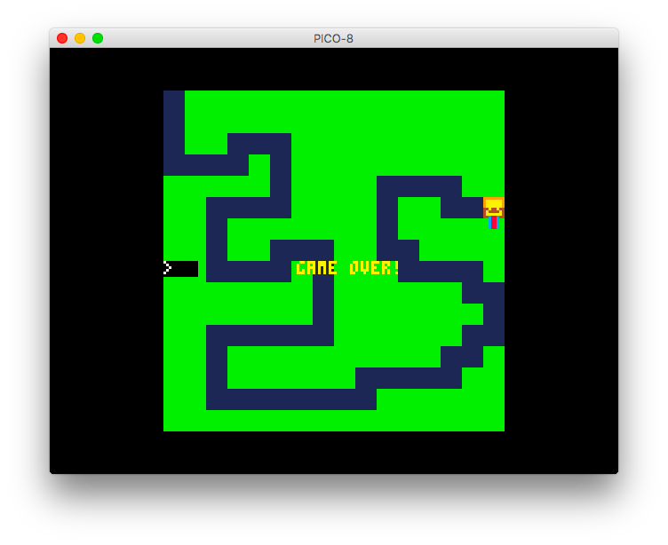

# Maze

In the next 30 minutes, you're going to become an actual game developer 🎮  - we're going to make a remake of the classic [scary maze](http://www.playscarymazegame.net/play-scary-maze-game/) game, in the amazing [PICO-8](https://www.lexaloffle.com/pico-8.php).

Here's what it looks like 👇

<iframe src="https://www.lexaloffle.com/bbs/?pid=53863#p53862" style="height:500px">

# Setup 🔧

All you need for this setup is a copy of PICO-8, which you can get [here](https://www.lexaloffle.com/pico-8.php). PICO-8 is a game development suite which is delightfully simple, satisfying and quick to work with - you can write code, draw characters and maps, along with making music, all in the same software which weighs only a few megabytes ⚡

PICO-8 works on Windows, Mac OS, Linux and even Raspberry Pi 🖥️  - it is totally worth the $15!

# Exploring ⛰

Nice - you got PICO-8! When you launch it, you might see this unfamiliar screen with a blinking red cursor 👇


This is the PICO-8 console - but you won't need this for now, so go ahead and press `esc` on your keyboard. You'll see something like this:


Go ahead and click on each of the icons on the top right of the screen. In order, they represent:

1. **Code**: Logic that your game runs continously
2. **Sprite**: Draw the characters in your game
3. **Map**: Make a map for your game(background) with sprites
4. **Sound**: Make small sound effects for your game
5. **Music**: Compose background music for your game with sounds

Explore anything you want - or don't 😛  There's no need to worry about breaking anything 😌

# Getting Started 🏃

Once you're done exploring, quit and restart PICO-8 - and then press the `esc` key like you did earlier. You're into the code editor once again 👨‍💻

If you've ever played games before, you've probably heard of the term `FPS` - it stands for **F**rames **P**er **S**econd. PICO-8 runs at 30 FPS, meaning your game is updated 30 times every second.

We're going to divide our game into 3 sections, where we initialize our game, we update it, and when we draw it to the screen - the code for these sections would look like this:

```lua
function _init() --Initializing: runs only once, when the game is loaded
end

function _update() --Updating: runs 30 times every second
end

function _draw() --Drawing: runs 30 times every second, but after _update
end
```

Let's start with something simple - drawing a small square in the middle of our screen. PICO-8's screen is 128x128 pixels, so we'll draw a pixel in the center with co-ordinates `64(x), 64(y)` and `12` to make it blue! Add this code inside your `_draw() function`:

```lua
cls()
pset(64,64,12)
```

`cls()` clears the screen everytime your code runs, so that our screen doesn't become too messy!

Now, just press `⌘/ctrl + r` to run the game, and see a nice blue pixel in the middle of our screen 👀


That's pretty boring though 💤  - Let's make this pixel move!

But before we do that, we need a place to store these co-ordinates, so add these containers to your `_init() function`:

 

```lua
x=64
y=64
```

and update your `_draw function` with this:

```lua
pset(x,y,12)
```

Your code will still run perfectly, but the pixel still doesn't move - we'll get to that now!

Since the update function runs 30 times/second, we can include conditions inside it to move our pixel. We'll use our arrow keys to control it, with simple logic, increasing or decreasing the x and y co-ordinates of the pixel.

Add this code to your `_update() function`:

```lua
--Use Shift+U,D,R,L for typing in arrow keys in PICO-8
if(btn(⬆️)) y-=1
if(btn(⬇️)) y+=1
if(btn(⬅️)) x-=1
if(btn(➡️)) x+=1
```

 Run your game(`⌘/ctrl + r`) and use your arrow keys, and you will see a moving pixel ⛸️  

# Making it a game 🎮

We have some movement on our screen now, but it's still just a pixel - and by no means even looks like a game. Let's change that, and add graphics, sound and a background map!

Head onto the 😺  tab, from the top-right corner of your screen.


All you need to know for now is that you can draw 8x8 characters, from the 16 colors in the pallete to your right. Here's an example - the character I made - 


When you're making games, characters, and other individual art is referred to as a `sprite`. Let's go ahead and replace the blue pixel with our newly drawn character - change your `pset(x,y,12)` line to this:

```lua
spr(1, x, y) -- draws the first sprite, to our x and y co-ordinates.
```

Nice! We have our own character roaming around on the screen - next, let's make an environment - a map for our character. Go back to the sprite editor (😺 ) - and click on the empty space next to your character - and draw a tile - paint your entire stripe blue - we'll use that to make a river in our game. 



Draw other types of tiles by clicking on the empty space next to the ones you've already drawn. Draw one sprite for grass, and another one with a treasure chest on it 💰

Head over the the map tab - the one with 4 rectangles on it, and use your sprites to make a map that looks something like this 👇


If you run your game now, you won't see any change - we need to draw the map to our screen first 🖌️  Add this to your `_draw()` function:

```lua
map(0,0) --make sure this comes before you draw your sprite
```

 


Our little creation finally looks like a game now 🎮 

## Enforcing rules 📖

Our game is still just a character roaming around a map though - a player has no idea of what the objective is. Let's add some logic to our game that makes an irritating sound whenever the character goes out of the river, and onto the grass 🌊 

Head over to the sound tab (🔉 ) - and use your mouse to draw something like the sound below 👇


It's high pitched, and pretty irritating 🤯 

How do we play this sound at the right time though? We'll use conditions in our code, so that this sound only plays when our sprite is on grass. The code would look like this, add this yo your `_draw()` function:

```lua
if(mget(x/8,y/8)==2) sfx(0)
```

What this code does is check every frame if our character is on the grass sprite (no.2 - if your sprites are in another sequence, replace `2` with the grass' sprite number), and if it is - the irritating sound is played!

`mget()` tells us the tile on the map, given the co-ordinates of a map tile. We divide `x` and `y` with `8` because a map tile is `8x8` pixels ▪️

## The End 🏁

We need a game over, when our player reaches the treasure chest 💰 - and it's just another line of code, very similar to what we had to do to play the irritating sound - add this to your `_draw()` function:

```lua
if(mget(x/8,y/8)==4) stop("game over!", 50, 64, 10)--50(x), 64(y), 10(color)
```

This condition checks if the map tile our character is on is the treasure chest (sprite no.4 for me), and if it is, displays a game over message like this 👇



You just made your own game, in under 30 minutes - how cool is that! This game can be hacked on in many ways, you should totally go ahead and make it more customized! Here are a few ideas 👇

# Consolidation 🖋️

Play around with this game  - and make it your own. 

Here are a few ideas👇

- Instead of using arrow keys to move our sprite, use the mouse
    - Google your way in to make this happen
    - You could even do something like change the x co-ordinate based on your arrow keys, and the y co-ordinate based on your mouse!
- Add a celebration sound when you reach the treasure chest
- Make this game more scary 👻
- Restart the game when the sprite goes out of the river 🔁

Here's all the annotated code for you to see:

```lua
function _init() -- initializing: runs only once, when the game is loaded
 -- we're defining x and y here
 x=0
 y=0
end

function _update() -- updating: runs 30 times every second
 -- adding controls for our character through arrow keys here
 if(btn(⬆️)) y-=1
 if(btn(⬇️)) y+=1
 if(btn(⬅️)) x-=1
 if(btn(➡️)) x+=1
end

function _draw() -- drawing: runs 30 times every second, but after _update
 -- the stuff you see and hear, is all in here
 cls() -- clear the screen before every frame
 map(0,0) -- draw a map starting from origin
 spr(1, x, y) -- draw our character sprite on the updated x and y co-ordinates
 if(mget(x/8,y/8)==2) sfx(0) -- play the irritating sound if our character is on grass
 if(mget(x/8,y/8)==4) stop("game over!", 50, 64, 10) -- quit the game when you reach the treasure chest
end
```