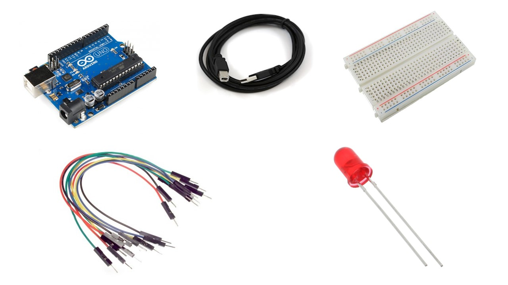
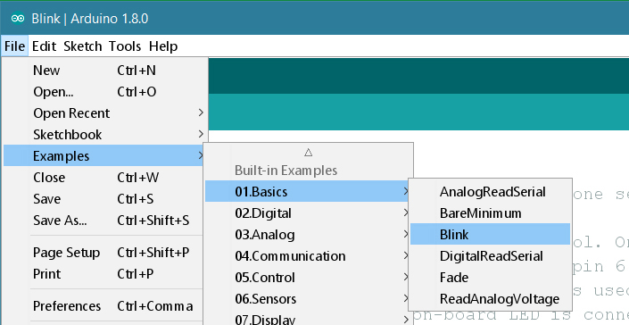
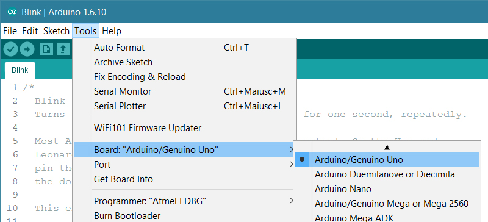
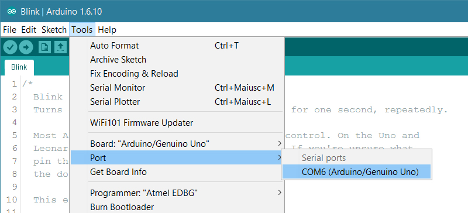
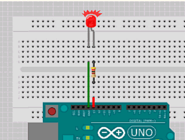

# Blink an LED with Arduino 

- Reference: [www.arduino.cc]()

## Things You Would need:

- Arduino Uno
- USB A to USB B Cable
- Breadboard
- Jumper Wires
- An LED

# Lets Get Started:

## Step 1

> Installing The IDE

Download the appropriate Arduino IDE for your platform from the [Arduino website](https://www.arduino.cc/en/Main/Software)

Install the IDE just like you install any other software. The drivers for the boards will be included.

## Step 2

> Loading the Blink example

The code we need comes with the Arduino IDE.

Open File>Examples>Basics>Blink

## Step 3

> Select your board type and port

You'll need to select the entry in the Tools > Board menu that corresponds to your Arduino or Genuino board

Select the serial device of the board from the Tools | Serial Port menu. This is likely to be COM3 or higher (COM1 and COM2 are usually reserved for hardware serial ports). To find out, you can disconnect your board and re-open the menu; the entry that disappears should be the Arduino or Genuino board. Reconnect the board and select that serial port.

## Step 4

> Upload the program

Now, simply click the "Upload" button in the environment. Wait a few seconds - you should see the RX and TX LEDs on the board flashing. If the upload is successful, the message "Done uploading." will appear in the status bar.

A few seconds after the upload finishes, you should see the pin 13 (L) LED on the board start to blink (in orange). If it does, **congratulations!** **You've gotten Arduino or Genuino up-and-running**. If you have problems, please see the [troubleshooting suggestions](https://www.arduino.cc/en/Guide/Troubleshooting)

## Blink!

Now connect the positive terminal (Longer lead) of the LED to Pin 13 (L) on the Arduino. Connect the negative terminal (Shorter lead) to GND. Your LED should begin to blink in unison with the built-in light.

**Note: Adding a 330 ohm resistor to the circuit is highly recommended to prevent the LED from burning off.**
