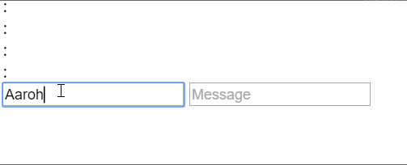
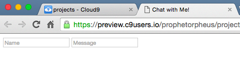
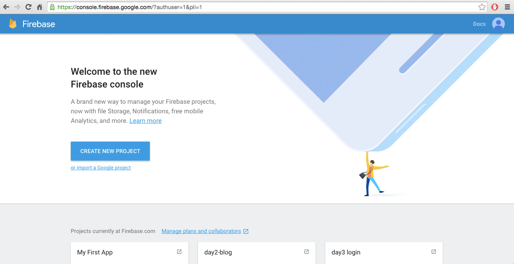
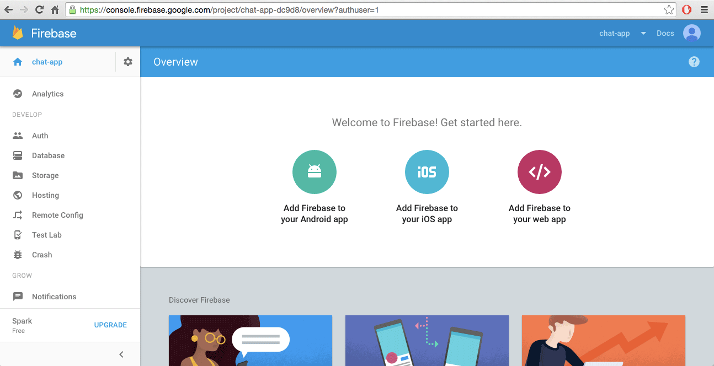
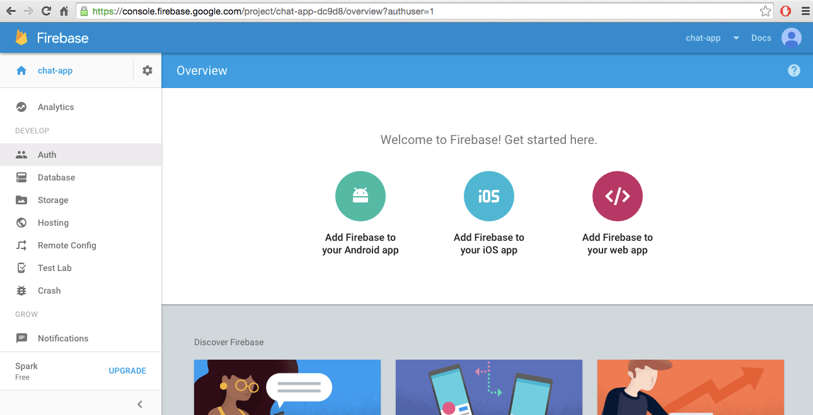
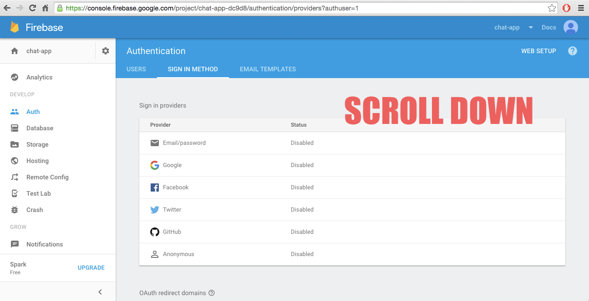
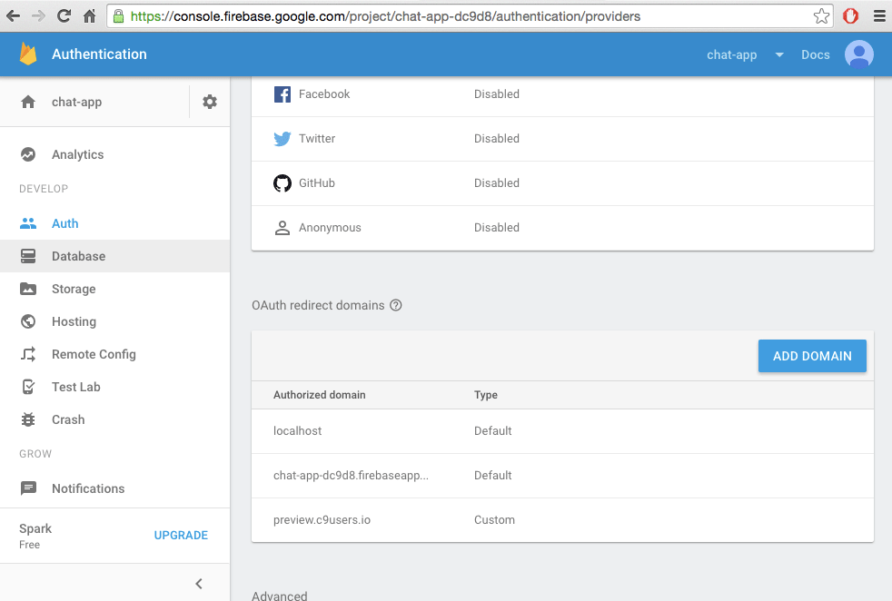
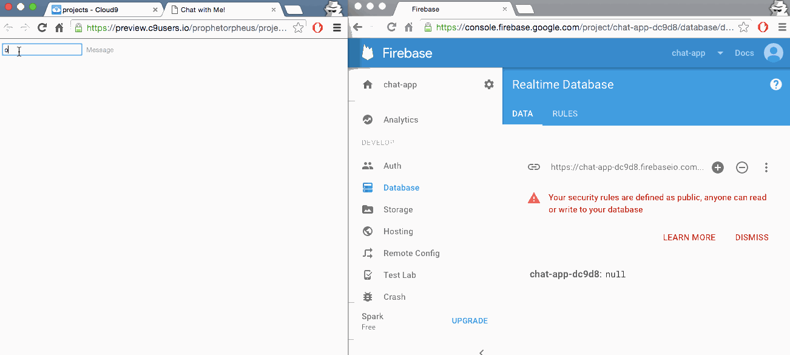

# Chat

Short link to this workshop: https://workshops.hackclub.com/chat

| What you'll build       |
| ----------------------- |
|  |

Here's a link to the [live demo][live_demo] and the [final code][final_code]. This workshop should take around 1 hour.

_**We recommend going through this workshop in Google Chrome.**_

[live_demo]: https://prophetorpheus.github.io/chat
[final_code]: https://github.com/prophetorpheus/prophetorpheus.github.io/tree/master/chat

---

In this workshop we'll be implementing a real-time chat using Firebase. Firebase is a real-time database. This means that all the information we send to Firebase gets updated across everything connected to that database.

**Table of Contents**

- [Part I: Set-up](#part-i-set-up)
- [Part II: The HTML File](#part-ii-the-html-file)
- [Part III: The JS File](#part-iii-the-js-file)
- [Part IV: Publishing and Sharing and Chatting!](#part-iv-publishing-and-sharing-and-chatting)
- [Part V: Hacking](#part-v-hacking)

## Part I: Set-up

- Open up the Cloud9 workspace
- Make a new folder and name it `chat`
- Make a new file called `index.html` in `chat`
- Make another new file within `chat` and name it `main.js`
- Type the base template into `index.html`. Here's what our `index.html` should look like after doing this:

  ```js
  <!DOCTYPE html>
  <html>
    <head>
      <title>Chat with Me!</title>
    <head>
    <body>
    </body>
  </html>
  ```

- Include Firebase, by adding this to the **body** of `index.html`:

  ```html
  <script src="https://www.gstatic.com/firebasejs/live/3.0/firebase.js"></script>
  ```

- Now let's also add jQuery. Type the following script tag below the one that adds Firebase:

  ```html
  <script src="https://ajax.googleapis.com/ajax/libs/jquery/1.11.1/jquery.min.js"></script>
  ```

- Lastly, include the `main.js`, by adding this after the previous line:

  ```html
  <script src="main.js"></script>
  ```

## Part II: The HTML File

Add a div to store message history in the **body**, above the script tags. We will later put our messages inside this div. Messages from other people to us will also go in here.

```html
<div id="messages"></div>
```

Put these two inputs into the **body**, below the `div` we just created, and above the script tags:

```html
<input type="text" id="nameInput" placeholder="Name">
<input type="text" id="messageInput" placeholder="Message">
```

These two input tags allow us to set a name for the user and allow the user to send a message: whatever is typed in `messageInput`.

Save and open up the external live preview.



## Part III: The JS File

### Preparing to Use Firebase

Now we'll set up the Firebase side of our project. Go to [Firebase](https://firebase.google.com/) and sign up for an account.

Now that we're at our dashboard, we'll create our app.



Let's click on "Add Firebase to your web app." We'll copy part of the code snippet and paste it into our `main.js`:



So far our `main.js` looks like this (your URLs and keys will be different):

```js
var config = {
  apiKey: "AIbaSxCyCLHv4X9TnygLWKoBt52ml_A4TjjNVek",
  authDomain: "chat-test-bxcdb.firebaseapp.com",
  databaseURL: "https://chat-test-bxcdb.firebaseio.com",
  storageBucket: "",
};
firebase.initializeApp(config);
```

Now if we save our `main.js` and check out the external live preview, we'll see an error in console! Why is this?


Firebase will only allow authorized domains (websites) to change the database. This is so an internet stranger can't ruin your awesome messaging app.

First, we'll need to authorize Cloud9 in our Firebase console. Let's return to our Firebase dashboard.

### Configuring Permissions

We have to give Cloud9 access to Firebase, so we'll do this by adding the domain of our external life preview (`preview.c9users.io`) to Firebase. This way, Firebase allows Cloud9 to retrieve and push data to the database.

This will allow us to view what's happening in Firebase while building our app.

Click on `Auth` in the sidebar, and then the "Sign-In Method" tab:



Once there, we'll scroll down and add `preview.c9users.io` and `USERNAME.github.io` (so you can later view your project on your Github Page) to the list of Authorized Domains:



Next we have to edit our database permissions. We'll do this by clicking on "Database" in the sidebar, and changing `auth != null` to `true`:



Great. Now we are done configuring Firebase and can return to our JavaScript file.

We'll be adding one more line to the bottom of `main.js`. This creates a reference to the database in our Firebase project, so that we can access it within `main.js`.

We should have something like this:

```js
var config = {
  apiKey: "AIbaSxCyCLHv4X9TnygLWKoBt52ml_A4TjjNVek",
  authDomain: "chat-test-bxcdb.firebaseapp.com",
  databaseURL: "https://chat-test-bxcdb.firebaseio.com",
  storageBucket: "",
};
firebase.initializeApp(config);

var chatData = firebase.database().ref();
```

### Saving Messages to Firebase

Now that we've allowed our Firebase project to be accessed by our Cloud9 project, we can perform actions on our Firebase database through our `main.js`.

First, we'll write a function that, when you press enter after typing a message, will push your name and message to the Firebase reference to be stored within the database.

Let's create the function, and attach it to a key press on the message input:

```js
function pushMessage(event) {
}

$('#messageInput').keypress(pushMessage);
```

Now we will say "if the event's key code is that of the enter key, do stuff" by adding a conditional.

**What's a key code?** Every key on your keyboard has a unique code, so we can tell which key a user pressed by the number that is returned.

The key code of the enter key is 13, so that's what we will be comparing in the conditional.

Let's add that to our function:

```js
function pushMessage(event) {
  if (event.keyCode == 13) {
  }
}
```

We need the message's sender and text, so that we can pass them to Firebase. We'll extract the values from the HTML inputs, and store them in variables:

```js
function pushMessage(event) {
  if (event.keyCode == 13) {
    var name = $('#nameInput').val();
    var text = $('#messageInput').val();
  }
}
```

Finally we'll push to Firebase by using `.push()` method on the reference we've created:

```js
function pushMessage(event) {
  if (event.keyCode == 13) {
    var name = $('#nameInput').val();
    var text = $('#messageInput').val();
    chatData.push({name: name, text: text});
  }
}
```

And to finish it up, we'll clear the message input:

```js
function pushMessage(event) {
  if (event.keyCode == 13) {
    var name = $('#nameInput').val();
    var text = $('#messageInput').val();
    chatData.push({name: name, text: text});
    $('#messageInput').val('');
  }
}
```

Now, save and try sending a message in your live preview! Sure, nothing shows up, but check out your Firebase database (go to `Database` in the sidebar of your Firebase console)! A new entry appears as you send messages!



### Retrieving Messages from Firebase

It's great that our messages are being sent and stored in Firebase, but We want them to be displayed on our page, too. We'll use Firebase's `.on()` method to handle the event of sending a message. In the event that a message is added to Firebase, we will call a function to display it. We will create that function now, by typing the following beneath the `pushMessage()` function:

```js
chatData.on("child_added", showMessage);

function showMessage(msg) {

}
```

Note that we are passing an argument called `msg` into `showMessage`. This is how Firebase returns the data for each message in the database. We can access said data by calling one of its methods (`.val()`). We'll store this data in a variable named `message`:

```js
function showMessage(msg) {
  var message = msg.val();
}
```

Now that we've got the message data in `message`, we'll extract the specific pieces of message data (sender name and message text), and store them in their own variables:

```js
function showMessage(msg) {
  var message = msg.val();
  var messageSender = message.name;
  var messageContent = message.text;
}
```

Lastly, we'll add it to our HTML using some jQuery. Start by creating a new element to store the entire message. We can also add a class to this element to classify it as a message.

```js
function showMessage(msg) {
  var message = msg.val();
  var messageSender = message.name;
  var messageContent = message.text;

  var messageEl = $("<div/>").addClass("message");
}
```

Then we'll create two [`span`](https://www.google.com/search?q=what+is+a+span+html) elements to store the sender and message content, and fill them with the appropriate info.

```js
function showMessage(msg) {
  var message = msg.val();
  var messageSender = message.name;
  var messageContent = message.text;

  var messageEl = $("<div/>").addClass("message");
  var senderEl = $("<span/>").text(messageSender + ": ");
  var contentEl = $("<span/>").text(messageContent);
}
```

Note that we've added a `+ ": "` to our text. The `+` operator when applied to strings allows the strings to be combined, or _concatenated_.

For example:

```js
var hack = "Hack";
var club = "Club";
var hackClub = hack + club; // "HackClub"
var hack_club = hack + " " + club; // "Hack Club"
```

Thus, here, we are concatenating the sender's name (`messageSender`) and the string `": "` and placing it in `senderEl`.

Now that we have filled our elements, we'll add them to the `messageEl` and in turn, add the `messageEl` to the div in the body that is for storing sent messages.

```js
function showMessage(msg) {
  // get the message object added to Firebase
  var message = msg.val();
  var messageSender = message.name;
  var messageContent = message.text;

  var messageEl = $("<div/>").addClass("message");
  var senderEl = $("<span/>").text(messageSender + ': ');
  var contentEl = $("<span/>").text(messageContent);

  // .append adds an element to the end
  messageEl.append(senderEl);
  messageEl.append(contentEl);
  $('#messages').append(messageEl);
}
```

## Part IV: Publishing and Sharing and Chatting!

Congratulations. Your chat app is complete. Save all your files and commit your changes!

- `git add -A`
- `git commit -m "Create a chat app using Firebase"`
- `git push`

Now you'll be able to view your app at `USERNAME.github.io/chat/`, as well as share this link with your friends, and actually communicate with them using the app! Try it out!

## Part V: Hacking

- Make a multiplayer guessing game
