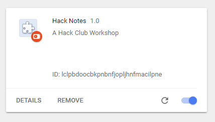

# Building a Chrome Extension

**This workshop will only work in Chrome**

This workshop will guide you through the setup, development, and distribution of a Chrome extension.

The full code for the extension is available [here](https://github.com/shmishtopher/HackPad).

## Creating a New Extension

All Chrome extensions start with a `manifest`, which is simply a `.json` file that describes the applications scope, permissions, and metadata. Start by creating an empty directory, naming it whatever seems appropriate. Add you `manifest.json` file to the empty directory, adding the following information:

```json
{
  "name": "Hack Pad",
  "version": "1.0",
  "description": "A Hack Club Workshop",
  "manifest_version": 2
}
```

To load our extension into Chrome, navigate to [chrome://extensions](chrome://extensions), toggle developer mode, and click "Load unpacked extension." Select your working directory (the one containing your manifest), and you should see a card that looks like this:



## Adding an Interface

If we want to give our extension a GUI, we need to specify it in our `manifest.json`. Our application will launch a simple popup, which we can specify in the `browser_action` field.

```json
{
  "name": "Hack Pad",
  "version": "1.0",
  "description": "A Hack Club Workshop",
  "manifest_version": 2,
  "browser_action": {
    "default_title": "Hack Pad",
    "default_popup": "pages/popup.html"
  }
}
```

Create three new directories: "pages", "scripts", and "styles" in the root of your project. Add `popup.html`, `main.js`, and `popup.css` to their respective directories.

```html
<!-- pages/popup.html -->

<!DOCTYPE html>
<html lang="en">
  <head>
    <meta charset="UTF-8">
    <meta name="viewport" content="width=device-width, initial-scale=1.0">
    <meta http-equiv="X-UA-Compatible" content="ie=edge">
    <link rel="stylesheet" href="../styles/popup.css">
    <title>Hack Pad</title>
  </head>
  <body>

    <div class="notepad">
      <h1>Hack Notes</h1>
      <div contenteditable id="notepad"></div>
    </div>

    <script src="../scripts/main.js"></script>
  </body>
</html>
```

```css
/* styles/popup.css */

html, body {
  width: 500px;
  height: 400px;
  padding: 0;
  margin: 0;

  display: flex;
  flex-direction: row;
  justify-content: center;
  align-items: center;
}

.notepad {
  display: flex;
  flex-direction: column;
  justify-content: flex-start;
  align-items: center;
  margin-top: auto;
  margin-bottom: 15px;

  width: 100%;
  height: 100%;
}

.notepad > h1 {
  font-family: Verdana, Geneva, Tahoma, sans-serif;
  font-weight: 500;
  font-size: 14px;
  color: #333333;
}

.notepad > div {
  width: calc(100% - 30px);
  height: calc(100% - 15px);
  background-color: #F9F9F9;
  border-radius: 5px;
  overflow-y: auto;

  box-sizing: border-box;
  outline: none;
  padding: 10px;
}

.notepad > div::-webkit-scrollbar {
  width: 6px;
}

.notepad > div::-webkit-scrollbar-track {
  width: 6px;
  background: #F9F9F9
}

.notepad > div::-webkit-scrollbar-thumb {
  position: relative;
  right: 5px;
  width: 6px;
  background: #E0E0E0;
  border-radius: 3px;
}
```

To view our popup, reload the extension and click on the "H" icon in the extensions menu (top right of the browser window). You'll see a popup that looks like this:

![popup][img/popup.png]

Because the `#notepad` div element has `contenteditable` attribute, you'll be able to type right into the div without any extra `input` elements. Typing on a virtual sticky note is nice, but a sticky note that erases itself every browser session is not very useful. We can remedy this by using some useful Chrome APIs.

## Adding Functionality

Most of the powerful Chrome APIs need to be specified in our `manifest.json` before they will be exposed to our code. The API that we want is the "storage" API. We can use this API to sync data to the users account, which means we can use is to keep all instances of the notebook in sync across devices. Before using the "storage" API, we need to enable it in the `manifest`, like this:

```json
{
  "name": "Hack Pad",
  "version": "1.0",
  "description": "A Hack Club Workshop",
  "manifest_version": 2,
  "permissions": ["storage"],
  "browser_action": {
    "default_title": "Hack Pad",
    "default_popup": "pages/popup.html"
  }
}
```

With the "storage" API enabled, we can use it in `main.js`:

```js
// scripts/main.js

const $notepad = document.getElementById('notepad')

$notepad.addEventListener('keyup', () => {
  chrome.storage.sync.set({
    notepad: $notepad.innerText
  })
})

chrome.storage.sync.get('notepad', res => {
  $notepad.innerText = res.notepad
})
```

Our first line creates a handle to our `#notepad` element, which we will as an `eventSource` in the next block. Since we want to maximize convenience and minimize unnecessary UI, we'll attach our saving behavior to every keystroke. The `keyup` event fires every time a user lifts completes a keystroke, so thats where we'll add our save logic. `chrome.storage.sync` behaves like a simple key-value store, and manages all the device syncing behavior in the background. Retrieving a value from storage is equally simple, we just need to pass a key and callback.

Now, our notebook is loaded whenever the extension is activated and saved on every `keyup` event. And that's it! The core of our extension is done!

## Challenges

1. Give your extension an icon (hint: add it to the manifest)
2. Add the ability to save multiple notebooks
3. Pack and publish your extension!


## Hacking

The next step is to make it your own project. Want to add chat? Google how to! Note sharing? Google it!

Here are examples made by Hack Club members you can use as inspiration:

1. [**CoinBlock**](https://github.com/shmishtopher/CoinBlock) _[Source](https://chrome.google.com/webstore/detail/coinblock/cipnhlfdbhohkabpbojakjbapbiimokl)_
