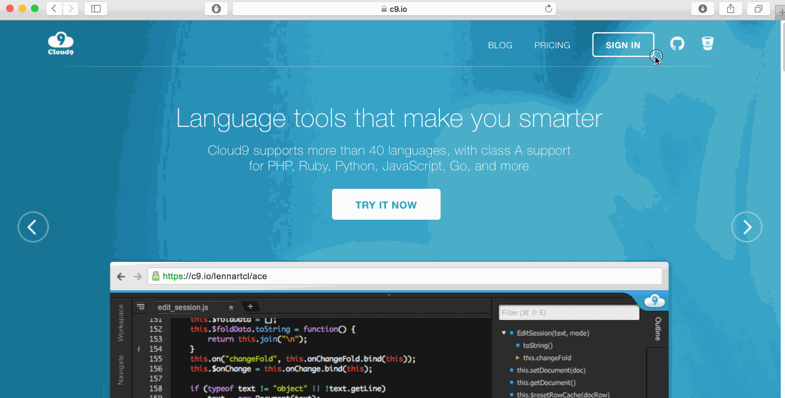
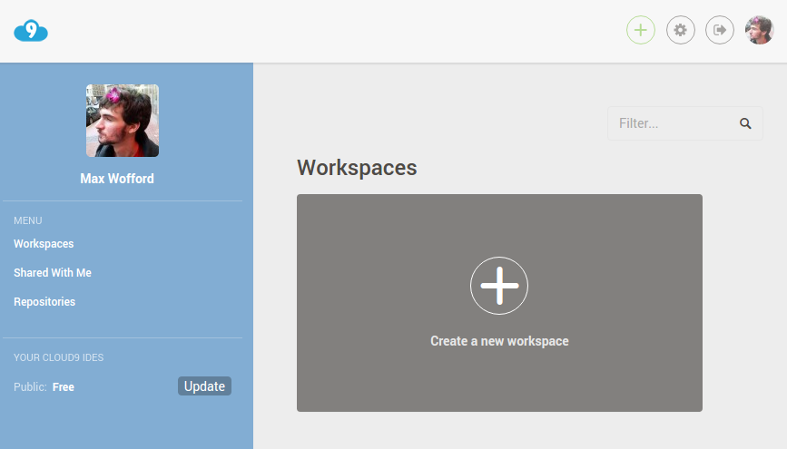
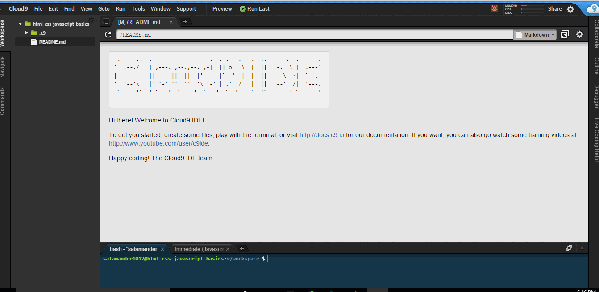
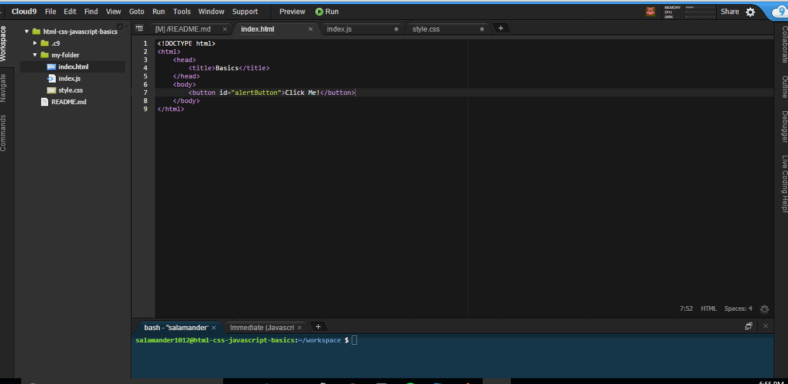
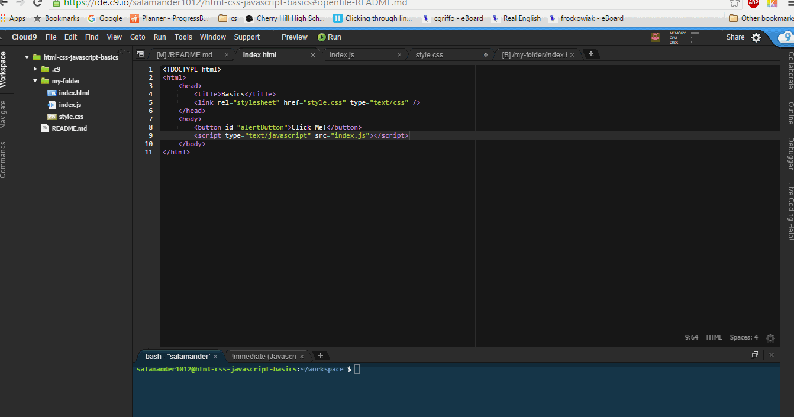

# Cloud9 tutorial


## What is Cloud9?

*Cloud9 is a website that lets you program online*. Traditionally, all
programming was done locally on the computer: you would save your files on your
computer and edit them on your computer (with a code editor). Cloud9 allows you
to save your files online and edit your files online (Cloud9 also has a code
editor). This means all you need to start programming is internet and a browser.
No more installing software!

**Imporatant**: if you're having trouble, checkout the
[troubleshooting](#troubleshooting) section at the end of the workshop.

-------------------------------------------------------------------------------

## Tips And Tricks

To open a link in another tab, right click on the link and select `Open In New
Tab`.

## Login with GitHub

First, make sure you have a GitHub account. If you don't have one, follow the
guide
[here](https://github.com/hackclub/hackclub/tree/master/playbook/workshops/portfolio#creating-a-github-account).

Now that you have a GitHub account, you can login to Cloud9 with GitHub. Go to
https://c9.io and click on the "octocat" icon in the top corner as demonstrated
below:



## Create a New Workspace

To create a new workspace you can either select the create a new workspace
option under workspaces, or click the new workspace button at the top right of
your screen.



Next set your workspace name to *html-css-javascript-basics*, and your
description to *Learning to use html css and javascript together*. Make your
workspace public, skip the *Clone from Git or Mercurial URL* option and set your
template to *Custom*. Finally click the *Create Workspace* button at the bottom
of your page and you should be prompted to this screen.



## Using HTML CSS and Javascript Together in Cloud9

First we will create a new folder. To do this right click the workspace bar on
the left and select *New Folder*. You can name this folder whatever you like.


Next we will be creating a html file. To do this hit file on the top left of
your screen, hover over the *New From Template* option, and select *HTML file*.
Now we want to save this file in the new folder we just created. To do this go
to *file* and click *save as*. Name your file *index.html* and save it inside
the folder you just created.


Repeat the last step twice more, except this time create a CSS file and a
Javascript file. Name your files *style.css* and *index.js*

Now that you have your files set up lets start building. Inside your
*index.html* file in the body element create a button with the attribute *id*
set to *alertButton*.

```html
<button id="alertButton">Click Me!</button>
```

To preview you file right click your *index.html* file in your workspace sidebar
to the left and hit *Preview*. This will open up a new tab with the rendered
version of your html file.



### Adding CSS to Your HTML

Next lets add some style to our button. In your *style.css* file add the
following code

```css
#alertButton {
  background: none;
  border-style: none;
  border: 2px solid black;
  padding: 10px;
  color: black;
}

#alertButton:hover {
  background-color: black;
  color: white;
}
```

#### CSS Selectors

In CSS, selectors are patterns used to select the element(s) you want to style.
If we were to do

```css
button {
  // css goes here
}
```

Our css would still work, however if we had multiple buttons in our html, all
those buttons would be styled the same because every button element in our html
would have the same css applied to it. If we want different styles for each
button, we can give each button a unique id attribute in html. Then when we want
to reference that id attribute in our css we can do.

```css
#idName {
  // css goes here
}
```

Another css selector that we encountered is the hover selector seen here.

```css
#alertButton:hover {
  background-color: black;
  color: white;
}
```

This basically says that when a mouse hovers over the html element with the id
*alertButton*, apply this css to that element. You read more about css selectors
[here](http://www.w3schools.com/cssref/css_selectors.asp).

If you look at your preview, you will notice none of the styles were applied to
your button. This is because you have to tell your html file where to get the
css from. To do this we will add this code inside the *head* element of your
html.

```html
<link rel="stylesheet" href="style.css" type="text/css" />
```

Basically what this does is link your html to your css. The value of your *href*
attribute should be the location of your css file. Since our css file is in the
same folder as our html all we have to do is set the value of *href* to the name
of our css file.

### Adding Javascript to Your HTML

Next lets add some Javascript. Inside your *index.js* file add the following
code.

```js
var button = document.getElementById("alertButton");

button.onclick = function () {
  alert("Button was pressed");
}
```

**Understanding the code**

> In our javascript file we start of by creating a variable called *button* and
> set it equal to the element in our html that has an *id* of *alertButton*.
> Next we declare that when our button is clicked, a function is run that alerts
> the user with the message "Button was pressed".

If we try testing our code, it wont work yet for the same reason our css didn't
work at first. We need to tell our html file where to get the javascript from.
To do this, we will add the following code to the end of the *body* element
inside our html.

```html
<script type="text/javascript" src="index.js"></script>
```

This links our html and our javascript together. The *src* attribute should be
set to the location of our javascript file. Since our javascript file is in the
same folder as our html all we have to do is set the value of *src* to the name
of our javascript file.

Go ahead and test your code now.



## Troubleshooting

- **Nothing shows up**
  - Try saving the `index.html` file from `File > Save`. After that reload the
    preview.
- **CSS not applying styles to the button**
  - Make sure the `href` attribute of the `<link>` element in `index.html`
    points to a file in the same directory at as `index.html` called
    `style.css`.
  - Make sure you have a css file called `style.css`.
  - Make sure the `id` attribute of the `<button>` in `index.html` is the same
    as the id being selected in your `style.css` file (minus the `#`). ID's ARE
    case sensitive!
- **Javscript is not displaying the alert**
  - Make sure the `src` attribute of the `<src>` element in `index.html` points
    to a file in the same directory at as `index.html` called `index.js`.
  - Make sure you have a Javascript file called `index.js`.
  - Make sure the `id` attribute of the `<button>` in `index.html` is the same
    as the id being selected in the `document.getElementById` function in your
    `index.js` file (minus the `#`). ID's ARE case sensitive!

## Congratulations!

You now know how to

- Create a new workspace in Cloud9
- Work with HTML CSS and Javascript together

One last thing. Please click a rating below to rate this workshop. It'll only
take 3 seconds.

_How likely is it that you would recommend this workshop to a friend?_

| [1][r1] | [2][r2] | [3][r3] | [4][r4] | [5][r5] | [6][r6] | [7][r7] | [8][r8] | [9][r9] | [10][r10] |
| ------- | ------- | ------- | ------- | ------- | ------- | ------- | ------- | ------- | --------- |

Be sure to experiment with HTML, CSS, and Javascript on your own!

[r1]: https://feedback-redir.hackclub.io/1ycv4tf0X-OHOf2_KyS7bY9gJ9vJC_VSA2x205vmaZY4?ip=entry.78173348&rfield=entry.559841237&r=1
[r2]: https://feedback-redir.hackclub.io/1ycv4tf0X-OHOf2_KyS7bY9gJ9vJC_VSA2x205vmaZY4?ip=entry.78173348&rfield=entry.559841237&r=2
[r3]: https://feedback-redir.hackclub.io/1ycv4tf0X-OHOf2_KyS7bY9gJ9vJC_VSA2x205vmaZY4?ip=entry.78173348&rfield=entry.559841237&r=3
[r4]: https://feedback-redir.hackclub.io/1ycv4tf0X-OHOf2_KyS7bY9gJ9vJC_VSA2x205vmaZY4?ip=entry.78173348&rfield=entry.559841237&r=4
[r5]: https://feedback-redir.hackclub.io/1ycv4tf0X-OHOf2_KyS7bY9gJ9vJC_VSA2x205vmaZY4?ip=entry.78173348&rfield=entry.559841237&r=5
[r6]: https://feedback-redir.hackclub.io/1ycv4tf0X-OHOf2_KyS7bY9gJ9vJC_VSA2x205vmaZY4?ip=entry.78173348&rfield=entry.559841237&r=6
[r7]: https://feedback-redir.hackclub.io/1ycv4tf0X-OHOf2_KyS7bY9gJ9vJC_VSA2x205vmaZY4?ip=entry.78173348&rfield=entry.559841237&r=7
[r8]: https://feedback-redir.hackclub.io/1ycv4tf0X-OHOf2_KyS7bY9gJ9vJC_VSA2x205vmaZY4?ip=entry.78173348&rfield=entry.559841237&r=8
[r9]: https://feedback-redir.hackclub.io/1ycv4tf0X-OHOf2_KyS7bY9gJ9vJC_VSA2x205vmaZY4?ip=entry.78173348&rfield=entry.559841237&r=9
[r10]: https://feedback-redir.hackclub.io/1ycv4tf0X-OHOf2_KyS7bY9gJ9vJC_VSA2x205vmaZY4?ip=entry.78173348&rfield=entry.559841237&r=10
