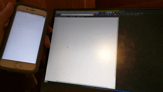

# Sketch Together

| What you'll build       |
| ----------------------- |
|  |

_We recommend going through this workshop in Google Chrome._

Links to a live demo and the final code below. This workshop should take around 1 hour.

[**Live Demo**](https://collaborative-sketch--prophetorpheus.repl.co)

[**Final Code**](https://repl.it/@prophetorpheus/collaborative-sketch)

---

Draw with one or more friends! In this project we'll be combining HTML, p5.js, Firebase, and jQuery to create a collaborative sketchpad. We'll use p5.js to manipulate the drawing space, Firebase to keep track of our drawing in terms of points that we've marked in our drawing, and jQuery to easily manipulate HTML elements.

## Part I: Set-up

### Setting up the Files

As always, we'll go to Repl.it and spin up a new [HTML repl](https://repl.it/languages/html)

Next, clear the contents of `index.html` and put the following in its place:

```html
<!DOCTYPE html>
<html>
  <head>
    <title>Collaborative Sketch!</title>
  </head>
  <body></body>
</html>
```

And we'll add script tags for Firebase, p5.js, jQuery, and our own `script.js` file within our `body`.

```html
<script src="https://www.gstatic.com/firebasejs/5.3.0/firebase.js"></script>
<script src="https://cdn.jsdelivr.net/npm/p5@1.0.0/lib/p5.min.js"></script>
<script src="https://ajax.googleapis.com/ajax/libs/jquery/3.3.1/jquery.min.js"></script>
<script src="main.js"></script>
```

### Setting up the Firebase App

Firebase is a real-time database. This means that whenever one person edits the sketch, the sketch on everyone else's computer or phone will update!

Before we can start coding, we need to sign up on the Firebase website. Go to [Firebase](https://firebase.google.com/) and sign up for an account.

Now that we're at our dashboard, we'll create our app. Let's head over to our [Firebase dashboard](https://console.firebase.google.com/) and create a new project, which we will name `collaborative-sketch`.

Let's click on "Add Firebase to your web app." We'll copy _part_ of the code snippet and paste it into our `script.js`. Keep in mind your URLs and variables will be different, and that's fine!

```js
var config = {
  apiKey: 'AIxaSyGsAkHke9lXEU_97a8rYpMn7gOH3eWDxrM',
  authDomain: 'collaborative-sketch.firebaseapp.com',
  databaseURL: 'https://collaborative-sketch.firebaseio.com',
  storageBucket: 'collaborative-sketch.appspot.com'
}
firebase.initializeApp(config)
```

After copying the code snippet above, head back to Firebase and select the `Auth` tab on the left-hand side. Select `SET UP SIGN-IN METHOD` from the top menu bar, and click `ADD DOMAIN`. Enter `repl.co` and click `ADD`.

Next, go to the `Database` tab on the left-hand side. Within the `Database` tab, we're going to select `Rules`. Here we'll set database permissions for reading and writing to `true`.

```json
{
  "rules": {
    ".read": true,
    ".write": true
  }
}
```

Click `Publish` to save your changes. You should see this warning at the top of your page -- don't worry about it:


We'll now head back to our `script.js` file. Below the Firebase configuration, we'll add a variable `pointsData` that we can use to access Firebase.

```js
firebase.initializeApp(config)

var pointsData = firebase.database().ref()
```

## Part II: The JS File

At this point, `main.js` looks something like this:

```js
var config = {
  apiKey: 'AIxaSyGsAkHke9lXEU_97a8rYpMn7gOH3eWDxrM',
  authDomain: 'collaborative-sketch.firebaseapp.com',
  databaseURL: 'https://collaborative-sketch.firebaseio.com',
  storageBucket: 'collaborative-sketch.appspot.com'
}
firebase.initializeApp(config)

var pointsData = firebase.database().ref()
```

Let's quickly walk through what a part of this code does. For example:

```js
var config = {
  // stuff hidden here for simplicity
}
```

This section of code creates a new `object` in JavaScript named `config`.

**What is a JavaScript Object?**

Take the object closest to you right now, for most of you that might be a cell phone. A cell phone can have a lot of characteristics, or _properties_. One could be a screen.

How would you describe a screen to someone who hasn't seen it before? You can tell them how big that screen is. JavaScript objects are bundles of information stored in this way: a property and a value. What would a JavaScript object of our phone look like?

```js
var phone = {
  screenSize: '5.5 inches'
}
```

See how similar it looks to the `config` object we have in our `main.js`? The `apiKey` is a unique property to _your_ `config` object that lets Firebase know who is accessing your app's database.

```js
var config = {
  apiKey: 'AIxaSyGsAkHke9lXEU_97a8rYpMn7gOH3eWDxrM'
  // ...other stuff
}
```

The first thing we've added to the object is a `property` named `apiKey`, which we assigned a jumbled value of text to. To access this value, we can write:

```js
config.apiKey
```

The `.` is a special character that allows us to look inside of an `object`. This can be used as a shortcut to replacing code, so writing `config.apiKey` is many times equivalent to writing the full jumbled text `"AIxaSyGsAkHke9lXEU_97a8rYpMn7gOH3eWDxrM"`.

In the same manner, `config.authDomain` would look inside to the `object` for the value of `authDomain` and become "replaced" by `"collab-draw.firebaseapp.com"`.

Can anybody guess what this line replaces?

```js
config.databaseURL
```

### Keeping Track of the Points

Beneath that, we'll add our p5.js functions, `setup()` and `draw()`:

```js
var config = {
  // stuff hidden here for simplicity
}
firebase.initializeApp(config)

var pointsData = firebase.database().ref()

function setup() {}

function draw() {}
```

Then, within the `setup()` function, we'll create a canvas and paint the background. Here, we're creating a 400 by 400 canvas and coloring the background white:

```js
function setup() {
  createCanvas(400, 400)
  background(255)
}
```

We'll also set the fill to black, so that the ellipses we draw will be filled in black:

```js
function setup() {
  createCanvas(400, 400)
  background(255)
  fill(0)
}
```

### Syncing to Firebase

Next, we'll create an array to store the points that have been drawn on the canvas so far. Let's put this line above the `setup()` function:

```js
var pointsData = firebase.database().ref()
var points = []

function setup() {
  // ...the rest of the setup function
}
```

We'll need some way to get data from Firebase and into our `points` array, so let's add a call to Firebase at the end of `setup()`:

```js
function setup() {
  createCanvas(400, 400)
  background(255)
  fill(0)

  pointsData.on('child_added', function(point) {
    points.push(point.val())
  })
}
```

You'll notice that we've created a function at the same time that we're passing it as an argument. This function does not have a name, and is not stored anywhere. It exists only to be passed as an argument to `.on()`. This is called an anonymous function.

It would be equivalent if we had declared a function, perhaps named `addPointToPointsArray`, and then passed that in as our argument to `.on()`.

Now our `main.js` should look like this:

```js
var config = {
  apiKey: 'AIxaSyGsAkHke9lXEU_97a8rYpMn7gOH3eWDxrM',
  authDomain: 'collaborative-sketch.firebaseapp.com',
  databaseURL: 'https://collaborative-sketch.firebaseio.com',
  storageBucket: 'collaborative-sketch.appspot.com'
}
firebase.initializeApp(config)

var pointsData = firebase.database().ref()

var points = []

function setup() {
  createCanvas(400, 400)
  background(255)
  fill(0)
  pointsData.on('child_added', function(point) {
    points.push(point.val())
  })
}

function draw() {}
```

### Displaying the Points

Next, we'll want to display the points that we've requested from Firebase, by moving through the `points` array and drawing an ellipse at each point:

```js
function draw() {
  for (var i = 0; i < points.length; i++) {
    var point = points[i]
    circle(point.x, point.y, 5)
  }
}
```

We'll also want to repaint the background at each `draw()` function call, so let's call `background()` before drawing the points:

```js
function draw() {
  background(255)

  for (var i = 0; i < points.length; i++) {
    var point = points[i]
    circle(point.x, point.y, 5)
  }
}
```

### Drawing Points

Now let's add functionality to be able to click and draw, and have the points that we've drawn be updated in Firebase.

We'll first create a function after the draw function that takes the mouse x and y position and pushes that information to Firebase:

```js
function draw() {
  // ...the rest of the draw function
}

function drawPoint() {
  pointsData.push({ x: mouseX, y: mouseY })
}
```

[`mouseX`](https://p5js.org/reference/#p5/mouseX) and [`mouseY`](https://p5js.org/reference/#p5/mouseY) are provided by p5.js.

We don't even have to draw ellipses directly in these functions, because that'll be taken care of by the `.on()` handler that we have in `setup()`, which will get our newly created points from Firebase and add them to the `points` array, which will then be drawn by `draw()`.

Next, we'll set up our functions to detect clicking and dragging. Normally we would use `mousePressed()` and `mouseDragged()`, but we want to restrict the event handling to the canvas. We don't want to send mouse data to Firebase if the clicking isn't happening within the canvas.

So instead, we'll be detecting mouse activity with one of the canvas's methods. In order to call a method of canvas, we must store our canvas in a variable. Alter the `createCanvas()` line in `setup()`:

```diff
- createCanvas(400, 400);
+ var canvas = createCanvas(400, 400);
```

And then we can use the `.mousePressed()` method, and pass in our previously created `drawPoint()` function as an argument. This means that `drawPoint()` will be executed when there is a mouse pressed on the canvas.

Type the following at the end of the `setup()` function:

```js
function setup() {
  // ...the rest of the setup function
  pointsData.on('child_added', function(point) {
    points.push(point.val())
  })

  canvas.mousePressed(drawPoint)
}
```

We also want `drawPoint()` to be called when we drag our mouse, but there is no `.mouseDragged()` method. So we'll make our own, out of the `mouseIsPressed` p5.js property, and the canvas method `.mouseMoved()`. If `mouseIsPressed` is true during `.mouseMoved()`, that means our mouse is being dragged!

We can start by adding this beneath `canvas.mousePressed(drawPoint);`:

```js
function setup() {
  // ...the rest of the setup function
  canvas.mousePressed(drawPoint)
  canvas.mouseMoved(drawPoint)
}
```

That's not _quite_ right, because we want to execute `drawPoint()`, but only if `mouseIsPressed` is true.

We could write a separate function right under `drawPoint`:

```js
function drawPoint() {
  // ...the rest of the drawPoint function
}

function drawPointIfMousePressed() {
  if (mouseIsPressed) {
    drawPoint()
  }
}
```

And then use it:

```diff
- canvas.mouseMoved(drawPoint);
+ canvas.mouseMoved(drawPointIfMousePressed);
```

Now, if we save and refresh live preview (opened with `preview` > `live preview`), we'll be able to draw stuff. Then, if we link the URL of our external live preview to a friend, we'll be able to see what they're drawing as well! Awesome!

Now that something kinda works, let's make it official by committing and pushing! See if you remember the commands to use.

Once you have pushed, remember to add `USERNAME.github.io` to the list of Authorized Domains on your Firebase app. After that, your project should be live on `USERNAME.github.io/collaborative_sketch/`! To see how to add an authorized domain, go to [Setting up the Firebase App](#setting-up-the-firebase-app).

## Part III: Odds and Ends

The last part of this workshop is including some nice features. We'll add two buttons: one to save the drawing that's been made, and one to delete the drawing.

In our `index.html`, we'll create a sort of control panel, with a `div` containing our two buttons:

```html
<body>
  <div id="controls">
    <button id="saveDrawing">Save to Computer</button>
    <button id="clearDrawing">DELETE DRAWING</button>
  </div>

  <script src="https://www.gstatic.com/firebasejs/5.3.0/firebase.js"></script>
  <script src="https://cdn.jsdelivr.net/npm/p5@1.0.0/lib/p5.min.js"></script>
  <script src="https://ajax.googleapis.com/ajax/libs/jquery/3.3.1/jquery.min.js"></script>
  <script src="main.js"></script>
</body>
```

In our `main.js`, we'll create the functionality behind these two buttons, and then attach it to the HTML elements using jQuery. Add this code below everything else in your `main.js`

```js
function drawPointIfMousePressed() {
  if (mouseIsPressed) {
    drawPoint()
  }
}

$('#saveDrawing').on('click', saveDrawing)

function saveDrawing() {}

$('#clearDrawing').on('click', clearDrawing)

function clearDrawing() {}
```

How do we define these functions? Well, we've already seen how to save our canvas -- using the `saveCanvas()` function offered by p5.js! Let's fill in our `saveDrawing()` function:

```js
function saveDrawing() {
  saveCanvas()
}
```

And what of our `clearDrawing()` function? Well, first, we should remove everything currently stored in our Firebase app, and then we should wipe our `points` array:

```js
function clearDrawing() {
  pointsData.remove()
  points = []
}
```

Right now other screens won't clear when we remove the drawing from Firebase. To fix this, add the following:

```js
function setup() {
  // ...the rest of the setup function
  pointsData.on('child_added', function(point) {
    points.push(point.val())
  })
  pointsData.on('child_removed', function() {
    points = []
  })

  canvas.mousePressed(drawPoint)
  canvas.mouseMoved(drawPointIfMousePressed)
}
```

Congratulations! Your collaborative drawing app is now complete.

## Part IV: Publishing and Sharing

Make sure you're logged into your Repl.it account and press **Run** with the most recent code.

Share your URL to the [`#shipit`](https://hackclub.slack.com/messages/shipit/) channel on Slack, so that everyone can collaborate together!

## Part V: Hacking

You can create other collaboration-driven projects using Firebase, such as a story game! Or use Firebase to organize an internet scavenger hunt!

**Examples:**

- [Draw continuous lines](https://maxwofford.com/collaborative_sketch/)
