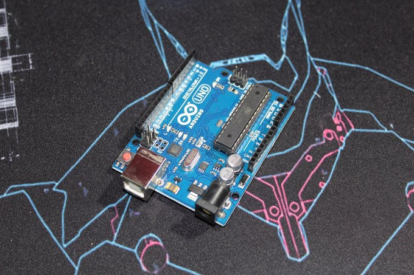
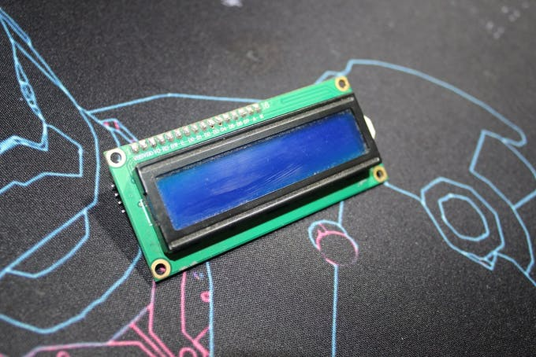
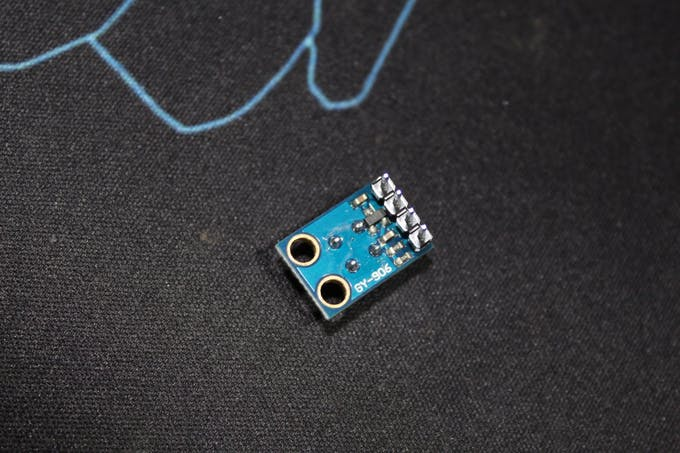
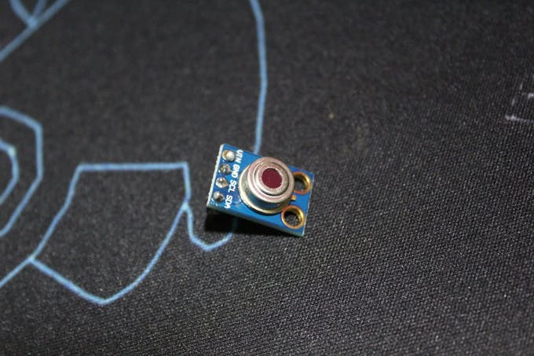
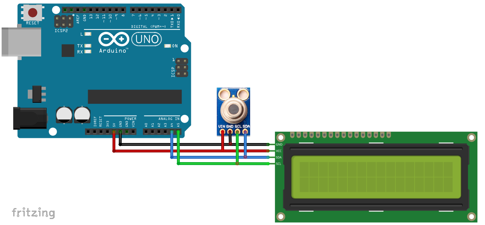
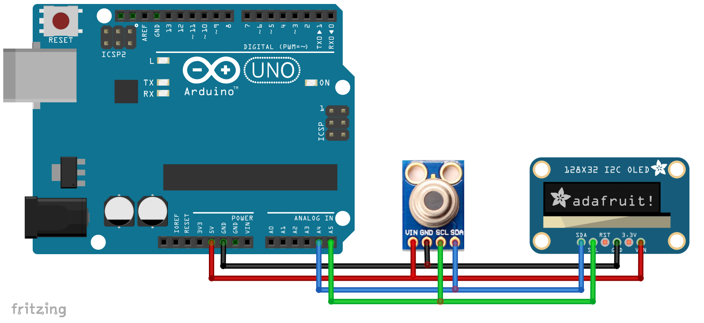
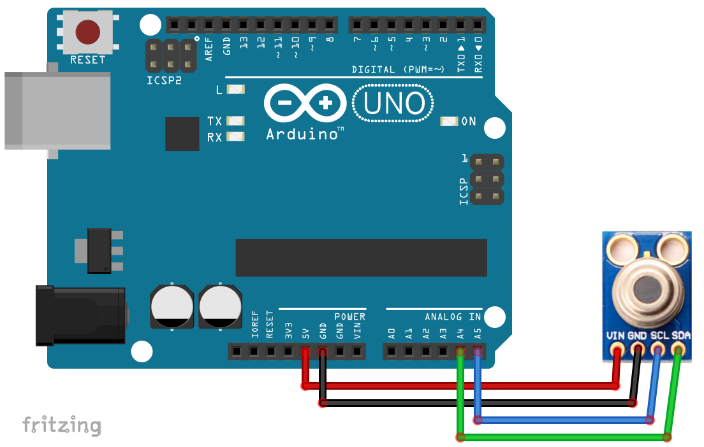
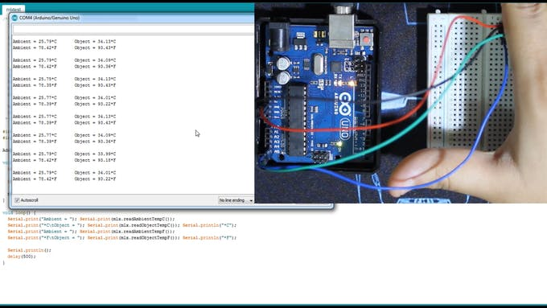

*Hello Friends aka Frandz! In this simple yet a bit mis-pronounced workshop, we are going to make a contactless temperature meter which can show you your body temperature and as well your surrounding's temperature.*


## Gimme The Shopping List


So, first things first. Let's see that what things do we need and some alternative free ways 😎

1. Arduino UNO
2. MLX 90614 (Infrared Temperature Sensor)
3. Standard LCD 16x2 White On Blue

Yup.. that's all in the shopping bag.
You can also try out the code on:

[Arduino.cc](https://create.arduino.cc/)

[Tinkercad](https://www.tinkercad.com/)

[Codebender](https://codebender.cc/)

[Circuito](https://www.circuito.io/)

[Circuit Lab](https://www.circuitlab.com/)


## Here Are Some Details For MLX 90614:

1. Range for ambient temperature: -40 to 125˚C (-40 to 257°F)
2. Range for object temperature (non contact): -70 to 380˚C (-94 to 716°F)
3. Resolution: 0.02 °C
4. Accuracy: 0.5°C for (0-50 °C) both ambient and object


# Ready. Set. Measure!


Now, we got all the components required, got my pokemon ball on the table, and some cookies for my dog. So, let's get started!

The first thing we need to do is importing the required libraries.

```
#include <LiquidCrystal_I2C.h>
#include <Wire.h>
#include <Adafruit_MLX90614.h>
```
Here, the ***LiquidCrystal_I2C.h*** is the display library whilst the ***Wire.h*** and ***Adafruit_MLX90614.h*** are the I2C Communication and Temperature Sensor libraries respectively.

Next, we define some stuff.

```
#define I2C_ADDR 0x27 //I2C adress, you should use the code to scan the adress first (0x27) here
#define BACKLIGHT_PIN 3 // Declaring LCD Pins
#define En_pin 2
#define Rw_pin 1
#define Rs_pin 0
#define D4_pin 4
#define D5_pin 5
#define D6_pin 6
#define D7_pin 7
```

Here, you shall first use the code to scan the address (0x27) and the rest of it declaring the LCD Pins.

After this;

```
LiquidCrystal_I2C lcd(I2C_ADDR,En_pin,Rw_pin,Rs_pin,D4_pin,D5_pin,D6_pin,D7_pin);
Adafruit_MLX90614 mlx = Adafruit_MLX90614();

```

Okay! Let me put you in context that what exactly is happening here. We are telling the computer that,

*"Hey dude! I got a sensor and some pins which I am defining above. Do check them."*

And now comes the main thing.

```
void setup() {
  
  mlx.begin();
  lcd.begin (16,2);
  lcd.setBacklightPin(BACKLIGHT_PIN,POSITIVE);
  lcd.setBacklight(HIGH); //Lighting backlight
  lcd.home ();

}
```
So here when the computer boots up, we are gonna tell it to start some of the processes we want. For this, we need to create a function! Here: ```setup();```

The first one which is: ```mlx.begin();``` tells the computer to turn on the sensor.
Then, ```lcd.begin (16,2);``` defines the rows and columns (16, 2) respectively.
After that, ```lcd.setBacklightPin(BACKLIGHT_PIN,POSITIVE);``` states to set the backlit pin as *Enabled* aka *Positive*.
Later on, ```lcd.setBacklight(HIGH);``` is to turn on the backlight. As an example, turning off would make it ``` lcd.setBacklight(LOW); ```
Next, ``` lcd,home ();``` tells the cursor to shift on (0,0) as (X, Y) axis.

Now, we got the what we wanted but the story doesn't end here. 


**We need to loop this thing to make a constant check on temperature. For that, we make a LOOOOP ;)**

```
void loop() {
 lcd.setCursor(0,0);
 lcd.print("Ambient ");
 lcd.print(mlx.readAmbientTempC());
 lcd.print(" C");
 
 lcd.setCursor(0,1);
 lcd.print("Target  ");
 lcd.print(mlx.readObjectTempC());
 lcd.print(" C");

 delay(1000);

}
```
Here again, we tell the cursor to get to (0, 0) at the start as we don't want it to get interrupted at the point where it was in the previous function. In more simpler words, we tell it to erase everything and get back to it's home town. LOL. I am joking. We just tell it to move to (0, 0) so later when we tell it to print an output or something other, it will start from (0, 0)

Now, in the second line we are telling it to print "Ambient." For the ones who don't know, Ambient simply means current surrounding. And printing is just printing stuff what we tell the computer. Not much knowledge required. 😁

Next, (because we installed the required libraries) we tell it to read the ambient temperature. And right after that we print "C." Now, when sensor captures the temperature, it's in Degree Celcius (We can change it to Fahrenheit, but I give it to you as a homework!). But, as an output, it will just give us the number (For Example: 23, 30, 41, etc.) and not 23 C. This is just for the user convenience. 

After that, We set the cursor to (0, 1) and tell it to print "Target." Now "Target" here doesn't mean the target temperature. It means the temperature captured while the user comes near the sensor. In a nutshell, it's gonna be our body temperature.

And then as usual, we COMMAND it to give the output using ```lcd.print(mlx.readObjectTempC());``` and also print "C" for user and OUR convenience.


Now, the thing is that our body temperature might not remain constant or maybe the surrounding's temperature might not remain constant. Thus, checking the temperature once, is not enough. And remember that that's the reason we created this LOOP!
But we don't want the system to update our temperature every now and then. Thus, a preferable option would be to set a delay time and be it as 1s aka 1000 millisecond.

AND VOILA! You just created your very own CONTACTLESS TEMPERATURE SENSOR! It has it's own advantage during the this time of the pandemic. And thus, this device is something very easy and cool to try out!

You can also test this out on a serial monitor just to correct some erros before finalizing everything.
As a pro tip, you can expand this project by adding a button to turn on and off the sensor. Also, you can go with an OLED screen as well! But, you also need some extra code for that.

**The ideas for expanding are endless and application is versatile, perhaps!**

<br>

The Code In A Nutshell:

```
#include <LiquidCrystal_I2C.h>
#include <Wire.h>
#include <Adafruit_MLX90614.h>

#define I2C_ADDR 0x27 //I2C adress, you should use the code to scan the adress first (0x27) here
#define BACKLIGHT_PIN 3 // Declaring LCD Pins
#define En_pin 2
#define Rw_pin 1
#define Rs_pin 0
#define D4_pin 4
#define D5_pin 5
#define D6_pin 6
#define D7_pin 7

LiquidCrystal_I2C lcd(I2C_ADDR,En_pin,Rw_pin,Rs_pin,D4_pin,D5_pin,D6_pin,D7_pin);
Adafruit_MLX90614 mlx = Adafruit_MLX90614();

void setup() {
  
  mlx.begin();
  lcd.begin (16,2);
  lcd.setBacklightPin(BACKLIGHT_PIN,POSITIVE);
  lcd.setBacklight(HIGH); //Lighting backlight
  lcd.home ();

}

void loop() {
 lcd.setCursor(0,0);
 lcd.print("Ambient ");
 lcd.print(mlx.readAmbientTempC());
 lcd.print(" C");
 
 lcd.setCursor(0,1);
 lcd.print("Target  ");
 lcd.print(mlx.readObjectTempC());
 lcd.print(" C");

 delay(1000);

}
```

Don't forget to select the correct board from your board manager and the correct comport. And then, press the upload button.

## Some Important Links:
1. [ML90614 library](https://github.com/adafruit/Adafruit-MLX90614-Library)
2. [Adafruit SSD1306 library](https://github.com/adafruit/Adafruit_SSD1306)

## I Love Issues aka We ALL Love Issues! (I Hope. LOL)

The issue about this module is that the temperature readings changes a lot when moving only few centimeters from the object. So you should be pretty close or fix a distance from you want to measure and calibrate the module.

## Gallery


Arduino UNO



LCD Display



MLX SENSOR BACK



MLX SENSOR FRONT


OLED SCREEN 128 X 32



Schematic: Wiring With LCD



Schematic: Wiring With OLED



Schematic: Wiring With MONITOR



Testing With The Serial Monitor
