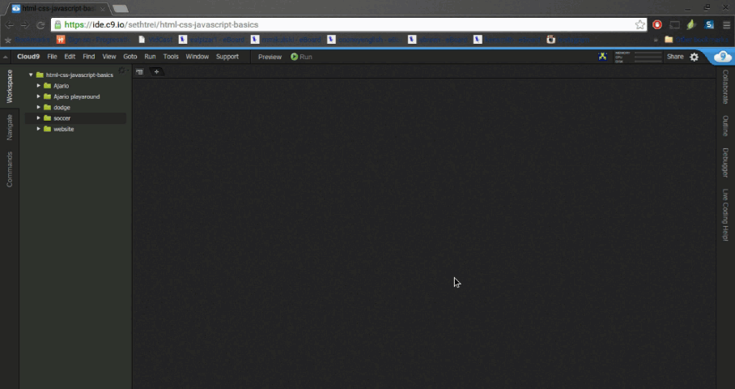
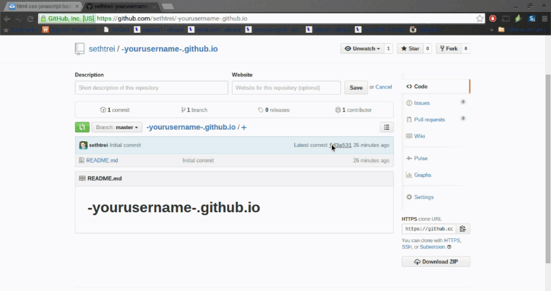

# Github Pages Workshop

Welcome! In this workshop you will set up a GitHub Pages Website!

To start you need to have completed the <a
href="https://github.com/hackedu/hackedu/tree/master/workshops/contrib/cloud9"
target="_blank">Cloud 9 Workshop.</a>

# What is GitHub Pages?

GitHub Pages is a way of using a GitHub repository to make a website. By the end
of the workshop you will have a link to get you to your website.

# What is a Repository?

A respository is a location where code and other files can be stored.

# Create a Repository

Make a repository following this format:

    (yourusername).github.io

So if your username is `supersam`, your repository would be `supersam.github.io`.

> 

# Clone into Cloud9

Go into your Cloud9 workspace and choose an area to clone your repository. You
want to find the terminal that starts with "bash". If it isnt there open a new
terminal. (Instructions directly below)

> 

1. Get the link for cloning. It is on the right side of your repository. If you
   click the little icon, the link is now on your clipboard.

      > 

2. In the terminal type: git clone [then the link you just copied]

      > 

# Congrats! You can now edit and save in your repository!

You should start creating the necessary files for a website. (`index.html`,
`style.css`, etc)

*If you don't know how to do this, you should check out the
[portfolio workshop](../../portfolio) to learn how to build your website!*

-------------------------------------------------------------------------------

# Part 2

In this part of the workshop, you will learn how to sync your Cloud9 data into
your GitHub Repository.

# Commiting and Publishing to GitHub

Once you have made changes in the files you need to put them on GitHub which
will put it on your website.

1. **Go into the terminal and type:**

        cd [repository name]

    This puts you into your repository

2. **Add your changes to the commit list by doing...**

        git add .

3. **Commit your changes with the following format**

        git commit -m "Here you type what the commit does. Keep the quotations."

    This will get your changes ready to push to GitHub

4. **Push your changes**

        git push

    It will ask for your username and password.  
    Note: When you type your password it wont show up in the terminal.

# Let's Explain What you Just Did

You just used git to push to a repository. Git is a way of organzing files, and
GitHub adds a user interface to git.

# So what is the URL?

The URL to your website is the same name as your repository so it should be
`[username].github.io`.

# Done!

Congrats! Now you can share the URL to anyone!

> 

# Feedback

Please fill out [this survey.](http://goo.gl/forms/KSUwTTB9K7)
