Raspberry Pi has become an integral part of IoT projects. 

The **Internet of Things** (IoT) is a system of interrelated computing devices, mechanical and digital machines, objects, animals or people that are provided with unique identifiers and the ability to transfer data over a network without requiring human-to-human or human-to-computer interaction. 

In this project, we are going to use a "drag and drop" IoT project builder platform called [Cayenne](http://cayenne.mydevices.com). With this platform, we can read sensor data, control actuators, etc. without having to worry about complicated code writing. 

First of all, we are going to control an LED bulb using the Cayenne app (Cayenne can also be accessed through a browser).

## Things Needed

- A Raspberry Pi connected to the internet
- Breadboards 
- An LED
- 220Ω resistor
- Female to male jumper wires
- An Android phone or a computer connected to the same network

All equipments are available for purchase from most electronic retailers. A great place to find them may be where you purchased your Raspberry Pi.

Turn on your Raspberry Pi and connect it to your network.

Then download the Cayenne app from the [Google Play Store](https://play.google.com/store/apps/details?id=com.mydevices.cayenne&hl=en) or [Apple Store](https://itunes.apple.com/us/app/cayenne-iot-project-builder/id1057997711), or you can use the online version on their [website](http://cayenne.mydevices.com). 

1. Create your free account.

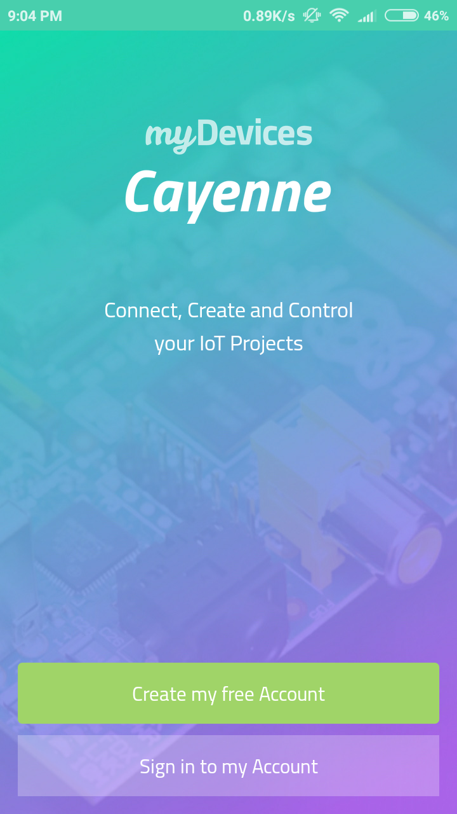

2. Click the **+** on the right top side to add new devices. 

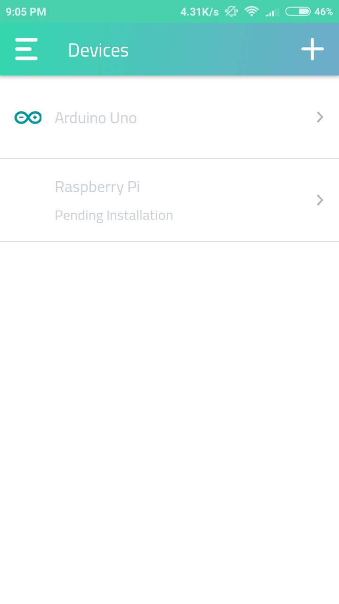

3. Select the Raspberry Pi icon

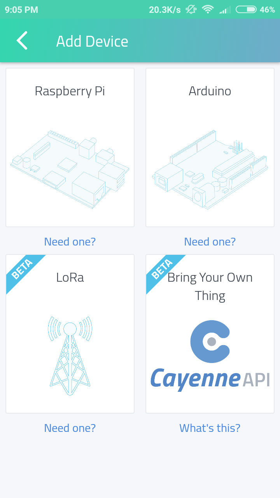

4. Follow the instructions and search for your Raspberry Pi

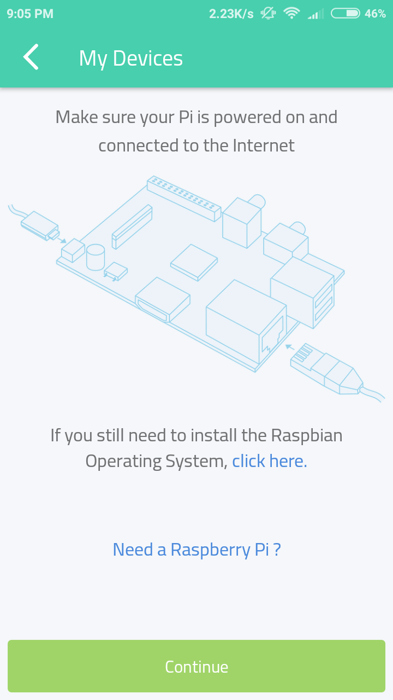

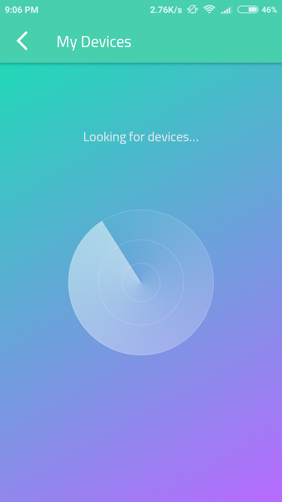

5. Cayenne will automatically detect your Raspberry Pi. If it did not automatically connect you, you can also manually type in the IP address of your Pi. See [this workshop](workshops/remote_viewing_raspi#find-the-ip-address-of-your-pi) for how to find your IP address.

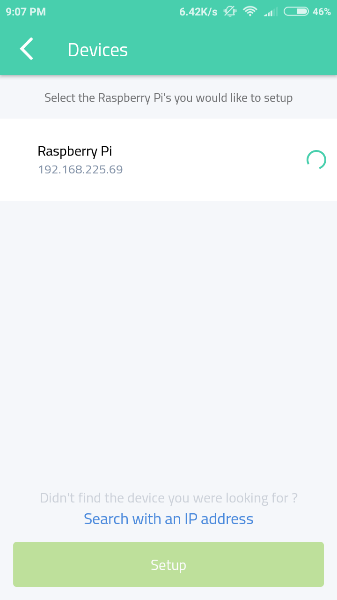

6. Select your Raspberry Pi and click setup. This will then initialize the installation of required files on to the Raspberry Pi.

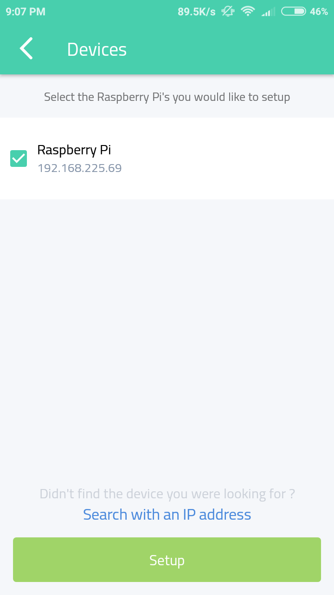

7. It will take 5 min or so to complete this setup. You can go enjoy a a nice afternoon snack while you wait, or you can just sit back and relax. 

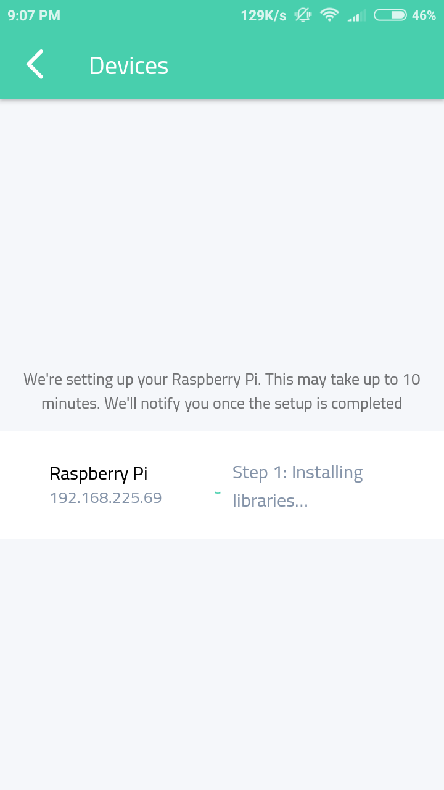

8. Once it is done, select your device from the interface.

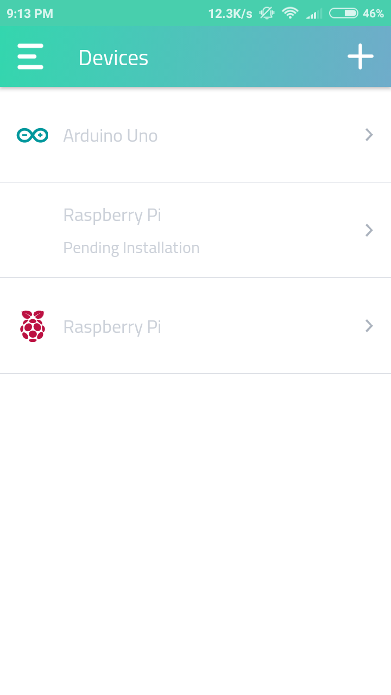

9. You will be able to see various parameters on the screen, and on the other tab you can see the state and details about GPIO.

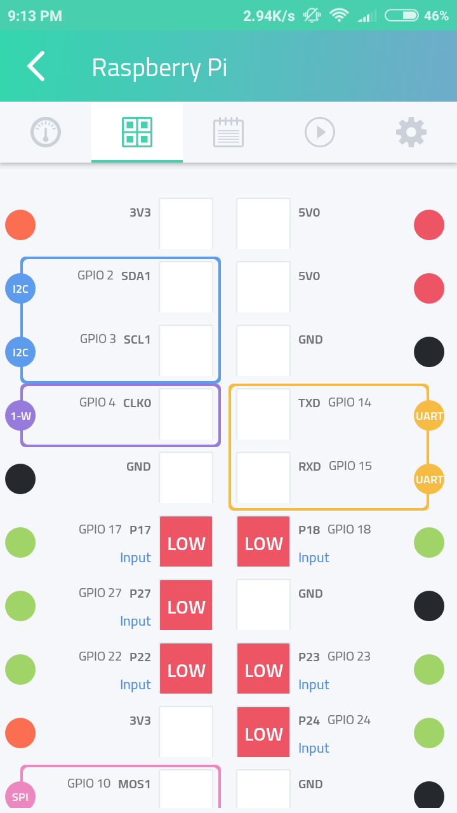

10. Now connect your LED to your Raspberry Pi using a breadboard and two jumper wires. Follow the diagram below.

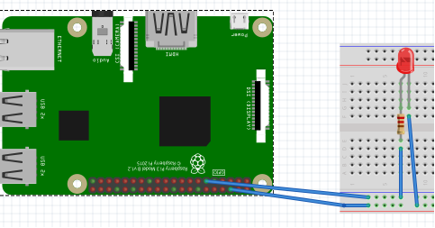

Positive end of the LED should be connected to  GPIO 17 of Raspberry Pi. The negative end can be connected to any of the GND available in the Raspberry Pi.

Follow the Raspberry Pi GPIO specification sheet for clarification. 

**⚠️ Don't forget the resistor - directly connecting the LED will sometimes damage it!**

11. Click the + icon on the top right section of the first tab and select light from the actuators and then light switch. 

12. Fill in the information needed as specified below:

- First field: Name it as **Light switch**
- Second field: Select **Raspberry Pi**
- Third field: Select **Integrated GPIO**
- Fourth filed: choose **11**, since we have connected our LED to GPIO 17 which is on pin 11.
- **Enable** Invert Logic
- Leave the other two fields as is.
- Then click add button below.

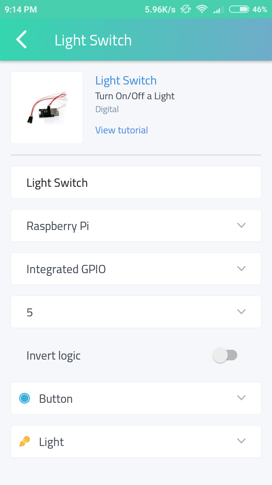

That's it, you have successfully configured your Raspberry Pi. A button should appear on the interface. Now click that button that you have created, and you should see the LED turning ON! 💡

You have completed your very first IoT project. Since Cayenne is very easy to use, you can make your own projects by hooking up different modules and sensors. All you need is that maker mind and that passion to learn how things work. If you have any questions, Google is always your best helper!

We will be adding projects to this series in the future. For now, you can check out [Cayenne's website](https://mydevices.com/cayenne/videos/) for more beginner-friendly tutorials!

Hack it away!
