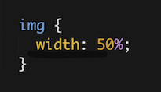
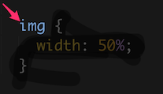
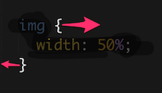
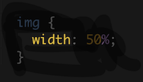
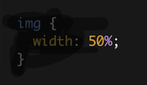

_**Hello friends! We need a community member to update this workshop to work without Cloud9. Interested? Message an admin in slack! Until then, this will live in the Retired section.**_

# Cringe 101

Short link to this workshop: https://workshops.hackclub.com/cringe_101

## Introduction


### What?

**Cringe 101** will give you **the tools** to create the most cringiest website ever. We want **you** to make something totally different from anything we've seen before.

Surprise me, your friends, maybe your mom, I don't know. Just try not to kill anyone.

**Cringe 101** should be done after having some experience with making some nice looking things in HTML + CSS.

But we can't force you — I'm kinda scared of you to be honest. So, this will workshop will be self-enclosed (kinda, we still urge you to go through the workshop below first).

### If You Haven't Already...

Probably a good decision. Create a beast of a website by following this workshop:

[Portfolio Workshop](../portfolio)

Get it online using:

[Git and GitHub](../git_and_github)

### Beautiful Examples

Curated by yours truly (follow me on [Twitter](https://twitter.com/JevinSidhu) yo), here are some of my favorites.

- https://illuminaughty.herokuapp.com/
- http://www.goer.org/htmlhorror/htmlhorror1.html

### Set Up Your Document:

This isn't 100% necessary for the code to run (it will still totally do so), but it tells the webpage some key facts that make it run without any hitches.

```html
<!DOCTYPE html>
<html>
  <head>
    <link href="main.css" rel="stylesheet" />
  </head>
  <body></body>
</html>
```

`<html>` + `<head>` + `<body>` are all called HTML Tags.

- Tags are what is used to to organize the content of a web page.
  - `<html>` → Called the opening tag.
  - `</html>` → Called the closing tag.
- The difference is the forward slash before the name ( / ).
- Almost all HTML tags have both an opening and closing tag.
  - Ones that don't we will discuss.
- This organizes the website.
  - We don't want our `<head>` section in our body section, so we close that before opening our `<body>` tag.
- `<!DOCTYPE html>` Placed at the top of your document.
  - It is an instruction to the web browser about what version of HTML the page is written in.
  - It automatically defaults to the most recent release.
    - HTML5 is the most recent release of HTML.
- `<html>` Encloses the entirety of the rest of the document.
  - All of your following code should go inside here.
- It tells the browser that this everything inside of this tag is HTML code.
- `<head>` Encloses the code that you don't want to show up on the page.
  - Includes linking to the CSS file (`<link>`).
- HTML and CSS are dumb. They make no association unless told to do so. `<link href="main.css rel="stylesheet">` is linking the CSS file to the HTML.
- `<link>` is another tag and inside of it you have a `href` that explain the name of the file.
  - In this case, it is named `main.css`>
    - All CSS files must end with `.css` → All HTML files must end with `.html`
  - `rel=stylesheet` is telling the program that the type of file is a stylesheet, or CSS file>
- `<body>` tag represents the content of an HTML document.
  - There can be only one `<body>` element in a document.

# Ideas for Cringe

## GIFs

- GIFs supports animations — so we can get a video!
  - GIFs stands for Graphics Interchange Format.

They deliver beauties like this:


Insert GIFs just like any other image format!

To add an image, use the image tag: ``

- `img` is the tag name → This is self-closing, meaning there is no a closing tag like `</img>`.
- `src` is an attribute that specifies the URL of the image.
- Think of it like a setting.
- Add the URL (redirected to image) between the quotes.

http://imgur.com/ is a website where you can upload and then get a link to the image!

- HTML is used for content.
  - Like the skeleton (spooky) of a body.
- CSS is used to change the way things look and feel.
  - Like the color, width, height of your face/skin.

Let's break CSS down into an English sentence:

- English sentenced code is called pseudo-code → Code that wouldn't run on the computer, but we're making sense of it.

Here's the CSS:





For every **`img` tag** on the web page



I want all the style properties inside the curly brackets to apply:



specifically, I want the width



to be 50% of the width of the page.

In the CSS, we use **selectors to select tags**, `img` is the selector in our example.

- What if you want to **call 1 of your 2 `<h1>` tags** → Both have the same selector right now.

  - To solve this and create **custom CSS selectors**, in HTML → This is called creating a class

- After **keyword** (`<div, <body, <h1, <head`) of **any tag** type **class="class-name"** to create a class
  - `<body class="class-name"> </body>`
  - These must no capitals and spaces are replaced by dashes
  - There must be a . before your class-name and then the normal syntax.

For example if we wanted the background of our site to be a GIF of Kanye West we could do this:

HTML:

`<body class="who"></body>`

CSS:

```css
.who {
  background: url('https://media3.giphy.com/media/9RTiWDExHW6aY/200.gif ');
}
```

This means that for every element with the class of "example", it will have a background image of Kanye West.

Here is a preview of what that does: https://preview.c9users.io/jevinsidhu/cringe-101/index.html?_c9_id=livepreview0&_c9_host=https://ide.c9.io

Below is the code for this site:

```html
<!DOCTYPE html>
<html>
  <head>
    <link href="main.css" rel="stylesheet" />
  </head>

  <body class="who">
    <a href="god.html"></a>
    <!--When an element with the class "who" is clicked it will lead you to a separate page-->
  </body>
</html>
```

---

```html
<!DOCTYPE html>
<html>
  <head>
    <link href="main.css" rel="stylesheet" />
  </head>

  <body class="god"></body>
</html>
```

---

```css
html,
body {
  margin: 0;
  padding: 0;
  width: 100%;
  height: 100%;
}

a {
  display: block;
  width: 100%;
  height: 100%;
}

.who {
  background: url('https://media3.giphy.com/media/9RTiWDExHW6aY/200.gif ');
}

.god {
  background: url('https://media.giphy.com/media/6rclMe3lUIQNi/giphy.gif ');
}
```

## Fonts

Some fonts really make people cringe. An example of that would be the esteemed Comic Sans.

Changing your font is easy to do and **Google Fonts** (https://www.google.com/fonts) makes it even easier. There are hundreds of fonts Google offers to use for free on the site.

The best part about Google Fonts is that it gives you the code you need to put on your site.

**Steps to add and change fonts:**

1. Navigate to [google.com/fonts](https://www.google.com/fonts).
2. To select a font, click the + on any of the ones on the front page or by searching for one on the top right corner.
3. Once you have selected one or more fonts, click the bottom line where it says “ Families Selected and click the preview and share button.
4. From there, let’s copy the link below **STANDARD @IMPORT**. This should look something like `<link href="https://fonts.googleapis.com/css?family=Baloo+Tamma|Open+Sans|Roboto" rel="stylesheet">`
5. You'll notice it looks exactly like a CSS file -- that's because it is!
6. Since it's a CSS file, you know what that means! Copy the code & paste into your `<head>`.

```html
<!DOCTYPE html>
<html>
  <head>
    <link
      href="https://fonts.googleapis.com/css?family= Open+Sans"
      rel="stylesheet"
    />
  </head>
</html>
```

Now that we added the font, we can actually change our text to the font we like using CSS!

In the example below, we changed all the text to the desired font by using the property `font-family` on the body tag. However, if you want to be really cringy, use different fonts for every different piece of text using more specific tags.

```css
body {
  font-family: 'Open Sans';
  color: #000;
  font-size: 10px;
  font-weight: 300;
}
```

Tip — Along with changing the fonts, change the colors (`color`) and thickness (`font-weight`) of the different text as well to see your friends cringe even more!


## Pseudo - Classes

You can revisit that workshop for more extensive overview of them, but here's a quick recap.

A **pseudo-class** is an **exception to a set of rules you created in CSS**.

- _**If you do something**, the **default set of rules will be overridden** by the new set_
- Pseudo-classes are activated by adding them to a CSS selector like this.

```css
h1:hover {
  color: red;
}
```

The `h1` is the tag from the HTML we are working with. The `:hover` is the pseudo - class or exception you have added. In this case by adding `:hover` you have created an exception to the old color the `h1` tag was in and have stated that whenever the mouse hovers the `h1` text, it's color will be red instead.

An example of `:hover` in action can be seen on Udit's site when you go over the words Twitter, Instagram, Medium and Cipher — http://uditdesai.github.io/me

Hopefully you found that example to be really pretty and an effective use of pseudo - classes, however this CSS trick can also be used to make websites really cringy by making every piece of text change colors when hovering over them.

## `<audio>` Tag

An audio tag is super simple to get ready!

All you need to start annoying your friends, family, dog, etc is:

1. A pair of `<audio>` tags.
   - `<audio> </audio>`.
2. A properly configured `<source>` tag inside of those (it's self closing!).

- You can have multiple source files inside a pair of audio tags.
  - It'll just cycle through them like a playlist!

```html
<audio>
  <source src="audiofile.mp3" type="mediatype" />
</audio>
```

**To upload an audio file to Cloud9**

You'll need to upload your sound file directly to C9 if you can't find it hosted somewhere like this (https://www.anotherwebsite.com/sound.mp3)

Just follow the either method below to upload your file to C9.


1. Drag and drop your file onto the folder tree you want to upload it under

- It should highlight the folder green when you hover over it and when you let go, it should start uploading.

**Alternate Method**


1. Look at the top bar of your workspace and select "File".
2. Mouse over the drop down list that pops up and hit "Upload Local Files...".
3. Either Drag and Drop your files into the newly opened window, or hit "Select files" or "Select Folder".
4. Find your audio file on your computer and click "Open".
5. If you did all this right, should start uploading on the sidebar!

**Setting up the `<audio>` tags**

Okay! Lets start by making a pair of `<audio>` tags.

You have your tags in place but they'll need a bit of configuring to get working. Like all tags in HTML it can accept extra information called attributes to tweak them to your needs.

Attributes are basically like unique properties of a pair of tags:

```html
<div class="bestdiv"></div>
```

Anything inside the first `<>` that isn't the element name (div) is called an **attribute** (`id=""`, `class=""`, etc.)

As such, `<audio>` has its own set of attributes that can be applied to them simply by typing them in between the `<>`

Here's a list of the unique attributes that `<audio>` tags can accept exclusively:

- `autoplay:` Tells the browser to automatically play the audio once it's loaded.
- `controls:` Creates a play bar with a play/pause button, sliding bar, and a volume control
- `loop:` Loops the audio again once it's finished.
- `muted:` Mutes the audio output. (doesn't stop the audio from playing, it just has no volume).
- `preload="":`
  - `auto:` load the audio file after the page loads.
  - `metadata:` only load the metadata (extra info like author, etc that is stored within the file) when the page loads.
  - `none:` doesn't load the audio file when the page loads.
- `src="" :`
  - e.g preload="none" would tell it to not load the file when the page loads
- `src=""`
  - Specifies where the audio file is. (This won't work on every browser so that's why we use the <source> tags)

Example of an audio tag set to automatically play, and loop an audio file:

```html
<audio autoplay loop src="hotline-bling.mp3"></audio>
```

## Configuring the `<source>` tags

The `<source>` tag simply serves the same purpose as putting a `src=""` attribute above, as in it directs the browser to where the audio file is.

`<source>` can be used for all sorts of media files, (sound, video, etc) but for this tutorial we'll just be using it for audio.

This tag also has its own set of attributes like `<audio>` also it's **self-closing**. `src="[URL]":`

- Points to the location of the media file
- File can be hosted on another website
- must end in a supported file extension
- Alternatively, hosted directly where the website is
- e.g "thiswebsite.com/hotlinebling.mp3" another example:


`type="[media-type]"`

- Specifies the type of media that will be displayed
- e.g `;source src="blinghotline.mp3" type="audio/mpeg"&gt;`
- This changes depending on the type of file you use. You can find more types here: http://www.w3schools.com/tags/att_source_type.asp

**Example of `<audio>` and `<source>` tags properly configured to play a locally hosted `darude.mp3` on loop.**

```html
<audio loop autoplay>
  <source src="audio/darude.mp3" type="audio/mpeg" />
</audio>
```

Did you do this and still aren't satisfied with the level of cringe? Maybe instead of regular audio you need [ADVANCED AUDIO](https://www.youtube.com/watch?v=XjtkWZ1uCXo).

## Advanced Audio using JavaScript

There's an infinite number of things you can do with JavaScript, but for this workshop we'll show you a way to make JS trigger a sound when any part of your page is clicked!

You do not need the HTML tags from the tutorial above to get this work. But you will need to know how to specify the location of an audio file. (`src=""`)

To get this to work you'll need:

1. A JavaScript File linked in your HTML `<script type="text/javascript" src="script.js"></script>`
2. At least one audio file hosted either remotely (another website) or locally inside of your workspace


An example of a remote audio source would be something like

`"www.yeezy.com/onsight.mp3"`

If you already have these, awesome! If not, get those setup before continuing with this section.

To begin, let's open your JS file!

The single line of code that we'll need to tell JavaScript to "listen" for an event is:

```js
document.addEventListener('[event]', function() {
  // [Your code to run]
})
```

You may or may not understand what this chunk of code means so let's break it down.

`document` simply means the HTML document that the JavaScript file was run/linked in (using your `<script>` tags).

`.addEventListener` means to add a "listener" to trigger something when a certain event happens

So far pretty simple right? `document.addEventListener` just means: **Start listening to whenever a certain event happens**

Now we need to specify what type of event we want our listener to look out for, to do this we put the name of the event in the [event] section of the code.

```js
document.addEventListener('[event]', function() {})
```

These events have certain names, but thanks to our friends at `w3schools` they've given us a nicely arranged list of all the HTML events.

[You can find that here](http://www.w3schools.com/tags/ref_eventattributes.asp)

**Note: You remove the prefix when you use those names inside of `document.addEventListener`**

So following that rule

```js
document.addEventListener('onclick', function() {})
```

Would turn into:

```
document.addEventListener("click", function() {});
```

Now that we've told `Listener` what to listen for, we need to tell it to run code when it sees what it's looking for.

To do that, we use `function() {}`

`function() {}` is basically telling JavaScript to run the lines of code inside of `{}`

With that known, how do we get JavaScript to play audio?

We create a variable with an audio path inside of the `{}` using:

```
var variableName = new Audio('[AUDIOPATH]');
```

`variableName` can be simply anything you want it to be, try to keep it clear and concise though!

- Notice how the second word was capitalized? This is called camel casing.

**`[AUDIOPATH]`** is where your audio file is, it can either be a website link to the file or the path on your workspace

The path on your workspace to the file is relative to the HTML file, so if your audio file is in the same folder as your HTML file it would just simply be `new Audio("example.mp3")`

Now for the final step, which is to finally play your audio!

To tell JavaScript to play the audio file stored in the variable all we need to write is:

```js
variablename.play()
```

`variablename` would be the name you set previously when you wrote `var variablename`

Don't forget to close your curly brackets of `function() {}` and it should work!

```js
document.addEventListener('click', function() {
  var wow = new Audio('wow-.mp3')
  wow.play()
})
```

The example plays `wow-.mp3` every time a left click is registered on the page.

[Check it out here!](https://preview.c9users.io/matthewkwong/hack_club/Cringe%20101/cringe.html?_c9_id=livepreview1&_c9_host=https://ide.c9.io)

## `<marquee>` Tag

Microsoft's `<marquee>` tag scrolls a selection of markup across the screen.

The `<marquee>` tag creates a 100% wide div (box) with text sliding across the screen.

There are a large number of [attributes for the `<marquee>` tag](https://developer.mozilla.org/en-US/docs/Web/HTML/Element/marquee).

You can change the width, the alignment, the scrolling speed, the scrolling delay, and even the scrolling direction (right to left or left to right).

It is a tag, so it encloses other tags:

```html
<marquee><div class="cringe"></div></marquee>
```

Here's an example of what you can do!

```html
<marquee
  direction="up"
  width="100%"
  height="250"
  behavior="alternate"
  style="border:solid"
>
  <marquee behavior="alternate"
    ></marquee>
</marquee>
```
