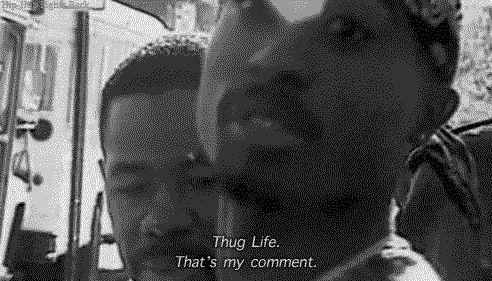
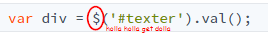
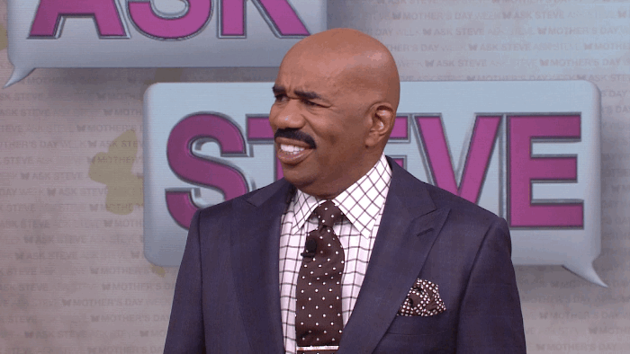

# The Dawgshop



## Introduction

Links to a live demo and the final code below. This workshop should take around 1 hour.

[**Live Demo**](https://prophetorpheus.github.io/dawgshop/index.html)

[**Final Code**](https://github.com/prophetorpheus/prophetorpheus.github.io/tree/master/dawgshop)

---

What is this? The Dawgshop™ is an introduction to the basics of JavaScript + jQuery.

We'll be adding ", dawg" to the end of whatever you type into an input box — simple, but sweet. You'll be able to change the word added at your own will.

This [slidedeck](https://docs.google.com/presentation/d/1N2l9FTYlGCocr8cqjLaHpp5tgv0hS-WI3US7PiMbRnc/edit#slide=id.p) created by Amy Sorto and modified by [Cipher](http://projectcipher.io) is a great introduction to key concepts. Please take a look through it!

## Setting Up Your Files and HTML Document

1. Make a new folder named, "dawgshop"

- Right click on the folder and make a file named `index.html`
- Repeat this step and make 2 more files named `style.css` and `script.js`

## Formatting Our HTML

Let's get down to business and get this started!

To have a proper page, we must follow this format

**Please do not copy and paste!**

```html
<!DOCTYPE html>
<html>
  <head>
    <link href="main.css" rel="stylesheet" />
  </head>

  <body>
    <script src="script.js"></script>
  </body>
</html>
```

Some things to note:

- `<script src="script.js"></script>` links the JS file to the HTML file
- `<link href="main.css" rel="stylesheet">` links the CSS file to the HTML file
- Webpages + browsers are really dumb, humans just make them smart
- `<script>` is a tag that links the the HTML file to the JavaScript file
  - `src` is called an attribute
    - It specifies the location — in this case it was simply the file name, "script.js"

**NOTE: Make sure you have closing tags (`</script>`)**

## Adding jQuery

As mentioned in the slidedeck, jQuery is a JavaScript library that adds functionality to JavaScript.

JavaScript was created in 1995 — that was 20 years ago (from 2015). Libraries help keep the language powerful and current.

Using the same `<script>` tag we need to link a jQuery content-delivery network (CDN)

- CDN's allow us to import a file with the jQuery library. If you open https://ajax.googleapis.com/ajax/libs/jquery/2.1.3/jquery.min.js, it is a bunch of lines of code!
- You could download this, include it alongside your files, and link the file name.
  - It'd be exactly the same!
  - CDN's simply allow us to have the same functionality more quickly.

Include the linking of jQuery above your `script.js` file

- HTML runs top-to-bottom
- Our script file requires jQuery in order to run, so it should come after

```html
<script src="https://ajax.googleapis.com/ajax/libs/jquery/2.1.3/jquery.min.js"></script>
<script src="script.js"></script>
```

## Creating the HTML Structure

Our focus for this workshop is the the basics of JavaScript + jQuery. Let's finish up our HTML first!


Note: All of this must be enclosed by the `<body>` tag. The closing tag, `</body>`, should be after your script tags.

**[Let's go](https://youtu.be/AYD4dZqCpdU?t=17)**

_Please ~~don't~~ turn up that hard to our workshop_

1. To enclose our content, we'll create a `<div>` tag

This is a container to:

- Organize our content
- Apply stylings from our `style.css` file to everything enclosed

  ```html
  <div class="dawgit"></div>
  ```

2. To add the name of the workshop, let's create a `<h1></h1>` header tag.

Give the header tag an id of "title"

- Type `id="title"` before the `<h1` is closed.

It should look like this: `<h1 id="title">Dawg It Up</h1>`

- An id is a way to identify single elements that use the same tag as other elements.
- I.e., There may be multiple `<h1>` tags in your code
  - To select one it needs to have its custom name, hence the id.

Indent your code!

- Indenting items that are enclosed within another tag is important for your own readability

  - In this case `<h1>` is enclosed in `<div>`

  ```html
  <div class="dawgit">
    <h1 id="title">Dawg It Up</h1>
  </div>
  ```

3. Let's create a place to input our text with the `<input/>` self-enclosed tag

`<input/>` is self-enclosed tag for creating an input box. The `/` is how it
closes itself. We'll be able to type in this box!


Give this input box an id of "text-input"

```html
<input id="text-input" />
```

We can give the box "placeholder text" as well!

- Placeholder text in the greyed out text (see the photo above, "insert text")

Add a `placeholder` attribute (like `src` is an attribute):

- `placeholder="some text"` right after the id

```html
<input id="text-input" placeholder="insert text" />
```

- We've made the placeholder simply say "insert text"

4. Let's make a submit button with the `<button>` tag

`<button>` is the tag for creating a button

- Just like the `<h1>` tag, this another tag where we place text between the opening and closing tags to display on the webpage

Give this button the text "dawg it"

```html
<button>dawg it</button>
```

Give this button an id of "go"

```html
<button id="go">dawg it</button>
```

We're going to tell the webpage that this is a type-of-something. In this case, it's a button!

To do this, we're also going to give this a `type` attribute.

- That means we should `type="button"` right before the id
  - This is to ensure that the webpage understands we want a button
    - By specifying this, the HTML adds some build-in CSS styling

```html
<div class="dawgit">
  <h1 id="title">Dawg It Up</h1>
  <button type="button" id="go">dawg it</button>
</div>
```

**Look at that beautiful indenting. Is your code indented?**


5. Still inside the div, let's create a space for our dawgified content, let's create a `<p>` tag with an
   id of `output`.

```html
<p id="output"></p>
```

`<p>` stands for paragraph

- Just like the `<h1>` tag, this is another tag where we can place text between the opening and closing tags to display on the webpage

Whatever text we type into the input box will have “, dawg” added - We will then add the text between the opening and closing <p> tags - We’ll do this using JavaScript.

##### Our code should now look like this! (do not copy and paste!):

```html
<body>
  <!-- Our main HTML -->
  <div class="dawgit">
    <h1 id="title">Dawg It Up</h1>
    <input id="text-input" placeholder="insert text" />
    <button type="button" id="go">dawg it</button>
    <p id="output"></p>
  </div>

  <!-- JavaScript files, also referred to as simply "scripts" -->
  <script src="https://ajax.googleapis.com/ajax/libs/jquery/2.1.3/jquery.min.js"></script>
  <script src="script.js"></script>
</body>
```

## CSS

CSS (cascading style sheets) is the styling of our page

- This styling lives in the `style.css` file

We use selectors in CSS that select our HTML tags

We want you to style the page!

- If you feel uncomfortable, that's good! You'll only really grow by being put into uncomfortable situations and then figuring your way out
- Your peers are here to help you if you have any questions, all you gotta do is ask
  - Google is also amazing! It's what all programmers turn to, especially professionals!

If you feel completely lost, no worries! Go back to our older [workshops](https://workshops.hackclub.com/) or use those awesome google search skills of yours.

## JavaScript + jQuery , dawg

Remember that the variable names in the examples below can be anything you want, but we recommend sticking with ours in order to make the workshop easier to follow!

### JavaScript

Let's open up our JavaScript file now!

### Adding a Listener

To begin our JavaScript journey to Thug Land we'll need to add a listener to listen for a click on our button.

```js
document.getElementById('go')
```

This line simply means: Find the element with the the id "go" in the document.

Now we haven't done anything with this element yet, we want the button to trigger some code when someone presses it so we'll add `.onclick = function() {}` to the end of the line

`.onclick` simply adds a rule to listen for a click on the button and runs whatever is assigned to it.

In this case, `= function() {}` happens to be assigned to it.

With that known, we can infer that `.onclick = function() {}` simply means: When a click is registered, run the following function.

To review, so far our code looks like:

```js
document.getElementById('go').onclick = function() {}
```

which simply says: Find the element with the id of "go" and listen for a click on this element. If there is a registered click, run this function (block of code.)

If you've followed along this far, awesome! You're doing great, we're almost done. If you're stuck, turn to a peer!

**We a team and we the best.**


Now that we've gotten JavaScript to listen for a click on the button, we need to tell it to do something when it gets a click.

### Creating a Variable and Assigning a Value

Every line that we want to execute **needs** to be inside the curly brackets **( { } )** of `function()`

Don't forget to indent it either! Remember, it'll make it easier to read.

So let's start with first finding what we need to dawg up.

We'll be grabbing the value from the input box, and since the id "text-input" is assigned to the box...

That means, whenever someone types into the input box, it will be retrieved with this line of JavaScript!

To do that we need to use:

```js
var inputText = $('#text-input').val()
```

WHOA HOLD UP DID YOU SEE THAT?????

LOOK AGAIN.



You're probably wondering what the heck that `$` is doing here. Remember the libraries section in the slidedeck?

That is the power of jQuery at work. It took something we would normally use like `document.getElementById('text-input')` and shortened it to `$('#text-input')`.

Of course, `document.getElementById('text-input')` would still work if you'd prefer that.


Note: It finds HTML elements exactly like a CSS Selector would:

- id's would be: `$('#[id]')`
- Classes would be: `$('.[classname]')`
- Regular tags would work too: `$('h1')`

Therefore:

```js
var textInput = $('#text-input')
```

Means the same thing as:

```js
var textInput = document.getElementById('#text-input')
```

Place `.val();` at the end of the line

- Takes the value of whatever you've selected

So to clarify everything, `var inputText = $('#text-input').val();` means to take the value of the element `text-input` and store it into a new variable called `inputText`.

We're grabbing the value from the input box, since the id "text-input" is assigned to the box

- Whatever someone types into the input box will be retrieved with this line of JavaScript.

We're gonna use this string value to dawg it up later on.

- A string is a series of characters (text and numbers)!
  - This is also mentioned in the slidedeck

So, we've debunked that mystery!


```js
document.getElementById('go').onclick = function() {
  var inputText = $('#text-input').val()
}
```

Let's move on to performing the actual dawging part of the string we got in the last part :basketball:.

### Adding the `", Dawg"` to the `add` Variable

We need to store the variable with the words from the input box and then add the word `, "dawg"` to it

```js
var dawgifiedText = inputText + ', dawg'
```

This line takes the string we got in the last section (variable `inputText`) from the input box, adds `", dawg"` to the end of it, and then stores it into a new variable named `dawgifiedText`.

Remember: Whatever is on the right side will be assigned to the left side.

- `inputText + ", dawg"` is being assigned to the variable `dawgifiedText`

Adding the two strings together is called **concatenation**. Ya fancy, huh?



Alright, now that we're dawging it up, it's time to display our up text on the page — fo'shizzle.

Just to make sure, at this point your code should look like this:

```js
document.getElementById('go').onclick = function() {
  var inputText = $('#text-input').val()
  var dawgifiedText = inputText + ', dawg'
}
```

### Displaying the Text

Now we're going to use: `document.getElementById()` to find the element on the HTML page by its id.

```js
document.getElementById('output')
```

This will take care of that job for us

- We're finding the element with the id `output`

PS: you can use jQuery's `$('')` for this as well.

- Try changing this line to use the jQuery syntax
- Syntax means the grammar, spelling, and set of rules of a language

Now we will attach `.innerHTML = dawgifiedText;` to the end of the line `document.getElementById('output').innerHTML`

It's just like `$('#text-input').val();` that we used before:

- Except this time we're setting the `innerHTML` value (the text inside of the pairs of `<p>` tags) of an HTML element instead of getting a value from it.

We will now assign the value of `dawgifiedText` to the `<p>` tag with the id `output`:

```js
document.getElementById('output').innerHTML = dawgifiedText
```

In plain English, `document.getElementById('output').innerHTML = dawgifiedText;` means:

- Set the `innerHTML` of HTML element with id "output" to the value of the variable, `dawgifiedText` (our dawgified string variable → the variable that holds our text)

Close your curly brackets ( `}` ), slap a semicolon ( `;` ) on the end of it and BAM you're done!

Final Code:

```js
document.getElementById('go').onclick = function() {
  var inputText = $('#text-input').val()
  var dawgifiedText = inputText + ', dawg'
  document.getElementById('output').innerHTML = dawgifiedText
}
```

## You are now a JavaScript Legend.

Congratulations! You made your own dawging machine!


Unless you copy-pasted, then, eh. Maybe only a half-legend.

Your mom thinks you're special, that's all that really matters 💯

As a note, you can replace ', dawg' with any other text; give it a try!"

## Sharing with the Community

Like with previous workshops, let's set up a link that you can share with others!

1. Open the terminal by pressing `alt + t` on the keyboard at the same time. Then type in the following commands:

- `git add --all`
- `git commit -am "Dawg It Up"`
- `git push origin master`

2. GitHub will now ask you for your username and password.

- Go ahead and enter your username and then press the <kbd>enter</kbd> key.
- Then enter your password and press <kbd>enter</kbd>. _Note that the characters don't show up on the screen but rest assured, you are still typing._

3. Now try to view your game by going to `username.github.io/dawgshop`

   > Make sure to change `username` to your own username

4. Post the link to the [`#shipit`](https://hackclub.slack.com/messages/shipit/) on Slack to share your awesome work!

## Hacking

Now is the chance to make this project yours! For inspiration, you can look [here](http://jevinsidhu.github.io/thugify/) to see an example of what you can do.

## Thanks for completing our workshop ❤


Move on to the [Cringe 101 Workshop](../cringe_101/) afterwards!
