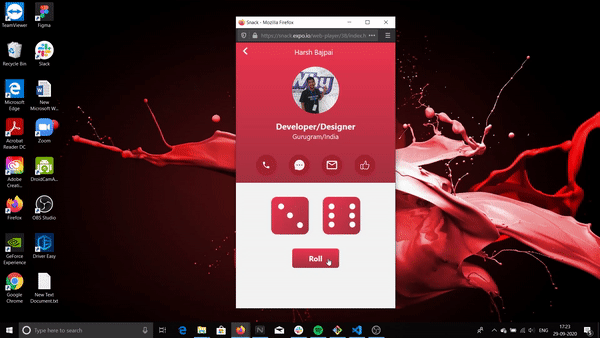
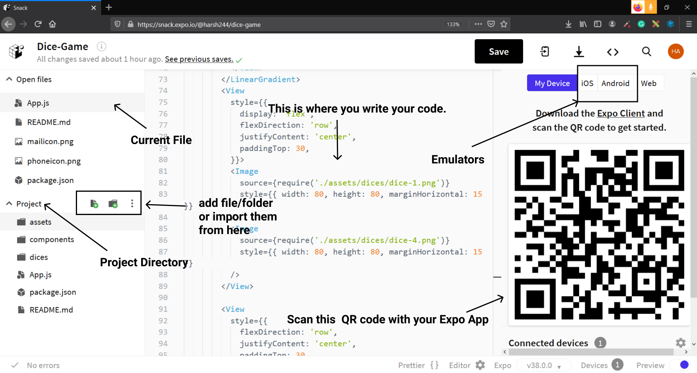
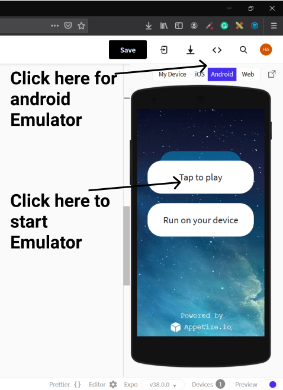
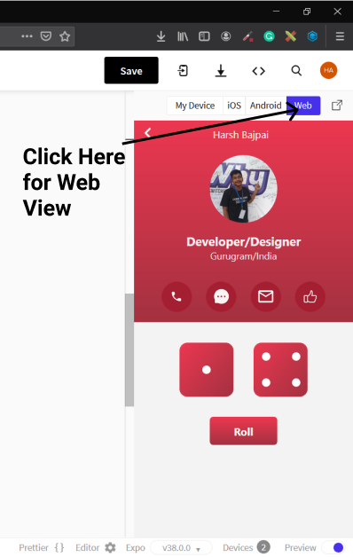
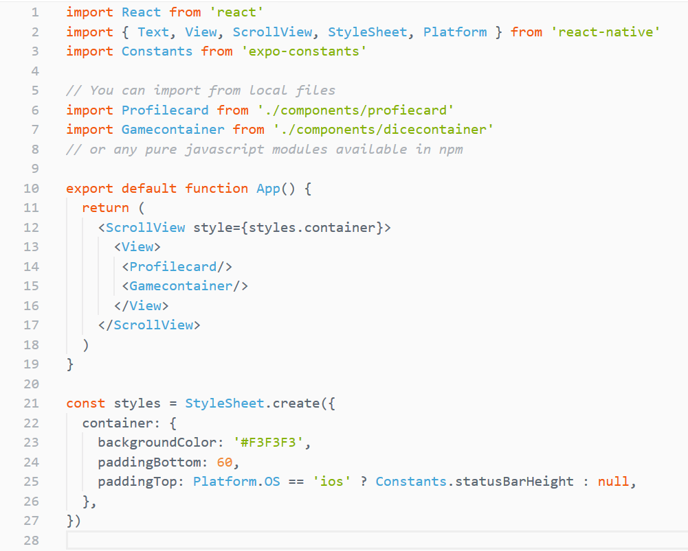
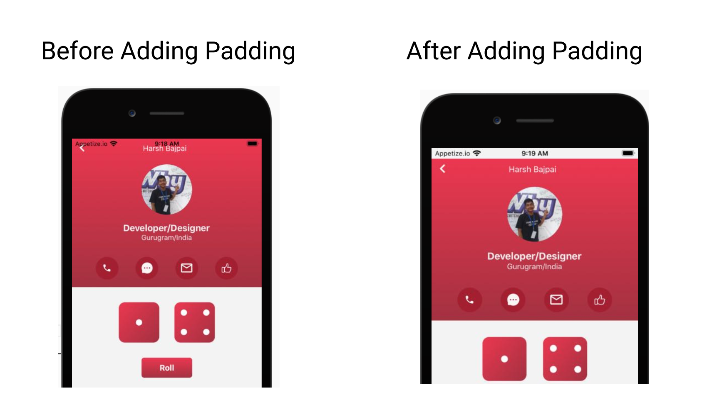
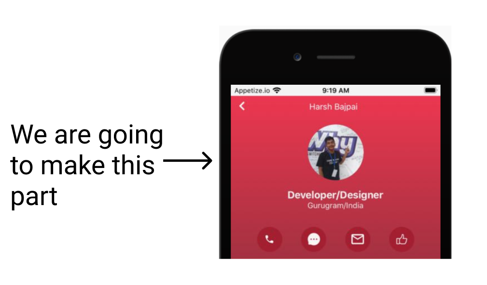
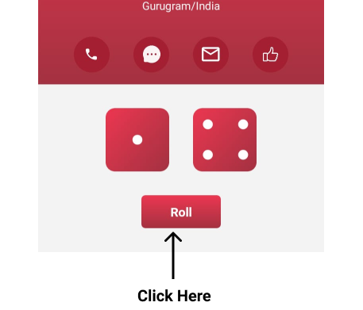

# Dice Game

In this workshop, we will be making a Dice game app with the help of React-Native. You don't require **any setup** ( yes! no setup required 🤠) to get started with this workshop!

This is what it will look like:



The above is being run on a web emulator. How to use this emulator is included in this workshop.

## Prerequisites

The workshop is for anyone familiar with:

- React
- Javascript
- CSS ( basics + [Flexbox](https://css-tricks.com/snippets/css/a-guide-to-flexbox/) )

You don't need to be a Guru in these topics, a basic understanding of them is more than enough!

## Development Environment

We will be using [Snack](https://snack.expo.io/), an online editor provided by [Expo](https://expo.io/) to make our app in this workshop!

So before moving forward let's discuss Snack!

### Why use Snack?


Snack is the perfect choice for workshops because:

- It requires no setup to get started with development in Snack!
- The device emulators run in the browser itself ( both Android and iOS )!
- You can easily share and export your Snack projects with others.
- You can test your app directly on your phone via the Expo app.


### Introduction to the interface

The below image is what Snack's interface looks like.



I have labeled the important parts of the interface. The interface is really intuitive and will not be a big issue for anyone who is not familiar with it.

### Should I run the app on my device or on an emulator?

The Snack emulators are really awesome _but sometimes they might require you to wait in a queue ( you won't be waiting for too long )_ but still if you have an Android or iOS device then use it, as it won't require you to be on a queue.



Another suggestion is to use the web view as it won't require any waiting time and once the app is developed then try it on emulators ✌️



### What is this Expo App?


Expo App is available for both Android and iOS and you can test your app made in Snack directly from it in your device ( it also has some other use-cases! ).

You just need to scan the QR code of your Snack project from your Expo app ( In case of iOS users, you can also use your in-built scanner ) to run your project on your device.


Links for Expo:

- [iOS](https://apps.apple.com/us/app/expo-client/id982107779)
- [Android](https://play.google.com/store/apps/details?id=host.exp.exponent&hl=en_IN)

## Setup

I have created a Snack template for you, it contains all the resources for making this app.

- **You need to open** [https://snack.expo.io/@harsh244/dicegame-starter](https://snack.expo.io/@harsh244/dicegame-starter) in your browser.

- **The finished project is available at [https://snack.expo.io/@harsh244/dice-game](https://snack.expo.io/@harsh244/dice-game), you can use it as help in this workshop!**

This will open a template Snack project for you. **Your setup is complete** ( I know it feels awesome as it required almost no setup 🕶️ ).


## Some Basics first!

### What is React-Native?

1. React-Native is an open-source mobile application framework created by Facebook, Inc. You can implement your interfaces in React and can use web-like CSS to style these interfaces.

2. All the components are mapped to their native components so that you get native performance in your apps.

3. All the CSS properties are camelCase meaning padding-top in react-native will be paddingTop. Some features of the web CSS aren't supported in react-native.

### What are react-native components

React-Native provides some default components like View, ScrollView, Text, etc.

You need to import them from 'react-native'

example

```js
import { View, Text } from 'react-native'
```

You can also use third-party or custom components.

### What is StyleSheet.create

It is a way of creating styles for your components in react-native.
It takes an object configuration as an argument.

Let's take an example to make it clearer.

```js
import { Text, StyleSheet } from 'react-native'

export default function Comp() {
  return <Text style={styles.headerText}>Hack Club is Awesome!</Text>
}

const styles = StyleSheet.create({
  headerText: {
    color: 'red',
    backgroundColor: 'yellow'
  }
})
```

- In the following code <Text \> has a _style prop_ which expects an object containing styles for the component.

- In react-native style properties are camelCase meaning background-color will be backgroundColor.

- So here the text color of the component will be red while the background-color will be yellow! ( I know this color choice is really bad (: ).

- To know more about these components and their properties visit [React-Native documentation](https://reactnative.dev/docs/components-and-apis0)

### What is special about App.js

- App.js is your root file and is the starting point for your app.

- So, whatever component you will return from here will be considered as the root component at the time of rendering.

Now let's get started by making a project in it ( I believe projects are the best way to learn stuff ).

## Working with App.js

Your App.js will already have some template code in it. Your code will look something like this.



1. We have made some initial imports here which include React, some react-native components ( View, ScrollView, etc) and Constants from 'expo-constants'.

2. Constants provides system information that remains constant throughout the lifetime of your app's install. It can be very helpful in designing apps ( will be more clear when I will discuss the stylesheet part ).

3. Profilecard and Gamecontainer are our two custom Components which will be used to compose our interface ( we are trying to bring modularity in our code ).

Now let's discuss about <View\> and <ScrollView\>.

### What is the difference between <View\> and <ScrollView\>

- <View\> are containers for your layout. We use Flexbox to design the layout inside them.

- They can be nested within each other. ( They are like the <div\> which are used in web development )

#### So what is this <ScrollView\>?

- <ScrollView\> is a scrollable container! All its children are in a scrollable container.

When our device goes in Landscape orientation then our display height becomes really short hence **<ScrollView\> will allow the content to be still accessible via scrolling in Landscape mode. **


### Let's talk about StyleSheet.create

Okay, so we know that react-native uses object based styling for its components.

There is a very strange thing in the StyleSheet.create function, which is:

```javascript
paddingTop: Platform.os == 'ios' ? Constants.statusBarHeight: null,
```

#### Why are we doing this here?



- Okay so in iOS devices our app's content starts from the top of the screen ( meaning the status bar is not ignored! ) so Platform.os tell us which operating system the app is running on ( Platform is made available by react-native )

- If it is **'ios'** then we give padding from the top equal to the height of the status bar.
  We use Constants.statusBarHeight for it (The padding problem doesn't exist in Android!).


## Making the Profilecard!

Okay, now we are going to make the Profilecard.



### Step1 - Open the profilecard.js file

Open profilecard.js file which is in components folder. It will already have some template code ready for you.

You should change all of my information with your information ( like name, place, etc ).

**Imp: for making your circular profile picture like mine, please use [profilepicturemaker.com](https://profilepicturemaker.com/).**

Now make your component and StyleSheet.create function look like this ( don't delete any other part of the file, just change this component and the stylesheet ):

```js
export default function Comp() {
  return (
    <>
      <LinearGradient colors={['#EC3750', '#A33140']} style={styles.gradient}>
        <View style={styles.header}>
          <Image
            source={require('../assets/icons/backicon.png')}
            style={{ width: 9.5, height: 16, marginLeft: 15 }}
          />
          <View style={styles.nameContainer}>
            <Text style={styles.nameText}>Harsh Bajpai</Text>
          </View>
        </View>

        <View style={styles.profilepicContainer}>
          <Image
            source={require('../assets/profilepic.png')}
            style={{ height: 100, width: 100 }}
          />
          <Text style={styles.title}>Developer/Designer</Text>
          <Text style={{ fontSize: 14, color: '#F3F3F3' }}>Gurugram/India</Text>
        </View>
        <View>
          <View style={styles.iconContainer}>
            {imgarr.map((image) => (
              <Image source={image} style={{ width: 45, height: 45 }} />
            ))}
          </View>
        </View>
      </LinearGradient>
    </>
  )
}

const styles = StyleSheet.create({
  gradient: { display: 'flex', flexDirection: 'column' },
  header: { marginTop: 10, flexDirection: 'row' },
  nameContainer: { position: 'absolute', width: '100%' },
  nameText: {
    color: 'white',
    textAlign: 'center',
    paddingRight: 8,
    fontSize: 15
  },
  profilepicContainer: { alignItems: 'center', marginTop: 25 },
  title: {
    fontWeight: 'bold',
    fontSize: 18,
    color: '#F3F3F3',
    marginTop: 15
  },
  iconContainer: {
    flexDirection: 'row',
    justifyContent: 'space-around',
    marginTop: 30,
    marginBottom: 15,
    paddingHorizontal: 30
  }
})
```

- This code contains a lot of CSS and React which is self-explanatory to anyone familiar with them. So, I will explain _things specific to react-native to you._

Here is an explanation of all the important things happening here:

1. <LinearGradient\> is a component from [expo-linear-gradient](https://docs.expo.io/versions/latest/sdk/linear-gradient/). It is being used to create the red gradient in the background.

2. Here the styles which are really short are written as inline styles.

Example:

```js
<Text style={{ fontSize: 14, color: '#F3F3F3' }}>Gurugram/India</Text>
```

3. We are using [map](https://developer.mozilla.org/en-US/docs/Web/JavaScript/Reference/Global_Objects/Map) method to avoid writing the same code four times:

```js
{
  imgarr.map((image) => (
    <Image source={image} style={{ width: 45, height: 45 }} />
  ))
}
```

Here we are using **imgarr** array which contains the four icons sequentially. This array is _located at the bottom_ of the profilecard.js file.

It loook like this:-

```js
const imgarr = [
  require('../assets/icons/phoneicon.png'),
  require('../assets/icons/messageicon.png'),
  require('../assets/icons/mailicon.png'),
  require('../assets/icons/likeicon.png')
]
```

This was all you needed to complete the profile section part!


## Working with the game part!

Now open your dicecontainer.js file, it already has some template code written in it.

Now let us take a look at some important imports of the file first:

```js
import Button from './button'
import randomNumGenerator from './lib/dicegenerator'
```

1. Here Button is a component and you don't need to deal with it, although if you want to see its implementation you can check it.

2. We are using this button instead of react-native's Button because this Button will give us the same appearance regardless of the OS ( react-native's Button appearance varies with the platform ).

3. randomNumGenerator will be used by us to generate a random number between 0-5. ( It will be used to generate random dice in the app ).

Now let's look at **dicearr** Array which is at the bottom of the file.

```js
const dicearr = [
  require('../assets/dice/dice-1.png'),
  require('../assets/dice/dice-2.png'),
  require('../assets/dice/dice-3.png'),
  require('../assets/dice/dice-4.png'),
  require('../assets/dice/dice-5.png'),
  require('../assets/dice/dice-6.png')
]
```

It contains an array of dice images from 1-6!

### Working with the component

Okay, now change your component and StyleSheet with the following code. ( for short styles we have used inline styles ).

```js
export default function Comp() {
  const [statearr, setStatearr] = React.useState([2, 5])

  return (
    <>
      <View>
        <View style={styles.diceContainer}>
          <Image
            source={dicearr[statearr[0]]}
            style={{ width: 80, height: 80, marginHorizontal: 15 }}
          />
          <Image
            source={dicearr[statearr[1]]}
            style={{ width: 80, height: 80, marginHorizontal: 15 }}
          />
        </View>

        <View style={styles.buttonContainer}>
          <Button
            title="Roll"
            onPress={function () {
              setStatearr([randomNumGenerator(), randomNumGenerator()])
            }}
          />
        </View>
      </View>
    </>
  )
}

const styles = StyleSheet.create({
  diceContainer: {
    display: 'flex',
    flexDirection: 'row',
    justifyContent: 'center',
    paddingTop: 30
  },
  buttonContainer: {
    flexDirection: 'row',
    justifyContent: 'center',
    paddingTop: 30
  }
})
```

Here, the following important things are happening:

1. ```js
   const [statearr, setStatearr] = React.useState([2, 5])
   ```

````

- Here we are using [useState](https://reactjs.org/docs/hooks-state.html) from React ( it is a concept of [React hooks](https://reactjs.org/docs/hooks-intro.html) ).

-  A change in the value of **statearr** will cause re-render, meaning it will update the UI, **setStatearr is used to set a new value for statearr** ( _don't do statearr=[2,4]_ ).
Its default value will be [2,5].

Now let's understand this part of the code:

```jsx
<Image source={dicearr[statearr[0]]}
 style={{ width: 80, height: 80, marginHorizontal: 15 }}/>

<Image source={dicearr[statearr[1]]}
 style={{ width: 80, height: 80, marginHorizontal: 15 }}/>
````

Here the <Image\> are being determined by **using statearr[0] and statearr[1] to determine the value of the dicearr array**.

A change in the value of statearr will result in the changing of the images.

### Button Component!

Now let's talk about the <Button\>

```jsx
<Button
  title="Roll"
  onPress={function () {
    setStatearr([randomNumGenerator(), randomNumGenerator()])
  }}
/>
```

1. It receives the Text to render as title prop. ( Here it is 'Roll' )

2. The function passed to the onPress prop will be executed when it will be pressed.

3. Here, it changes statearr array to hold two random values. ( _it is using randomNumGenerator function for it_ ).

### Done!

Yes, this was all you needed to make this app. You have completed the whole programming part.


## Run it!

Just click on the **Roll button** and see the magic!



## Next Steps!

I know it feels awesome to make it but don't stop here, Create whatever you can from this crazy trick and share it with us in the [`#ship`](https://app.slack.com/client/T0266FRGM/C0M8PUPU6) channel of [Hack Club's Slack](https://hackclub.com/slack/).


I am available on Hack Club's Slack by the username **Harsh Bajpai**, If you have any doubt or query regarding this workshop or react-native feel free to reach out to me!
