<h1 align="center"> Discord Chatbot </h1>
<p align="center">Make a discord bot which talks with you!</p>

Here's the [final code](https://repl.it/@k4u5h4L/discord-chatbot-complete).

The workshop should take about 30-40 minutes.

The video tutorial for this workshop is linked at the bottom of this workshop with the required links for documentation and resources.

## Part 1: Getting API keys!

### Setting up the Discord bot

To set up the bot, you need to visit the [Discord dev portal](https://discord.com/developers) and set up an application.
Click to the top right button to create a new application.
Keep this page open for a while, as we may be taking some stuff from here...


<!-- 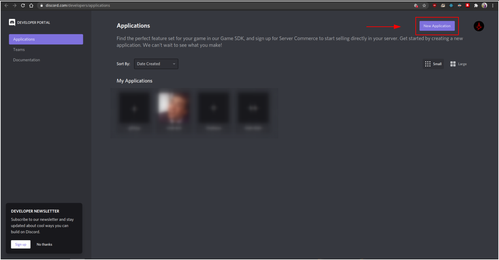 -->

Go ahead and give it a cool name! I'm going to name it as doodle-noddle, but you can name it whatever you want!


<!-- 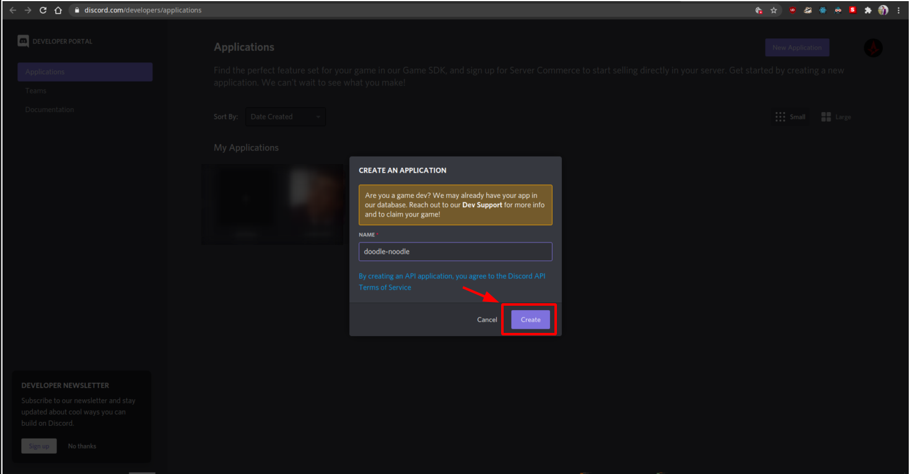 -->

Then go ahead and create the application.
Now go to the bot section in the menu on the left hand side, and add a new bot.


<!-- 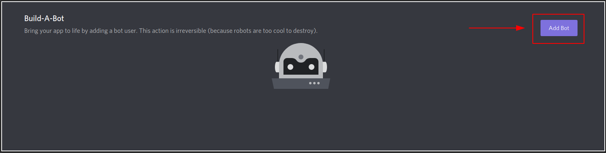 -->

If you get any formation like this, click on "yes, do it".


<!-- 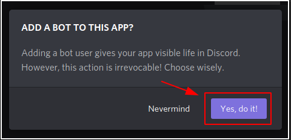 -->

Now you should be greeted with this screen. If you successfully get this, then you're good!


<!-- 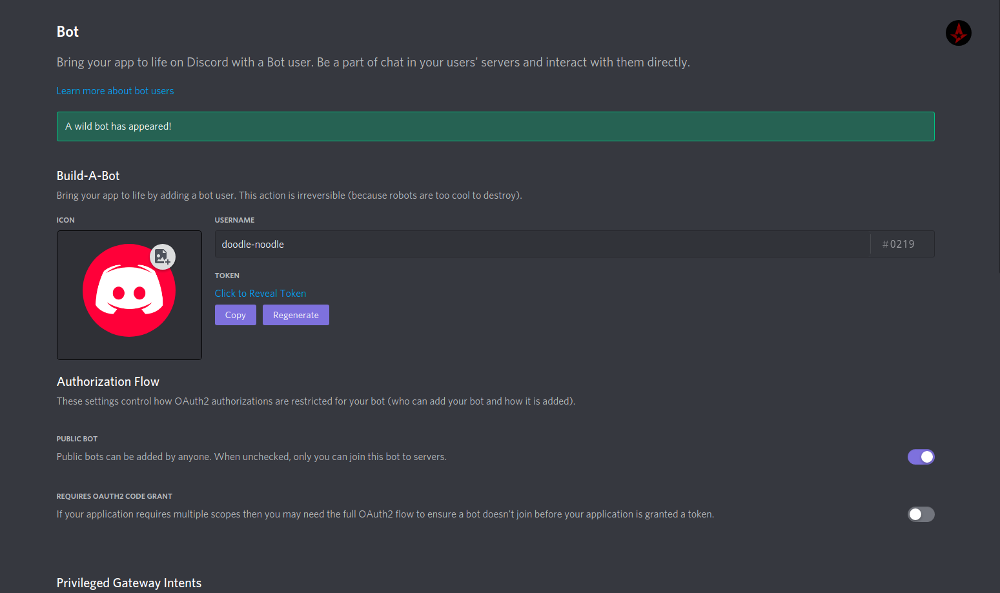 -->

<!-- Insert a celebration gif here --->

<br /><br />

<p align="center">

</p>

Now, we will add this bot to our server. For this, You need to be the admin of the server.

Assuming you have logged in to your discord account and made a server or having an exisiting server as an admin, let's proceed!

Visit [this page](https://discordapi.com/permissions.html) to set the permissions of your bot and get the link to add your bot to your server.

You will have to tick these permissions below:

- Read Messages
- Send Messages
- Embed links
- Attach Files
- Read Message History
- Mention @everyone, @here, and All Roles

Now your screen should look something like this:


<!-- 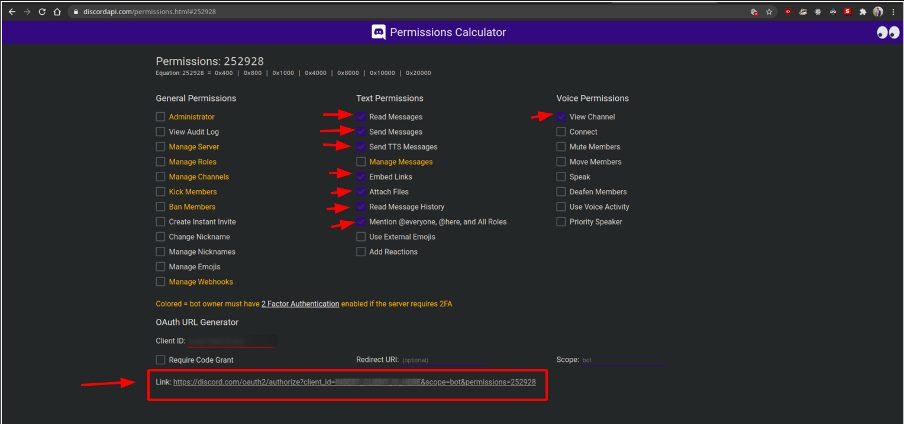 -->

Now, we need to go back to the discord dev page to get the `CLIENT ID` of your application.

So in the "General Information" tab in the menu on the left side, you need to copy your `CLIENT ID`, and paste it in the 'CLIENT ID' field in the permissions page.

After doing so, you will get a link to add your bot to your server. So go on to that link and add your bot to the server you created.

So now, we only have one thing left to do in this part. Go back to the "bot" tab and copy the `TOKEN` and keep it somewhere safe. We will be soon using it.

Whew, that's a lot of information. But don't stop just yet, we are on our way!

<!-- Insert a "whew" gif here --->
<br>
<p align="center">

</p>

### Setting up the Dialogflow agent

Now that we have successfully set up the Discord bot and saved the API token, we shall move on to set up Google's Dialogflow platform to manage all the "talking" our bot is gonna do! And you know what the best part is? You will be doing all this without writing a single line of Machine Learning code!!

Sounds exciting? Follow me to set this up too!

Visit the [Dialogflow console](https://dialogflow.cloud.google.com/) to set up the agent. Remember, you need to have a google account to be able to login.


<!-- 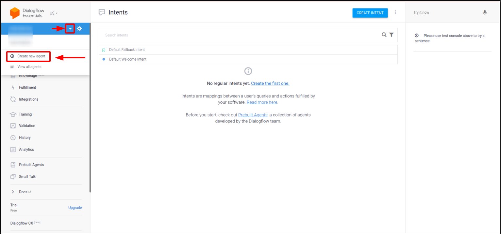 -->

Now you will have to click on this drop down menu, and create a new agent. Go ahead and name it whatever you want.
I'll call mine as doodle-noodle-agent!


<!--  -->

Now hit the Create button and wait for a few seconds for the agent to be created.

After a while, you will be greeted with this screen.


<!-- 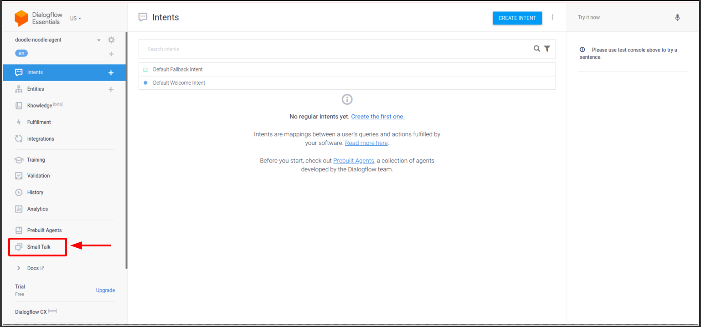 -->

Now click on the "Small Talk" tab on the menu on the left side, and go ahead and enable the small talk toggle. This is essential if you want your bot to be able to converse with you.


<!-- 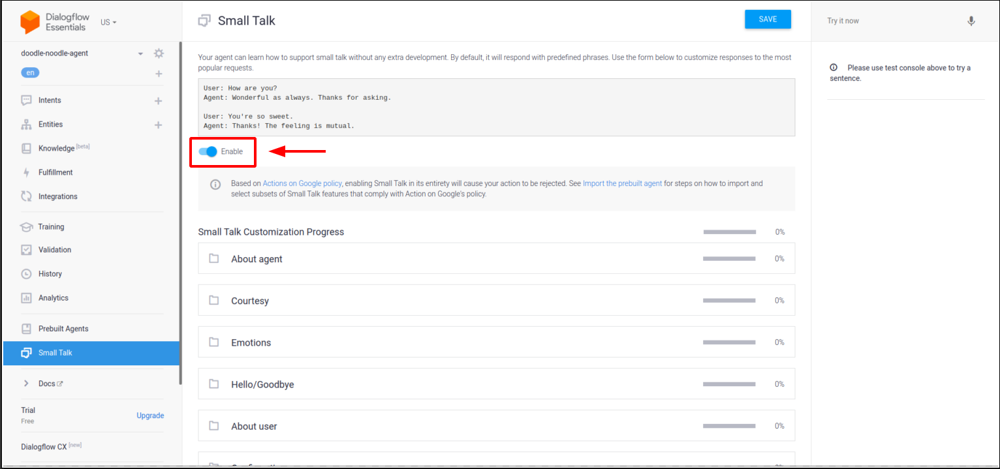 -->

Now, we need to get API keys from dialogflow just like how we did it with Discord. For this, click on the gear icon beside your agent name. This will take you to the settings pannel of agent.


<!-- 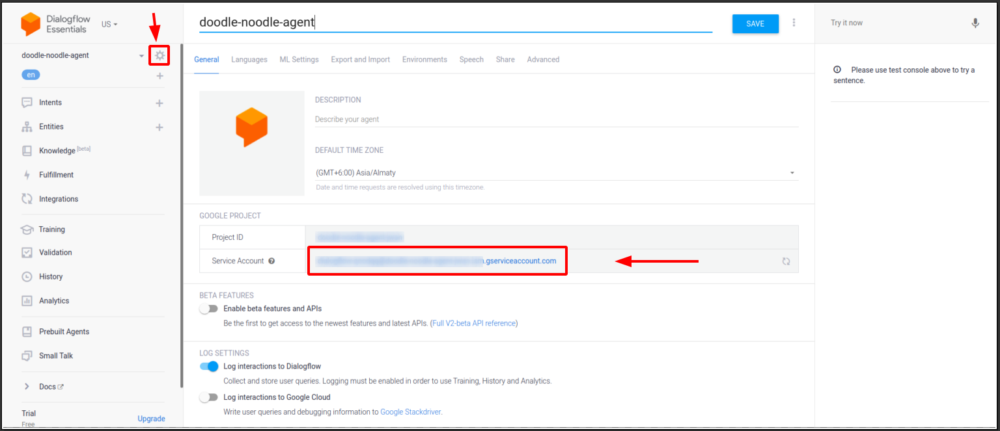 -->

Here, click on the link for the "Service Account" and open it in a new tab.


<!--  -->

Here, click on your service account down there.


<!-- 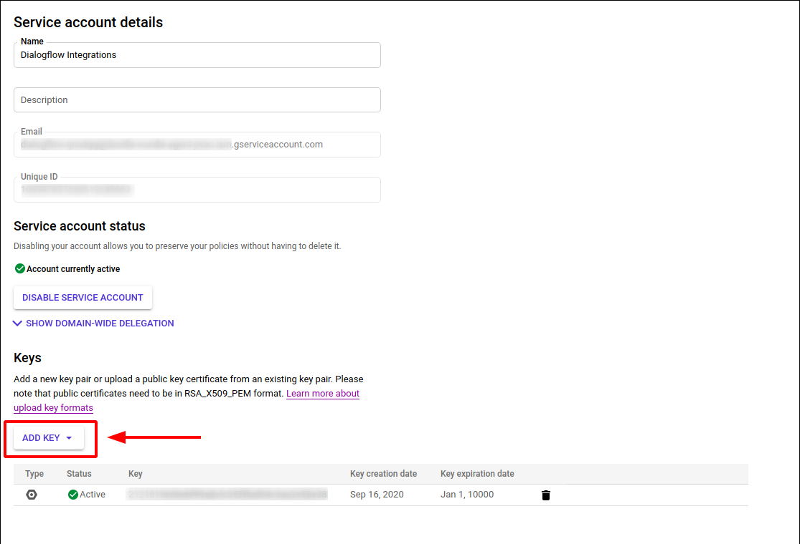 -->

Now, click on "Add Key" and create a new key in JSON format.
This should automatically get downloaded for you to your local system.

This is your API key from Dialogflow. Keep this safe, as it has private information about your dialogflow account.

Now that you have come so far, give yourself a pat on your back, because we are all set up to start coding the bot using discord.js and dialogflow APIs.

<!-- insert pat on back gif -->
<br>

<p align="center">

</p>

## Part 2: Start coding the bot!

Here, we will be using JavaScript as a programming language to code out the discord bot. I will be using code snippets from [discord.js](https://discord.js.org/) and [Node.js Dialogflow client](https://github.com/googleapis/nodejs-dialogflow#using-the-client-library) documentation. So if you're interested you can have a read before we move on!

Now let's get our hands dirty and start coding the bot!

Go ahead to [this repl link](https://repl.it/@k4u5h4L/discord-chatbot) to code out the bot online! All the packages are already installed for you there so that you can directly dive into the code!

Go on and fork the repl.

Okay so now in the repl site, you need to create a file called `.env` in the working directory, and paste in the `TOKEN` value. Eg - suppose my token is 12345, it will look like

```
DISCORD_TOKEN=12345
```

Avoid any quotes. It should just be the name and value. Also don't forget to add in your project ID in the `.env` file as well. You will find it in the json file you downloaded.

So in the end your `.env` file will look like this (assuming my project ID is qwerty):

```
DISCORD_TOKEN=12345
PROJECT_ID=qwerty
```

One last thing, create a new file called `config.json` and paste all the contents of the json file you donwloaded from Dialogflow.

All the imports are already done for you! So we shall get to start coding the logic now.

This is what [discord.js](https://discord.js.org/) documentation has for us. I have taken the liberty of showing you all the code we need for this bot.

```js
const Discord = require("discord.js");
const client = new Discord.Client();

client.on("ready", () => {
  console.log(`Logged in as ${client.user.tag}!`);
});

client.on("message", (msg) => {
  if (msg.content === "ping") {
    msg.reply("Pong!");
  }
});

client.login("token");
```

The above code spins up a simple bot which replies "Pong!" if soneone texts "ping"!

Here we are first importing the packages required, and creating a client. Once the client is ready, we are logging that the client is ready.

We will see the code for DIalogflow, again, taken for [their documentation](https://github.com/googleapis/nodejs-dialogflow#using-the-client-library).

```js
const dialogflow = require("@google-cloud/dialogflow");
const uuid = require("uuid");

async function runSample(projectId = "your-project-id") {
  // A unique identifier for the given session
  const sessionId = uuid.v4();

  // Create a new session
  const sessionClient = new dialogflow.SessionsClient();
  const sessionPath = sessionClient.projectAgentSessionPath(
    projectId,
    sessionId
  );

  // The text query request.
  const request = {
    session: sessionPath,
    queryInput: {
      text: {
        // The query to send to the dialogflow agent
        text: "hello",
        // The language used by the client (en-US)
        languageCode: "en-US",
      },
    },
  };

  // Send request and log result
  const responses = await sessionClient.detectIntent(request);
  console.log("Detected intent");
  const result = responses[0].queryResult;
  console.log(`  Query: ${result.queryText}`);
  console.log(`  Response: ${result.fulfillmentText}`);
  if (result.intent) {
    console.log(`  Intent: ${result.intent.displayName}`);
  } else {
    console.log(`  No intent matched.`);
  }
}
```

We will modify the function to send a request to Dialogflow everytime a user sends a text. So for this, we need to pass in the user's message as a parameter to the function. We'll first start by renaming the function to `replyMsg`.

Here's the code included with the modifications:

```js
async function replyMsg(textMsg) {
  projectId = process.env.PROJECT_ID;
  // A unique identifier for the given session
  const sessionId = uuid.v4();

  // Create a new session
  const sessionClient = new dialogflow.SessionsClient();
  const sessionPath = await sessionClient.projectAgentSessionPath(
    projectId,
    sessionId
  );

  // The text query request.
  const request = {
    session: sessionPath,
    queryInput: {
      text: {
        // The query to send to the dialogflow agent
        text: textMsg,
        // The language used by the client (en-US)
        languageCode: "en-US",
      },
    },
  };

  // Send request and log result
  const responses = await sessionClient.detectIntent(request);
  const result = responses[0].queryResult;
  console.log(`Query: ${result.queryText}`);

  return await result.fulfillmentText;
}
```

So what's happening here?

<!-- insert thinking gif -->
<br>

<p align="center">

</p>

Let me tell you!

We are hard coding the `projectId` as it won't change, at least for our bot, from an environment variable we just set up (remember the .env file?).

The package `uuid` generates a new string everytime it's method is called. So we are using it for a session ID required by dialogflow.

Then we are creating session clients with the `projectId` and the `sessionId` got from `uuid`.

Then comes the `request` object which will be sent to Dialogflow to be interpreted. You specify the text from the user here in the `text` attribute so that the Dialogflow agent can read it and send a corresponding reply.

Once that reply happens, we will capture that in a variable called `responses`. From here we will log the `queryText` which is the text what the user sent, and return the `fulfillmentText` which is a response to that text got back from Dialogflow.

Whew, that's a lot to digest huh? But stay with me, we're almost on the way to complete this!

<hr />

Now what we need to do is integrate both Dialogflow and discord.js to make a chatbot. For this, you only need to change the function when a message reaches the bot. Instead of sending "Pong!", we will send the text got from DIalogflow.

```js
client.on("message", (message) => {
  if (!message.author.bot) {
    replyMsg(message.content).then((res) => {
      console.log(res);
      message.reply(res);
    });
  }
});
```

So here, we are first checking if the user sending this message is not a bot. If you don't include this condition, then there may be an infinite loop where the bot replies to itself. So keep it for safety.

After the checking, you relay the message sent from the user to DIalogflow. And when the response is received by Dialogflow, you are sending it back to the user.

It's all coming together now eh?

<!-- insert coming together gif -->
<br>

<p align="center">

</p>

## To try it out!

Now to finally try out the bot and see if it actually works!

Check your code if all your variables and JSON api files are correct and updated. If all looks good, hit the RUN button, and wait for the `Bot ready!` message to be displayed. If this is displayed, then your discord API is working!

Now, try sending a message in the server.

This is what I received from the bot when i tried to talk with it


<!-- 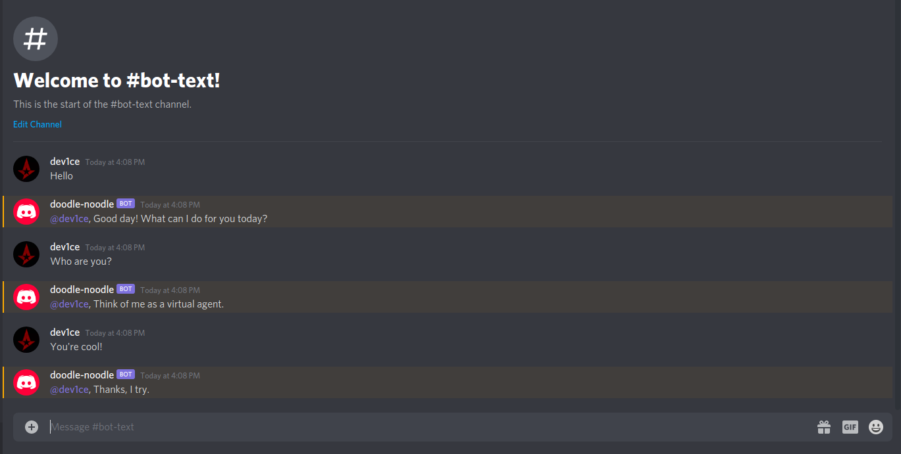 -->

<!-- insert complete gif -->

<br><br>

<p align="center">

</p>

It's awesome isn't it? You can now talk with your virtual agent you created in this workshop!

## Going forward

You can go back to your dialogflow console and customise your bot even more!

I will leave all reference links below so that it will be easy for you to find it in one place

- Bot: https://discord.js.org/
- Authentication: https://cloud.google.com/docs/authentication/getting-started
- Using Dialogflow: https://github.com/googleapis/nodejs-dialogflow#using-the-client-library
- Dialogflow console: https://dialogflow.cloud.google.com/
- Discord developers portal: https://discord.com/developers
- Bot permissions calculator: https://discordapi.com/permissions.html

## Note:

- If I may have disclosed any API keys in this workshop, please don't use the same keys since I have already revoked them and they don't work anymore. You have to visit those sites and get registered to get your hands on these keys.

- To those of you people who felt difficult following this workshop, we got your back! We have an extensive youtube video covering topics from the beginning to the very end. So just click on on the below picture if you're confused!<br><br>

    <!-- <iframe width="560" height="315" src="https://www.youtube.com/embed/FwIi2Z-7fmI" frameborder="0" allow="accelerometer; autoplay; clipboard-write; encrypted-media; gyroscope; picture-in-picture" allowfullscreen></iframe> -->

  [](https://www.youtube.com/watch?v=FwIi2Z-7fmI)
