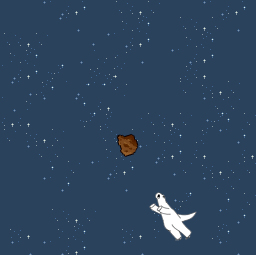
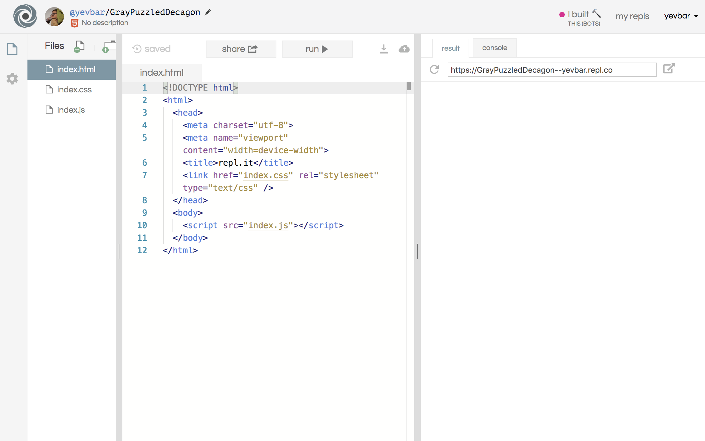
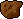
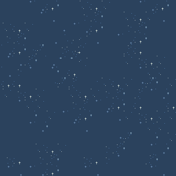
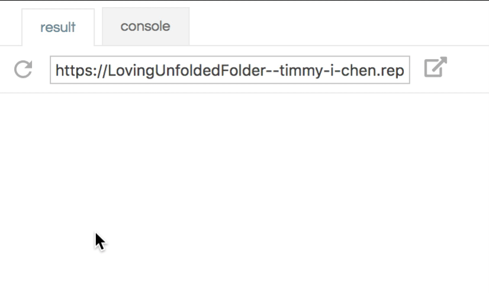

# Dodge

| What you'll build       |
| ----------------------- |
|  |

Links to a live demo and the final code below. This workshop should take around 1 hour and 15 minutes.

[**Live Demo**](https://dodge--prophetorpheus.repl.co)

[**Final Code**](https://repl.it/@prophetorpheus/dodge)

---

In this workshop, we're going to build a simple, yet addictive, game using JavaScript.

Previously when we've done web development, we've used HTML elements and things of that ilk to build what we see in the browser. Today we're going to do things a little differently and build our game using a new coding language, JavaScript, along with two great libraries called p5.js and p5.play.

[p5.js](http://p5js.org/) is a library for making stuff in conjunction with the HTML canvas element. It is nothing more than JS code written to make commonly-desired functionality much more accessible. It is a JS port of Processing, a software for making pictures and visuals with code.
[p5.play](http://p5play.molleindustria.org/) is another library, which itself uses p5.js, and adds easy-to-use functionality specifically tailored towards building games.

## Table of contents:

- [Part I: Setup](#part-i-setup)
- [Part II: The External JS File](#part-ii-the-external-js-file)
- [Part III: Publishing and Sharing](#part-iii-publishing-and-sharing)
- [Part IV Hacking](#part-iv-hacking)
- [Attributions](#attributions)

## Part I. Setup

Just as we've done previously, we're going to be building this project in Repl.it.

Go ahead and spin up an [HTML/CSS/JS Repl](https://repl.it/languages/html) before continuing.



Our project's code is going to be divided into two files: `index.html` (the HTML code) and `index.js` (the JavaScript code). The HTML file will tell the browser about the game's existence and how to display it on the page. The JavaScript file will tell the browser how to actually run the game.

First things first, clear the contents of your `index.html` and put the following in its place

```html
<!DOCTYPE html>
<html>
<head>
  <title>Dodge</title>
</head>
<body>
  <script src="https://cdnjs.cloudflare.com/ajax/libs/p5.js/0.6.1/p5.js"></script>
  <script src="https://cdn.rawgit.com/molleindustria/p5.play/42cd19c3/lib/p5.play.js"></script>
</body>
</html>
```

The two `script` tags inside of `body` tell the browser to load p5.js and p5.play, which we'll need to run our game.
 
Great, so now we have `index.html` and `index.js`. `index.html` is loading p5.js and p5.play, but it doesn't know about `index.js` yet. Let's change that by adding `<script src="index.js"></script>` to the **body** in `index.html`, beneath the other `script` tags. `index.html` should now look like this:

```html
<!DOCTYPE html>
<html>
<head>
  <title>Dodge</title>
</head>
<body>
  <script src="https://cdnjs.cloudflare.com/ajax/libs/p5.js/0.6.1/p5.js"></script>
  <script src="https://cdn.rawgit.com/molleindustria/p5.play/42cd19c3/lib/p5.play.js"></script>
  <script src="index.js"></script>
</body>
</html>
```

Now, save using the shortcut <kbd>Command</kbd>+<kbd>s</kbd> or <kbd>Ctrl</kbd>+<kbd>s</kbd> and open up live preview by clicking `Preview > Live Preview`. Right now it's just a blank page, but we'll be changing that soon enough ;)

## Part II. The External JS File

### Set Up

p5.js works by automatically calling two special functions: `setup()` and `draw()` to create the visuals on your webpage. We'll be writing our own code in these functions, so that p5.js can then run our code.

Double-click `index.js` to open, and add these functions (type them out, don't copy and paste!).

```js
function setup() {
}

function draw() {
}
```

If you save and refresh the preview in Cloud9, you'll notice nothing has changed.

How these functions work is that `setup()` is run only once, upon page load. `draw()` on the other hand, is run repeatedly after `setup()` finishes, and in this way, provides the basis for any animation or interaction you see in your project.

Let's add something for `setup()` to set up.

```js
function setup() {
  createCanvas(250, 250);
}
```

[`createCanvas()`](http://p5js.org/reference/#p5/createCanvas) is a function that takes two arguments (two numbers for width and height, respectively) and creates an HTML canvas element (i.e., the thing that will house your project) of that size.

Now we'll add something for the `draw()` function to do as well. Let's start by having it paint the background a dark blue color every frame.

```js
function draw() {
  background(0, 0, 100);
}
```

`background()` is a function that sets the appearance of the background. Here we're using three arguments to define the red, green, and blue (RGB) values of a color, which will be the background color of our canvas. You can use `background` in some more ways, though, which are detailed in documentation [here](https://p5js.org/reference/#/p5/background).

If you save and refresh live preview, you'll see that I've chosen this dark blue. You can experiment with the RGB values and choose your own background color.

Now that we've finished setting up, it's time to add the most important thing to our game: the player.

### Adding the Player

So where should we create the player? Well, we definitely want to have it when we load the game, so it might make sense to put player creation in `setup()`. Let's first declare the existence of the player at the top of the file with:

```js
var player;
```

This line creates a variable named "player." We'll be able to store something in this variable and refer to it later. Having this outside of the other functions will allow us to refer to the variable from either function, and anywhere else in the document. This is called a global variable, because it's accessible from everywhere.

And now let's define it into existence. We'll need to decide where to place it, and how big it is. How about at the bottom, in the middle of the canvas, and say, a 50x50 square?

```js
function setup() {
  createCanvas(250, 250);
  player = createSprite(width/2, height, 50, 50);
}
```

[`createSprite()`](http://p5play.molleindustria.org/docs/classes/p5.play.html#method-createSprite) makes a placeholder for an image (meaning you can customize with your own!), and takes four arguments (horizontal and vertical coordinates, and width and height of sprite, respectively).

We've placed our player in the horizontal center of the canvas (width/2), and at the bottom (height). `width` and `height` are variables that were automatically set for us by p5.js when we created the canvas, and they refer to the width and the height of the canvas, of course!

Here it might make sense to mention that the coordinate system of p5.js is not like the traditional one you may have seen in your maths classes. p5.js has its origin (0, 0) at the upper left corner of the canvas, with the x and y values increasing rightward and downward.

Okay, so it looks like we've added our player---wait. No, it doesn't. Turns out that while we've created a player, we haven't shown it on our canvas anywhere.

Fortunately, the p5.play library also offers a really simple function for displaying sprites, `drawSprites`. Let's go ahead and add this to the `draw` function.

```js
function draw() {
  background(0, 0, 100);
  drawSprites();
}
```

Save and refresh live preview to see your player!

It looks like it's cut off, though. Guess we have to adjust the y-position. Let's modify that in our initial creation of the player, in `setup()`.

```js
function setup() {
  createCanvas(250, 250);
  player = createSprite(width/2, height-25, 50, 50);
}
```

Now we've bumped the y-position up by half the sprite's height, and it sits at the bottom of our canvas.

### Adding Motion

It's not very compelling having a static player just sitting there. Why doesn't it move?

Oh yes, because we haven't added that code yet. We will do that now.

Our sprite has a property called `position`, and we can shift the position in order to create motion. The `position` property itself has two properties: `x` and `y`, which describe placement along the x and y axes, respectively. Since we want to move the player horizontally, we'll be changing the x value. To do this, we can add this line to `draw()`:

```js
player.position.x = player.position.x + 1;
```

So why does the player keep moving, if we are only changing the x-position by 1? Well, you'll remember that the `draw()` function is called repeatedly, so each time, the x-position is set to 1 greater than what it was when the `draw()` function was called last.

If you play around with this, you'll note that substituting `1` with a larger number will make the player move faster to the right. And what happens if you substitute `1` with a smaller number? 0.5, or -1?

Now that we've introduced motion into our game, it's time to put some restrictions on that motion. For example, we don't want our player to always be moving (only when we tell it to!), and we don't want it to move off the screen entirely.

### Adding Controls

We only want the player to move when we press the controls. p5.js gives us a way to detect when keys are being pressed, namely with the function `keyDown()`. This function takes an argument that represents a key. For our purposes, we'll be needing `LEFT_ARROW` and `RIGHT_ARROW`, which are [`keyCodes`](http://p5js.org/reference/#p5/keyCode) preset by p5.js to correspond to the left and right arrow keys, respectively.

Let's wrap the line we just wrote, about incrementing x-position by 1, in a conditional, so that it only happens on the condition that the right arrow key is pressed:

```js
function draw() {
  background(0, 0, 100);
  drawSprites();

  if (keyDown(RIGHT_ARROW)) {
    player.position.x = player.position.x + 1;
  }
}
```

And we'll have corresponding behavior assigned to the left arrow key, except that we'll decrement the position by 1. Place this below the previous conditional:

```js
function draw() {
  background(0, 0, 100);
  drawSprites();

  if (keyDown(RIGHT_ARROW)) {
    player.position.x = player.position.x + 1;
  }

  if (keyDown(LEFT_ARROW)) {
    player.position.x = player.position.x - 1;
  }
}
```

### Keeping the Player within Bounds

Though we've given our player the freedom to move, we don't want the player to move off the canvas, because then we won't be able to see it.

We'll update our code to prevent the player's x-position from going past the limits of the screen, i.e., it should never dip below 0, or above width. We'll add this new condition to our conditional, using the "and" operator (`&&`):

```js
// This replaces the old keyDown(RIGHT_ARROW) code

if (keyDown(RIGHT_ARROW) && player.position.x < width) {
  player.position.x = player.position.x + 1;
}
```

There, that should keep it from moving unless there's space to move. Here, we've added an additional condition to move. Now, in order for the player to move rightward, not only must the right arrow key be pressed (`keyDown(RIGHT_ARROW)`), but also the current x-position must be less than a certain amount (`player.position.x < width`). If either condition is not satisfied, the player will not move.

We'll add the corresponding one for moving leftward.

```js
// This replaces the old keyDown(LEFT_ARROW) code

if (keyDown(LEFT_ARROW) && player.position.x > 0) {
  player.position.x = player.position.x - 1;
}
```

But what's this? Looks like we're off by half the player width again. For those of you who avoided this, props for paying attention. The foreshadowing for this was in our creation of the player. We set the initial position there, and since passing it the initial x-position of `width/2` placed it directly in the center, that was a hint that the sprite's position coordinate is in its center, and the reason why we have to offset by half the player width for both boundaries.

So we'll make changes accordingly:

```js
if (keyDown(RIGHT_ARROW) && player.position.x < (width-25)) {
  player.position.x = player.position.x + 1;
}

if (keyDown(LEFT_ARROW) && player.position.x > 25) {
  player.position.x = player.position.x - 1;
}
```

And the `draw()` function should look like this now:

```js
function draw() {
  background(0, 0, 100);

  if (keyDown(RIGHT_ARROW) && player.position.x < (width-25)) {
    player.position.x = player.position.x + 1;
  }

  if (keyDown(LEFT_ARROW) && player.position.x > 25) {
    player.position.x = player.position.x - 1;
  }

  drawSprites();
}
```

### Adding the Enemy

Now we add enemy sprite. This is like how we added the player sprite. First we declare it (again, outside of our two functions), and then we use `createSprite()` to actually create it. All we have to do now is decide the size and position of our enemy.

```js
var enemy;

function setup() {
  createCanvas(250, 250);
  player = createSprite(width/2, height-25, 50, 50);
  enemy = createSprite(width/2, 0, 10, 30);
}
```

And to display it, guess what? That's already taken care of by our familiar friend, `drawSprites()`.

### Moving the Enemy

Much like how we made the player move by changing its position incrementally, we'll modifying the position of the enemy within the `draw()` function.

Let's make it come towards the player, and have it drop down to the bottom of the canvas:

```js
if (keyDown(LEFT_ARROW) && player.position.x > 25) {
  player.position.x = player.position.x - 1;
}

enemy.position.y = enemy.position.y + 1;

drawSprites();
```

Instead of modifying `position.x`, we're modifying `position.y`, because we want the enemy to move vertically. We're incrementing the value, because we want the position to move downward. Remember, in the coordinate system in p5.js, the y values increase in the downward direction.

I'm going to make my enemy a bit faster than my player, by incrementing by 3, instead of 1.

Now our code looks like this:

```js
function draw() {
  background(0, 0, 100);

  if (keyDown(RIGHT_ARROW) && player.position.x < (width-25)) {
    player.position.x = player.position.x + 1;
  }

  if (keyDown(LEFT_ARROW) && player.position.x > 25) {
    player.position.x = player.position.x - 1;
  }

  enemy.position.y = enemy.position.y + 3;

  drawSprites();
}
```

Let's check out what we've got. Looks great, except that the enemy is a pretty minor threat if it only shows up once and then leaves the canvas forever. We're gonna have to bring it back to the top once it passes the bottom of the canvas. We can set up a check for when the y-position becomes greater than the height of the canvas, and when that happens, we will set the y-position to 0, so that it reappears at the top.

```js
enemy.position.y = enemy.position.y + 3;

if (enemy.position.y > height) {
  enemy.position.y = 0;
}

drawSprites();
```

If we add this right under the line where we increment the position, we can see that now the enemy forms a sort of dashed barrier. This isn't very exciting, as we don't have to do much dodging. We could just leave our player in one spot and always avoid the enemy. To make things more interesting, we'll reset the x-position of the enemy each time it moves past the bottom. And to make it even more interesting, we'll randomize this value. So now there will be no premeditated escape possible!

We can make use of the function `random()`, provided for us by p5.js. `random()` is a neat function that can accept different numbers of arguments. You can check out its documentation [here](http://p5js.org/reference/#p5/random).

```js
enemy.position.y = enemy.position.y + 3;

if (enemy.position.y > height) {
  enemy.position.y = 0;
  enemy.position.x = random(5, width-5);
}

drawSprites();
```

For our purposes we are passing in two numerical arguments to `random()`, with which it will give us a random value between the two numbers. Thanks to our previous run-ins with dealing with the edges of the canvas, we've experienced enough to know that we need a 5-pixel buffer on each side.

Bam! Our enemy now shows up randomly across the top of the canvas! And drops down like bullets onto our player who is forced to frantically dodge!! Perfect!

### Collision

Well, if you've failed to dodge the enemy at least once, you'll realize that the player is not forced to frantically dodge after all... the enemy doesn't kill the player when they collide.

Let's make it a real threat, by recognizing when the enemy and player collide. p5.play provides the `overlap()` method on our sprites for doing just that.

```js
function draw() {
  if (enemy.overlap(player)) {
    gameOver();
  }

  background(0, 0, 100);

  // ...the rest of the draw function
```

This is our lose condition. Now we can punish the user for losing in this `gameOver()` function, which we will now create.

### Game Over

Even though it may feel like we've been writing all of our code in these two special p5.js functions to make stuff in the canvas, we shouldn't forget that we are still just writing JavaScript. So let's define our own function, `gameOver()`, the way we would any other JS function. We'll place it underneath the `draw()` function.

```js
function draw() {
  // ...the draw function
}

function gameOver() {
}
```

And let's display a game over screen.

```js
function gameOver() {
  background(0);
  textAlign(CENTER);
  fill("white");
  text("Game Over!", width/2, height/2);
}
```

We're drawing a background for our game over screen, and then placing text over it. I'm sure you can guess what `textAlign(CENTER)` does, but [here's the documentation](http://p5js.org/reference/#p5/textAlign) for more detail. We've inserted the text "Game Over!" at the center of the screen using [`text()`](http://p5js.org/reference/#/p5/text). We run `fill("white")` before calling the `text()` function to tell p5 to draw the text as white.

Hm, looks like the `draw()` function just keeps on drawing the game, even after the game ends.

How are we going to get our `draw()` function to stop displaying our game, and instead display our game over screen for more than a fraction of a second?

Well, one way is to split it into two modes: game over, and game not over, and say "if the game has ended, then show game over screen, otherwise, show the gameplay screen," and we can do this with a flag that keeps track of whether or not the game has ended.

Let's add in a flag, initialize it in `setup()`, and edit our `draw()` function. We'll also be exchanging out calling `gameOver()` directly when the enemy and player collide for a line that toggles the flag instead. That is, we'll delete `gameOver()` from our `if` block and instead switch the flag's value from `false` (game is not over) to `true` (game is over).

```js
var isGameOver;
// ...other variables

function setup() {
    isGameOver = false;
    // ...the rest of the setup function
}

function draw() {
    if (isGameOver) {
        gameOver();
    } else {
        if (enemy.overlap(player)) {
            isGameOver = true;
        }
        // ...the rest of the draw function
    }
}
```

We'll initialize this variable with the value `false`, because the game is not yet over at the beginning. Then we'll set up a conditional in `draw()`, to check if the game is over, in which case we'll run `gameOver()`. In the `else` block, we'll put what we've written for gameplay so far. Remember to change the body of the conditional that checks for collision. We want to update the flag, instead of calling `gameOver()` directly. By updating the flag, we're redirecting the `draw()` function to the game over screen, so to speak.

Great! It seems to be working nicely now. But how can we allow the player to try again?

### Restart Game

Let's have the user be able to restart the game by clicking the canvas upon seeing the game over screen.

First, we have to let the user know that this is an available option! We'll use the `text()` function, and instruct the user to click the canvas to restart the game. Let's add a line to the game over screen.

```js
function gameOver() {
  background(0);
  textAlign(CENTER);
  fill("white");
  text("Game Over!", width/2, height/2);
  text("Click anywhere to try again", width/2, 3*height/4);
}
```

And second, we have to detect the user's click and restart the game on detection.

p5.js has a handy mechanism for this! There is a built-in function that will execute when a click is registered on the canvas, called [`mouseClicked`](http://p5js.org/reference/#p5/mouseClicked). We just have to define the body of this function and specify what to do when the user clicks.

```js
function gameOver() {
  background(0);
  textAlign(CENTER);
  fill("white");
  text("Game Over!", width/2, height/2);
  text("Click anywhere to try again", width/2, 3*height/4);
}

function mouseClicked() {
}
```

Well, we want to draw the gameplay again, which means telling the `draw()` function to switch modes. We can do this easily by setting `isGameOver` back to `false`.

```js
function mouseClicked() {
  isGameOver = false;
}
```

Hmm, why does the canvas display the game only for a moment before switching back to the game over screen?

Aha! Our player and enemy are still intersecting, because we never reset the positions!

```js
function mouseClicked() {
  isGameOver = false;
  player.position.x = width/2;
  player.position.y = height-25;
  enemy.position.x = width/2;
  enemy.position.y = 0;
}
```

There, that should do it.

### Covering Our Bases

What happens if we're in the middle of playing and accidentally click? The player and enemy suddenly teleport to the initial position. That's no good. We should only reset the game if the game has already ended, i.e., if `isGameOver` is true.

```js
function mouseClicked() {
  if (isGameOver) {
    isGameOver = false;
    player.position.x = width/2;
    player.position.y = height-25;
    enemy.position.x = width/2;
    enemy.position.y = 0;
  }
}
```

Now we're in business. Mouse clicks will only reset the game if the game has ended, i.e., only on the game over screen.

### Spicing it Up

Let's make Dodge beautiful. We're going to bring the game from looking like this:


To looking like this:


#### Adding Images

To start, let's customize the game with images.

We're providing the following images and have already uploaded them to an image host, giving us a URL to load the images from in our code.

<br/>

| **Player**                               |
| ---------------------------------------- |
|              |
| `https://i.imgur.com/N5uCbDu.png`        |

<br/>

| **Enemy**                                |
| ---------------------------------------- |
|                     |
| `https://i.imgur.com/OdL0XPt.png`        |

<br/>

| **Background**                           |
| ---------------------------------------- |
|                   |
| `https://i.imgur.com/aKQOg3G.png`        |

<br/>

p5.js has a function called [`loadImage()`](http://p5js.org/reference/#p5/loadImage) that takes URL of an image as an argument and gives us a loaded image ready to be used. p5.play sprites have the method [`addImage()`](http://p5play.molleindustria.org/docs/classes/Sprite.html#method-addImage) that we can give a loaded image to assign it to the sprite.

In addition to `setup()` and `draw()`, p5.js has a special function called `preload()`, which is run right when the page loads before `setup()`. `preload()` is generally used to load images and other resources (like sounds) into the game. Go ahead and declare `preload()` right before the `setup()` function.

```js
// ...the rest of the variables
var enemy;

function preload() {
}

function setup() {
  // ...the rest of the setup function
}
```

#### Customizing the Player and the Enemy

Let's start by making some variables to hold our player image and our enemy image. Create these right below where we declared our `player` and `enemy` variables at the top of the file.

```js
var player;
var playerImage;
var enemy;
var enemyImage;
```

Now let's load an image into `playerImage` in `preload()`.

```js
function preload() {
  playerImage = loadImage("https://i.imgur.com/N5uCbDu.png");
}
```

...and do the same with `enemyImage`.

```js
function preload(){
  playerImage = loadImage("https://i.imgur.com/N5uCbDu.png");
  enemyImage = loadImage("https://i.imgur.com/OdL0XPt.png");
}
```

Add the loaded images to the `player` and `enemy`, right under where we create the sprites in `setup()`.

```js
// in the setup function...
player = createSprite(width/2, height-25, 50, 50);
player.addImage(playerImage);
enemy = createSprite(width/2, 0, 10, 30);
enemy.addImage(enemyImage);
```

When we add an image to a sprite, the sprite's width and height is changed to match the image's. Because we're loading our `player` sprite's image right after we create the sprite, we don't need to worry about the sprite's initial width and height. Let's just go ahead and set them to zero.

```diff
// in the setup function...
-player = createSprite(width/2, height-25, 50, 50);
+player = createSprite(width/2, height-25, 0, 0);
```

Let's change the `enemy`'s placeholder width and height to those of the actual `enemyImage` too.

```diff
// in the setup function...
-enemy = createSprite(width/2, 0, 10, 30);
+enemy = createSprite(width/2, 0, 0, 0);
```

We were previously setting the player sprite's initial y coordinate to half of the sprite's width away from the bottom of the screen. Now that we're using an image instead of a placeholder square, we can replace `25` with half of the player image's height.

```diff
// in the setup function...
-player = createSprite(width/2, height-25, 0, 0);
+player = createSprite(width/2, height-(playerImage.height/2), 0, 0);
```

We're also going to want to make that same change in the `mouseClicked()` function.

```diff
// in the mouseClicked function
-player.position.y = height-25;
+player.position.y = height-(playerImage.height/2);
```

Let's not forget our bounds! Though our `player` sprite is just about 50 pixels wide, this will not always be the case with different images. Let's set our bounds to `(playerImage.width/2)` in the `draw()` function.

```js
// in the draw function...
if(keyDown(RIGHT_ARROW) && player.position.x < (width - (playerImage.width/2))){
  player.position.x += 2;
}

if(keyDown(LEFT_ARROW) && player.position.x > (playerImage.width/2)){
  player.position.x -= 2;
}
```

Always code defensively!

#### Customizing the Background

And, finally, for the background. Go ahead and declare a new variable, `backgroundImage`, at the top of the file and load an image into it in `preload()`.

```js
var enemyImage;
var backgroundImage;

function preload() {
  enemyImage = loadImage("https://i.imgur.com/OdL0XPt.png");
  backgroundImage = loadImage("https://i.imgur.com/aKQOg3G.png");
  // ...the rest of the preload function
}
```

Now, go ahead and replace our existing `background()` call in `draw()` with `background(backgroundImage)`, to tell p5 to use an image for the background.

```diff
// in the draw function...
-background(0, 50, 100);
+background(backgroundImage);
```

Final thing: notice that the background image is 256 by 256 pixels, but the canvas is 250 by 250 pixels. Go ahead and change this to improve the look of the background image.

```diff
function setup() {
- createCanvas(250, 250);
+ createCanvas(256, 256);
  // ...the rest of the setup function
}
```

#### Rotating the Enemy

In GIF of what we're aiming for, you'll notice that the asteroid (the `enemy`) is spinning.


This is actually quite easy to implement using p5.play. The [`Sprite`](http://p5play.molleindustria.org/docs/classes/Sprite.html) class in p5.play has an attribute called [`rotationSpeed`](http://p5play.molleindustria.org/docs/classes/Sprite.html#prop-rotationSpeed), which we can set to have p5.play rotate the sprite every time `draw()` is called.

```js
// in the setup function...
enemy.addImage(enemyImage);
enemy.rotationSpeed = 4.0;
```

Your game should now look pretty much identical to our target GIF. Rock on :punch:.

Feel free to customize the enemy's rotation speed to make it faster/slower!

## Part III. Publishing and Sharing

You're done, yay! The game you made is live at the URL above the preview in the editor:



Don't forget to share a link to your beautiful creation on the Slack on the [`#shipit`](https://hackclub.slack.com/messages/shipit) channel!

## Part IV. Hacking

- Isn't it a bit sad that there's a lose condition, but no win condition? Not even a score counter for number of enemies dodged?
- Speaking of that, what if the objective of the game was to catch all the enemies instead of dodging them?
- What if the enemies didn't drop straight down, but instead bounced around the screen? Hah! Good luck dodging that!
- What if there were levels in which both the enemies and player got faster and faster?
- Did you find it hard to restart the game because you had to switch from clicking to frantically mashing arrow keys to dodging the first enemy? Might it be better instead to use a key to restart the game? Or, might it be better to randomize the initial position to better your chances of survival? (Hint, we've already used the relevant functions in this workshop!)
- Right now we have a dinosaur (our beloved mascot, Prophet Orpheus) that's avoiding asteroids in space. What if we made the game look like an RPG, where a hero is avoiding arrows that are being shot at them? Or something completely different? Good places to find free graphics for games are http://opengameart.org/ and http://makepixelart.com/. Make sure to give attribution to the creators though!

Infinite possibilities await you! [p5.js documentation](http://p5js.org/reference/) is a great resource, and can help you fulfill all of your wildest ambitions for this game!

**Examples:**

- [Patrick Dodge](http://katielattaa.github.io/dodge/)
- [Dodge with Levels](https://gabriellazrak.github.io/dodge/)
- [Collect Poo](https://jocyhe.github.io/collectpoo/index.html)
- [Ragdoll Laser Dodge](http://www.roundgames.com/game/Ragdoll+Laser+Dodge)

## Attributions

Thank you to the following people for making this workshop possible.

- Lanea Zimmerman for the [Dirt Platformer Tiles](http://opengameart.org/content/dirt-platformer-tiles) tileset, which is used in the background image
- The [Make Pixel Art](http://makepixelart.com) community for the [asteroid graphic](http://makepixelart.com/artists/anonymous/asteroid_33)
- [p5.js](http://p5js.org/) community, for porting Processing to JS
- Molleindustria, for the p5.play library
