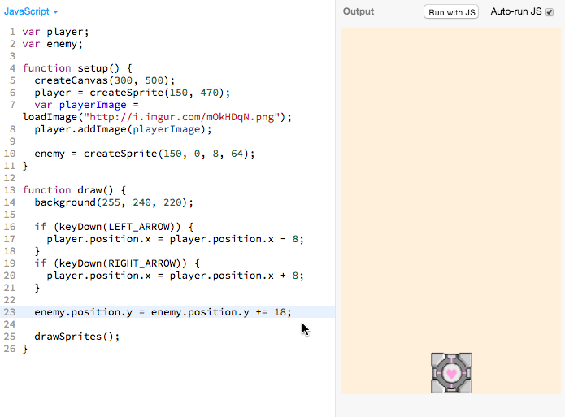

# Enemy - Go Back To Top

We can make the enemy go back to the top of the screen when it hits the bottom
with the following code (new lines are highlighted in gray):

> 

<a href="http://jsbin.com/qiyuno/78/edit?js,output"
target="_blank"></a>

The highlighted gray lines above (reproduced below) are responsible for making
the enemy sprite going back to the top of the screen:

```js
if (enemy.position.y > 500) {
  enemy.position.y = 0;
}
```

## Tinkering

> 

 Try messing around with this number yourself and see what
you observe.

## Understanding the Code

Remember that these are the dimensions of the canvas:


So if the sprite's `y` coordinate is greater than `500`, that means that it is
**_below_** the canvas:


Let's re-phrase this code:

```js
if (enemy.position.y > 500) {
  enemy.position.y = 0;
}
```

Into more understandable English:

> **`if`** the **`enemy`**'s **`y`** **`position`** is **`>`** than **`500`**
> then make the **`enemy`**'s **`y`** **`position`** **`=`** **`0`**

In short, this code moves the enemy back to `y = 0` (The top of the canvas) when
it is below the bottom of the canvas.

## Adding Our New Code

Lets add our new code in:

> 

## Recap

- We learned how to detect the boundaries of the game
- We learned how to more our sprites to the top of the game

## Next Up

| **[   <br> 9. Random Enemy Position]  (random_enemy_position.md)** |
| --------------------------------------------------------------------------------------------------------- |

## Appendix

_This appendix is still being built! Is there something you have a question
about? Submit an issue requesting its addition
[here](https://github.com/hackclub/hackclub/issues)._

## Table of Contents

| **[          <br> 1.  Blank Canvas]      (blank_canvas.md)**          | **[    <br> 2. Add Player Sprite]    (add_player_sprite.md)**    | **[  <br> 3. Linear Player Movement] (linear_player_movement.md)** |
| --------------------------------------------------------------------------------------------------- | --------------------------------------------------------------------------------------------------- | ---------------------------------------------------------------------------------------------------------- |
| **[    <br> 4.  Arrow Key Movement](arrow_key_movement.md)**    | **[         <br> 5. Player Image]         (player_image.md)**         | **[        <br> 6. Add Enemy Sprite]       (add_enemy_sprite.md)**       |
| **[ <br> 7.  Enemy Sprite Move] (linear_enemy_movement.md)** | **[ <br> 8. Enemy Go Back to Top] (enemy_go_back_to_top.md)** | **[   <br> 9. Random Enemy Position]  (random_enemy_position.md)**  |
| **[            <br> 10. Game Over]         (game_over.md)**             |                                                                                                     | **[ <br> Back to the README.md](README.md)**                                            |
