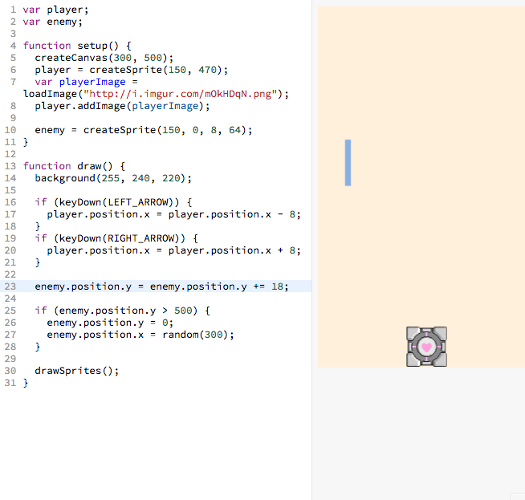

# Game Over When Touching

Currently, when the player touches the enemy, nothing happens:

> 

However we want the message "Game Over" to appear when the player touches the
enemy:

> 

We can make a game over appear when the player touches the enemy with the
following code (new code highlighted in gray):

> 

[][game_over]

The highlighted gray lines above (reproduced below) are responsible for making
"Game Over" appear on the screen when the player touches the enemy:

```js
if (player.overlap(enemy)) {
  alert("Game Over");
}
```

## Understanding the Code

We can interpret the code as follows:

> **`if`** the **`player`** **`overlap`**s the **`enemy`**  
> then **`alert`** the message **`"Game Over"`**

## Adding the Code

**Pro-Tip**: Before writing anything, temporarily "comment out"
`enemy.position.y = enemy.position.y += 18;` Why? Try not doing this haha.

> 

```
What is commenting out?

By adding those two slashes at the beginning of the line, you're telling the
computer to ignore anything after those slashes. This results in the line not
being ran.
```

> 

## Done!

Yay! We made it! We have covered the bulk of the game.
Everything else is minor but important.

> 

One last thing. Please click a rating below to rate this workshop. It'll only
take 3 seconds.

_How likely is it that you would recommend this workshop to a friend?_

| [1][r1] | [2][r2] | [3][r3] | [4][r4] | [5][r5] | [6][r6] | [7][r7] | [8][r8] | [9][r9] | [10][r10] |
| ------- | ------- | ------- | ------- | ------- | ------- | ------- | ------- | ------- | --------- |

[r1]: https://feedback-redir.hackclub.io/1GM13ZyHJMgpIyZZY2DDDCeRmloewKIFTV0dQjgUQDB4?ip=entry.78173348&rfield=entry.559841237&r=1
[r2]: https://feedback-redir.hackclub.io/1GM13ZyHJMgpIyZZY2DDDCeRmloewKIFTV0dQjgUQDB4?ip=entry.78173348&rfield=entry.559841237&r=2
[r3]: https://feedback-redir.hackclub.io/1GM13ZyHJMgpIyZZY2DDDCeRmloewKIFTV0dQjgUQDB4?ip=entry.78173348&rfield=entry.559841237&r=3
[r4]: https://feedback-redir.hackclub.io/1GM13ZyHJMgpIyZZY2DDDCeRmloewKIFTV0dQjgUQDB4?ip=entry.78173348&rfield=entry.559841237&r=4
[r5]: https://feedback-redir.hackclub.io/1GM13ZyHJMgpIyZZY2DDDCeRmloewKIFTV0dQjgUQDB4?ip=entry.78173348&rfield=entry.559841237&r=5
[r6]: https://feedback-redir.hackclub.io/1GM13ZyHJMgpIyZZY2DDDCeRmloewKIFTV0dQjgUQDB4?ip=entry.78173348&rfield=entry.559841237&r=6
[r7]: https://feedback-redir.hackclub.io/1GM13ZyHJMgpIyZZY2DDDCeRmloewKIFTV0dQjgUQDB4?ip=entry.78173348&rfield=entry.559841237&r=7
[r8]: https://feedback-redir.hackclub.io/1GM13ZyHJMgpIyZZY2DDDCeRmloewKIFTV0dQjgUQDB4?ip=entry.78173348&rfield=entry.559841237&r=8
[r9]: https://feedback-redir.hackclub.io/1GM13ZyHJMgpIyZZY2DDDCeRmloewKIFTV0dQjgUQDB4?ip=entry.78173348&rfield=entry.559841237&r=9
[r10]: https://feedback-redir.hackclub.io/1GM13ZyHJMgpIyZZY2DDDCeRmloewKIFTV0dQjgUQDB4?ip=entry.78173348&rfield=entry.559841237&r=10

Congratulations on finishing the game!

## Quick Fixes

You may notice that it's hard to replay the game because when the bullet hits
the player, it gets stuck in and endless cycle of `alert`'s. One quick way we
can fix this is to add this after the `alert` code:

```js
player.remove();
```

This will remove the player and end the seemingly endless cycle!

[See the final product][game_over]

<!-- I did my best here. I want this to be shippable ASAP. -->

## Recap

- We learned how to show an alert
- We learned how to detect if a sprite is overlapping another sprite
- We learned how to remove a sprite

## Appendix

_This appendix is still being built! Is there something you have a question
about? Submit an issue requesting its addition
[here](https://github.com/hackclub/hackclub/issues)_

## Table of Contents

| **[          <br> 1.  Blank Canvas]      (blank_canvas.md)**          | **[    <br> 2. Add Player Sprite]    (add_player_sprite.md)**    | **[  <br> 3. Linear Player Movement] (linear_player_movement.md)** |
| --------------------------------------------------------------------------------------------------- | --------------------------------------------------------------------------------------------------- | ---------------------------------------------------------------------------------------------------------- |
| **[    <br> 4.  Arrow Key Movement](arrow_key_movement.md)**    | **[         <br> 5. Player Image]         (player_image.md)**         | **[        <br> 6. Add Enemy Sprite]       (add_enemy_sprite.md)**       |
| **[ <br> 7.  Enemy Sprite Move] (linear_enemy_movement.md)** | **[ <br> 8. Enemy Go Back to Top] (enemy_go_back_to_top.md)** | **[   <br> 9. Random Enemy Position]  (random_enemy_position.md)**  |
| **[            <br> 10. Game Over]         (game_over.md)**             |                                                                                                     | **[ <br> Back to the README.md](README.md)**                                            |

[game_over]: https://jsbin.com/gist/6b812a57166e47d1a063
