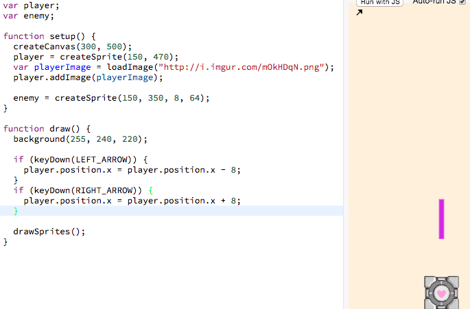
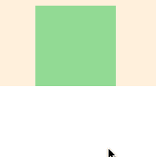
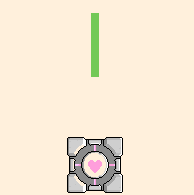
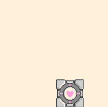

# Linear Enemy Sprite Movement

We can make the enemy sprite move in almost the same way that we made our player
sprite move (new code highlighted in gray):

> 

[](http://jsbin.com/qiyuno/49/edit?js,output)

The highlighted gray lines above (reproduced below) are responsible for making
the enemy sprite move:

```js
enemy.position.y = enemy.position.y += 18;
```

## Tinkering With The Code

> 

 Try messing around with this number yourself and notice
what you observe.

## Understanding The Code

This code functions very similarly to the code that made the player sprite move
in [step 3's linear player movement](linear_player_movement.md). Open that if
you want a reminder of how this works.

## Add It To Your Own Code

```js
enemy.position.y = enemy.position.y += 18;
```

> 

You should try play around with your own speed and find out what works the best!

## Recap

- We learned how to change the speed of a sprites movement on the `y` axis

## Next Up

| **[ <br> 8. Enemy Go Back to Top] (enemy_go_back_to_top.md)** |
| --------------------------------------------------------------------------------------------------- |

## Appendix

_This appendix is still being built! Is there something you have a question
about? Submit an issue requesting its addition
[here](https://github.com/hackedu/hackedu/issues)_

## Table of Contents

| **[          <br> 1.  Blank Canvas]      (blank_canvas.md)**          | **[    <br> 2. Add Player Sprite]    (add_player_sprite.md)**    | **[  <br> 3. Linear Player Movement] (linear_player_movement.md)** |
| --------------------------------------------------------------------------------------------------- | --------------------------------------------------------------------------------------------------- | ---------------------------------------------------------------------------------------------------------- |
| **[    <br> 4.  Arrow Key Movement](arrow_key_movement.md)**    | **[         <br> 5. Player Image]         (player_image.md)**         | **[        <br> 6. Add Enemy Sprite]       (add_enemy_sprite.md)**       |
| **[ <br> 7.  Enemy Sprite Move] (linear_enemy_movement.md)** | **[ <br> 8. Enemy Go Back to Top] (enemy_go_back_to_top.md)** | **[   <br> 9. Random Enemy Position]  (random_enemy_position.md)**  |
| **[            <br> 10. Game Over]         (game_over.md)**             |                                                                                                     | **[ <br> Back to the README.md](README.md)**                                            |

# Feedback

_Did you find anything confusing or not working in this segment of the
tutorial? Tell us about it
[here](https://docs.google.com/forms/d/1IxbiDtyP-UOx3hRGu3o2I-iVll95xQ6I_pW8JS3TZ2k/viewform?entry.1677546962=Linear+enemy+sprite+movement+for+the+bullet+dodging+game)._
