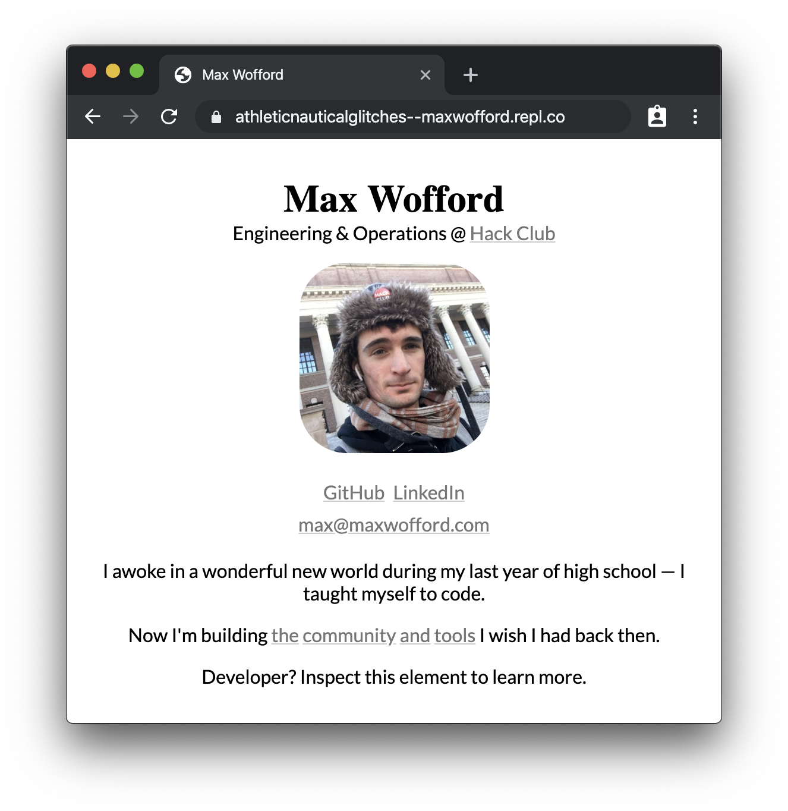
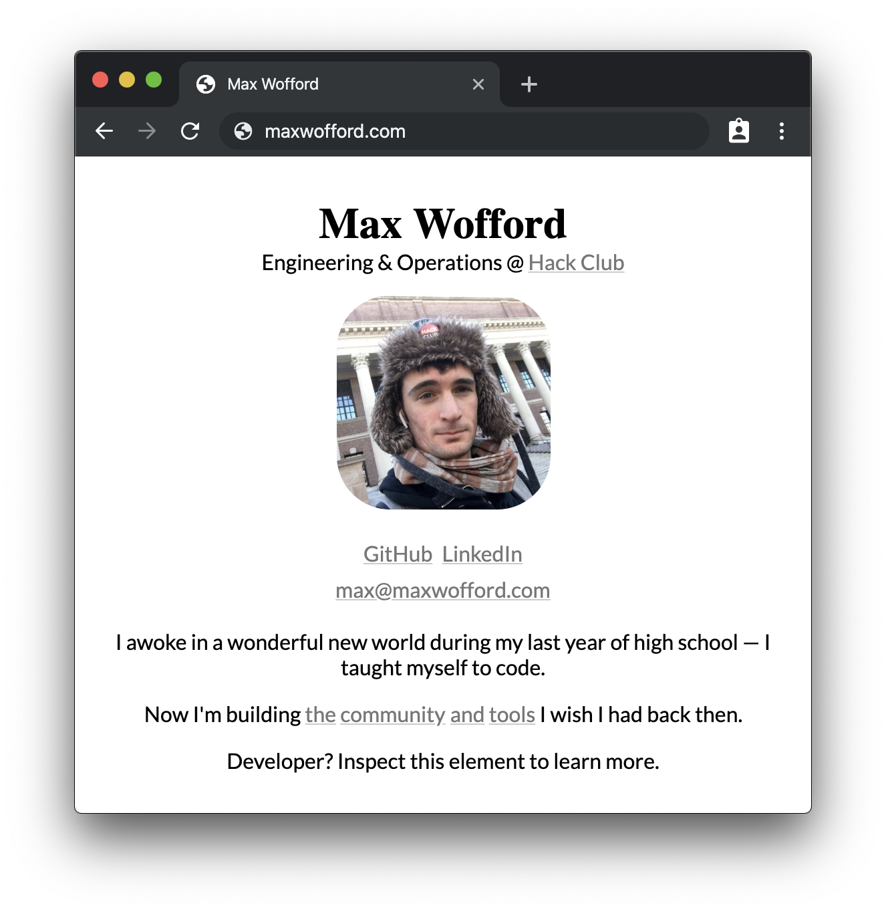
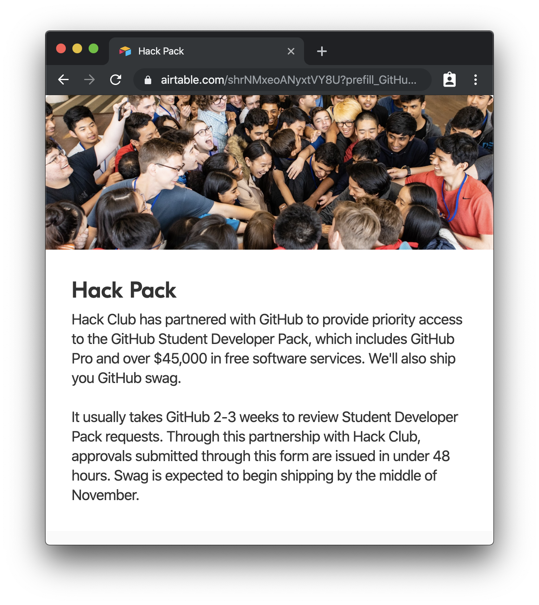
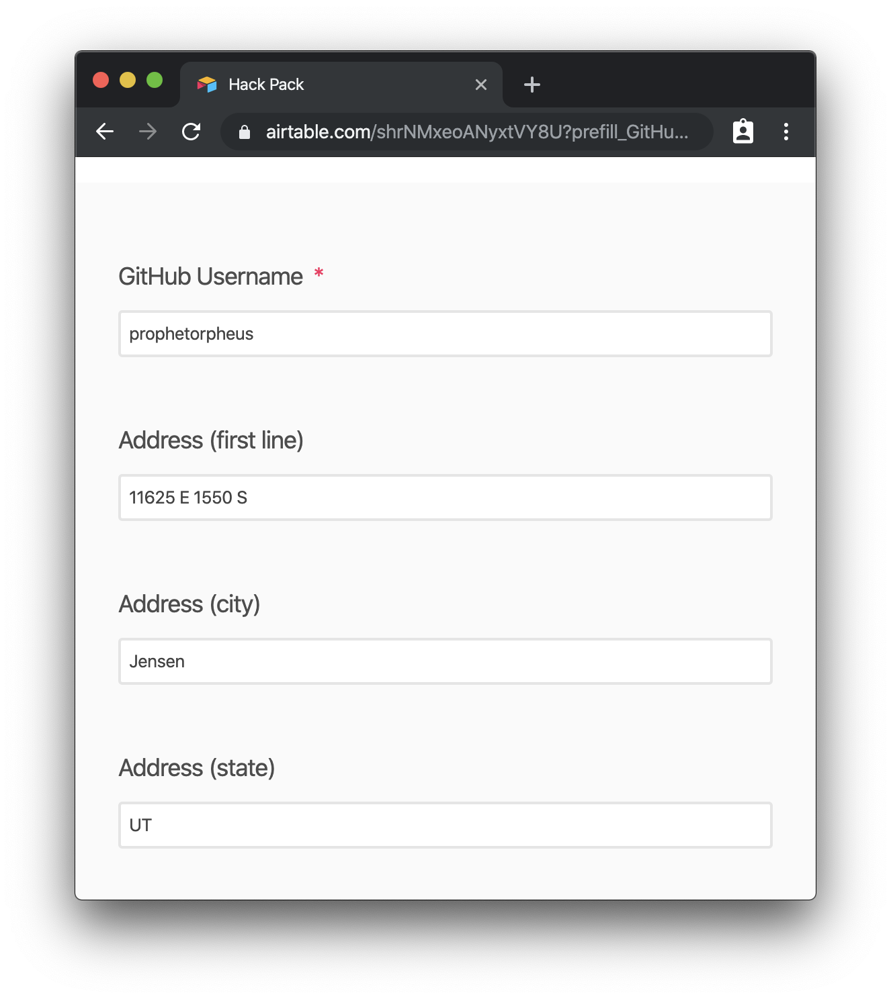
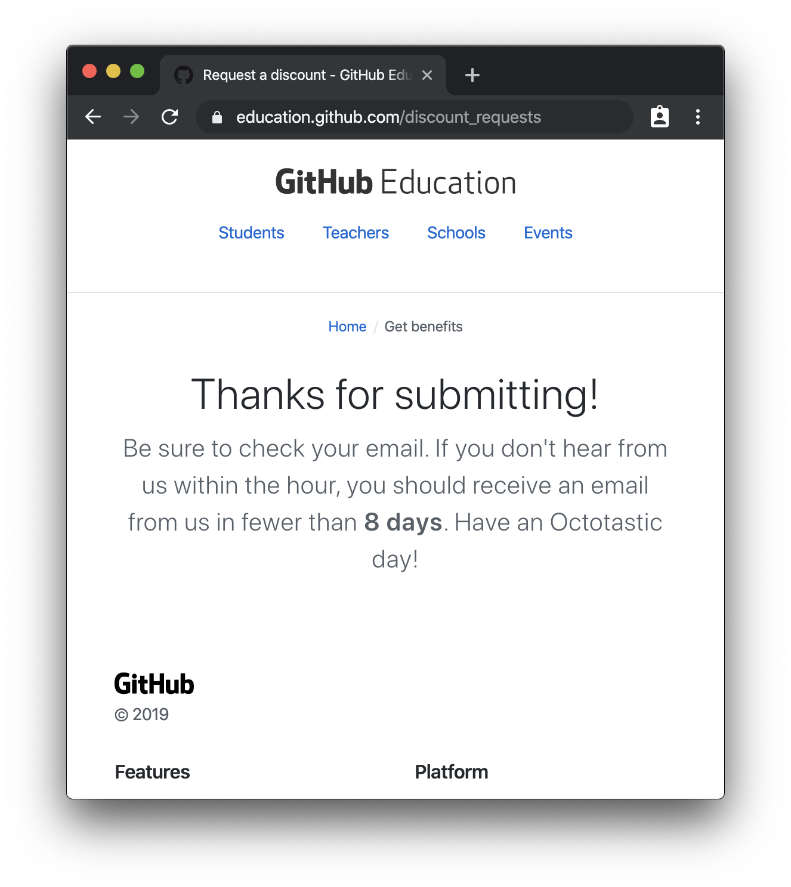
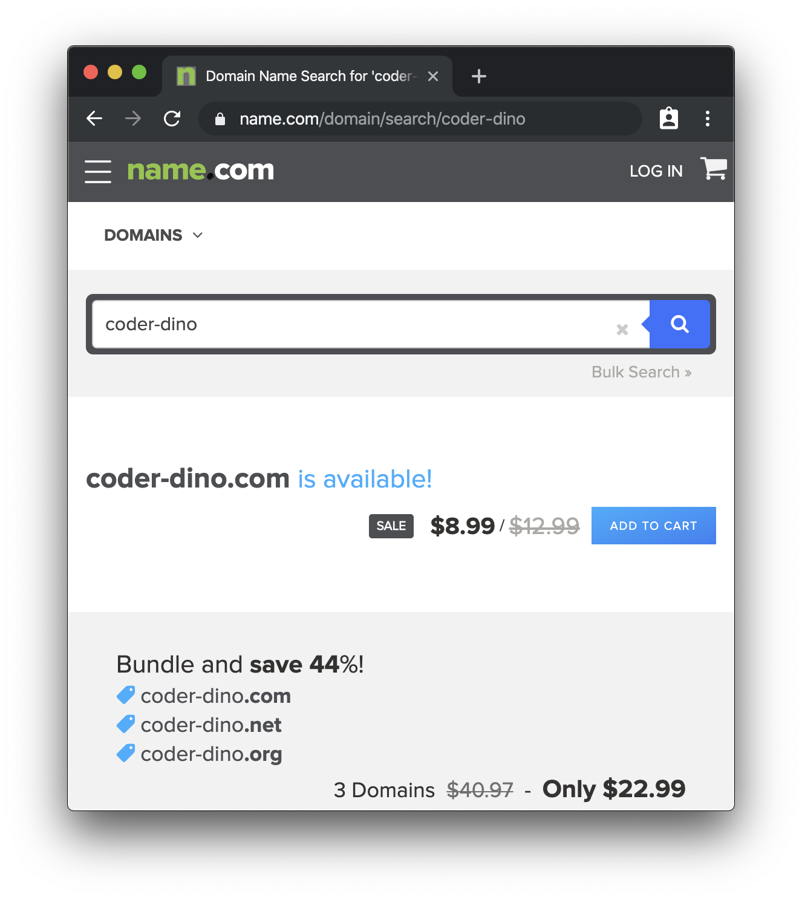

# Your domain

So here you are– you've got a website on repl.it with a URL that sucks. Mine is https://athleticnauticalglitches--maxwofford.repl.co.

> That domain sucks!
> — you

This workshop will show you how to turn it into something nice, like this:

> 
> — people you show your domain to

This workshop will take about 20-30 minutes spread out over a day. You'll get a free domain from the Hack Pack, but that will take 24-48 hours to be approved.

## Part I: Setup

You're going to need a few things to get started here. First, you'll need a domain. Get one for free by applying for the Hack Pack at https://hack.af/pack.

_You'll be taken to a form:_

_Include your address for swag from GitHub:_

Once you click "Continue to GitHub" you'll finish the second page of the form on GitHub's site.

While you wait to be approved, you can start looking at available domains at https://name.com.

Lastly, you'll need a site on repl.it. If you don't have one yet, you can build one using [the workshop](https://hack.af/intro).

_Note: If you have a site on GitHub pages, you can still use this workshop– there will be a short note for you later_

## Part II: Get a domain

Once you get your approval confirmation, you can go [here](https://education.github.com/pack) to get a free domain.

