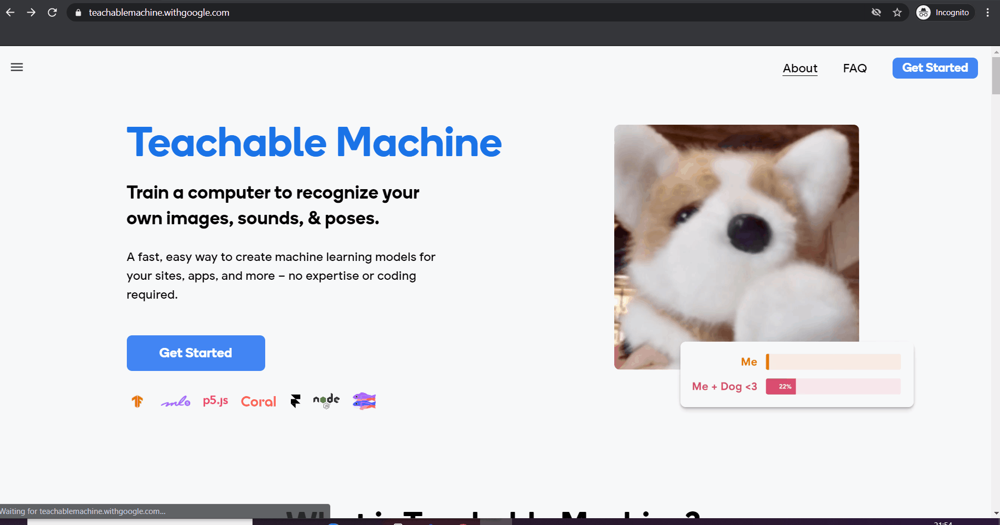
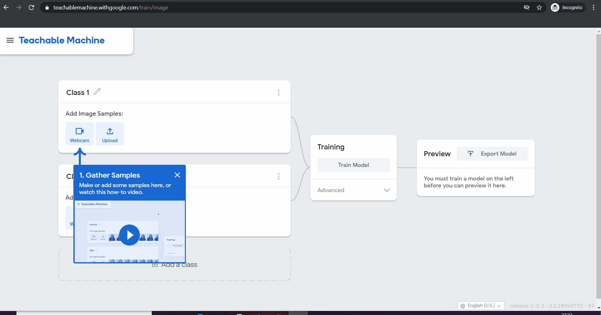
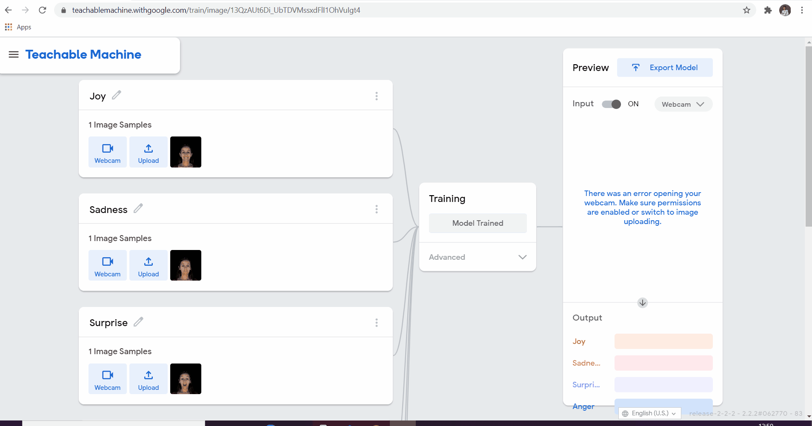

# Facial Expression Recognition

Facial expressions convey the emotional state of an individual to observer what is at the back of mind. What we do while we speak often says more than the actual words. There are six basic types of emotions
__1.Happiness 2.Sadness 3.Fear 4.Anger 5.Suprise 6.Disgust.__

    

  

## How facial expression recognition works?
Facial expression recognition work in 2 parts:
1. Facial Detection:- The ability to detect the location of face in any input image or frame. The output is bounding box of the deteced faces. 
2. Emotion Detection:- Classifying the emotion on the face as happy, angry, sad, surprise, disgust or fear. 

Learn more about facial expression recognition in [Courcera course](https://www.coursera.org/projects/facial-expression-recognition-keras).

[Link to DEMO](https://facialexpressionrecognition.yashkalbande.repl.co/)
## Building Facial Expression Recognition whithout writing single line of code.....
Yes! I am not joking. It is possible by using [Teachable Machine](https://teachablemachine.withgoogle.com/) a fast, easy way to create machine learning models for no expertise or coding required. So lets start: 
1. Click [hear](https://teachablemachine.withgoogle.com/). 
2. Select __"Get Started"__. A new page will open with heading "New Project". 
3. Click on __"Image Project"__ to start trainig new image project model. 
 
4. Now create six classes, by default there are two classes avaliable. We can add more by using __+ Add a class__ option.  
5. Rename classes to __1.Happiness 2.Sadness 3.Fear 4.Anger 5.Suprise 6.Disgust.__ 
 
6. Now is the most interesting step, we have to add image samples to each class with respective emotions. Like _smiling, happy_ images in __Happiness Class__. We have two option __Webcam__ and __Upload__ to add images. For video guide click [hear](https://youtu.be/DFBbSTvtpy4). 
7. Click on __Train Model__ and let other values as default. 
8. Your Machine Learnig model is ready! Preview it by enabling webcam or input a image. 
9. Now its time to __Export Model__. We can export model in 3 differnt ways. But for now we will use default _Tensorflow.js_. Select __Upload my model__ to add our own model to cloud for further use. 
10. Click on _Copy_ option from code snippet. 
11. Open new HTML template on [repl.it](https://repl.it/languages/html) and paste the code between _body_ syntax. 
12. Click on __Run__ button to see your __Realtime Facial Expression Recognition__ working. 
13. Select __Start__ Button to get started. Give access to your webcam. It wil take couple of seconds to start webcam and connect to model. 
 

## Hacking
There are different ways in which we can advance in Facial Expression Recognition. We can download Tensorflow model converted into keras .h5 model and load it in our Python Project.We get list for probablity of prediction for each class we add while creating Classes (Step: 4). Tensorflow Lite model to use in android application or IOT and   Take a look at classses we have add. We can add more class to it like Neautral, winking left or right side,etc. In the begining the result will be not that much accurate, but as time pass it will show more optimal results.Think of where we can use facial expression recoginition can be implement in real life. Below are some new example to keep hacking going on. 

**Tensorflow Trained Model With Python**: [DEMO](https://FCRwithTensorflow.yashkalbande.repl.run) [CODE](https://repl.it/@YashKalbande/FCRwithTensorflow#main.py)  
**Advance Facial Expression Recogination**: [DEMO](https://advancefacialexpressionrecognition.yashkalbande.repl.co) [CODE](https://repl.it/@YashKalbande/AdvanceFacialExpressionRecognition)  
**Beautify boring looking website with CSS & JS**: [DEMO](https://AdvanceFER.yashkalbande.repl.co) [CODE](https://repl.it/@YashKalbande/AdvanceFER#index.html)  

