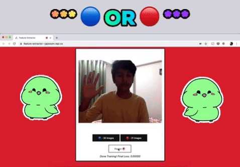
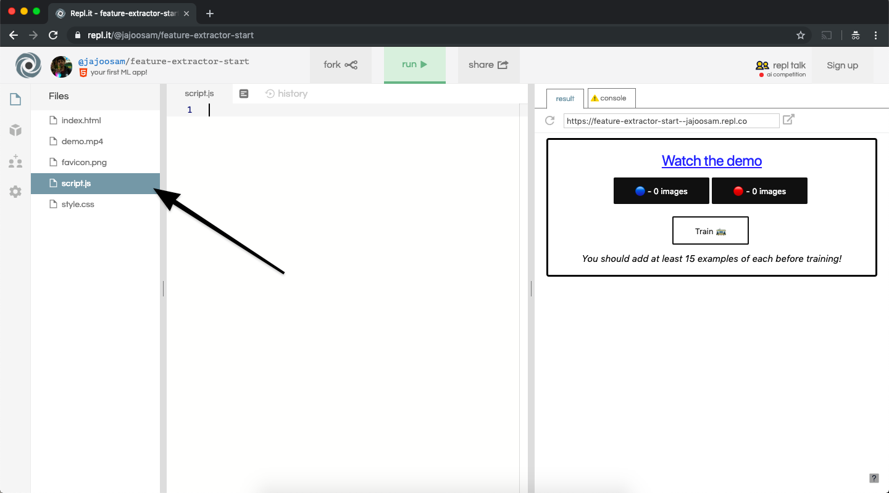
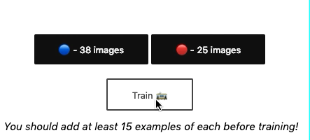

[Demo](https://feature-extractor--jajoosam.repl.co) ⏯️ [Code](https://feature-extractor--jajoosam.repl.co/__repl) 👨‍💻 [Video Walkthrough](https://feature-extractor--jajoosam.repl.co/demo.mp4) 🎦

Machine Learning is a super cool way to build AI apps - but I won't lie, it is a lot of math. Luckily, thanks to [ml5.js](https://ml5js.org) - we don't need to spend months understanding ML, we can apply it and develop some cool uses in our app within just a few hours 😄

This is a guide to build a feature extractor - something that can get a video stream from your webcam and predict what it sees, once it is trained with a little bit of data - just like in the video above!

## 🍴 Forking the frontend

I don't want to waste too much of your time with the frontend I used for this app - I think it'd be much better if I skipped right to the JavaScript, and logic.

You should fork this repl - [https://repl.it/@jajoosam/feature-extractor-start](https://repl.it/@jajoosam/feature-extractor-start) - so that you have the HTML already there! It's essentially just a few `div`s for holding the video and some other text, along with some buttons to control our app!

I've commented everything (except the CSS 😛) - so you should be able to go through the frontend and understand the basic layout of the app in a few minutes. Once you're done, head over to `script.js`



## ✏️ Declaring the variables

We're going to have quite a few variables to declare, so the first thing we're going to do is create them.

Our app is going to have a lot of functions, and it's important that all of them can access the variables - which is why we shall declare right at the start of our code

```javascript
var featureExtractor, classifier, video, loss, redCount, blueCount

redCount = blueCount = 0
```

I'll give you an overview of what these are for, but you'll understand them much better as we continue building our app.

`featureExtractor` and `classifier` are variables we're going to store and initialize machine learning models in.

`video` is where we're storing the webcam stream, while `loss` lets us know the progress of how far our on feature extractor has been trained.

Finally, `blueCount` and `redCount` are counters for how many images there are in each category - and we initalize both of them with a value of `0`, in the next line.

## 🛠️ The setup function

`setup()` is a function which shall fire up as soon as our code is ready to run. Because we are using [p5.js](https://p5js.org), our code is pretty readable and easy to understand here.

```javascript
function setup() {
  // Tells p5 to not automatically create a canvas element.
  noCanvas()

  // Starts capturing a video feed from the webcam
  video = createCapture(VIDEO)

  // Puts the video stream into the div in our html, with ID `video`
  video.parent('video')

  // Initializes a feature extractor, yet to be trained - from ml5.js
  featureExtractor = ml5.featureExtractor('MobileNet')
  classifier = featureExtractor.classification(video)

  // What we're doing next - setting up buttons!
  setupButtons()
}
```

This code goes in your `script.js` file right after you declare variables - essentially, it gets a video stream and displays it on our page, inside a `div` with the ID `video`. We also make some functions using the ml5.js library here, and pass the captured video as a parameter - you'll see what we do with these soon, but there's still a little more setup left!

As you can see, at the end of `setup()`, we call `setupButtons()` - the function we're going to make next. Here, we're adding event listeners to buttons in our HTML - so we can run functions when they're clicked.

Here's all the code we write for the `setupButtons()` function 👇

```javascript
// A function to create the buttons
function setupButtons() {
  buttonA = select('#red')
  buttonB = select('#blue')
  buttonA.mousePressed(function() {
    redCount++
    classifier.addImage('red')
    select('#redCount').html(redCount)
  })
  buttonB.mousePressed(function() {
    blueCount++
    classifier.addImage('blue')
    select('#blueCount').html(blueCount)
  })

  train = select('#train')
  train.mousePressed(function() {
    classifier.train(function(lossValue) {
      // This is where we're actually training our model

      if (lossValue) {
        loss = lossValue
        select('#info').html('Loss: ' + loss)
      } else {
        select('#info').html('Done Training! Final Loss: ' + loss)
        select('#train').style('display', 'none')
        select('#predict').style('display', 'inline')
      }
    })
  })

  // Predict Button
  buttonPredict = select('#predict')
  buttonPredict.mousePressed(classify)
}
```

That's the largest function of our app, and I'm going to break it up into several parts to make it easier to explain!

## 🧙‍♂️bUt wHaT Do tHeSe bUtToNs dO?!?!?!

DON'T PANIC.

Let's start off with this block:

```javascript
buttonA = select('#red')
buttonB = select('#blue')

buttonA.mousePressed(function() {
  redCount++
  classifier.addImage('red')
  select('#redCount').html(redCount)
})

buttonB.mousePressed(function() {
  blueCount++
  classifier.addImage('blue')
  select('#blueCount').html(blueCount)
})
```

`buttonA` and `buttonB` are nothing but the two different buttons we have in our app!


With `.mousePressed()` we're defining what happens when any of these buttons are pressed - which is:

- Increase the count by 1, using the `++` operator
- Capture the current frame from the webcam video and add it to the classifier, with `classifier.addImage()`. These images are used to train the model to know the difference between an image that's for switching to a red background and an image that's for switching to a blue background.
- Update the count on our app by changing the button's text, with `.html()`

Next up, we have this whole block - where we train the classifier itself:

```javascript
train = select('#train')
train.mousePressed(function() {
  classifier.train(function(lossValue) {
    // This is where we're actually training our model

    if (lossValue) {
      loss = lossValue
      select('#info').html('Loss: ' + loss)
    } else {
      select('#info').html('Done Training! Final Loss: ' + loss)
      select('#train').style('display', 'none')
      select('#predict').style('display', 'inline')
    }
  })
})
```

When the `Train 🚋` button on our app is pressed, we call `classifier.train()` - and with each iteration, the function we supply there is called - which is why we see the _[Loss](https://ml-cheatsheet.readthedocs.io/en/latest/loss\_functions.html)_ value keep changing.



When the _Loss_ value is `0`, then we hid the `Train 🚋` button, and show the previously hidden `Predict 🔮` button!

The last 2 lines of the `setupButtons()` function are about the predict button:

```javascript
buttonPredict = select('#predict')
buttonPredict.mousePressed(classify)
```

It seems like we're calling this `classify` function - which is what we're going to build next!

Keep going, we're almost done 💯

## 🔮 Predictions, and showing results

Our `classifier()` function is pretty straightforward - this is all we do:

```javascript
function classify() {
  classifier.classify(gotResults)
}
```

We're just telling the ml5 `classifier` to classify the current frame in either of the categories (🔴 or 🔵), and send the results to the `gotResults` function - which brings us to the final part of our app!

As long as the classifier doesn't send us an error, we change the entire page's background color to either `red` or `blue` - and then call `classify()` again, which keeps our code running forever, and the predictions keep coming!

```javascript
function gotResults(err, result) {
  if (err) {
    console.log(err)
  }
  select('body').style('background', result)
  classify()
}
```

That's all the code we have to write to build the example feature extractor. I highly recommend going through the final code so that you can see how everything fits together well - I know there are quite a few functions too keep track of, but I've commented everything to make it easier 😅

[https://repl.it/@jajoosam/feature-extractor](https://repl.it/@jajoosam/feature-extractor)

Now go ahead, try it out! Here are some things I did to see if the feature extractor would work (it did!) 👇

- Keep my head in the left in 🔴, and right in 🔵
- Make a ✌️ in 🔴, and a ✋ in 🔵
- Wear different colored 👕s in 🔴 and 🔵

Let me know other cool things it worked with 👀

## ✨ okay, but what do I **MAKE** with this?

There are SOOOOO MANY THINGS you could do! A feature extractor gives you the ability to add this whole other, mysterious way of controlling, and getting input in your app!

Here are a few ideas 💡

- A gesture controlled game, right in the browser 🎮
- A mood tracker - leave the tab open all day, and train it with different face expressions 🤔
- Build your own **[hotdog or not](https://www.youtube.com/watch?v=pqTntG1RXSY)** app 🌭
- Build an app which only lets you message others with gestures 💬

## 👨‍🏫 what else is there?

ml5.js can do crazy things! You can integrate image classification into your own app [like I did](https://repl.it/talk/challenge/male-A-scavenger-hunt-with-image-classification/10185), find similar words which fit into a text, get a precise skeleton of human bodies and even transfer the styles in images - look at what my picture looks like, when composed with the style of a cool painting 🖌️


You should take a look at the many [examples on the ml5.js website](https://ml5js.org/docs/quick-start) - or take a look at [Dan Shiffman's videos on ml5.js](https://www.youtube.com/playlist?list=PLRqwX-V7Uu6YPSwT06y_AEYTqIwbeam3y), he covers loads of things you can do with it - and explains everything with a ton of energy. I highly recommend watching his videos on the [Coding Train](https://www.youtube.com/user/shiffman) YouTube!

If you have any questions or need any help with a project you're building, feel free to ping @jajoosam on the hackclub slack :)

> _A big thank you to repl.it for allowing us to republish this workshop!_
