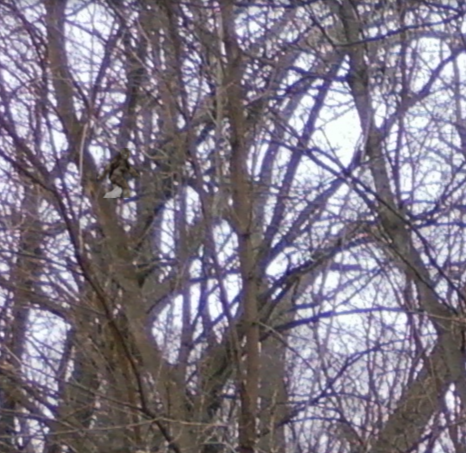
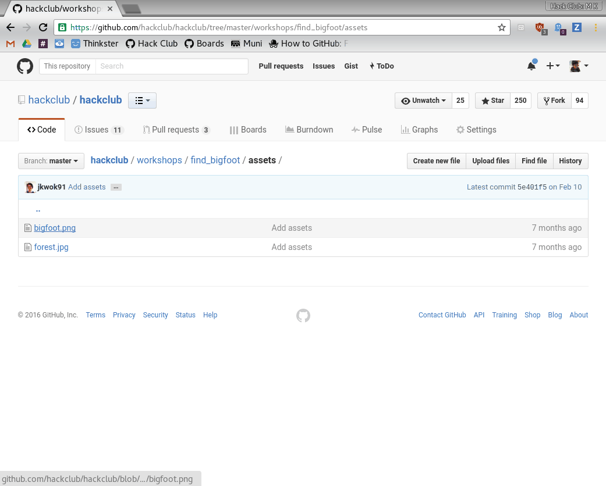
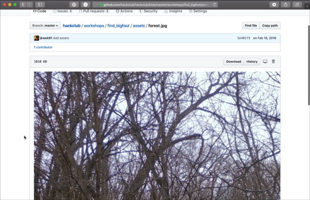
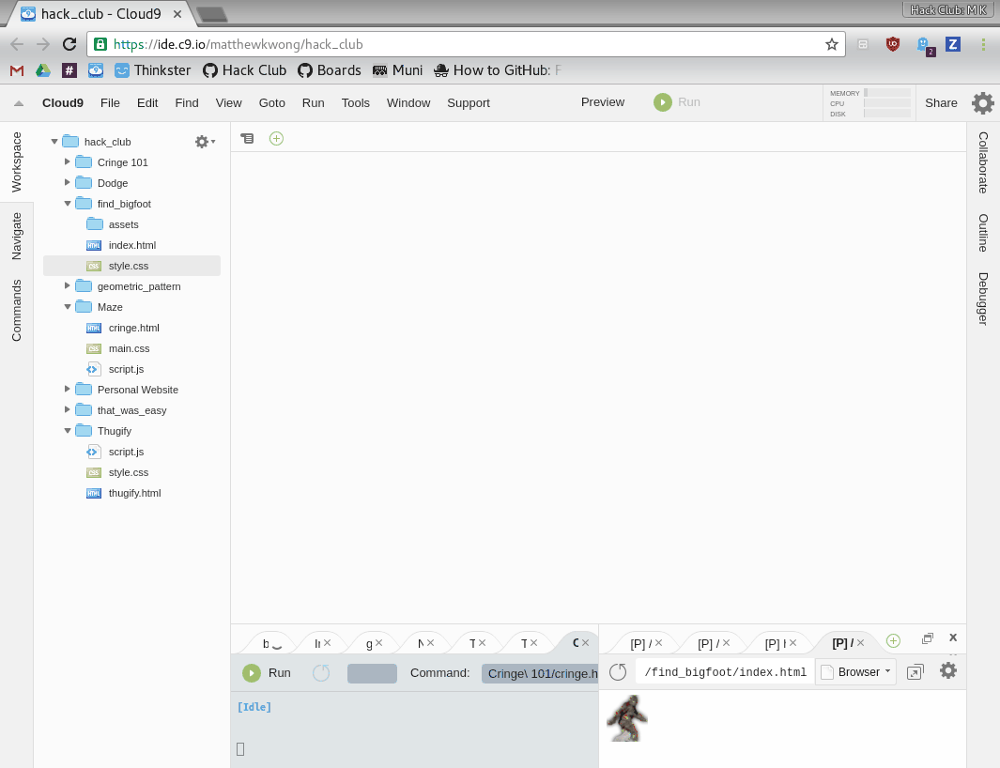
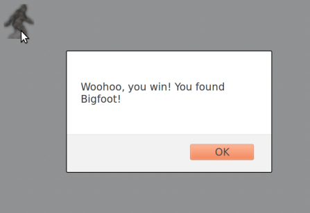

# Find Bigfoot

In this workshop, you will make a game about finding Bigfoot. It will look like this:



Open the [live demo](https://ad510.github.io/workshop-test/find_bigfoot/).

**On the way, you will:**

- Learn how to do event handling and how to create pop-up boxes in JavaScript.
- Set a background image for a web page.
- Directly set the coordinates of an element.
- Most importantly, practice Googling so you can become an independent hacker.

## Set Up the Project

If you've done other Hack Club workshops before, this should be pretty straightforward.

### Create a Blank HTML File

1. Go to https://c9.io
2. Under the workspace called `USERNAME.github.io` where `USERNAME` is your GitHub username, click **Open** to open the workspace.
3. Make a new folder called `find_bigfoot`.
4. In the `find_bigfoot` folder, make a new file called `index.html`.
5. Make another file in the `find_bigfoot` folder and call it `style.css`. 
6. Double-click `index.html` to open the file.

### Add Standard HTML Template

Type the standard HTML template into `index.html`:

```html
<!DOCTYPE html>
<html>
    <head>

    </head>
    <body>

    </body>
</html>
```

### Open the Live Preview

1. Click **File > Save** or <kbd>Ctrl</kbd>+<kbd>s</kbd> to save the file.
2. Click **Preview > Live Preview File** to open a live preview of the web page. Currently it is blank, but that will change soon!

### Get Images for the Game

1. Go to https://github.com/hackclub/hackclub/tree/master/workshops/find_bigfoot/assets
2. Click on each image, then right click and **Save Image As** to save it to your computer.
3. Make a new folder called `assets` in your workspace `find_bigfoot` folder.
4. Drag all the images you saved into the `assets` folder.

If you're having trouble, here's a step by step tutorial:







Now you're all set with the images you'll need!

## Creating the Game

What needs to be in a game about finding Bigfoot? Well, it needs Bigfoot, and it needs to tell the player when Bigfoot has been found.

### Taking Bigfoot Out of His Natural Habitat

It is rumored that Bigfoot's natural habitat is a forest in the Pacific Northwest. What happens if you take him out of his natural habitat and stick him on a computer screen? Would he scream? Would he rip up the computer?

Luckily for you, we've done the hard part of wrangling him out of the jungle and putting him in captivity on the Internet, and Bigfoot can be found in your `assets` folder:

    assets/bigfoot.png

So now you have to put an **image** of him into your game, like you did in the [Personal Website](../personal_website/) workshop.

To add an image we use ``.

When you are done, you should see Bigfoot in the live preview, like this:


And the HTML looks like this:

```html
<!DOCTYPE html>
<html>
    <head>

    </head>
    <body>
        
    </body>
</html>
```

### Telling the Player When Bigfoot Has Been Found

A game needs interaction in order to be a game, so let's display a pop-up box whenever the player clicks on Bigfoot, like this:



How can you do that?

One of the most important skills towards becoming an independent hacker is knowing how to Google things when stuck. So let's start by Googling "[HTML handle click](https://www.google.com/search?q=html+handle+click)":

> 

Clicking the first link takes you [here](http://www.w3schools.com/jsref/event_onclick.asp):

> 

Aha! It looks like whenever you put `onclick="myFunction()"` on a tag such as `button` or `img`, it executes the [**JavaScript**](http://www.w3schools.com/js/) code you put in the quotes whenever that tag is clicked on.

We want our JavaScript code to display a pop-up box saying you've won. So now let's Google "[JavaScript pop-up box](https://www.google.com/search?q=javascript+popup+box)":

> 

The first link takes you [here](http://www.w3schools.com/js/js_popup.asp):

> 

It looks like when you run `alert("I am an alert box!");` it opens a pop-up box showing the text inside the quotes. So if we put 2 and 2 together, our `img` tag should look like this:

```html

```

Change your `img` tag to look like that too, then click Bigfoot in the live preview.

Oops, it didn't work! Why could that be?

Another important skill when hacking is knowing how to fix stuff when they go wrong. Cloud9 gives a couple hints:

1. It displayed the message "Unable to update preview: unmatched tags detected"
2. The quotation mark after `alert(` has a red underline.

Here's what went wrong. We expected the quotation mark after `alert(` to indicate the beginning of the message, but what it actually did was indicate the end of the `onclick` attribute.

Here's a little trick you can use to fix that. In JavaScript, you can use either `"` or `'` around text (the technical term is a [**string**](http://www.w3schools.com/js/js_strings.asp)). So change the inner quotes to single quotes, like this:

    onclick="alert('Woohoo, you win! You found Bigfoot!');"

And now clicking Bigfoot should display the message.

At this point, `index.html` should look like this:

```html
<!DOCTYPE html>
<html>
    <head>
       
    </head>
    <body>
        
    </body>
</html>
```

Congratulations, you have a working game now! You're all done! Now you can go to [FGL](https://fgl.com) and sell your game to sponsors and make millions of dollars!

## Hiding Bigfoot

I guess you spotted the problem already. This game is way too easy! I mean, Bigfoot is just sitting there out in the open, begging for you to click on him.

### Putting Bigfoot Back in His Natural Habitat

That must be because we took him out of his natural habitat. You see, normally Bigfoot is hiding in a dense forest, making it hard to find him. Let's fix that by adding a **background image** of a forest. We have one in `assets`:

    assets/forest.jpg

When you are making your own projects, you won't have workshops telling the solution to every step. So this time, let's practice your Googling skills and see if you can figure out how to set that background image without being told the solution! After adding the background image, the live preview looks like this:


When you are done, or if you are simply really stuck, we've included a sample solution below. (But there are other ways to add the background image, so if your solution doesn't match mine, that's OK.)

_Sample solution:_

```html
<!DOCTYPE html>
<html>
    <head>
        <style>
            body {
                background-image: url("assets/forest.jpg");
            }
        </style>
    </head>
    <body>
        
    </body>
</html>

<!--
There are several ways to add the background image. Here is one way:

1. Google "html background image" (without quotes).
2. The first link brings you here: http://www.w3schools.com/cssref/pr_background-image.asp
3. There is an example near the top. You can click "Try it yourself" to see the full HTML of the example.
4. Add the <style> tag in the <head> like in the example, but replace the URL with the picture of the forest. You do not need the background-color rule since we are already setting a background image.
-->
```

### Setting Bigfoot's Location

That's much better! But the top left corner is a pretty boring place to hide Bigfoot. Can you figure out how to set Bigfoot's **position** to somewhere else? This one is harder, and may take some trial and error, but it's really worth the effort to see if you can figure it out yourself. Afterwards, Bigfoot's position will be somewhere in the middle of the forest, rather than the top left corner, like this:


.  
.  
.  
.  
.  

OK, got it working? If you need help, try asking your neighbor or a club leader for hints.

#### Sample Solution

Let's walk through the steps of one way of solving this.

Google "[HTML position](https://www.google.com/search?q=html+position)".

> 

The first link takes you [here](http://www.w3schools.com/cssref/pr_class_position.asp):

> 

It has some CSS code showing how to "position an `<h2>` element":

```css
h2 {
    position: absolute;
    left: 100px;
    top: 150px;
}
```

But we don't want to position an `<h2>` element. We want to position an `` element. So we type the code above into the `<style>` section, but typing `img` instead of `h2`.

### Loading Bigfoot before the background

Right now Big Foot loads before the background image does unless you have a fast internet connection and we don't want that! We're going to fix that by running code only after the page has loaded.

Just like how we ran code when someone clicked using `onclick`, we're going to call a function once the page has loaded with `onload`. You can look this up by googlintg "on page load". Lets go ahead and make a script tag for our new function inside the page head `loadBigFoot()`.

```html
<head>
    <!-- Other stuff in the head goes here -->

    <script>
        function loadBigFoot() {

        }
    </script>
</head>
```

We should also go ahead and add the onload to the body tag. There are a couple more things we should do. First, go ahead and get rid of src tag, as we will be adding that with the function. Then, add an `id` to the img tag. This is so we can change the `src` attribute after the page loads.

```html
    <body onload="loadBigFoot()">
        
    </body>
</html>
```

Now, lets get a hold of the img tag and change its `src` to our friend Big Foot.

```javascript
    <script>
        function loadBigFoot() {
             document.getElementById("bigFoot").src = "assets/bigfoot.png"
        }
```
Big Foot should now load after the background. We did it!

When we're done, `index.html` looks like 

```html
<!DOCTYPE html>
<html>
    <head>
        <style>
            body {
                background-image: url("assets/forest.jpg");
            }
            img {
                position: absolute;
                left: 100px;
                top: 150px;
            }
        </style>
        <script>
            function loadBigFoot() {
                document.getElementById("bigFoot").src = "assets/bigfoot.png"
            }
        </script>
    </head>
    <body onload="loadBigFoot()">
        
    </body>
</html>
```

But feel free to experiment with the `left` and `top` values to find a good place to hide Bigfoot.

### Celebrate!

Congratulations, you have a working game! You're all done! 

Most importantly, by practicing Googling stuff, you are on your way toward becoming an independent hacker.

## Sharing with the Community

Like with previous workshops, let's set up a link that you can share with others!

1. Open the terminal by pressing `alt + t` on the keyboard at the same time. Then type in the following commands:
  - `git add --all`
  - `git commit -am "Find Bigfoot workshop"`
  - `git push origin master`

2. GitHub will now ask you for your username and password.
  - Go ahead and enter your username and then press the enter.
  - Then enter your password and press enter. _Note that the characters don't show up on the screen but rest assured, you are still typing._

3. Now try to view your game by going to `username.github.io/find_bigfoot`

   > Make sure to change `username` to your own username

4. Post the link to the [`#shipit`](https://hackclub.slack.com/messages/shipit/) on Slack to share your awesome game!

## Hacking

Now is the chance to make the game into your own! For inspiration, you can look [here](http://andrewd.50webs.com/bigfoot) to see what's possible.
