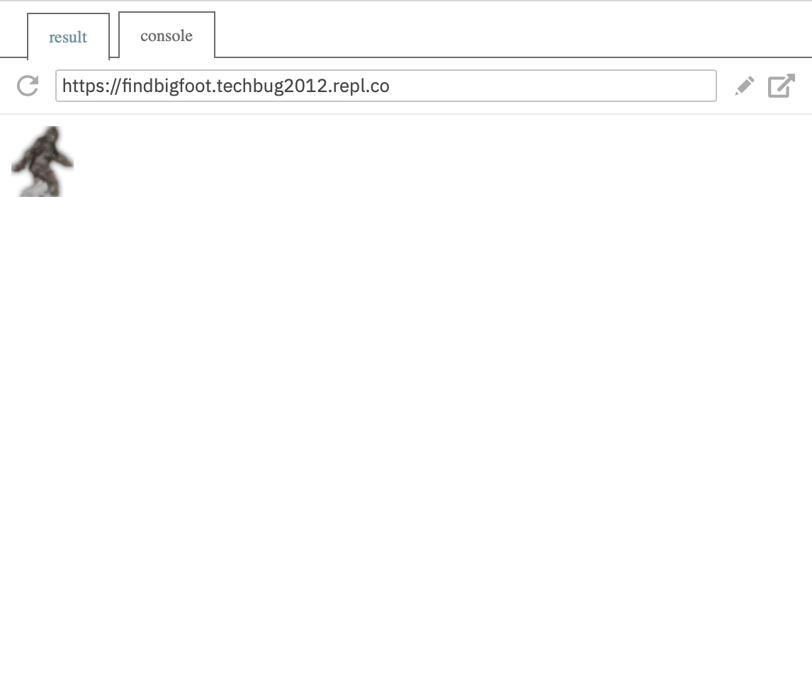
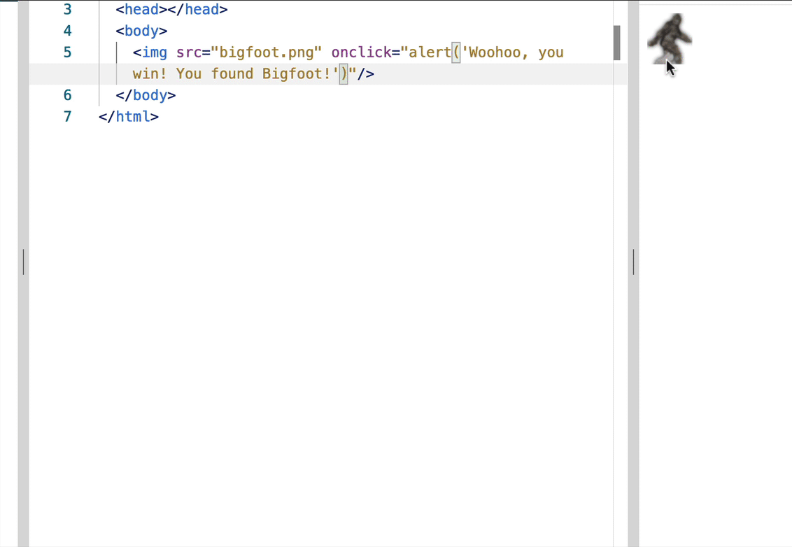
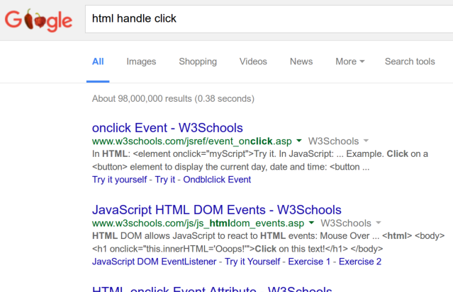
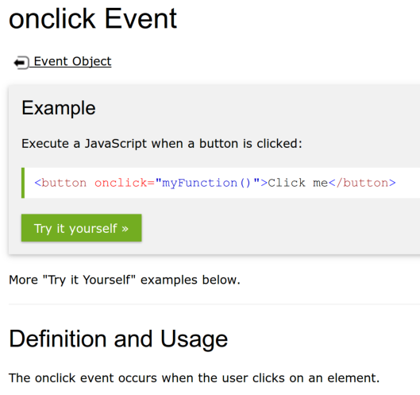
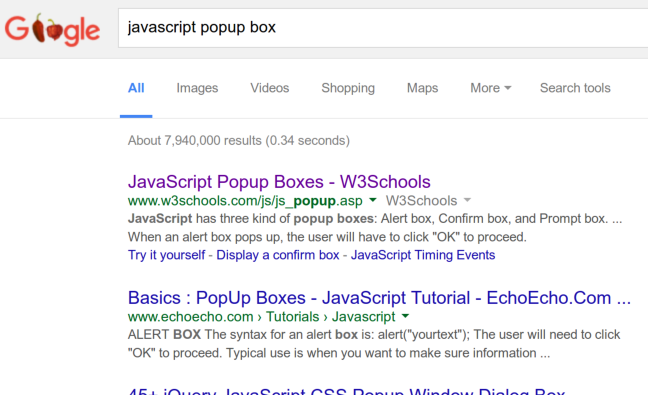
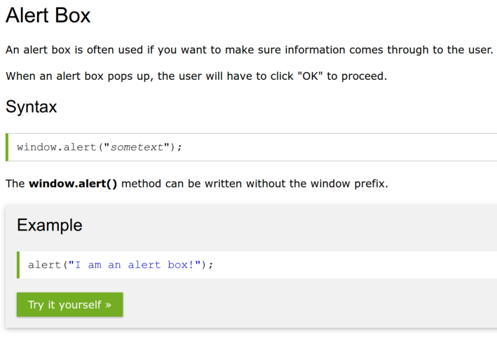
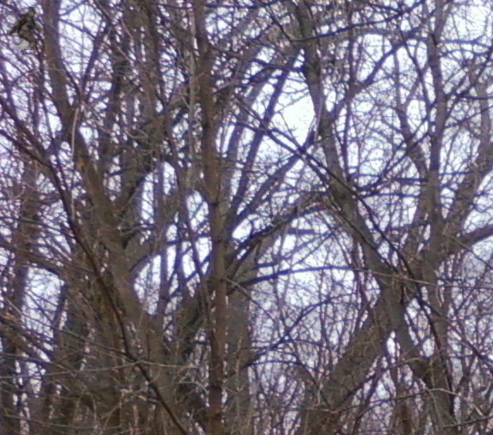
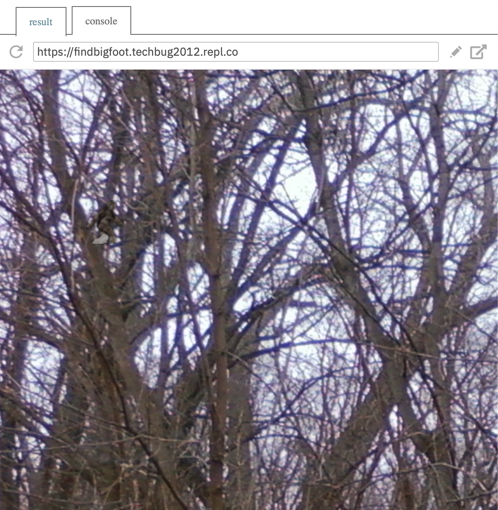
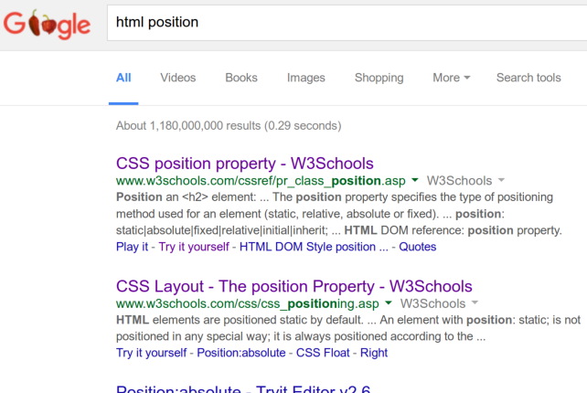
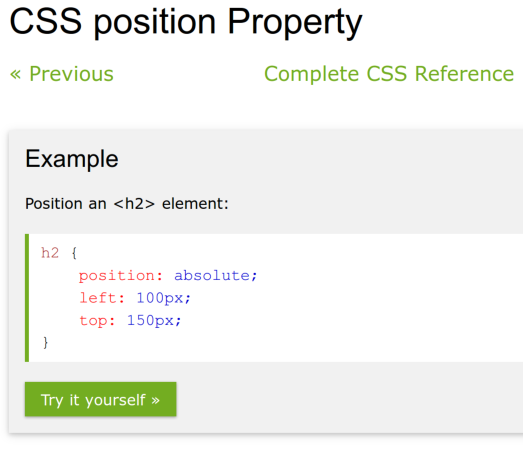

# Find Bigfoot

In this workshop, you will make a game about finding Bigfoot. It will look like this:


Links to a live demo and the final code below. This workshop should take around 1 hour.

[**Live Demo**](http://prophetorpheus.github.io/find_bigfoot/)

[**Final Code**](https://github.com/prophetorpheus/prophetorpheus.github.io/tree/master/find_bigfoot)

---

**On the way, you will:**

- Learn how to do event handling and how to create pop-up boxes in JavaScript.
- Set a background image for a web page.
- Directly set the coordinates of an element.
- Most importantly, practice Googling so you can become an independent hacker.

## Set Up the Project

Open a new HTML project on [**repl.it**/languages/html](https://repl.it/languages/html)

### Get Images for the Game

1. Go to https://github.com/hackclub/hackclub/tree/master/workshops/find_bigfoot/assets
2. Click on each image, then right click and **Save Image As** to save it to your computer
3. Drag all the images you saved into the repl.it sidebar

Now you're all set with the images you'll need!

## Creating the Game

What needs to be in a game about finding Bigfoot? Well, it needs Bigfoot, and it needs to tell the player when Bigfoot has been found.

### Taking Bigfoot Out of His Natural Habitat

It is rumored that Bigfoot's natural habitat is a forest in the Pacific Northwest. What happens if you take him out of his natural habitat and stick him on a computer screen? Would he scream? Would he rip up the computer?

Luckily for you, we've done the hard part of wrangling him out of the jungle and putting him in captivity on the Internet, and Bigfoot can be found in your repl.it project :)

So now you have to put an **image** of him into your game, like you did in the [Personal Website](../personal_website/) workshop. To add an image, we use:

```html

```

When you're done, you should see Bigfoot in the live preview, like this:



And the `index.html` file looks like this:

```html
<!DOCTYPE html>
<html>
  <head></head>
  <body>
    
  </body>
</html>
```

### Telling the Player When Bigfoot Has Been Found

A game needs interaction in order to be a game, so let's display a pop-up box whenever the player clicks on Bigfoot, like this:



How can you do that?

One of the most important skills towards becoming an independent hacker is knowing how to Google things when stuck. So let's start by Googling "[HTML handle click](https://www.google.com/search?q=html+handle+click)":

> 

Clicking the first link takes you [here](http://www.w3schools.com/jsref/event_onclick.asp):

> 

Aha! It looks like whenever you put `onclick="myFunction()"` on a tag such as `button` or `img`, it executes the [**JavaScript**](http://www.w3schools.com/js/) code you put in the quotes whenever that tag is clicked on.

For one moment:

- HTML controls the content of the page
- CSS controls the styling & layout
- JavaScript controls the functionality & interactivity

We want our JavaScript code to display a pop-up box saying you've won. So now let's Google "[JavaScript pop-up box](https://www.google.com/search?q=javascript+popup+box)":

> 

The first link takes you [here](http://www.w3schools.com/js/js_popup.asp):

> 

It looks like when you run `alert("I am an alert box!");` it opens a pop-up box showing the text inside the quotes. So if we put 2 and 2 together, our `img` tag should look like this:

```html

```

Change your `img` tag to look like that too, then click Bigfoot in the live preview.

Oops, it didn't work! Why could that be?

Another important skill when hacking is knowing how to fix stuff when they go wrong. repl.it gives you a hint: the quotation mark after `alert(` has a red underline.

Here's what went wrong. We expected the quotation mark after `alert(` to indicate the beginning of the message, but what it actually did was indicate the end of the `onclick` attribute.

Here's a little trick you can use to fix that. In JavaScript, you can use either `"` or `'` around text (the technical term is a [**string**](http://www.w3schools.com/js/js_strings.asp)). So change the inner quotes to single quotes, like this:

```
onclick="alert('Woohoo, you win! You found Bigfoot!');"
```

And now clicking Bigfoot should display the message.

At this point, your `` should look like this:

```html

```

Congratulations, you have a working game now! You're all done! Now you can go to [FGL](https://fgl.com) and sell your game to sponsors and make millions of dollars!

## Hiding Bigfoot

I guess you spotted the problem already. This game is way too easy! I mean, Bigfoot is just sitting there out in the open, begging for you to click on him.

### Putting Bigfoot Back in His Natural Habitat

That must be because we took him out of his natural habitat. You see, normally Bigfoot is hiding in a dense forest, making it hard to find him. Let's fix that by adding a **background image** of a forest. We already uploaded `forest.jpg`, the image we'll use.

When you are making your own projects, you won't have workshops telling the solution to every step. So this time, let's practice your Googling skills and see if you can figure out how to set that background image without being told the solution! After adding the background image, the live preview looks like this:



When you are done, or if you are simply really stuck, we've included a sample solution below. (But there are other ways to add the background image, so if your solution doesn't match mine, that's OK.)

Sample solution, in `style.css`:

```css
body {
  background-image: url('/forest.jpg');
}
```

There are several ways to add the background image. Here is one way:

1. Google `html background image`.
2. The first link brings you here: http://www.w3schools.com/cssref/pr_background-image.asp
3. There is an example near the top. You can click "Try it yourself" to see the full HTML of the example.
4. Open the `style.css` file like in the example, but replace the URL with the picture of the forest. You do not need the background-color rule since we are already setting a background image.
5. Remember to link your CSS file to your HTML file!

### Setting Bigfoot's Location

That's much better! But the top left corner is a pretty boring place to hide Bigfoot. Can you figure out how to set Bigfoot's **position** to somewhere else? This one is harder, and may take some trial and error, but it's really worth the effort to see if you can figure it out yourself. Afterwards, Bigfoot's position will be somewhere in the middle of the forest, rather than the top left corner, like this:



OK, got it working? If you need help, try asking your neighbor or workshop leader for hints.

#### Sample Solution

Let's walk through the steps of one way of solving this.

Google "[HTML position](https://www.google.com/search?q=html+position)".

> 

The first link takes you [here](http://www.w3schools.com/cssref/pr_class_position.asp):

> 

It has some CSS code showing how to "position an `<h2>` element":

```css
h2 {
  position: absolute;
  left: 100px;
  top: 150px;
}
```

But we don't want to position an `<h2>` element. We want to position an `` element. So we type the code above into the `style.css` file, but typing `img` instead of `h2`.

### Loading Bigfoot Before the Background

Right now Bigfoot loads before the background image does unless you have a fast internet connection and we don't want that! We're going to fix that by running code only after the page has loaded.

Just like how we ran code when someone clicked using `onclick`, we're going to call a function once the page has loaded with `onload`. You can look this up by Googling "on page load". Lets go ahead and make a script tag for our new function in the JavaScript file, `script.js`:

```js
function loadBigFoot() {}
```

We should also go ahead and add the `onload` attribute to the body tag. There are a couple more things we have to do. First, go ahead and get rid of `src` tag, as we will be adding that with the function. Then, add an `id` to the `img` tag. This is so we can change the `src` attribute after the page loads.

```html
<body onload="loadBigFoot()">
  
</body>
```

Now, lets get a hold of the `img` tag and change its `src` to our friend Bigfoot.

```js
function loadBigFoot() {
  document.getElementById('bigFoot').src = 'bigfoot.png'
}
```

Bigfoot should now load after the background. We did it!

Feel free to experiment with the `left` and `top` values to find a good place to hide Bigfoot.

## Making The Game Harder

Now we have another problem. This game is… too easy. Once somebody plays it once, they’ll be able to beat it over and over again with no challenge! We need to write a function that will move bigfoot randomly around the page after you beat it.

Open your script.js file and let’s make a new function `moveBigFoot();`

```js
function moveBigFoot() {}
```

Now remember, we’re trying to move bigfoot randomly around the screen. So the first thing we need to do is make a variable that will get our image. Like earlier, we’ll use “document.getElementbyId.”

```js
function moveBigFoot() {
  var picture = document.getElementById('bigFoot')
}
```

This will help us out later on.

Now look at how we positioned bigfoot in the css file. We have two numbers: Bigfoot's position from the top and his position from the left. Therefore, those are the two numbers that have to be random so he can move around. Try and google and figure out a way to generate a random number.

There’s a couple different ways to solve this, but we googled “generate a random number in javascript” and went to the first result, which told us to use `Math.random()`

So since we have two numbers to generate (for `left:` and `top:`) we need to create two new variables for those values.

```js
function moveBigFoot() {
  var picture = document.getElementById('bigFoot')

  var x = Math.random() * 300
  var y = Math.random() * 300
}
```

This will generate two random numbers between 0-300 whenever the function is run.

Now that we have our two numbers, we have to actually make them apply to our picture variable. Here, we’ll use the style left and style top property.

```js
function moveBigFoot() {
  var picture = document.getElementById('bigFoot')

  var x = Math.random()*300;
  var y = Math.random()*300;

  picture.style.top = x + 'px';
  picture.style.left = y + 'px';
  }
}
```

This will take any images that follow the parameters of the picture variable (which is just finding the `id` `bigFoot`) and set the top and left position to the random numbers that it generates.

Next, back to our html file. We need to make it so that whenever we win the game and find Bigfoot, the moveBigFoot function will be called and it’ll move him to a new location based on the two numbers we just generated.

Let’s create a new onclick method in our `` tag in the html file.

```html

```

Now let’s try and run that and see if it works.

Did it?

No?

Okay. Let's see what we can do about that.

It looks like having two onclick methods is confusing the program. It will make it a lot easier and more efficient to move the alert to the moveBigFoot() function, so that it will all happen at once.
Let’s take out the `alert` in the `img` tag and put it in our moveBigFoot() function

So now, our new ``in the html file should just look like this

```html

```

And our `moveBigFoot()` function in scripts.js should look like this

```js
function moveBigFoot() {
  alert('Woohoo, you win! You found Bigfoot!')
  var picture = document.getElementById('bigFoot')

  var x = Math.random() * 300
  var y = Math.random() * 300

  picture.style.top = x + 'px'
  picture.style.left = y + 'px'
}
```

Now let's try it. Go ahead and click on bigfoot.

Did the alert pop up? Yes?

Nice!

And now did Bigfoot move?

Nice again - great work!

### Celebrate!

Congratulations, you have a working game! You're all done!


Most importantly, by practicing Googling stuff, you are on your way toward becoming an independent hacker.

## Hacking

Now is the chance to make the game into your own! For inspiration, you can look [here](http://andrewd.50webs.com/bigfoot) to see what's possible.
