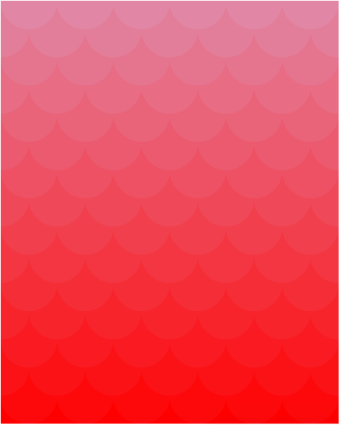
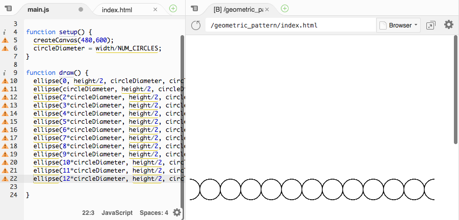
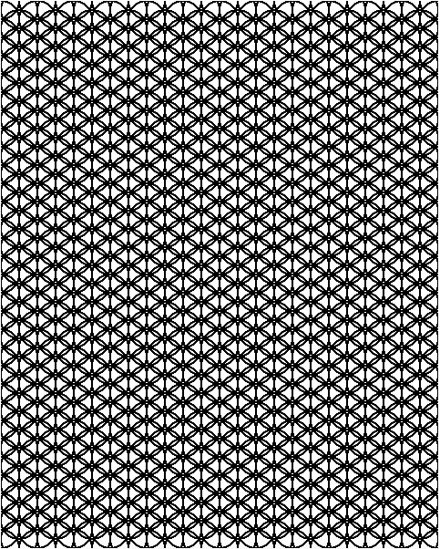

# Geometric Pattern



We'll be creating a cool graphic like the one above, using JavaScript and p5.js.
[p5.js](http://p5js.org/) is a library for making stuff in conjunction with the [HTML canvas element](https://developer.mozilla.org/en-US/docs/Web/HTML/Element/canvas). p5.js is nothing more than JavaScript code written to make commonly-desired functionality much more accessible. It is primarily used to make visuals and graphics. A great introduction can be found [here](http://taeyoonchoi.com/signing-coders-1/).

## Part I: Set-up

First, go to Cloud9 and open up your `projects` workspace by pressing Open.


Once in the workspace, right-click the `projects` folder on the left and select `New Folder`. Name it `geometric_pattern`.

Next, right-click the `geometric_pattern` folder, select `New File`, and name it `index.html`.
Then, right-click the `geometric_pattern` folder again, select `New File` again, and this time, name it `main.js`.

## Part II: Priming the Files

### Priming the HTML File

Double-click `index.html` to open it. Just as we've done previously, we'll type this base structure into our HTML file:

```html
<!DOCTYPE html>
<html>
  <head>
  </head>
  <body>
  </body>
</html>
```

Now, let's add our JavaScript dependencies, namely, p5.js. Let's add that into our **body** with a `<script>` tag: **Please type everything except the URL, which you can copy and paste!**

```html
<body>
  <script src="https://cdnjs.cloudflare.com/ajax/libs/p5.js/0.4.12/p5.js"></script>
</body>
```

We'll also need to attach our JavaScript file, `main.js`. Add this below the line that adds p5.js:

```html
<body>
  <script src="https://cdnjs.cloudflare.com/ajax/libs/p5.js/0.4.12/p5.js"></script>
  <script src="main.js"></script>
</body>
```

Now we'll save (with shortcut: `CTRL+s` / `Command+s`) and open Live Preview (`Preview` > `Live Preview`).

### Priming the JS File

Double-click `main.js` to open, and type the following:

```js
function setup() {
}

function draw() {
}
```

p5.js works by automatically calling two special functions: [`setup()`](http://p5js.org/reference/#/p5/setup) and [`draw()`](http://p5js.org/reference/#p5/draw) to create the visuals on your webpage. We'll be writing our own code in these functions, so that p5.js can then run our code.

`setup()` is run only once, at the beginning. `draw()` on the other hand, is run repeatedly after `setup()` finishes, and in this way, provides the basis for any animation or interaction you see in your project.

Let's save and refresh Live Preview.

It looks like nothing, because our functions do nothing. Let's add something for `setup()` to set up.

```js
function setup() {
  createCanvas(480,600);
}
```

[`createCanvas()`](http://p5js.org/reference/#p5/createCanvas) is a function that takes two arguments (two numbers for width and height, respectively) and creates an [HTML canvas element](https://developer.mozilla.org/en-US/docs/Web/HTML/Element/canvas) (i.e., where your pattern will be contained) of that size.

In this project, we'll be creating a tiling of overlapping circles.

First, let's decide how many circles we want in each row. We can store this number in a variable **at the top, above both functions**:

```js
var NUM_CIRCLES = 12;

function setup() {
  createCanvas(480,600);
}

function draw() {
}
```

We'll use this to determine the diameter of the circles we want to draw, by doing some simple math. Let's declare a variable to store the value of the circle diameter; name it `circleDiameter`. Add the declaration at the top of the file, underneath `NUM_CIRCLES`, and define it within `setup()`:

```js
var NUM_CIRCLES = 12;
var circleDiameter;

function setup() {
  createCanvas(480,600);
  circleDiameter = width/NUM_CIRCLES;
}
```

p5.js stores the width of the canvas in a variable named [`width`](http://p5js.org/reference/#/p5/width). By dividing the width by the number of circles, we can calculate the length of the diameter, which we'll store in `circleDiameter`.

## Part III: Drawing on the Canvas

### Drawing One Circle

p5.js makes drawing ellipses and circles easy with the function [`ellipse()`](http://p5js.org/reference/#p5/ellipse).

Let's see the `ellipse()` function in action by drawing a circle in the middle of the screen:

```js
function draw() {
  ellipse(width/2,height/2,circleDiameter,circleDiameter);
}
```

Save and refresh Live Preview.

In this example, the first two arguments we pass to the ellipse function are the x and y coordinates of the center of the ellipse. We've passed in `width/2` and `height/2`, respectively, which means the center of the ellipse will also be the center of the canvas. The latter two arguments are the x-width and y-width of the ellipse. Since we want to draw a circle, we're passing the same value for both.

You can play around with these values to get a better feel of how this function works.

### Drawing a Row of Circles

Let's try to draw a row of circles first. We'll want to place them `circleDiameter` away from each other. Modify your `draw()` function so it looks like this:

```js
function draw() {
  ellipse(0, height/2, circleDiameter, circleDiameter);
  ellipse(circleDiameter, height/2, circleDiameter, circleDiameter);
  ellipse(2*circleDiameter, height/2, circleDiameter, circleDiameter);
  ellipse(3*circleDiameter, height/2, circleDiameter, circleDiameter);
  ellipse(4*circleDiameter, height/2, circleDiameter, circleDiameter);
}
```

So here we've drawn 5 circles. We can draw more, since we've made room for 12 (when we set NUM_CIRCLES). Keep going until it looks like this:



Great, now that we've drawn one row of circles in the middle, we have to draw the other rows. Guess we'll be writing a lot of `ellipse()` statements.

Just kidding! There's a construct in programming called a loop, and it repeats a set of instructions as many times as you decide.

Let's remove all those repetitive lines and add a loop into our `draw()` function. We'll be using a type of loop called a **while-loop**, like so:

```js
function draw() {
  var x = 0;
  while (x <= width) {

    x = x + circleDiameter;
  }
}
```

You'll notice there are multiple parts to this:

- `var x = 0;`: this is a variable that will store the value of our x-coordinate as we draw ellipses across the row.
- `while (x <= width)`: this is the header of the while-loop, and it means that the instructions within the loop should be executed as long as `x` is less than or equal to `width`.
- `{` and the corresponding `}` at the bottom: these braces enclose the code that should be repeated.
- `x = x + circleDiameter;`: this is one instruction we want to be repeated. This will alter the value of `x`, incrementing it by `circleDiameter` every time we go through the loop.

If we save and refresh, we'll see nothing. That's because we there is no code inside the while-loop that affects the canvas. Let's add a line to draw an ellipse at the top of the canvas:

```js
function draw() {
  var x = 0;
  while (x <= width) {
    ellipse(x, 0, circleDiameter, circleDiameter);
    x = x + circleDiameter;
  }
}
```

We're supplying `x` as the x-coordinate (cleverly named, eh?), and 0 as the y-coordinate, of the ellipse's center.

If you save and refresh, you'll see a line of cut-off circles at the top. This is the magic of the loop. Since the value of `x` was increased by `circleDiameter` after every iteration of the while-loop, circles were drawn in intervals of `circleDiameter` pixels.

As to why the circles are cut off -- this is because we set the y-coordinate of the _center_ of every circle to 0.

### Drawing a Grid of Circles

So that's great, we've drawn one row of circles. But what we'd like is to cover the entire canvas with circles.

Just like we used a loop to repeat circles in the horizontal direction, we can also use another loop to repeat them in the vertical direction.

If we wrap our existing while-loop in another while-loop, we'll be performing the action of filling an entire row with circles, multiple times. And thus covering multiple rows.

Let's put everything so far inside another while-loop. Don't forget to update `ellipse()`:

```js
function draw() {
  var y = 0;
  while (y <= height) {
    var x = 0;
    while (x <= width) {
      ellipse(x, y, circleDiameter, circleDiameter);
      x = x + circleDiameter;
    }
    y = y + circleDiameter;
  }
}
```

As with the previous while-loop's `x`, we're executing the code inside the `{` and `}` as long as the value of `y`, which we've initialized at `0`, is less than or equal to `height`. (`height`, as you may have guessed, is the counterpart to `width`, and it is where p5.js stores the height of the canvas.) We're also incrementing `y` at the end of each iteration by `circleDiameter`.

Using this incrementing `y` variable as our y-coordinate is how we're able to draw rows up and down the canvas.

Save and refresh Live Preview to check it out!

### Offsetting the Circles in the Y-Direction

We want the circles to overlap, so let's change the spacing in the y-direction.

We can achieve this by changing the last line of the `y` while-loop to increment by `circleDiameter/2` instead of `circleDiameter`.

We'll create a variable (call it `circleRadius`) for this, at the top of the file, define it in `setup()`, and make the replacement in the last line of the `y` while-loop:

```js
var NUM_CIRCLES = 12;
var circleDiameter;
var circleRadius;

function setup() {
  createCanvas(480,600);
  circleDiameter = width/NUM_CIRCLES;
  circleRadius = circleDiameter/2;
}

function draw() {
  var y = 0;
  while (y <= height) {
    var x = 0;
    while (x <= width) {
      ellipse(x, y, circleDiameter, circleDiameter);
      x = x + circleDiameter;
    }
    y = y + circleRadius;
  }
}
```

Save and refresh Live Preview to see the change.

### Offsetting the Circles in the X-Direction

It looks pretty cool right now, but our circles aren't overlapping exactly right. It looks like every other row should be shifted horizontally by `circleRadius`.

We can keep track of alternating rows by using a flag. A flag is just a variable that stores a `true`/`false` value.

Let's add one in our `draw()` function:

```js
function draw() {
  var alternatingRow = false;

  var y = 0;
  while (y <= height) {
    var x = 0;
    while (x <= width) {
      ellipse(x, y, circleDiameter, circleDiameter);
      x = x + circleDiameter;
    }
    y = y + circleRadius;
  }
}
```

To differentiate between rows, we should add a line to flip the flag at the bottom of the `y` while-loop. This is because each pass through the `y` while-loop creates a new row, thus it would be appropriate after the creation of each row to flip the flag.

We'll using the negation operator (`!`) to flip from `false` to `true` and vice versa:

```js
function draw() {
  var alternatingRow = false;

  var y = 0;
  while (y <= height) {
    var x = 0;
    while (x <= width) {
      ellipse(x, y, circleDiameter, circleDiameter);
      x = x + circleDiameter;
    }
    y = y + circleRadius;
    alternatingRow = !alternatingRow;
  }
}
```

This sets the flag `alternatingRow` to its opposite. Its initial value was `false`, and after one row, its value will be `true`. Thus, the second row will be an alternating row. After the second row is created, the flag will be flipped back to false, and so on.

Let's create a conditional that will use the flag's value to determine whether or not to shift the row. We'll add this just after we define `x`, inside the `y` while-loop:

```js
function draw() {
  var alternatingRow = false;

  var y = 0;
  while (y <= height) {
    var x = 0;

    if (alternatingRow) {

    } else {

    }

    while (x <= width) {
      ellipse(x, y, circleDiameter, circleDiameter);
      x = x + circleDiameter;
    }
    y = y + circleRadius;
    alternatingRow = !alternatingRow;
  }
}
```

Now we just need to make this shift. We'll do this by modifying the starting `x` value. Currently, the starting `x` value is always 0, which results in every row starting at the x-coordinate 0.

We can modify this by removing this definition:

```js

  while (y <= height) {
    var x;

    if (alternatingRow) {

```

And setting the value _conditionally_:

```js

  while (y <= height) {
    var x;

    if (alternatingRow) {
      x = circleRadius;
    } else {
      x = 0;
    }

    while (x <= width) {

```

Your `draw()` should now look like this:

```js
function draw() {
  var alternatingRow = false;

  var y = 0;
  while (y <= height) {
    var x;

    if (alternatingRow) {
      x = circleRadius;
    } else {
      x = 0;
    }

    while (x <= width) {
      ellipse(x, y, circleDiameter, circleDiameter);
      x = x + circleDiameter;
    }
    y = y + circleRadius;
    alternatingRow = !alternatingRow;
  }
}
```

Save and check it out!

### Reversing Direction

So you may have noticed that it seems that our circles are overlapping on the wrong side. We wanted them to overlap each other on the top, but they are overlapping on the bottom. This is because they are being drawn from top to bottom, and the upper circles are being drawn over.

We can fix this by setting the initial value of `y` to the height, and changing the condition in the while-loop to check if `y` is greater than 0. We'll also decrement the value of `y` instead of incrementing it, at the bottom of the `y` while-loop;

```js
function draw() {
  var alternatingRow = false;

  var y = height;
  while (y >= 0) {
    var x;

    if (alternatingRow) {
      x = circleRadius;
    } else {
      x = 0;
    }

    while (x <= width) {
      ellipse(x, y, circleDiameter, circleDiameter);
      x = x + circleDiameter;
    }
    y = y - circleRadius;
    alternatingRow = !alternatingRow;
  }
}
```

Save to see the changes!

## Part IV: Adding Color

Black and white is nice, but how about some color? p5.js provides several helpful functions, including: [`color()`](http://p5js.org/reference/#p5/color), [`fill()`](http://p5js.org/reference/#p5/fill), and [`stroke()`](http://p5js.org/reference/#p5/stroke) that help modify the graphics.

### Changing Fill

One way to use `color()` is to provide 3 arguments; each corresponding to [red (R), green (G), and blue (B) values](https://en.wikipedia.org/wiki/RGB_color_model).

Let's choose our color to be red. The R, G, and B values for a bright red are 255, 0, and 0, respectively. We can create this color with `color(255, 0, 0)`.

Now we'll pass this color to the `fill()` function. If we set fill before drawing the ellipse, all the ellipses we draw will be filled with that color. Let's give this a try and type the following line immediately before drawing our ellipse:

```js
fill(color(255, 0, 0));
```

Save and refresh. Your canvas should now look like red dragon scales.

### Changing Stroke

Just like how there's a `fill()` for changing the fill color, there's a `stroke()` for changing the stroke color. Right now, the stroke is black (hence the black outlines).

We can make a garish display by adding a bright green stroke, if we place the following line beneath our `fill()` function call:

```js
stroke(color(0,255,0));
```

Save and refresh, and let your eyes be assaulted by this faux pas.

### Changing Color between Rows

While this looks pretty cool, let's make the rows different colors. We can get the gradient effect by setting a starting color, and incrementing the R, G, and B values each time we go through the for loop.

Let's do this by first declaring variables to store each of the R, G, and B values at the top of the file:

```js
var NUM_CIRCLES = 12;
var circleDiameter;
var circleRadius;
var rVal;
var gVal;
var bVal;
```

Next, we'll set their initial values at the top of the `draw()` function:

```js
function draw() {
  rVal = 255;
  gVal = 0;
  bVal = 0;

  var alternatingRow = false;

...

}
```

And then increment the values at the bottom of the `y` while-loop in `draw()`, by adding these lines.

```js
...

    rVal = rVal - 1;
    gVal = gVal + 5;
    bVal = bVal + 2;
  }
}
```

Here, we're decrementing the R value by 1, incrementing the G value by 5, and the B value by 2.

You can also try adding those three lines within the inner for-loop, which will modify the colors within each row.

Finally, we'll replace the arguments in `color()` with these variables, in both the `fill()` and `stroke()` function calls:

```js
fill(color(rVal,gVal,bVal));
stroke(color(rVal,gVal,bVal));
```

Now, save and see the gradient effect you've applied throughout the pattern! Yay!

## Part V: Publishing and Sharing

### Downloading Your Masterpiece

You can actually download the this cool pattern to your computer, to use as a desktop background or what have you. p5.js provides a function `saveCanvas()` to download the canvas.

```js
// gotta check if adding it in setup() will be stupid cuz nothing has been drawn yet, or what
```

### Making It Live

Make sure all of your files are saved. Then, head on over to the terminal in Cloud9 by pressing `alt+t` and type the following commands (pressing Enter after each one):

- `git add --all`
- `git commit -m "Geometric Pattern Workshop"`
- `git push`

Then, enter your GitHub username and password (careful here, as password will not be displayed).

Congratulations! Your pattern is now live on `USERNAME.github.io/geometric_pattern/` (replace `USERNAME` with your own GitHub username!)

## Part VI: Animate It

WARNING: THIS SECTION IS NOT RECOMMENDED FOR THOSE WITH A HISTORY OF EPILEPSY. Even if you have not been previously diagnosed with epilepsy, you should be careful, and immediately close the window and consult a doctor if you experience any of the following symptoms: lightheadedness, altered vision, eye or face twitching, jerking or shaking of arms or legs, disorientation, confusion, or momentary loss of awareness.

That said, we can create a cool scrolling color effect by manipulating our colors to cycle. Right now we are resetting our initial RGB values each time `draw()` runs. But if we didn't reset every time, we could have rotating colors.

```js
function setup() {
  createCanvas(480,600);
  circleDiameter = width/NUM_CIRCLES;
  circleRadius = circleDiameter/2;
  rVal = 255;
  gVal = 0;
  bVal = 0;
}

function draw() {
  var alternatingRow = false;

...
```

If we move the three lines that set the initial RGB values to `setup()`, then we will be increment the values indefinitely. If we save and refresh our Live Preview, we'll see that everything is white. What's the deal?

Since the max values of RGB are 255, 255, 255 (which makes white), any values above that will be white. The `draw()` function executes so many times per second that you can't see the color change progression.

We can have color progression while keeping the values below 255 by modding each of these by 255. "Modding a by b" means that we divide a by b, and take the remainder. For example, 5mod2 gives us 1, because 5 divided by 2 has a remainder of 1. This arithmetic operation is available to us in JavaScript with the `%` operator.

Let's change our incrementation code to incorporate this:

```js
rVal = (rVal - 1)%255;
gVal = (gVal + 5)%255;
bVal = (bVal + 2)%255;
```

JavaScript `%` operator does something stupid, in that it mods negative numbers incorrectly. We can get around this by recognizing that subtracting 1 and modding is the same as adding 254 and modding.

```js
rVal = (rVal + 254)%255;
```

Save and refresh and be warned that it might be jarring.

As a check, your `main.js` should look like this:

Final code:

```js
var NUM_CIRCLES = 12;
var circleDiameter;
var circleRadius;
var rVal;
var gVal;
var bVal;

function setup() {
  createCanvas(480,600);
  circleDiameter = width/NUM_CIRCLES;
  circleRadius = circleDiameter/2;
  rVal = 255;
  gVal = 0;
  bVal = 0;
}

function draw() {
  var alternatingRow = false;

  var y = height;
  while (y >= 0) {
    var x;

    if (alternatingRow) {
      x = circleRadius;
    } else {
      x = 0;
    }

    while (x <= width) {
      stroke(color(rVal, gVal, bVal));
      fill(color(rVal, gVal, bVal));
      ellipse(x, y, circleDiameter, circleDiameter);
      x = x + circleDiameter;
    }
    y = y - circleRadius;
    alternatingRow = !alternatingRow;

    rVal = (rVal + 254)%255;
    gVal = (gVal + 5)%255;
    bVal = (bVal + 2)%255;
  }
}
```


## Part VII: Hacking

Ideas:

- try different colors until you find a combination you like (you can do this by changing the start values of rVal, gVal, and bVal. You can also change the incrementing value)
- try no fill to make cool lineart with overlapping circles
  > 
- change number of circles per line
- change number of lines / spacing of lines
- change shape of ellipses (what about horizontally fat ovals? vertically tall ovals?)
- change placement or spacing of ellipses
- change shapes (p5.js offers easy functions to make triangles, rectangles, and more)
- p5.js knows where your mouse [x](https://p5js.org/reference/#/p5/mouseX) and [y](https://p5js.org/reference/#/p5/mouseY) coordinates are. You could have the seizurific colors only on mouseOver.


