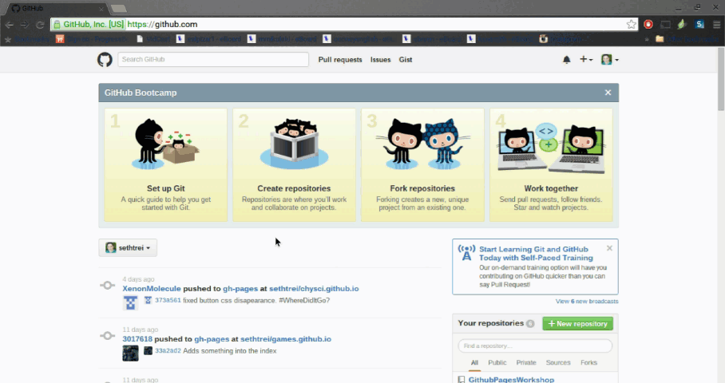
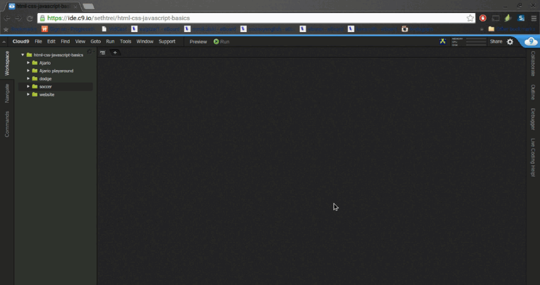
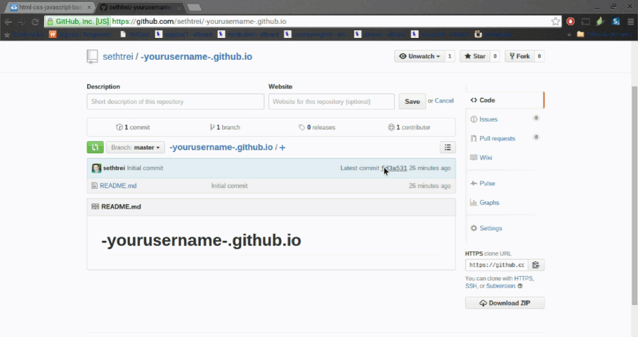

# GitHub Pages Workshop

**RETIRED**

_**This workshop has been retired and is no longer maintained.**_

---

Welcome! In this workshop you will set up a GitHub Pages Website!

To start you need to have completed the
<a href="https://github.com/hackclub/hackclub/tree/master/workshops/cloud9" target="_blank">
Cloud 9 Workshop</a>.

# What is GitHub Pages?

GitHub Pages is a way of using a GitHub repository to make a website. By the end
of the workshop you will have a link to get you to your website.

# What is a Repository?

A repository is a location (or folder) where code and other files can be
stored. The word `repository` is sometimes shortened to `repo`.

# Create a Repository

Make a repository following this format:

    (yourusername).github.io

So if your username is `supersam`, your repository would be `supersam.github.io`.

> 

# Clone into Cloud9

Go into your Cloud9 workspace and choose an area to clone your repository. You
want to find the terminal that starts with "bash". If it isn't there open a new
terminal. (Instructions directly below)

Now that we have a place to put our code, we want to set up a way to edit our
code.

1. Get the link for cloning. It is on the right side of your repository. If you
   click the little icon, the link is now on your clipboard.

     > 

2. Go into your Cloud9 workspace and open a new terminal (Alt+T, or Window > New
   Terminal).

     > 

3. In the terminal type: `git clone [then the link you just copied]`

     > 

**Congrats! You can now edit and save in your repository!**

You should start creating the necessary files for a website. (`index.html`,
`style.css`, etc)

-------------------------------------------------------------------------------

# Part 2

In this part of the workshop, you will learn how to sync your Cloud9 data into
your GitHub Repository.

# Committing and Publishing to GitHub

In this part of the workshop, you will learn how to put the code from Cloud9
into your GitHub repository.

### Committing and Publishing to GitHub

After you make changes to your site on Cloud9 you will need to put the changes on
GitHub for the changes to show up on your site.

1. **Switch into your repo in the terminal**

        cd [repository name]

2. **Add your changes to the commit list by doing...**

        git add .

3. **Commit your changes with the following format**

        git commit -m "Here you type what the commit does. Keep the quotations."

    This will get your changes ready to push to GitHub

4. **Push your changes**

        git push

    It will ask for your username and password.
    Note: When you type your password it wont show up in the terminal.

# Let's Explain What you Just Did

You just used git to push your repository on Cloud9 to your repository on
GitHub.

**GitHub and git?**

Git is a tool for organizing the files in your repository, as well as moving
your repository between Cloud9 and GitHub. Because Git is only controlled
through the terminal, GitHub is a website that provides a user interface for git
(buttons and pictures instead of just text).

# So what is the URL?

The URL to your website is the same name as your repository so it should be
`[username].github.io`.

# Done!

Congrats! Now you can share the URL to anyone!

> 

One last thing. Please click a rating below to rate this workshop. It'll only
take 3 seconds.
