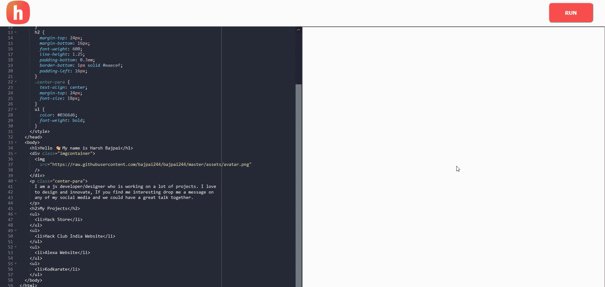
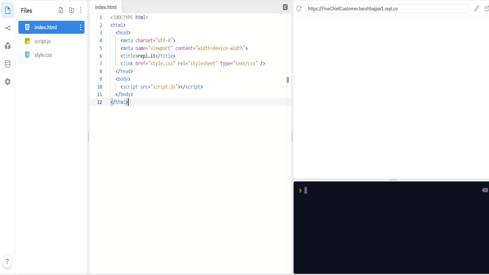
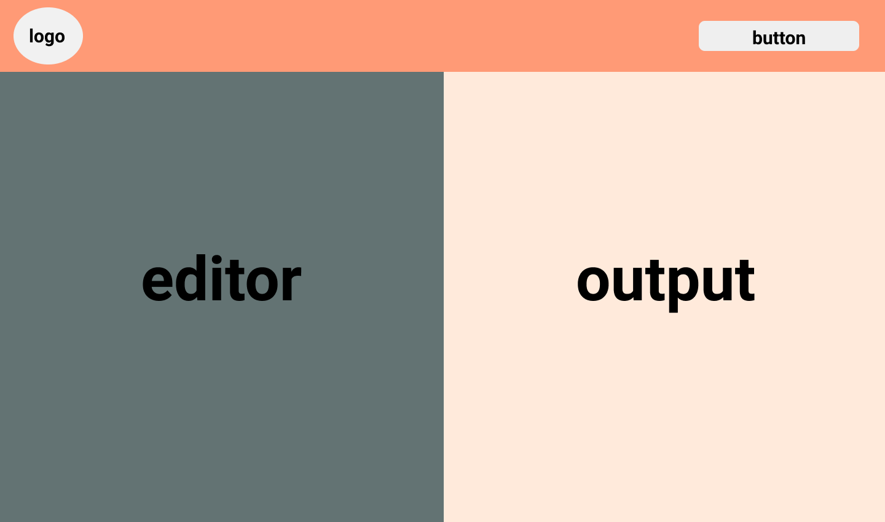
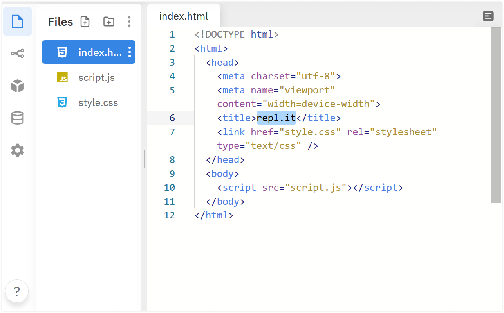
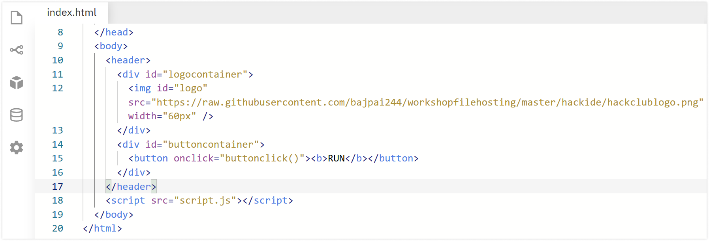
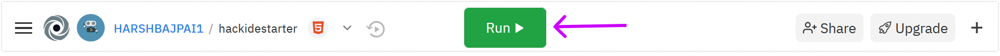
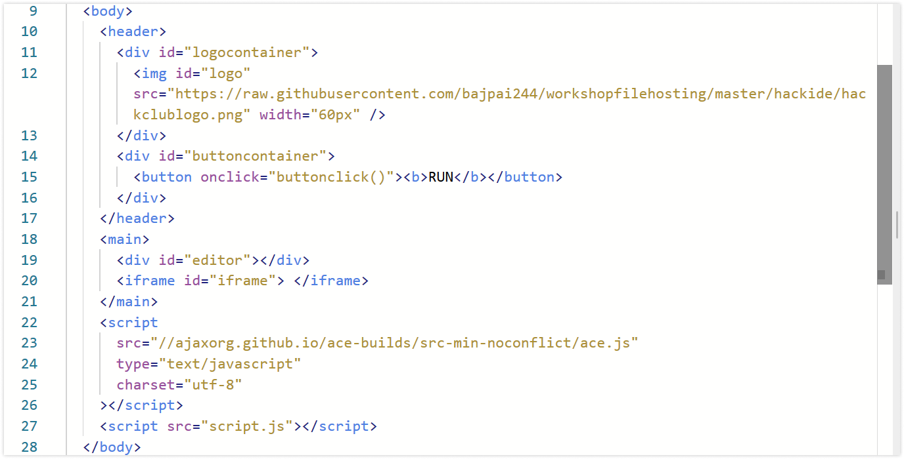
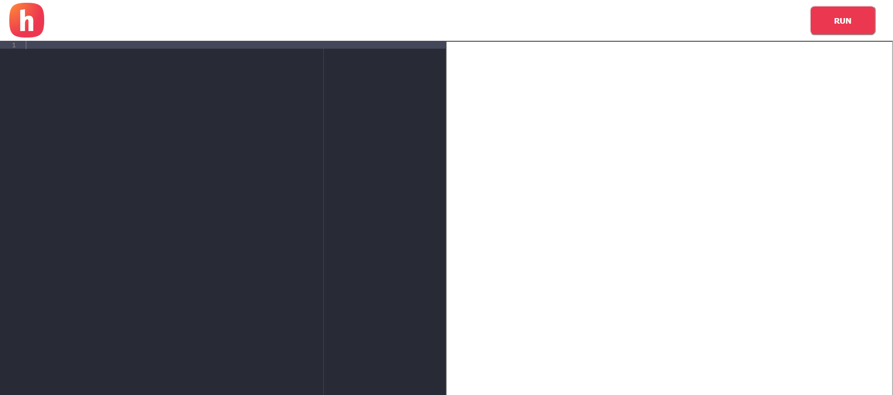
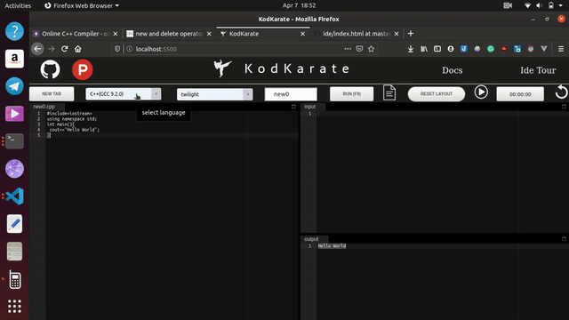

# Hack IDE

In this workshop we will be making a small web based IDE. This is going to be a really cool project that you can show to your friends and other Hack Club members.

This is what it will lool like:

 

 To see a live of demo of what you will be making visit this [link](https://hackideworkshopdemo.vercel.app/) and click on the RUN button to see the magic!
 
 This [link](https://repl.it/@HARSHBAJPAI1/hackidestarter-1#index.html) is to the final code. If you are stuck at any point then you can take help from this repl.

## Prerequisites

The workshop is for anyone familiar with:

- HTML
- Javascript
- CSS ( basics + [Flexbox](https://css-tricks.com/snippets/css/a-guide-to-flexbox/) )

You just need to have a basic understanding of them to follow along in this workshop.

## Setup

We will be using [Repl.it](https://repl.it) in this workshop. It is an online coding tool and is really easy to use.

We will be using HTML,Javascript and CSS in this workshop. To get started go to [https://repl.it/languages/html](https://repl.it/languages/html). This will spin up a coding environment for you!
<br/>



## Layout 

This is what the layout of the IDE is going to look like:



We will be using Flexbox to implement this layout. This is an awesome [resource](https://css-tricks.com/snippets/css/a-guide-to-flexbox/) to get started with Flexbox.

## Making The Header

Now we will start by making the header for our application. We will define its structure in the index.html file and then we will style it in the style.css file.

Remember HTML is for defining the structure of your website while CSS is for styling it.


## Working with index.html

Your index.html file already has some HTML code written in it make the following changes in it.

### Changing the <title\> tag

The <title\> tag has name _repl.it_, this is the name which will show up on the tab of your browser when you open your website ( for our project it will be seen when we will open it in a new tab )



Change it to **Hack IDE** from **repl.it**.
```html
  <title>Hack IDE</title>
```

### Adding <header\> 

Now we will define the structure of the header in index.html file.
 Add the following HTML between your **<body\>** tag before the already existing <script\> tag .


```html
 <header>
      <div id="logocontainer">
        
      </div>
      <div id="buttoncontainer">
        <button onclick="buttonclick()"><b>RUN</b></button>
      </div>
    </header>
```
After Adding it your code it will look like this:



The explanation of the above code is as follows:

- <header\> tag is declared to define our header in HTML.
-  tag is created which will be used as our logo. It has a parent <div\> tag which will be used to vertically align it to the center (we will do it in the CSS part).
- <button\> tag is created which will be used to run our code when we will click on it. It has a parent <div\> which will be used for its layout. Its width is set to 70px in width attribute. 
- <button\> has an onclick attribute equal to _buttonclick()_ which will run our Javascript code when the button will be clicked (we will define buttonclick() in a later section of this workshop).


## Need for styling

We have just created a structure for our header. To manage its layout and styling, it is time to move to CSS.

## Working with style.css

Open style.css, we will use it to style our HTML.
It is already linked with the index.html file. Now add the following CSS in your style.css file.

```css
html,
body {
  width: 100%;
  height: 100%;
  margin: 0;
}

body {
  display: flex;
  flex-direction: column;
}

header {
  height: 70px;
  background-color: white;
  display: flex;
}
```
- Here we are making html and body to acquire the full space of the display.

- body display is made flex with flex-direction column so that we can have a vertical flex layout ( why we did that will be more clear as we proceed. ).

- header is given a fixed height of 70px. Its display is flex, we will use some properties of Flexbox to develop our header.

### Styling header elements

Now it is the time that we start styling the elements of our header which are the logo and the button.

_Append the following code_ in your style.css file.

```css
#logocontainer {
  display: flex;
  flex-direction: column;
  justify-content: center;
  padding-left: 16px;
}

#buttoncontainer {
  flex: 1;
  display: flex;
  flex-direction: row-reverse;
  align-items: center;
  padding-right: 30px;
}

button {
  padding-top: 16px;
  padding-bottom: 16px;
  padding-left: 40px;
  padding-right: 40px;
  border-radius: 8px;
  background-color: #ec3750;
  color: white;
  cursor: pointer;
}

```

- We made #logocontainer ( parent <div\> of our  ) a flex container so that we can vertically align our image to the center.

- We made #buttoncontainer (parent <div\> of our <button\>) a flex container so that we can align our button to the right of the header and align it vertically to the center.

- flex:1 allocates all the left over space in header to #buttoncontainer (parent <div\> of our <button\>).

- button styling is nothing special, you can style the button the way you want or use my styling!

### Run

Now click the run button to run your website.



After running this you will see a header section like this 👇 on the top of your page.


## Creating The Editor

Now it is the time that we make the code editor and the display section of our IDE.

## Adding HTML

We need to add the HTML for our _code editor and output section._ 
Append the following HTML between your <body\> tags ( inside index.html file ).

 Add this code before the <script src="script.js" \> tag in <body\> and after the already existing <header\> tag. 

```html
   <main>
      <div id="editor"></div>
      <iframe src='' id="iframe"> </iframe>
    </main>
    <script
      src="//ajaxorg.github.io/ace-builds/src-min-noconflict/ace.js"
      type="text/javascript"
      charset="utf-8"
    ></script>
```

Here we have done the following:

- created <main\> tag to store both our editor and iframe.
- <div\> will be used as our code editor ( we will style it later)
- <iframe\> will be used by us to display our HTML code written in the code editor.
- We added a <script\> tag, it will allow us to use [Ace editor](https://ace.c9.io/) in our website and will provide our code editor some really cool functionalities.

after adding the code your <body\> tag will look like this:-



## Styling the Editor

Now it is time to style the HTML structure we just added.
Open your style.css file and append the following CSS.

```css
main {
  display: flex;
  flex: 1;
  position: relative;
}

iframe {
  flex: 1;
}

#editor {
  flex: 1;
}
```
Here we have done the following:

- main has flex:1 which will allow it to stretch and occupy all the remaining vertical space in the body.

- main is also a flex container so that we can have an equal horizontal division between the editor div and the iframe.

- iframe and #editor are given flex:1 so that they can occupy equal space in the main flex container.

## Working with Javascript

Now, we will use Javascript to configure our editor.

Add the following js code to your  _script.js file._

```javascript

var url = null

const editor = ace.edit('editor')
editor.setTheme('ace/theme/dracula')
editor.getSession().setMode('ace/mode/html')

```
- variable url will be used by us to store the URL string. (its use will become more clear in later sections)

- remember we added <script\> tag when we created our <main\> tag. We added a CDN link to the Ace editor. It gave us access to a variable named **ace.**

- ace.editor() method takes the HTML id of the element we want to make a code editor as an argument, in our case id is _editor._

- editor.setTheme('ace/theme/dracula') is setting the theme of the editor to dracula. The
Ace editor has support for multiple themes and dracula is one of them.

- editor.getSession().setMode('ace/mode/html') is setting the editor mode to html. It will autoclose our HTML tags when we will type in the code editor!

## Run 

Now run your html file to see what you have made!



Try typing some HTML <tags\> and you will notice that the editor now supports the autoclosing of tags!

## Creating Blob files and URLs

- Whatever code we type in our code editor we will create an HTML [Blob object](https://developer.mozilla.org/en-US/docs/Web/API/Blob) for it.

- The Blob object represents a blob, which is a file-like object of immutable, raw data; it can be read as text or binary data. 

- In our case, you can think of it as a representation of our HTML file, which would have been generated from the code that we wrote in our code editor.

- We can create local URLs of the Blob Objects via [URL.createObjectURL(blob)](https://developer.mozilla.org/en-US/docs/Web/API/URL/createObjectURL) method where _blob_ is any Blob object.


Add the following code to you script.js file:

```javascript
function createUrl(html) {
  var blob = new Blob([html], { type: 'text/html' })
  return URL.createObjectURL(blob)
}

function removeUrl(url) {
  URL.revokeObjectURL(url)
  }
```

Here we have done the following:

- createUrl(html) function will take an HTML Blob type object as an argument and will return an Object URL of it ( The use of this will be clear in next section).

- removeUrl(url) function takes a URL generated by createUrl(html) as an argument and deletes it so that we can free up space which was acquired by that URL. We are using [URL.revokeObjectURL()](https://developer.mozilla.org/en-US/docs/Web/API/URL/revokeObjectURL) for this purpose!

## Using the URLs!

Now we are going to use this URL.

Add the following code to your script.js file:

```javascript
function getIframe() {
  var iframe = document.getElementById('iframe')
  return iframe
}

function setIframeUrl(url) {
  var iframe = getIframe()
  iframe.src = url
}

function getEditorCode() {
  return editor.getValue()
}

function buttonclick() {
  var code = getEditorCode()
  removeUrl(url)
  url = createUrl(code)
  setIframeUrl(url)
}
```

Here we have done the following:

- getIframe() will return our iframe object from the [Document Object Model](https://www.w3schools.com/js/js_htmldom.asp). 

- setIframeUrl(url) will take a URL as an argument and will set iframe's src attribute to this URL. iframes show the content via their [src](https://www.w3schools.com/tags/att_iframe_src.asp) attribute. It uses getIframe() function in it to fetch the iframe object.

- getEditorCode() will return the code of our editor. We have access to editor.getValue() function of our editor global variable which return the code of our editor.

### buttonclick() function

Now, let's talk about *_buttonclick()_* function. It will be called when our RUN button is clicked.

- It first stores our code in the code variable. Then it removes the existing URL in the system via removeUrl() function. 

- Remember the url variable we created initially, it will be used to store the current URL in the system.

- It will create a new URL via createUrl() function and will store it in url variable.

- setIframeUrl() will be used to assign this URL to our iframe's src attribute.


## Magic Time!

Congratulations you have completed this workshop. Now run the code and do the following:

1. Type some HTML in your editor section.
2. Click the RUN button.


See whatever HTML you create you can see it parallelly in your iframe.


## Next Steps!

I know it feels awesome to make it but don't stop here, Create whatever you can from this crazy trick and share it with us in the [```#ship```](https://app.slack.com/client/T0266FRGM/C0M8PUPU6) channel of [Hack Club's Slack](https://hackclub.com/slack/). 

Here is a project which I made ( using this trick ):

### Kodkarate

KodKarate is an open source IDE powered by Judge Api with support for 21 programming languages and the editor can be used in 17 themes.



Visit: [https://www.kodkarate.in/](https://www.kodkarate.in/)

Github: [https://github.com/bajpai244/Kodkarate][https://github.com/bajpai244/Kodkarate]

If you have any doubts or queries regarding this workshop then reach out to me on Hack Club's Slack My username is Harsh Bajpai!
