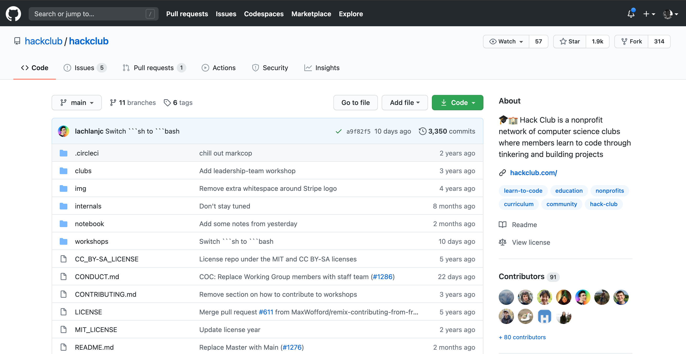
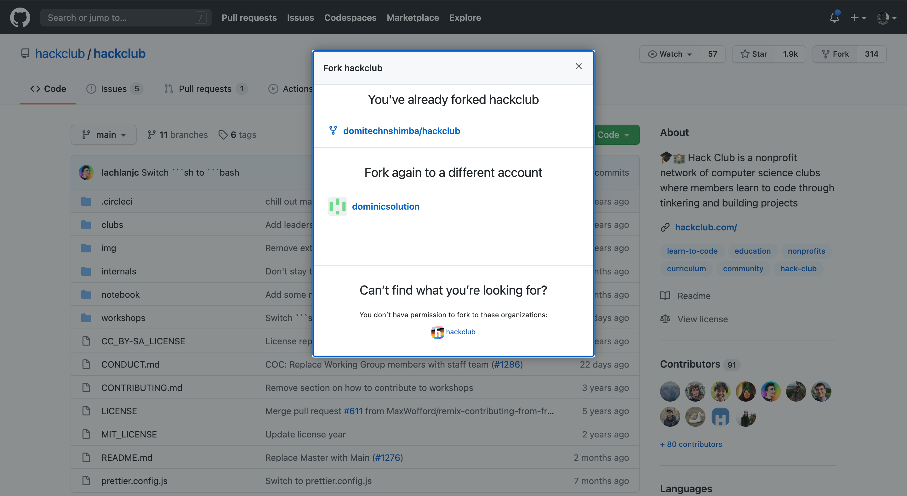
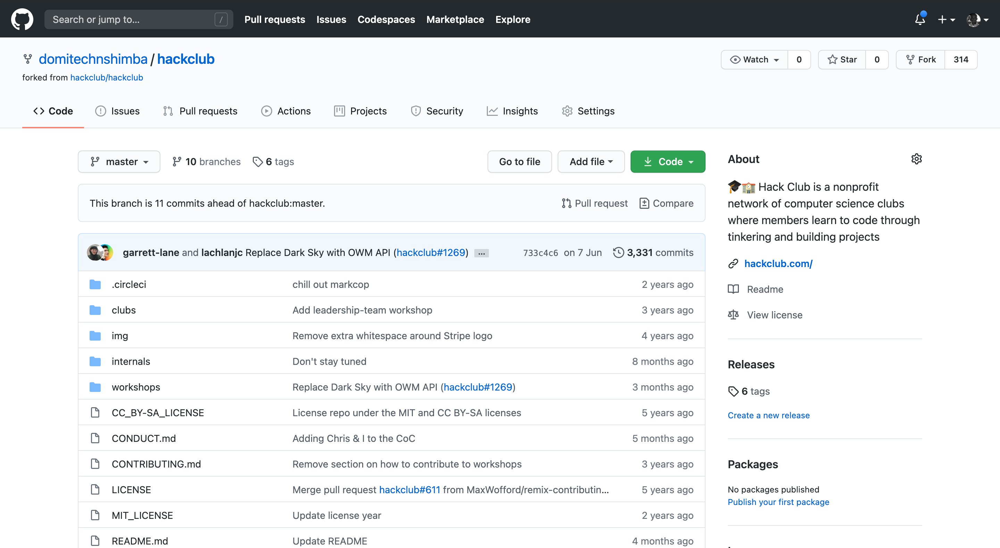
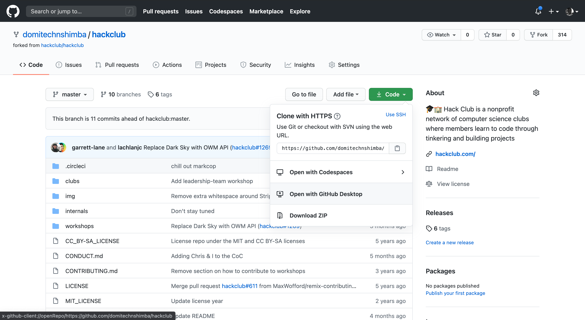
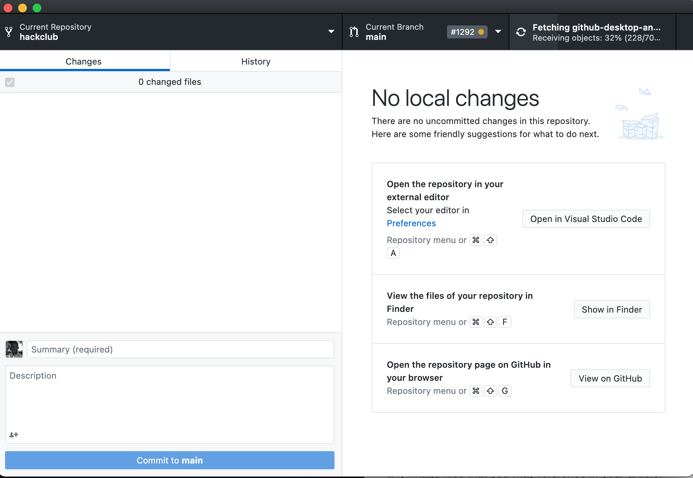
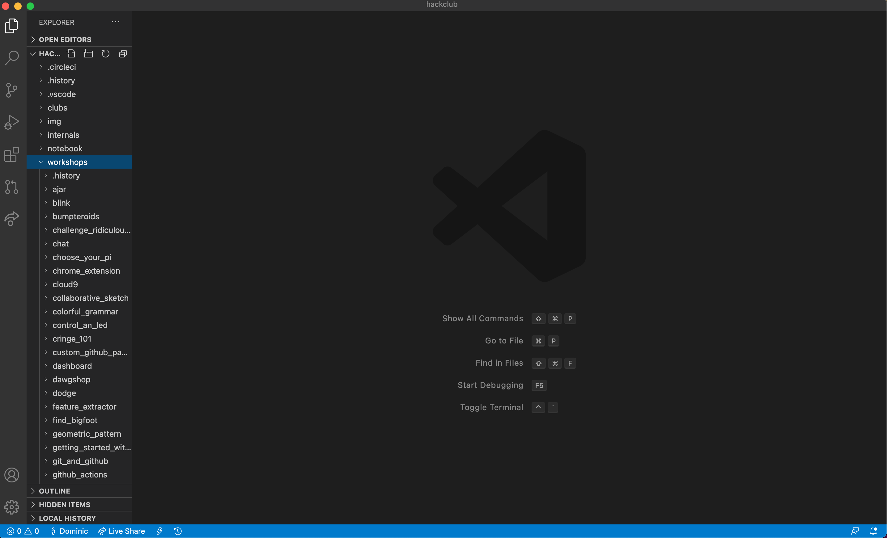
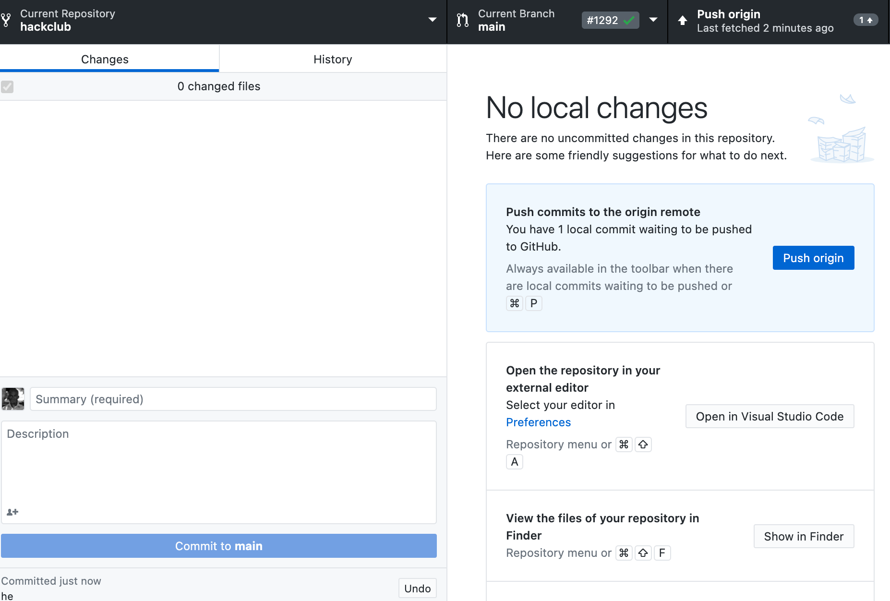
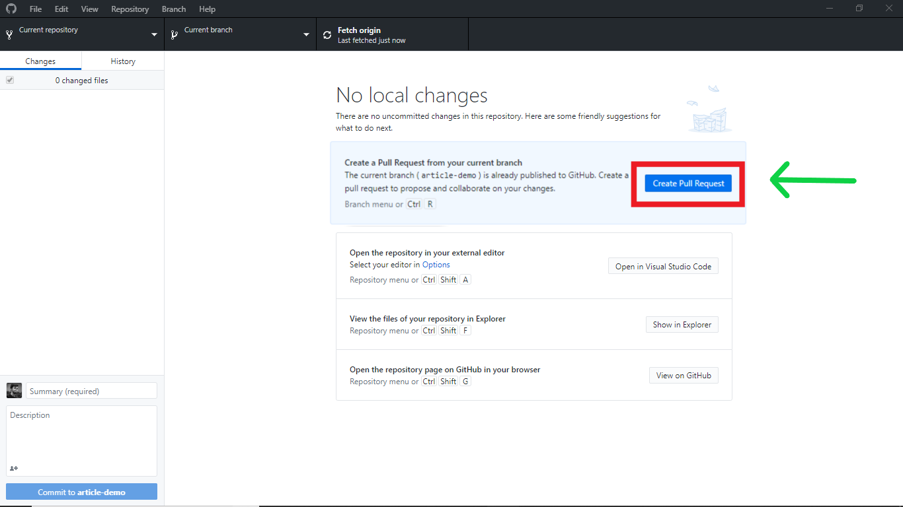
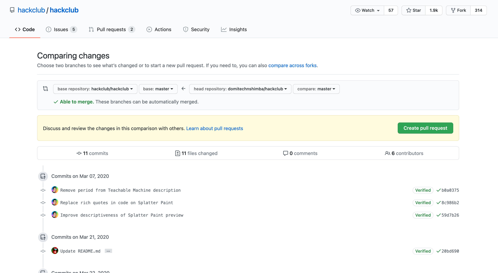
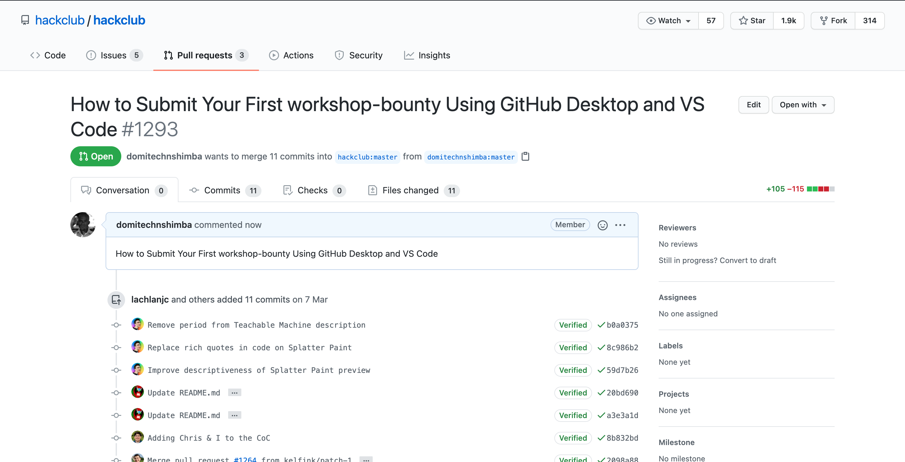

# How to Submit Your First workshop-bounty Using GitHub Desktop and VS Code

One of the most fundamental parts of contributing to open-source projects is working as a group and handling a large number of files across every development stage. This workshop will walk you through how to submit your first workshop in [Hack Club workshop-bounty](https://hackclub.com/workshop-bounty/) using GitHub Desktop and VS Code.
<!--more-->

I've always been a believer of learning things by actually doing them. The more I make mistakes, the more I get to learn. The idea of this workshop post originated after I faced several difficulties in submitting my first workshop.

This guide includes step-by-step instructions, so that you have a comfortable experience in beginning your open source contribution journey. Without further ado, let's get started by answering all the why(s), what(s) & how(s)!

**Note:** *You can also find [official instructions](https://hackclub.com/workshop-bounty/) on the Hack Club website.*

## A Complete Roadmap

### Step 1: So, I have my workshop ready. What should I do now to submit it?

Apart from all of the traditional ways of doing things, we're always seeking simpler and more efficient methods to do the same work with increased productivity. Technology aiding another technology has been one of the important features of the modern era. On similar lines, we'll be using following tools to ease the process:

- [GitHub Desktop](https://desktop.github.com/)
- *Text Editor* like [Visual Studio Code](https://code.visualstudio.com/), [Sublime Text](https://www.sublimetext.com/), [Atom](https://atom.io/)

Assuming, you have a working GitHub Account (which is required for contributing in the Hack Club workshop-bounty) and your workshop content is in **markdown (.md)** format, you are ready to upload your first workshop.

### Step 2: Forking theHack Club Repository

After setting up the workspace successfully, open the [Hack Club GitHub repository](https://github.com/hackclub/hackclub) on your web browser. You'll be seeing a master GitHub repo with a few boiler files. Click the **Fork** option in the upper right-hand corner (below your user account display).

Once you've clicked that option, a pop-up will appear. You need to give permission to fork the repository contents in your GitHub account (See image for reference).

If the forking process went well without an error, you'll be able to see your GitHub username in the upper left-hand corner. Now, if you have previously forked the same repository for your workshop, you can start from there as well.

### Step 3: Cloning the forked repository

Now, you will be able to see a green **Clone** button. This will allow you to clone your repository to your local machine. After clicking "Clone", select **Open in Desktop**. This will automatically direct you to the GitHub Desktop window.

Create a new branch, using a suitable name based on your workshop's subject matter. On the GitHub Desktop window, choose "Open in Visual Studio Code". This will take you to the VS Code window where you will be able to add, edit, and save your work.

In VS Code, you'll see an organized directory structure on the left side. You'll need to create a new folder and add your files in it, including your `README.md` file, along with any image files that you may reference in your workshop.

### Step 4: I am all done with my work. How do I create a Pull Request (PR)

Go to your GitHub Desktop. You will see all the changes you have done in your branch. Write suitable details like what you've done in the "Summary"Hack Club (with an optional description).

Then, click **"Commit"** in the bottom left-hand corner. Next, click **"Push Origin"** option to push your work into GitHub repository.

Once you're done with editing and updating your files, now you're all set to create a **Pull Request**. In order to do so, click **Create Pull Request**.

### Step 5: Verification & Final Submit

After clicking the **Create Pull Request** button, you'll be automatically directed to the GitHub repo page where you can first verify that all of the details are correct, or make edits if needed. Finally, click **Create Pull Request** ... and Voila! You're done!

### Mission Completed

You have successfully submitted your workshop with your own unique PR number! Now, you need to wait for review and final approval by theHack Club team. Meanwhile, do checkout all of the other interesting workshops from contributors on [Hack Club Library](https://github.com/hackclub/hackclub).

